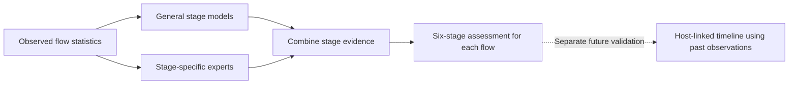

# Recognizing exfiltration and combining attack-stage evidence

**Two pilots completed and audited, September 22, 2026.** The simple stage ensemble shows a modest positive development result. A dedicated exfiltration specialist did not demonstrate a clear advantage over general-model controls.

## What we built and tested

1. **Exfiltration recognition:** compare general models with exfiltration-versus-all specialists, with and without 18 directional/variability feature transformations. Measure whether a suspicious flow is correctly called exfiltration and which other activities it gets confused with.
2. **Stage-specialist ensemble:** combine separate XGBoost and LightGBM experts for exfiltration, initial compromise, lateral movement, normal traffic, pivoting and reconnaissance. Compare simple averaging, per-stage family selection and learned fusion against equally informed general-model controls.

All arms share fitting data. Learned fusion uses out-of-fold predictions. Three fitting seeds use the same previously exposed SCVIC evaluation rows, so these are development findings, not independent attack replications.

## Actual finding: simple combination helps the stage assessment

The following comparison is **engineered general-model averaging versus averaging those general models with normalized stage-specialist outputs**. Values are means over three fits on the same 30,787 cases.

| Measure | General models | General + specialists |
|---|---:|---:|
| Six-class macro-F1 | 0.6749 | **0.6841** |
| Correct exfiltration F1 | 0.6125 | **0.6197** |
| Correct lateral-movement F1 | 0.6111 | **0.6327** |
| Normal flows falsely called attacks, out of 29,929 | 87.67 | **71.00** |
| Lateral flows recognized as any attack | **81.71%** | 81.48% |

Normal false alerts fell **19.01%**, and macro-F1 improved in all three fits. The lateral any-attack cost is one additional missed lateral flow in one of the three fits. Exact stage F1 and any-attack recall measure different behaviors. These findings do not establish that every stage or individual fit improves against every comparator.

For the separate exfiltration-ranking task, the combined learned model's AP was **0.5742**, versus **0.5778** for general-only learned fusion. Fixed general-plus-specialist averaging was **0.5687**, versus **0.5734** for general averaging. Adding specialists did not produce a convincing exfiltration-ranking benefit. The more elaborate learned full-stage fusion also performed worse than simple averaging. All arms and costs remain in the report.

Most false exfiltration labels were actually **pivoting**, rather than normal activity. The next useful question is whether additional, independently available context can distinguish those two behaviors. More models trained on the same traffic summaries may simply repeat the same confusion. That is a hypothesis to test, not an explanation proved by this pilot.

## Read the evidence

- [Full results, all arms and every stage](../results/exfil_stage_v1/REPORT.md)
- [Plain-language scientific interpretation](INTERPRETATION.md)
- [Stage comparison chart](../results/exfil_stage_v1/STAGE_F1.png)
- [Exfiltration ranking chart](../results/exfil_stage_v1/EXFIL_AP.png)
- [Independent saved-output audit: PASS](../results/exfil_stage_v1/AUDIT.json)
- [Experiment design](DESIGN.md) and [frozen protocol](protocol.json)
- [Dataset counts and provenance](DATA_QUALIFICATION.md)
- [Recent primary literature and novelty limits](LITERATURE.md)
- [Validity review and relation to the earlier experiment](VALIDITY_REVIEW.md)

Fourteen implementation/integrity tests passed. The independent auditor checked all 72 arm-level metric packages, data/model/prediction hashes, fitting/fold identities, threshold choices and confusion matrices. It did not replay model fitting or create new empirical confirmation.

## What “adversary picture” means at this point



This pilot builds the stage-assessment component. A reliable movement timeline still requires qualified host/time linkage and multiple independent attacks. SCVIC's prepared predictors lack those identifiers. The acquired DEDALE 2026 subset has only **two exfiltration flows from one execution**; it can illustrate chronology but cannot validate broad exfiltration reliability. Neither early warning nor missing/delayed-log resilience was measured here.

## Praxis position

**A useful positive pilot, with a narrower unresolved problem.** Exfiltration features and ensembles are already published, including Cai et al. (2025). The defensible research direction is testing which specialist/context evidence improves exact stage identification, with explicit confusion and false-alarm costs, under declared evidence availability. The current result does not establish a new algorithm or a completed novel praxis contribution.

## Reproduce

From the repository root, using the environment in `RUN_RECEIPT.json`:

```powershell
python -m experiments.apt_benchmark.exfil_stage_experiments.run --data <SCVIC_DATA.npz> --protocol experiments/apt_benchmark/exfil_stage_experiments/protocol.json --output <fresh_private_output>
python -m experiments.apt_benchmark.exfil_stage_experiments.report --run <private_output> --output <public_output>
python -m experiments.apt_benchmark.exfil_stage_experiments.audit --run <private_output> --data <SCVIC_DATA.npz> --protocol experiments/apt_benchmark/exfil_stage_experiments/protocol.json --output <audit_json>
python -m pytest experiments/apt_benchmark/exfil_stage_experiments/test_exfil_stage.py -q
```

The pilot retained 54 final base models and 15 learned fusion models, with 216 base fits including cross-fitting. It ran in approximately 103 seconds on CPU. No AWS instance was started; a GPU was unnecessary for these small tree-model fitting sets.
