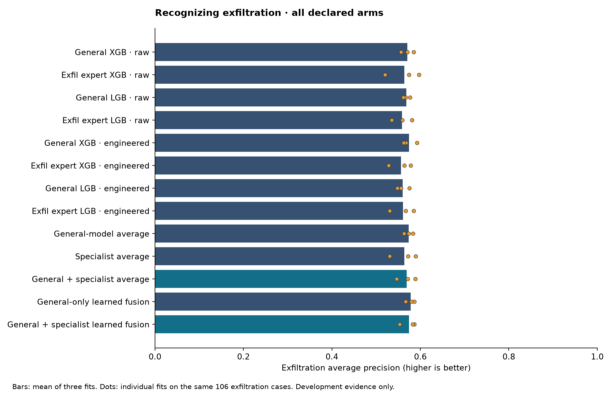
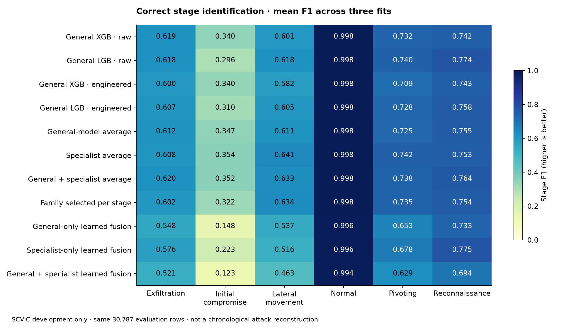

# Exfiltration attribution and stage-specialist fusion: pilot results

**Completed:** two development experiments; all three declared seeds and every arm. No method was dropped after its results. Source model/protocol freeze: `c961dff`. CPU only; no AWS compute started.

## What was measured

Experiment 1 tests whether an exfiltration specialist and 18 engineered traffic features help correctly identify exfiltration. Experiment 2 combines stage experts and measures the complete six-class classification. This does not measure attack chronology, early warning, or adversary identity.

Each seed uses the same 1,184 fitting labels across arms (1,024 normal + 32 for each attack stage). Calibration uses 30,782 additional rows. Evaluation uses the same previously exposed 30,787 development rows, with 106 exfiltration, 15 initial-compromise, 144 lateral, 29,929 normal, 425 pivoting and 168 reconnaissance cases. Seed variation is training-support variation, not independent attacks.

The batch fitted 216 base models including cross-fitting, retained 54 final base models, and fitted 15 fusion models. Elapsed modeling time: 103.3 seconds.

All configurations are fixed; this does not establish superiority over an exhaustively tuned baseline. General-only learned fusion controls for score recombination. Engineered generals control for the extra features. Learned fusion receives only out-of-fold fitting scores. See the [design](../../exfil_stage_experiments/DESIGN.md), [protocol](../../exfil_stage_experiments/protocol.json), [data qualification](../../exfil_stage_experiments/DATA_QUALIFICATION.md), and [literature review](../../exfil_stage_experiments/LITERATURE.md).

## Experiment 1: exact exfiltration recognition

AP means average precision over the precision–recall curve. F1/precision/recall and alert counts below use a threshold chosen to maximize exfiltration F1 on calibration data, then locked for evaluation. Counts are means over fits. False exfiltration alerts include normal traffic **and other attack stages**.

| Method | AP | ROC-AUC | Precision | Recall | F1 | True exfil alerts /106 | All false exfil alerts | Normal false exfil alerts |
|---|---:|---:|---:|---:|---:|---:|---:|---:|
| General XGB · raw | 0.5705 | 0.9968 | 57.19% | 72.01% | 0.6303 | 76.33 | 60.00 | 1.33 |
| Exfil expert XGB · raw | 0.5639 | 0.9941 | 56.70% | 74.84% | 0.6384 | 79.33 | 63.33 | 1.00 |
| General LGB · raw | 0.5686 | 0.9968 | 57.63% | 72.01% | 0.6360 | 76.33 | 57.33 | 0.00 |
| Exfil expert LGB · raw | 0.5585 | 0.9905 | 59.82% | 66.04% | 0.6217 | 70.00 | 48.67 | 0.00 |
| General XGB · engineered | 0.5740 | 0.9966 | 58.30% | 71.70% | 0.6378 | 76.00 | 55.67 | 0.67 |
| Exfil expert XGB · engineered | 0.5565 | 0.9961 | 57.88% | 69.81% | 0.6266 | 74.00 | 55.67 | 1.00 |
| General LGB · engineered | 0.5601 | 0.9965 | 57.32% | 74.21% | 0.6447 | 78.67 | 59.67 | 0.00 |
| Exfil expert LGB · engineered | 0.5608 | 0.9955 | 61.10% | 62.26% | 0.6126 | 66.00 | 43.33 | 0.00 |
| General-model average | 0.5734 | 0.9967 | 58.28% | 74.21% | 0.6490 | 78.67 | 57.67 | 0.00 |
| Specialist average | 0.5640 | 0.9962 | 61.02% | 64.47% | 0.6255 | 68.33 | 44.00 | 0.33 |
| General + specialist average | 0.5687 | 0.9968 | 56.79% | 74.53% | 0.6419 | 79.00 | 61.67 | 0.67 |
| General-only learned fusion | 0.5778 | 0.9968 | 57.46% | 73.27% | 0.6392 | 77.67 | 59.00 | 0.00 |
| General + specialist learned fusion | 0.5742 | 0.9968 | 58.44% | 68.55% | 0.6226 | 72.67 | 53.33 | 0.33 |

### Paired exfiltration contrasts

Every contrast below was specified by the design's feature, specialization, and fusion comparisons. Delta is candidate minus reference in AP units. A positive mean is a descriptive improvement on these cases; three positive fits do not establish population reliability.

| Candidate | Reference | Mean AP delta | Positive / negative fits |
|---|---|---:|---:|
| General XGB · engineered | General XGB · raw | +0.0036 | 2 / 1 |
| Exfil expert XGB · engineered | Exfil expert XGB · raw | -0.0074 | 1 / 2 |
| Exfil expert XGB · raw | General XGB · raw | -0.0066 | 2 / 1 |
| Exfil expert XGB · engineered | General XGB · engineered | -0.0176 | 1 / 2 |
| General LGB · engineered | General LGB · raw | -0.0085 | 0 / 3 |
| Exfil expert LGB · engineered | Exfil expert LGB · raw | +0.0023 | 2 / 1 |
| Exfil expert LGB · raw | General LGB · raw | -0.0101 | 1 / 2 |
| Exfil expert LGB · engineered | General LGB · engineered | +0.0007 | 2 / 1 |
| General + specialist average | General XGB · engineered | -0.0053 | 2 / 1 |
| General + specialist average | General LGB · engineered | +0.0086 | 2 / 1 |
| General + specialist average | General-model average | -0.0047 | 2 / 1 |
| General + specialist average | General-only learned fusion | -0.0091 | 2 / 1 |
| General + specialist learned fusion | General XGB · engineered | +0.0002 | 2 / 1 |
| General + specialist learned fusion | General LGB · engineered | +0.0141 | 2 / 1 |
| General + specialist learned fusion | General-model average | +0.0008 | 2 / 1 |
| General + specialist learned fusion | General-only learned fusion | -0.0035 | 2 / 1 |

## Experiment 2: the full stage assessment

Stage decisions use the largest of six scores. F1 values give equal attention to precision and recall; macro-F1 averages the six class F1s equally. Each stage's full precision, recall, AP, ROC-AUC, and confusion are in EVIDENCE.json and the per-stage table below.

| Method | Macro-F1 | Exfil F1 | Initial F1 | Lateral F1 | Normal F1 | Pivot F1 | Recon F1 | Normal any-attack FPR |
|---|---:|---:|---:|---:|---:|---:|---:|---:|
| General XGB · raw | 0.6720 | 0.6191 | 0.3400 | 0.6014 | 0.9975 | 0.7316 | 0.7424 | 0.36% |
| General LGB · raw | 0.6740 | 0.6177 | 0.2957 | 0.6185 | 0.9979 | 0.7400 | 0.7741 | 0.29% |
| General XGB · engineered | 0.6620 | 0.6005 | 0.3396 | 0.5823 | 0.9976 | 0.7092 | 0.7430 | 0.34% |
| General LGB · engineered | 0.6675 | 0.6066 | 0.3097 | 0.6054 | 0.9978 | 0.7277 | 0.7580 | 0.30% |
| General-model average | 0.6749 | 0.6125 | 0.3474 | 0.6111 | 0.9979 | 0.7250 | 0.7554 | 0.29% |
| Specialist average | 0.6827 | 0.6081 | 0.3538 | 0.6409 | 0.9983 | 0.7424 | 0.7528 | 0.20% |
| General + specialist average | 0.6841 | 0.6197 | 0.3521 | 0.6327 | 0.9982 | 0.7381 | 0.7637 | 0.24% |
| Family selected per stage | 0.6742 | 0.6022 | 0.3220 | 0.6338 | 0.9980 | 0.7348 | 0.7542 | 0.24% |
| General-only learned fusion | 0.6026 | 0.5482 | 0.1478 | 0.5374 | 0.9958 | 0.6533 | 0.7328 | 0.72% |
| Specialist-only learned fusion | 0.6272 | 0.5760 | 0.2229 | 0.5159 | 0.9955 | 0.6778 | 0.7750 | 0.81% |
| General + specialist learned fusion | 0.5706 | 0.5206 | 0.1228 | 0.4628 | 0.9943 | 0.6286 | 0.6945 | 1.06% |

### Stage fusion paired comparisons

| Candidate | Reference | Mean macro-F1 delta | Positive / negative fits |
|---|---|---:|---:|
| Specialist average | General XGB · engineered | +0.0207 | 3 / 0 |
| Specialist average | General LGB · engineered | +0.0152 | 3 / 0 |
| Specialist average | General-model average | +0.0078 | 2 / 1 |
| Specialist average | General-only learned fusion | +0.0802 | 3 / 0 |
| Family selected per stage | General XGB · engineered | +0.0121 | 3 / 0 |
| Family selected per stage | General LGB · engineered | +0.0066 | 2 / 1 |
| Family selected per stage | General-model average | -0.0007 | 1 / 2 |
| Family selected per stage | General-only learned fusion | +0.0716 | 3 / 0 |
| Specialist-only learned fusion | General XGB · engineered | -0.0348 | 0 / 3 |
| Specialist-only learned fusion | General LGB · engineered | -0.0403 | 0 / 3 |
| Specialist-only learned fusion | General-model average | -0.0477 | 0 / 3 |
| Specialist-only learned fusion | General-only learned fusion | +0.0246 | 3 / 0 |
| General + specialist average | General XGB · engineered | +0.0220 | 3 / 0 |
| General + specialist average | General LGB · engineered | +0.0165 | 3 / 0 |
| General + specialist average | General-model average | +0.0092 | 3 / 0 |
| General + specialist average | General-only learned fusion | +0.0815 | 3 / 0 |
| General + specialist learned fusion | General XGB · engineered | -0.0914 | 0 / 3 |
| General + specialist learned fusion | General LGB · engineered | -0.0969 | 0 / 3 |
| General + specialist learned fusion | General-model average | -0.1043 | 0 / 3 |
| General + specialist learned fusion | General-only learned fusion | -0.0320 | 0 / 3 |

## False-positive budget sensitivity

The 0.1%, 0.5%, 1%, and 2% levels are descriptive calibration budgets chosen for comparison. Actual evaluation rates can differ. These are not population guarantees or pass/fail research requirements. Normal-only calibration does not control confusion with other attacks; both versions are reported.

| Method | Calibration population | Nominal budget | Test exfil recall | Test precision | Test all-non-exfil FPR | Test normal FPR |
|---|---|---:|---:|---:|---:|---:|
| General XGB · raw | Normal | 0.10% | 90.88% | 28.37% | 0.79% | 0.09% |
| General XGB · raw | Normal | 0.50% | 95.28% | 14.83% | 1.90% | 0.50% |
| General XGB · raw | Normal | 1.00% | 96.86% | 10.88% | 2.75% | 1.03% |
| General XGB · raw | Normal | 2.00% | 99.37% | 7.76% | 4.08% | 2.08% |
| General XGB · raw | All non-exfil | 0.10% | 48.74% | 63.85% | 0.10% | 0.00% |
| General XGB · raw | All non-exfil | 0.50% | 86.16% | 37.87% | 0.49% | 0.03% |
| General XGB · raw | All non-exfil | 1.00% | 92.45% | 24.48% | 0.99% | 0.14% |
| General XGB · raw | All non-exfil | 2.00% | 94.97% | 14.17% | 1.99% | 0.54% |
| Exfil expert XGB · raw | Normal | 0.10% | 91.51% | 25.66% | 0.94% | 0.12% |
| Exfil expert XGB · raw | Normal | 0.50% | 96.54% | 14.93% | 1.91% | 0.54% |
| Exfil expert XGB · raw | Normal | 1.00% | 97.17% | 11.09% | 2.70% | 1.06% |
| Exfil expert XGB · raw | Normal | 2.00% | 97.80% | 8.33% | 3.72% | 1.92% |
| Exfil expert XGB · raw | All non-exfil | 0.10% | 44.97% | 63.84% | 0.09% | 0.00% |
| Exfil expert XGB · raw | All non-exfil | 0.50% | 87.74% | 37.30% | 0.51% | 0.02% |
| Exfil expert XGB · raw | All non-exfil | 1.00% | 91.82% | 23.27% | 1.05% | 0.17% |
| Exfil expert XGB · raw | All non-exfil | 2.00% | 96.54% | 14.38% | 1.99% | 0.60% |
| General LGB · raw | Normal | 0.10% | 92.45% | 24.40% | 1.04% | 0.11% |
| General LGB · raw | Normal | 0.50% | 96.23% | 14.06% | 2.04% | 0.56% |
| General LGB · raw | Normal | 1.00% | 97.48% | 10.92% | 2.76% | 1.07% |
| General LGB · raw | Normal | 2.00% | 98.74% | 8.02% | 3.92% | 2.05% |
| General LGB · raw | All non-exfil | 0.10% | 51.26% | 66.90% | 0.09% | 0.00% |
| General LGB · raw | All non-exfil | 0.50% | 86.79% | 39.66% | 0.46% | 0.03% |
| General LGB · raw | All non-exfil | 1.00% | 92.14% | 24.56% | 0.98% | 0.11% |
| General LGB · raw | All non-exfil | 2.00% | 96.86% | 13.84% | 2.08% | 0.60% |
| Exfil expert LGB · raw | Normal | 0.10% | 92.14% | 24.77% | 0.98% | 0.11% |
| Exfil expert LGB · raw | Normal | 0.50% | 96.23% | 15.09% | 1.87% | 0.54% |
| Exfil expert LGB · raw | Normal | 1.00% | 96.86% | 11.38% | 2.61% | 0.98% |
| Exfil expert LGB · raw | Normal | 2.00% | 97.48% | 8.36% | 3.71% | 1.90% |
| Exfil expert LGB · raw | All non-exfil | 0.10% | 45.60% | 64.34% | 0.09% | 0.00% |
| Exfil expert LGB · raw | All non-exfil | 0.50% | 84.59% | 38.21% | 0.48% | 0.02% |
| Exfil expert LGB · raw | All non-exfil | 1.00% | 92.77% | 23.94% | 1.02% | 0.13% |
| Exfil expert LGB · raw | All non-exfil | 2.00% | 96.86% | 14.17% | 2.03% | 0.61% |
| General XGB · engineered | Normal | 0.10% | 91.51% | 26.21% | 0.89% | 0.09% |
| General XGB · engineered | Normal | 0.50% | 95.91% | 14.31% | 2.00% | 0.51% |
| General XGB · engineered | Normal | 1.00% | 96.54% | 10.67% | 2.80% | 1.05% |
| General XGB · engineered | Normal | 2.00% | 97.80% | 7.71% | 4.05% | 2.07% |
| General XGB · engineered | All non-exfil | 0.10% | 52.83% | 64.58% | 0.10% | 0.00% |
| General XGB · engineered | All non-exfil | 0.50% | 87.11% | 38.47% | 0.48% | 0.02% |
| General XGB · engineered | All non-exfil | 1.00% | 91.82% | 24.42% | 0.98% | 0.11% |
| General XGB · engineered | All non-exfil | 2.00% | 95.91% | 14.20% | 2.00% | 0.51% |
| Exfil expert XGB · engineered | Normal | 0.10% | 90.57% | 25.67% | 0.91% | 0.10% |
| Exfil expert XGB · engineered | Normal | 0.50% | 95.28% | 15.33% | 1.82% | 0.54% |
| Exfil expert XGB · engineered | Normal | 1.00% | 97.48% | 11.25% | 2.68% | 1.05% |
| Exfil expert XGB · engineered | Normal | 2.00% | 98.43% | 8.25% | 3.80% | 1.97% |
| Exfil expert XGB · engineered | All non-exfil | 0.10% | 47.48% | 65.47% | 0.09% | 0.00% |
| Exfil expert XGB · engineered | All non-exfil | 0.50% | 87.11% | 37.91% | 0.49% | 0.02% |
| Exfil expert XGB · engineered | All non-exfil | 1.00% | 91.19% | 23.78% | 1.01% | 0.15% |
| Exfil expert XGB · engineered | All non-exfil | 2.00% | 95.60% | 14.06% | 2.03% | 0.66% |
| General LGB · engineered | Normal | 0.10% | 91.82% | 25.13% | 0.98% | 0.10% |
| General LGB · engineered | Normal | 0.50% | 94.97% | 14.52% | 1.94% | 0.51% |
| General LGB · engineered | Normal | 1.00% | 96.54% | 10.98% | 2.72% | 1.04% |
| General LGB · engineered | Normal | 2.00% | 98.43% | 7.84% | 4.00% | 2.09% |
| General LGB · engineered | All non-exfil | 0.10% | 51.89% | 64.57% | 0.10% | 0.00% |
| General LGB · engineered | All non-exfil | 0.50% | 87.42% | 38.08% | 0.49% | 0.02% |
| General LGB · engineered | All non-exfil | 1.00% | 92.45% | 24.90% | 0.96% | 0.11% |
| General LGB · engineered | All non-exfil | 2.00% | 95.60% | 14.11% | 2.01% | 0.57% |
| Exfil expert LGB · engineered | Normal | 0.10% | 90.88% | 26.76% | 0.89% | 0.12% |
| Exfil expert LGB · engineered | Normal | 0.50% | 95.28% | 15.35% | 1.83% | 0.52% |
| Exfil expert LGB · engineered | Normal | 1.00% | 96.86% | 11.87% | 2.50% | 0.92% |
| Exfil expert LGB · engineered | Normal | 2.00% | 97.48% | 8.52% | 3.65% | 1.93% |
| Exfil expert LGB · engineered | All non-exfil | 0.10% | 49.69% | 64.28% | 0.09% | 0.00% |
| Exfil expert LGB · engineered | All non-exfil | 0.50% | 85.22% | 37.06% | 0.50% | 0.04% |
| Exfil expert LGB · engineered | All non-exfil | 1.00% | 91.19% | 24.57% | 0.97% | 0.15% |
| Exfil expert LGB · engineered | All non-exfil | 2.00% | 95.28% | 14.10% | 2.01% | 0.62% |
| General-model average | Normal | 0.10% | 91.82% | 25.13% | 0.96% | 0.10% |
| General-model average | Normal | 0.50% | 95.60% | 14.28% | 1.99% | 0.51% |
| General-model average | Normal | 1.00% | 96.86% | 10.73% | 2.79% | 1.03% |
| General-model average | Normal | 2.00% | 98.74% | 7.70% | 4.09% | 2.11% |
| General-model average | All non-exfil | 0.10% | 52.52% | 64.47% | 0.10% | 0.00% |
| General-model average | All non-exfil | 0.50% | 86.16% | 38.79% | 0.47% | 0.02% |
| General-model average | All non-exfil | 1.00% | 92.45% | 24.54% | 0.98% | 0.10% |
| General-model average | All non-exfil | 2.00% | 95.60% | 14.38% | 1.97% | 0.51% |
| Specialist average | Normal | 0.10% | 90.88% | 25.19% | 0.96% | 0.12% |
| Specialist average | Normal | 0.50% | 95.91% | 15.09% | 1.87% | 0.52% |
| Specialist average | Normal | 1.00% | 97.17% | 11.21% | 2.70% | 1.07% |
| Specialist average | Normal | 2.00% | 98.11% | 8.03% | 3.90% | 2.06% |
| Specialist average | All non-exfil | 0.10% | 49.37% | 64.63% | 0.09% | 0.00% |
| Specialist average | All non-exfil | 0.50% | 86.79% | 38.11% | 0.49% | 0.02% |
| Specialist average | All non-exfil | 1.00% | 91.51% | 23.43% | 1.04% | 0.15% |
| Specialist average | All non-exfil | 2.00% | 96.23% | 14.24% | 2.01% | 0.62% |
| General + specialist average | Normal | 0.10% | 91.82% | 25.52% | 0.95% | 0.09% |
| General + specialist average | Normal | 0.50% | 96.23% | 14.29% | 2.00% | 0.51% |
| General + specialist average | Normal | 1.00% | 96.54% | 10.57% | 2.83% | 1.08% |
| General + specialist average | Normal | 2.00% | 99.06% | 7.67% | 4.13% | 2.07% |
| General + specialist average | All non-exfil | 0.10% | 51.26% | 64.67% | 0.10% | 0.00% |
| General + specialist average | All non-exfil | 0.50% | 87.11% | 39.19% | 0.47% | 0.01% |
| General + specialist average | All non-exfil | 1.00% | 92.14% | 24.32% | 0.99% | 0.11% |
| General + specialist average | All non-exfil | 2.00% | 96.23% | 14.23% | 2.00% | 0.53% |
| General-only learned fusion | Normal | 0.10% | 92.14% | 23.48% | 1.06% | 0.11% |
| General-only learned fusion | Normal | 0.50% | 95.60% | 13.93% | 2.06% | 0.52% |
| General-only learned fusion | Normal | 1.00% | 97.48% | 10.83% | 2.78% | 1.04% |
| General-only learned fusion | Normal | 2.00% | 98.74% | 7.71% | 4.09% | 2.11% |
| General-only learned fusion | All non-exfil | 0.10% | 51.57% | 64.25% | 0.10% | 0.00% |
| General-only learned fusion | All non-exfil | 0.50% | 88.05% | 38.78% | 0.48% | 0.02% |
| General-only learned fusion | All non-exfil | 1.00% | 92.77% | 24.87% | 0.97% | 0.09% |
| General-only learned fusion | All non-exfil | 2.00% | 95.60% | 14.22% | 1.99% | 0.47% |
| General + specialist learned fusion | Normal | 0.10% | 91.82% | 25.84% | 0.93% | 0.09% |
| General + specialist learned fusion | Normal | 0.50% | 95.60% | 14.73% | 1.94% | 0.50% |
| General + specialist learned fusion | Normal | 1.00% | 97.17% | 10.64% | 2.83% | 1.07% |
| General + specialist learned fusion | Normal | 2.00% | 99.37% | 7.68% | 4.14% | 2.05% |
| General + specialist learned fusion | All non-exfil | 0.10% | 48.43% | 63.57% | 0.10% | 0.00% |
| General + specialist learned fusion | All non-exfil | 0.50% | 87.74% | 37.60% | 0.51% | 0.01% |
| General + specialist learned fusion | All non-exfil | 1.00% | 92.45% | 25.46% | 0.94% | 0.09% |
| General + specialist learned fusion | All non-exfil | 2.00% | 95.28% | 14.49% | 1.94% | 0.51% |

## Every stage: full identification metrics

| Method | True stage | Precision | Recall | F1 | AP | ROC-AUC |
|---|---|---:|---:|---:|---:|---:|
| General XGB · raw | DataExfiltration | 50.71% | 79.87% | 0.6191 | 0.5705 | 0.9968 |
| General XGB · raw | InitialCompromise | 21.30% | 95.56% | 0.3400 | 0.8506 | 0.9994 |
| General XGB · raw | LateralMovement | 55.85% | 65.28% | 0.6014 | 0.5654 | 0.9834 |
| General XGB · raw | NormalTraffic | 99.86% | 99.64% | 0.9975 | 0.9999 | 0.9975 |
| General XGB · raw | Pivoting | 87.56% | 62.82% | 0.7316 | 0.8497 | 0.9960 |
| General XGB · raw | Reconnaissance | 68.24% | 82.14% | 0.7424 | 0.8074 | 0.9976 |
| General LGB · raw | DataExfiltration | 50.47% | 79.87% | 0.6177 | 0.5686 | 0.9968 |
| General LGB · raw | InitialCompromise | 17.65% | 95.56% | 0.2957 | 0.7709 | 0.9992 |
| General LGB · raw | LateralMovement | 59.61% | 64.35% | 0.6185 | 0.6079 | 0.9844 |
| General LGB · raw | NormalTraffic | 99.87% | 99.71% | 0.9979 | 0.9999 | 0.9983 |
| General LGB · raw | Pivoting | 89.11% | 63.29% | 0.7400 | 0.8555 | 0.9959 |
| General LGB · raw | Reconnaissance | 73.02% | 82.94% | 0.7741 | 0.8265 | 0.9975 |
| General XGB · engineered | DataExfiltration | 48.23% | 79.87% | 0.6005 | 0.5740 | 0.9966 |
| General XGB · engineered | InitialCompromise | 21.27% | 93.33% | 0.3396 | 0.8528 | 0.9994 |
| General XGB · engineered | LateralMovement | 53.85% | 63.43% | 0.5823 | 0.5355 | 0.9826 |
| General XGB · engineered | NormalTraffic | 99.86% | 99.66% | 0.9976 | 0.9999 | 0.9973 |
| General XGB · engineered | Pivoting | 87.10% | 59.84% | 0.7092 | 0.8531 | 0.9961 |
| General XGB · engineered | Reconnaissance | 68.20% | 81.94% | 0.7430 | 0.8114 | 0.9975 |
| General LGB · engineered | DataExfiltration | 48.82% | 80.19% | 0.6066 | 0.5601 | 0.9965 |
| General LGB · engineered | InitialCompromise | 18.73% | 95.56% | 0.3097 | 0.7792 | 0.9989 |
| General LGB · engineered | LateralMovement | 57.24% | 64.35% | 0.6054 | 0.5954 | 0.9850 |
| General LGB · engineered | NormalTraffic | 99.87% | 99.70% | 0.9978 | 0.9999 | 0.9984 |
| General LGB · engineered | Pivoting | 89.05% | 61.57% | 0.7277 | 0.8444 | 0.9957 |
| General LGB · engineered | Reconnaissance | 71.06% | 81.55% | 0.7580 | 0.8245 | 0.9978 |
| General-model average | DataExfiltration | 49.61% | 80.19% | 0.6125 | 0.5734 | 0.9967 |
| General-model average | InitialCompromise | 21.88% | 95.56% | 0.3474 | 0.8620 | 0.9993 |
| General-model average | LateralMovement | 58.24% | 64.35% | 0.6111 | 0.5706 | 0.9846 |
| General-model average | NormalTraffic | 99.87% | 99.71% | 0.9979 | 0.9999 | 0.9982 |
| General-model average | Pivoting | 88.35% | 61.49% | 0.7250 | 0.8553 | 0.9960 |
| General-model average | Reconnaissance | 69.98% | 82.74% | 0.7554 | 0.8235 | 0.9977 |
| Specialist average | DataExfiltration | 49.54% | 78.93% | 0.6081 | 0.5836 | 0.9965 |
| Specialist average | InitialCompromise | 22.31% | 95.56% | 0.3538 | 0.8591 | 0.9990 |
| Specialist average | LateralMovement | 64.71% | 63.66% | 0.6409 | 0.5929 | 0.9812 |
| Specialist average | NormalTraffic | 99.86% | 99.80% | 0.9983 | 0.9999 | 0.9977 |
| Specialist average | Pivoting | 91.31% | 62.59% | 0.7424 | 0.8637 | 0.9940 |
| Specialist average | Reconnaissance | 69.74% | 82.34% | 0.7528 | 0.7961 | 0.9913 |
| General + specialist average | DataExfiltration | 50.31% | 80.82% | 0.6197 | 0.5829 | 0.9968 |
| General + specialist average | InitialCompromise | 22.28% | 95.56% | 0.3521 | 0.8702 | 0.9992 |
| General + specialist average | LateralMovement | 62.13% | 64.58% | 0.6327 | 0.5858 | 0.9852 |
| General + specialist average | NormalTraffic | 99.87% | 99.76% | 0.9982 | 0.9999 | 0.9983 |
| General + specialist average | Pivoting | 90.32% | 62.43% | 0.7381 | 0.8634 | 0.9960 |
| General + specialist average | Reconnaissance | 71.10% | 83.13% | 0.7637 | 0.8143 | 0.9970 |
| Family selected per stage | DataExfiltration | 48.61% | 79.25% | 0.6022 | 0.5834 | 0.9958 |
| Family selected per stage | InitialCompromise | 19.81% | 95.56% | 0.3220 | 0.8338 | 0.9991 |
| Family selected per stage | LateralMovement | 64.76% | 62.27% | 0.6338 | 0.5813 | 0.9847 |
| Family selected per stage | NormalTraffic | 99.85% | 99.76% | 0.9980 | 0.9999 | 0.9977 |
| Family selected per stage | Pivoting | 89.67% | 62.27% | 0.7348 | 0.8603 | 0.9943 |
| Family selected per stage | Reconnaissance | 71.38% | 80.56% | 0.7542 | 0.7822 | 0.9908 |
| General-only learned fusion | DataExfiltration | 43.23% | 75.47% | 0.5482 | 0.5309 | 0.9972 |
| General-only learned fusion | InitialCompromise | 8.04% | 95.56% | 0.1478 | 0.8034 | 0.9992 |
| General-only learned fusion | LateralMovement | 47.71% | 62.50% | 0.5374 | 0.5445 | 0.9783 |
| General-only learned fusion | NormalTraffic | 99.88% | 99.28% | 0.9958 | 0.9999 | 0.9976 |
| General-only learned fusion | Pivoting | 86.91% | 52.39% | 0.6533 | 0.8092 | 0.9958 |
| General-only learned fusion | Reconnaissance | 65.96% | 82.74% | 0.7328 | 0.7144 | 0.9970 |
| Specialist-only learned fusion | DataExfiltration | 45.06% | 80.82% | 0.5760 | 0.5655 | 0.9972 |
| Specialist-only learned fusion | InitialCompromise | 13.55% | 93.33% | 0.2229 | 0.5546 | 0.9986 |
| Specialist-only learned fusion | LateralMovement | 43.49% | 67.59% | 0.5159 | 0.5487 | 0.9587 |
| Specialist-only learned fusion | NormalTraffic | 99.92% | 99.19% | 0.9955 | 0.9999 | 0.9971 |
| Specialist-only learned fusion | Pivoting | 85.85% | 56.00% | 0.6778 | 0.8427 | 0.9967 |
| Specialist-only learned fusion | Reconnaissance | 75.63% | 79.76% | 0.7750 | 0.7976 | 0.9929 |
| General + specialist learned fusion | DataExfiltration | 40.42% | 75.16% | 0.5206 | 0.4817 | 0.9967 |
| General + specialist learned fusion | InitialCompromise | 6.58% | 93.33% | 0.1228 | 0.6536 | 0.9899 |
| General + specialist learned fusion | LateralMovement | 37.51% | 65.28% | 0.4628 | 0.5276 | 0.9545 |
| General + specialist learned fusion | NormalTraffic | 99.92% | 98.94% | 0.9943 | 0.9998 | 0.9964 |
| General + specialist learned fusion | Pivoting | 84.24% | 50.82% | 0.6286 | 0.7702 | 0.9906 |
| General + specialist learned fusion | Reconnaissance | 64.53% | 75.20% | 0.6945 | 0.6617 | 0.9950 |

## What the available evidence cannot establish

- General and specialist ensembles already exist in the literature, including exfiltration-specific neural/tree work on SCVIC. A development gain here is an applied finding, not a new algorithm claim.
- SCVIC rows are deduplicated by exact predictor fingerprints, not guaranteed independent executions; new support hashes do not create a new holdout. Comparison arms share the same support and measurement rows.
- Flow-forward/backward is not verified victim-outbound/inbound direction. Full-flow features cannot show early detection.
- The acquired DEDALE subset has two exfiltration flows from one execution. It can illustrate a source-locked timeline, not prove dependable exfiltration recognition across campaigns. No DEDALE models were fitted or evaluated in this batch.
- Feature-view loss, actual missing/delayed logs, and causal host-linked stage fusion remain separately specified extensions. None is claimed as measured here.

## Reproducibility

[SUMMARY.json](SUMMARY.json) preserves each seed and arm. [EVIDENCE.json](EVIDENCE.json) contains arithmetic means and paired contrasts. [PRIVATE_ARTIFACTS.json](PRIVATE_ARTIFACTS.json) binds stored models, predictions and fit/fold identities by SHA-256. The independent [AUDIT.json](AUDIT.json) reports what was checked; consult its status before using the results. A computational audit is not independent empirical confirmation.
