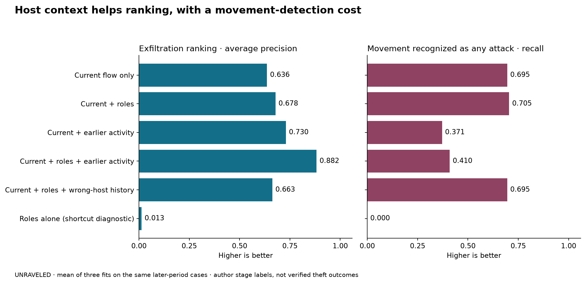

# Host roles and earlier activity: alternative-dataset pilot

**All 18 fixed-configuration fits completed:** six arms, three fitting supports. UNRAVELED single IT sensor; later complete captures are the evaluation period. CPU only. Source/protocol freeze: `b6e9e8d`.

## What this answers

This tests whether coarse roles and strictly earlier completed activity improve prediction of the author's movement/exfiltration **stage annotations**. The source does not independently verify that each labeled flow performs successful movement or carries stolen data. All IT-sensor movement rows describe Remote System Discovery on one host pair. The distinction is material: a stage-label gain is not proof of detecting actual theft.

The [frozen design](../../host_history_exfil/DESIGN.md), [data inventory](../../host_history_exfil/DATA_INVENTORY.md) and [dataset literature](../../host_history_exfil/DATASET_LITERATURE.md) explain the source, chronology, role mapping, missing movement calibration support and proposed stronger follow-up.

## Data and method

Malformed middle CSV fields were excluded; existing annotations were read from their validated right-hand positions. Feature/event identities and source hashes were checked. No target labels enter role or history features. All history flows finish strictly before the current flow starts. Current-flow statistics still require flow completion, so this is not early warning.

| Partition | Benign | Other attack stage | Movement | Exfiltration |
|---|---:|---:|---:|---:|
| fit | 147087 | 12362 | 27 | 1740 |
| calibration | 8929 | 2659 | 0 | 1331 |
| test | 192193 | 12424 | 35 | 3442 |

Each fit used 20,000 Benign, 5,000 OtherAttackStage, 27 LateralMovement, 1,740 DataExfiltration. Arms share these same fitting identities per seed. Every calibration and test row is retained; there is no random row train/test split.

Prepared 382,229 rows; removed 0 duplicate observable rows and quarantined 0 conflicting rows. Modeling elapsed time: 116.9 seconds.

## Main later-period results

Mean of three fits on the same later cases. AP is average precision. The first table uses the largest of four stage scores. Normal false alerts are benign rows called any attack; exfiltration precision includes confusion with other attacks.

| Method | Four-class macro-F1 | Exfil AP | Exfil precision | Exfil recall | Exfil F1 | Movement F1 | Movement any-attack recall | Benign false attacks |
|---|---:|---:|---:|---:|---:|---:|---:|---:|
| Current flow only | 0.7552 | 0.6363 | 85.90% | 67.53% | 0.7561 | 0.2861 | 69.52% | 157.33 |
| Current + roles | 0.7537 | 0.6782 | 85.87% | 67.50% | 0.7558 | 0.2804 | 70.48% | 149.00 |
| Current + earlier activity | 0.7591 | 0.7300 | 88.52% | 67.19% | 0.7639 | 0.2909 | 37.14% | 43.33 |
| Current + roles + earlier activity | 0.7552 | 0.8823 | 88.61% | 67.17% | 0.7641 | 0.2754 | 40.95% | 47.00 |
| Current + roles + wrong-host history | 0.7533 | 0.6629 | 85.58% | 67.52% | 0.7548 | 0.2803 | 69.52% | 142.67 |
| Roles alone (shortcut diagnostic) | 0.2401 | 0.0133 | 0.00% | 0.00% | 0.0000 | 0.0000 | 0.00% | 0.00 |

## Same coarse roles, shifted exfiltration destination

Department-to-private-services evaluation has **1,576 benign, 35 movement and 1,101 exfiltration rows**. Its fitting split has zero exfiltration examples; calibration has neither target class in this stratum. This is a new destination-role context, not a matched in-distribution comparison. A role-only shortcut can fail here even when aggregate scores look high.

The four-class F1 calculation includes OtherAttackStage even though it has no examples in this stratum; interpret the individual target F1s and counts directly. Pairwise AP considers only the two target labels; its no-skill reference is exfiltration prevalence **96.92%**, so a high value alone is weak evidence.

| Method | Exfil AP vs all stratum rows | Exfil precision | Exfil recall | Exfil F1 | Movement precision | Movement recall | Movement F1 | Exfil-vs-movement AP |
|---|---:|---:|---:|---:|---:|---:|---:|---:|
| Current flow only | 0.5786 | 0.00% | 0.00% | 0.0000 | 18.06% | 69.52% | 0.2861 | 1.0000 |
| Current + roles | 0.8695 | 0.00% | 0.00% | 0.0000 | 17.55% | 70.48% | 0.2804 | 0.9932 |
| Current + earlier activity | 0.4262 | 0.00% | 0.00% | 0.0000 | 24.31% | 37.14% | 0.2909 | 0.9999 |
| Current + roles + earlier activity | 0.7876 | 0.00% | 0.00% | 0.0000 | 21.17% | 40.95% | 0.2754 | 0.9725 |
| Current + roles + wrong-host history | 0.8132 | 0.00% | 0.00% | 0.0000 | 17.62% | 69.52% | 0.2803 | 0.9914 |
| Roles alone (shortcut diagnostic) | 0.4060 | 0.00% | 0.00% | 0.0000 | 0.00% | 0.00% | 0.0000 | 0.9692 |

## Calibration-selected exfiltration decisions

Thresholds maximize exfiltration F1 on calibration, then stay fixed. Calibration contains no movement examples; therefore these thresholds were not calibrated against movement confusion. The counted test movement mistakes make that limitation visible.

| Method | Precision | Recall | F1 | True exfil alerts | False benign→exfil | False other-stage→exfil | False movement→exfil |
|---|---:|---:|---:|---:|---:|---:|---:|
| Current flow only | 88.52% | 67.40% | 0.7653 | 2320.00 | 0.33 | 300.67 | 0.00 |
| Current + roles | 88.57% | 67.39% | 0.7654 | 2319.67 | 0.33 | 299.33 | 0.00 |
| Current + earlier activity | 87.93% | 67.29% | 0.7623 | 2316.00 | 4.33 | 314.00 | 0.00 |
| Current + roles + earlier activity | 88.21% | 67.26% | 0.7632 | 2315.00 | 1.33 | 308.67 | 0.00 |
| Current + roles + wrong-host history | 88.51% | 67.42% | 0.7654 | 2320.67 | 0.00 | 301.33 | 0.00 |
| Roles alone (shortcut diagnostic) | 1.16% | 68.01% | 0.0228 | 2341.00 | 186874.00 | 12424.00 | 0.00 |

## Paired differences: every declared component comparison

Deltas are candidate minus reference. These are fitting-support differences on shared cases, not independent-campaign confidence estimates.

| Candidate | Reference | Population | Metric | Mean delta | Positive / negative fits |
|---|---|---|---|---:|---:|
| Current + roles | Current flow only | test | exfil_ap | +0.0419 | 3 / 0 |
| Current + roles | Current flow only | test | exfil_f1 | -0.0003 | 1 / 2 |
| Current + roles | Current flow only | test | lateral_f1 | -0.0057 | 1 / 2 |
| Current + roles | Current flow only | test | macro_f1 | -0.0014 | 1 / 2 |
| Current + roles | Current flow only | DEPARTMENT->PRIVATE_SERVICES | exfil_ap | +0.2908 | 3 / 0 |
| Current + roles | Current flow only | DEPARTMENT->PRIVATE_SERVICES | exfil_f1 | +0.0000 | 0 / 0 |
| Current + roles | Current flow only | DEPARTMENT->PRIVATE_SERVICES | lateral_f1 | -0.0057 | 1 / 2 |
| Current + roles | Current flow only | DEPARTMENT->PRIVATE_SERVICES | macro_f1 | -0.0015 | 1 / 2 |
| Current + earlier activity | Current flow only | test | exfil_ap | +0.0938 | 3 / 0 |
| Current + earlier activity | Current flow only | test | exfil_f1 | +0.0078 | 3 / 0 |
| Current + earlier activity | Current flow only | test | lateral_f1 | +0.0048 | 2 / 1 |
| Current + earlier activity | Current flow only | test | macro_f1 | +0.0039 | 2 / 1 |
| Current + earlier activity | Current flow only | DEPARTMENT->PRIVATE_SERVICES | exfil_ap | -0.1524 | 1 / 2 |
| Current + earlier activity | Current flow only | DEPARTMENT->PRIVATE_SERVICES | exfil_f1 | +0.0000 | 0 / 0 |
| Current + earlier activity | Current flow only | DEPARTMENT->PRIVATE_SERVICES | lateral_f1 | +0.0048 | 2 / 1 |
| Current + earlier activity | Current flow only | DEPARTMENT->PRIVATE_SERVICES | macro_f1 | +0.0059 | 2 / 1 |
| Current + roles + earlier activity | Current + roles | test | exfil_ap | +0.2041 | 3 / 0 |
| Current + roles + earlier activity | Current + roles | test | exfil_f1 | +0.0083 | 3 / 0 |
| Current + roles + earlier activity | Current + roles | test | lateral_f1 | -0.0050 | 2 / 1 |
| Current + roles + earlier activity | Current + roles | test | macro_f1 | +0.0015 | 2 / 1 |
| Current + roles + earlier activity | Current + roles | DEPARTMENT->PRIVATE_SERVICES | exfil_ap | -0.0819 | 0 / 3 |
| Current + roles + earlier activity | Current + roles | DEPARTMENT->PRIVATE_SERVICES | exfil_f1 | +0.0000 | 0 / 0 |
| Current + roles + earlier activity | Current + roles | DEPARTMENT->PRIVATE_SERVICES | lateral_f1 | -0.0050 | 2 / 1 |
| Current + roles + earlier activity | Current + roles | DEPARTMENT->PRIVATE_SERVICES | macro_f1 | +0.0038 | 2 / 1 |
| Current + roles + earlier activity | Current + earlier activity | test | exfil_ap | +0.1522 | 3 / 0 |
| Current + roles + earlier activity | Current + earlier activity | test | exfil_f1 | +0.0002 | 2 / 1 |
| Current + roles + earlier activity | Current + earlier activity | test | lateral_f1 | -0.0155 | 0 / 3 |
| Current + roles + earlier activity | Current + earlier activity | test | macro_f1 | -0.0038 | 0 / 3 |
| Current + roles + earlier activity | Current + earlier activity | DEPARTMENT->PRIVATE_SERVICES | exfil_ap | +0.3614 | 3 / 0 |
| Current + roles + earlier activity | Current + earlier activity | DEPARTMENT->PRIVATE_SERVICES | exfil_f1 | +0.0000 | 0 / 0 |
| Current + roles + earlier activity | Current + earlier activity | DEPARTMENT->PRIVATE_SERVICES | lateral_f1 | -0.0155 | 0 / 3 |
| Current + roles + earlier activity | Current + earlier activity | DEPARTMENT->PRIVATE_SERVICES | macro_f1 | -0.0037 | 0 / 3 |
| Current + roles + earlier activity | Current + roles + wrong-host history | test | exfil_ap | +0.2194 | 3 / 0 |
| Current + roles + earlier activity | Current + roles + wrong-host history | test | exfil_f1 | +0.0093 | 3 / 0 |
| Current + roles + earlier activity | Current + roles + wrong-host history | test | lateral_f1 | -0.0049 | 2 / 1 |
| Current + roles + earlier activity | Current + roles + wrong-host history | test | macro_f1 | +0.0019 | 2 / 1 |
| Current + roles + earlier activity | Current + roles + wrong-host history | DEPARTMENT->PRIVATE_SERVICES | exfil_ap | -0.0256 | 1 / 2 |
| Current + roles + earlier activity | Current + roles + wrong-host history | DEPARTMENT->PRIVATE_SERVICES | exfil_f1 | +0.0000 | 0 / 0 |
| Current + roles + earlier activity | Current + roles + wrong-host history | DEPARTMENT->PRIVATE_SERVICES | lateral_f1 | -0.0049 | 2 / 1 |
| Current + roles + earlier activity | Current + roles + wrong-host history | DEPARTMENT->PRIVATE_SERVICES | macro_f1 | +0.0037 | 2 / 1 |

## Fixed calibration-budget sensitivity

Nominal 0.1%, 0.5%, 1%, and 2% non-exfiltration calibration tails are descriptive points, not success requirements or future guarantees. Movement is absent from calibration. Complete threshold values and later confusion counts are retained in SUMMARY.json.

| Method | Nominal calibration budget | Test exfil precision | Test exfil recall | Test false exfil alerts |
|---|---:|---:|---:|---:|
| Current flow only | 0.10% | 84.61% | 67.53% | 422.67 |
| Current flow only | 0.50% | 74.40% | 67.55% | 805.33 |
| Current flow only | 1.00% | 67.11% | 67.56% | 1148.33 |
| Current flow only | 2.00% | 57.31% | 67.57% | 1738.33 |
| Current + roles | 0.10% | 84.47% | 67.52% | 427.67 |
| Current + roles | 0.50% | 74.08% | 67.55% | 818.67 |
| Current + roles | 1.00% | 67.80% | 67.55% | 1108.33 |
| Current + roles | 2.00% | 57.25% | 67.56% | 1741.00 |
| Current + earlier activity | 0.10% | 86.44% | 67.36% | 364.33 |
| Current + earlier activity | 0.50% | 74.38% | 67.82% | 805.00 |
| Current + earlier activity | 1.00% | 56.92% | 70.03% | 1840.33 |
| Current + earlier activity | 2.00% | 41.51% | 71.89% | 3501.67 |
| Current + roles + earlier activity | 0.10% | 86.58% | 67.41% | 360.00 |
| Current + roles + earlier activity | 0.50% | 75.57% | 74.48% | 827.67 |
| Current + roles + earlier activity | 1.00% | 63.63% | 90.46% | 1774.00 |
| Current + roles + earlier activity | 2.00% | 48.90% | 92.58% | 3328.67 |
| Current + roles + wrong-host history | 0.10% | 82.62% | 67.54% | 489.67 |
| Current + roles + wrong-host history | 0.50% | 73.75% | 67.55% | 827.67 |
| Current + roles + wrong-host history | 1.00% | 67.97% | 67.56% | 1096.00 |
| Current + roles + wrong-host history | 2.00% | 60.47% | 67.57% | 1521.00 |
| Roles alone (shortcut diagnostic) | 0.10% | 0.00% | 0.00% | 0.00 |
| Roles alone (shortcut diagnostic) | 0.50% | 0.00% | 0.00% | 0.00 |
| Roles alone (shortcut diagnostic) | 1.00% | 0.00% | 0.00% | 0.00 |
| Roles alone (shortcut diagnostic) | 2.00% | 0.00% | 0.00% | 0.00 |

## Interpretation limits and artifacts

- A different dataset is not automatically independent confirmation: these source files were used in earlier GML development, and the record describes one APT campaign.
- Using one sensor prevents a cross-interface shortcut but does not remove fixed-host, role, script or source-label associations. Intra-subnet traffic is not comprehensively observed.
- Earlier history contains traffic observations only; stages, attacker identities, future events and future host inventories are excluded. No guarantee covers unmeasured exporter delays.
- Only 35 later movement rows represent one annotated host pair; three fitting seeds do not create more attacks. Calibration has no movement examples.
- Roles-only and wrong-host-history controls expose some shortcuts. A gain over them is not a causal explanation or proof of successful exfiltration.
- Newer source files were also inspected directly. [Comprehensive APT2025 qualification](../../host_history_exfil/COMPREHENSIVE_PROBE.md) found schema failures, duplicates and failed/preparatory transfers among tactic tags; it is not silently treated as validated ground truth.

[SUMMARY.json](SUMMARY.json) contains all seed/arm, role-pair and capture metrics. [EVIDENCE.json](EVIDENCE.json) holds means and paired differences. [PREPARATION.json](PREPARATION.json) and [PRIVATE_ARTIFACTS.json](PRIVATE_ARTIFACTS.json) bind inputs, models and scores. Consult the independent [AUDIT.json](AUDIT.json) before using results; an audit verifies saved-output calculations, not attack truth.
