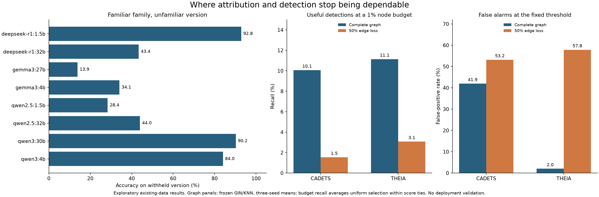

# Choosing a defensible Praxis direction

**Read [findings and candidate decisions](FINDINGS.md).** This batch screens all six proposed directions plus timing/typo features using existing data. It contains 248 new fits and 36 budget analyses of previously fitted graph scores. These are exploratory configurations, not independent experiments or campaigns. No deployable winner or first-ever novelty is claimed.

The two leading research candidates are:

* **Direct defensive utility:** preserving useful attack evidence within an investigation budget when telemetry is lost. Existing graph scores expose alert flooding and ranking deterioration, but temporal/chain validation and an effective mitigation remain necessary.
* **AI-focused feasibility:** specifying when family attribution should be declined under unseen model versions, environments and incomplete logs. High ordinary-split scores did not establish version transfer or unknown-family safety.

Recovery remains a feature extension. Current unknown/early rules failed. Human/AI correction results were sensitive to benchmark controls, and timing observations are not comparable across recording mechanisms.

## Evidence

* [Frozen initial protocol](PROTOCOL.txt), [replay extension](REPLAY_ADDENDUM.txt), [control-command sensitivity](CONTROL_COMMAND_ADDENDUM.txt), [existing graph-score extension](APT_SCORE_ADDENDUM.txt), [score-tie sensitivity](TIE_SENSITIVITY_NOTE.txt). Extensions explicitly disclose prior result inspection.
* [Primary-source novelty matrix and licenses](SOURCES.md). Honey full text is embargoed; TRACE's artifact was inaccessible here. Neither was silently treated as reviewed data.
* `evidence/RESULTS.json`, `SPLITS.json`, `PREDICTIONS_*.json.gz`: all Honey results, partitions and hashed-session decisions.
* `EXTERNAL.json`: independent-collector within-Lyptus family experiment, with task-held-out predictions. This is not frozen-classifier transfer.
* `BINARY_*` are the control-filtered replay sensitivity; `UNFILTERED_BINARY_*` preserve the initial replay result. Both public-data input derivatives and hashes are included. They are not verified keystroke labels.
* `GRAPH_RESULTS.json`: weak simple baselines across random and relation-specific edge loss. `GRAPH_EXISTING.json`: stronger previously fitted scores reevaluated under a fixed node budget. Decisions and score-tie groups are in compressed NPZ files. Nodes are not independent campaigns.
* `VALIDATION.json`: saved arithmetic, isolation and provenance checks. `MANIFEST.json`: publication file checksums. These are developer checks, not independent adjudication of source labels.

## Research tools

`observation_contract.py --view truncate32` returns measured logging qualification, known limitations and a research-only decision. Supported view names are in the result table. It does not classify arbitrary input as human/AI or malicious.

`budget_replay.py --scores FILE.npz --key score --budget 100 --seed 17 --output receipt.json` selects a fixed number of node scores with explicit random tie handling. The labels do not enter selection. This is an offline evaluation aid, not a deployed SOC alerting system.

## Reproduction

Use Python 3.11 and the pinned [prior numerical requirements](../operator_signals_20261007/requirements.txt). Paths below use `STUDY=experiments/praxis_next/defense_opportunities_20261007`; substitute the actual path in commands.

1. Prepare the original Honey cache as described in [the previous batch](../operator_signals_20261007/README.md). Then run `python STUDY/screen.py`. This requires several GB RAM and took about 31 minutes locally. Commands in transcripts remain inert strings.
2. Run `python STUDY/external.py` using inherited PX121 records.
3. For exact binary reproduction from the published converted inputs, import `binary` from the previous folder, set its `HERE` to this study directory, and call `run()` on `REPLAY_INPUT.json` and `FILTERED_REPLAY_INPUT.json` respectively. The `binary_replay.py` wrapper regenerates the unfiltered input when given the original PX122 `REPLAY_RECORDS.json`; `filter_binary.py` must follow that fresh unfiltered run because it archives the current unfiltered outputs before fitting the filtered data. Do not repeatedly run the filter against already-filtered outputs.
4. To repeat the input-control audit, run `python STUDY/human_audit.py --data PATH_TO_PX120_ARCHIVES`. Original public archives/manifests are required. This audit does not alter model inputs.
5. Generate the pinned prepared native graphs with the inherited [data adapter](../../apt_final/native_graph/data.py), following its source manifest. Run `python STUDY/graph_screen.py --data PATH_TO_PREPARED_GRAPHS`. Original graph scores for the separate rescore are produced by the inherited [embedding study](../../apt_final/embedding_baseline/README.md); run `python STUDY/rescore_graph.py --data PATH_TO_EMBEDDING_OUTPUTS`. This command verifies their saved hashes. Reusing their published decision files allows arithmetic auditing without original private model checkpoints.
6. Run `python STUDY/audit.py`, `python STUDY/report.py`, then `python -m unittest discover -s STUDY -p test_artifacts.py`. Optional `plot.py` uses matplotlib (3.11.1 in the plotting environment); it is separate from fitting. `package.py` writes compressed prediction chunks and the manifest.

The original source archives, full Honey transcript cache and graph score vectors stay outside Git. The publication includes compressed decisions sufficient to check reported outcome arithmetic. The prepared graph files have no timestamps or source UUIDs, preventing chronological outages and full attack-chain evaluation. No new source collection or cloud execution was performed.

For verification directly from a checkout, run `python STUDY/audit.py --published`. This uses published prediction chunks and packed graph decisions and does not require the ignored caches. The published-evidence audit passed 2,301 checks; the original score/cache audit passed 2,167, and four prototype tests passed. The overlapping checks are not independent validation runs. Version tests produce expected single-class metric warnings; these are distinct from optimizer convergence warnings, of which the main and external SVC runs recorded none.
