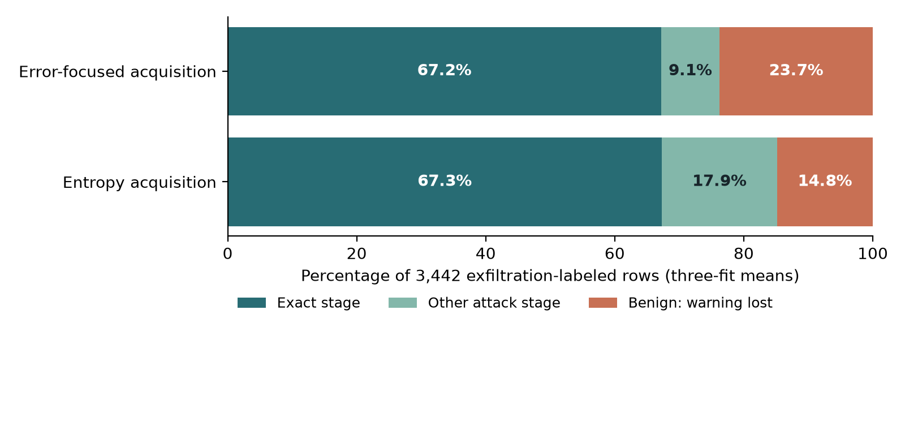
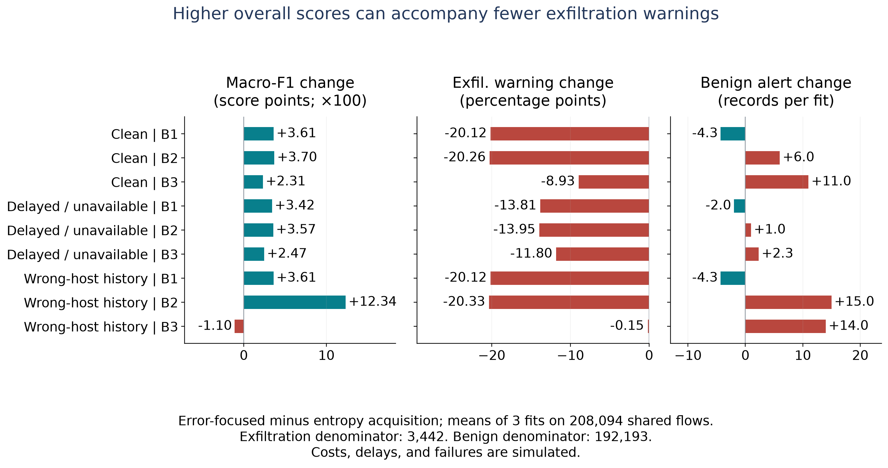
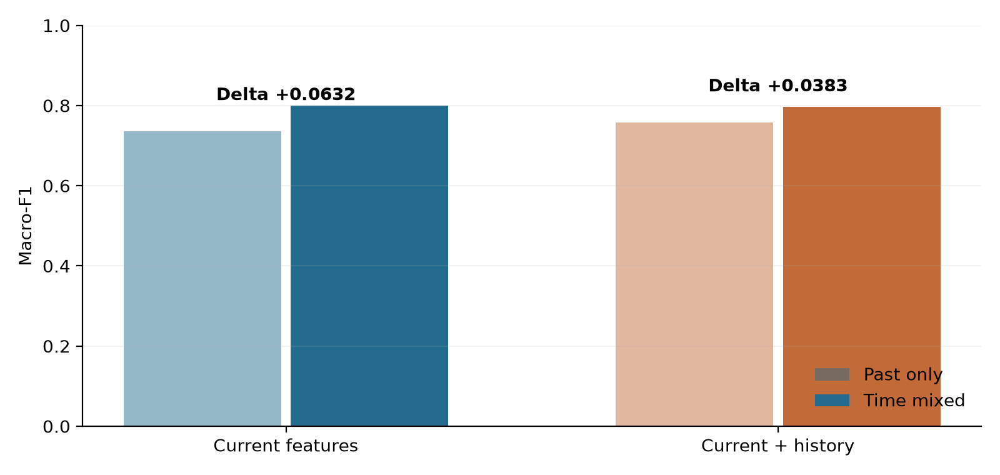
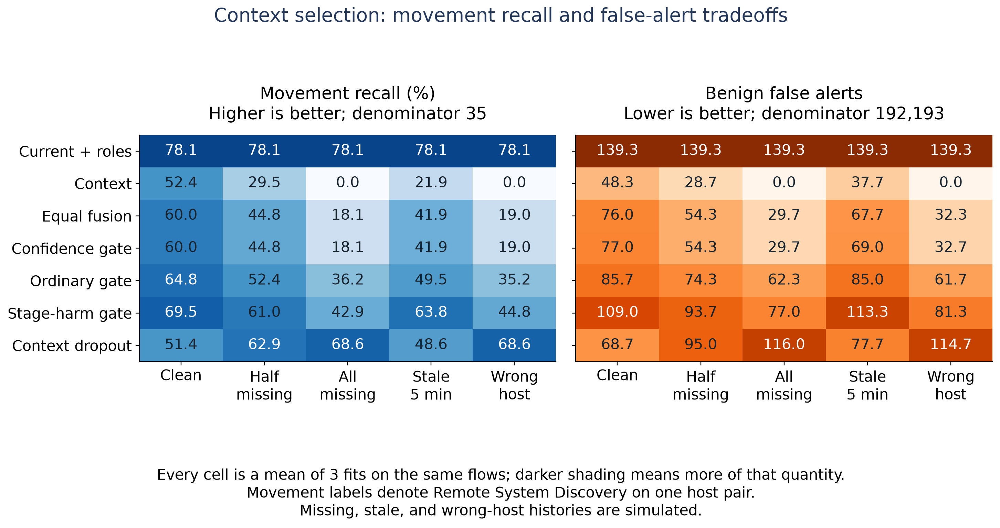
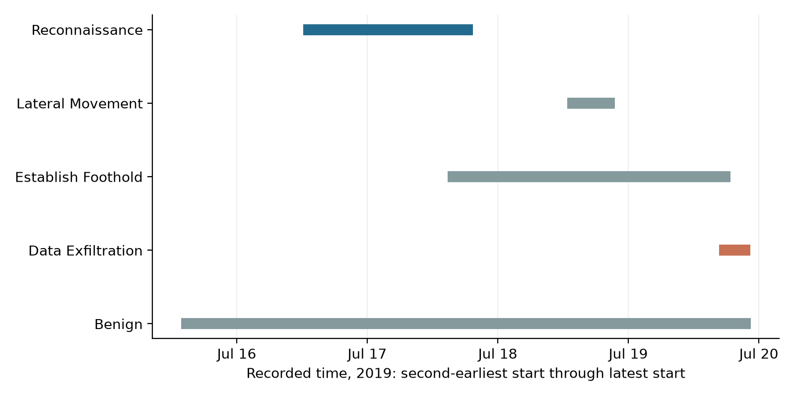
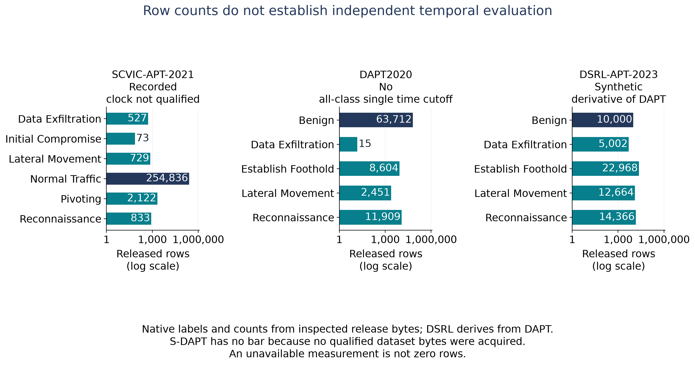
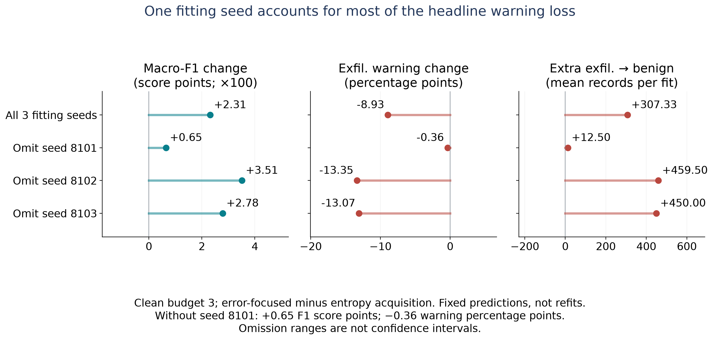
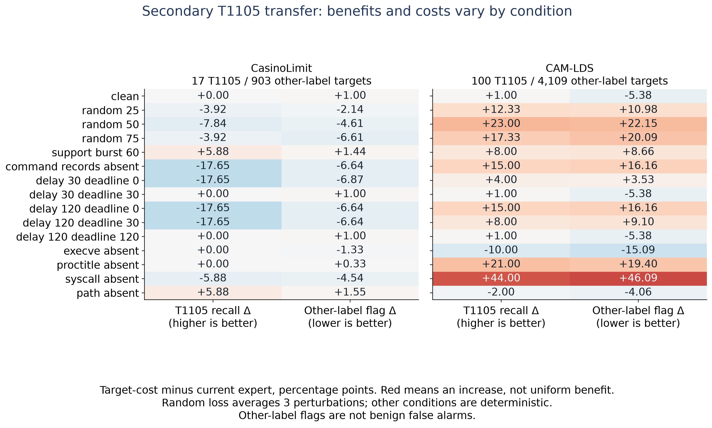
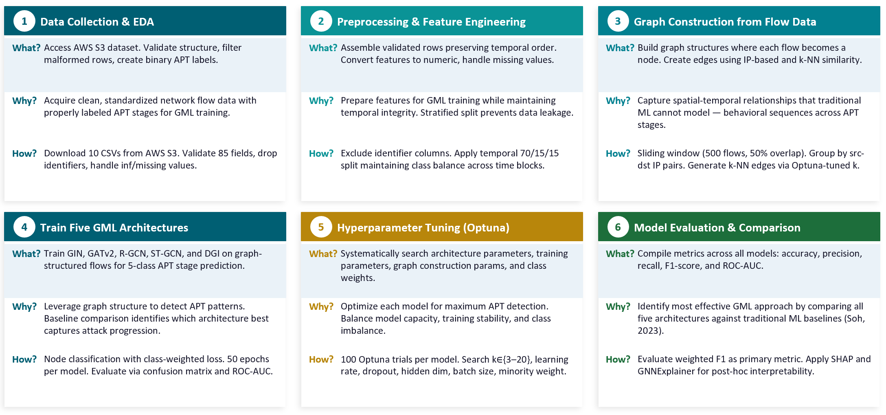

# Chapter 1: Introduction

## 1.1 Background

A security analyst reviewing a suspicious transfer faces two related questions: should this activity receive an attack warning, and which attack stage best describes it? A system can answer the second question incorrectly while still drawing attention to the activity. It can also assign a benign label and remove that opportunity for review. These outcomes have different operational meanings, even when a multiclass objective assigns them the same penalty.

Consider 100 records labeled exfiltration by a dataset author. If a model calls 60 exfiltration, 20 another attack stage, and 20 benign, its exact-stage recall is 60% and its warning recall is 80%. This illustrative accounting is not a study result. It explains why a single headline score cannot describe both stage accuracy and preservation of an attack label. Warning recall must also be considered with benign false alerts: predicting an attack for every record preserves every warning and creates an unusable workload.

Uddin et al. (2025) provide a direct empirical precedent for this distinction. Their hierarchical-versus-flat intrusion study reports per-attack recognition and attacks misclassified as normal. Recent APT provenance work also challenges the relationship between conventional evaluation scores and practical detection behavior (Bilot et al., 2025; Guerra et al., 2026). These findings motivate closer measurement of the decisions represented by a score, rather than assuming that a new model architecture solves the evaluation problem.

## 1.2 Research Motivation

Security-model review is an engineering decision: a practitioner must decide whether a proposed change improves outcomes that matter for the intended use. A multiclass score summarizes several kinds of error, yet those errors do not have the same meaning for an investigation. An event labelled as the wrong attack stage can still receive attention; an event labelled benign may receive none. Historical context can change both the stage label and the error destination.

This study began with two practical interventions: learning when historical context should be used and choosing additional evidence under a collection budget. Their completed comparisons revealed a useful evaluation question. Improvements in aggregate classification performance sometimes occurred alongside a loss of attack warnings. The praxis therefore centres on measuring that relationship and providing an inspection procedure supported by the recorded comparisons. The model implementations serve as experimental tools for this applied question.

## 1.3 Problem Statement

**Problem statement.** APT-stage evaluation can reward a change in aggregate classification performance without making its effects on missed attack warnings and benign alert workload visible, while available benchmark artifacts may not support the temporal comparison needed to interpret that change.

The purpose of this praxis is to measure these effects under explicit controls and provide an executable audit that practitioners can apply before accepting a stage classifier. The immediate application is model evaluation and selection. It is not a production detector deployment or a forecast of data theft.

The industry consequence is concrete: a team comparing model updates could accept a higher F1 score while sending fewer exfiltration-labeled events for investigation. A team can also overestimate its evidence by counting many correlated flows as independent incidents or by treating related dataset releases as separate replications. The study measures examples of these issues and documents the source checks needed to interpret them.

## 1.4 Thesis Statement

Evaluating APT models using overall performance, stage-specific missed warnings and benign false alerts together reveals consequential tradeoffs that an overall score alone does not describe. A defensible comparison must also establish that its training chronology, evaluation population and source labels support the question being asked.

The thesis is evaluated as an empirical measurement contribution. It does not require a new detector architecture. Its evidence comprises controlled comparisons, observed error destinations, sensitivity analyses and an executable source-qualification procedure.

## 1.5 Research Objectives

The objectives are to:

1. Quantify how historical-evidence choices change macro-F1, exact-stage recognition, stage-conditioned warning recall and benign false alerts on the same evaluation records.
2. Measure training-composition sensitivity while holding the classifier family, evaluation anchor and class-specific fitting budgets fixed.
3. Determine whether four proposed APT releases can support the declared all-native-class chronological comparison.
4. Deliver traceable results, understandable model mathematics and a reproducible reporting procedure that keeps adverse outcomes and uncertainty visible.

## 1.6 Research Questions and Analytical Propositions

**RQ1, primary:** When historical-evidence choices improve an APT model's overall score, what happens to exfiltration warnings and false alarms on the same evaluation records?

**RQ2, supporting:** How much does access to later-period fitting observations change reported stage performance when architecture, evaluation records and per-class fitting counts remain fixed?

**RQ3, supporting:** Which proposed benchmark artifacts support the unchanged all-native-class chronological comparison, and what prevents the others from supporting it?

The evaluation proposition for RQ1 is that a higher macro-F1 does not ensure preservation of warnings for a particular attack stage. For RQ2, the tested expectation is that changing temporal access and training composition can change scores despite a fixed evaluation anchor. For RQ3, the necessary-condition proposition is that a single cutoff cannot provide the specified earlier and later native-class support when the class-support interval is empty.

The fitted experiments froze their protocols before fitting. The warning-loss pattern was inspected retrospectively; these propositions do not retroactively constitute newly preregistered hypotheses. The complete comparisons and unfavorable outcomes remain in the results. This edition places the warning question first for clarity; the original experiment identifiers, protocols and results retain their original labels in the evidence archive.

## 1.7 Scope of Research

The main study evaluates the prepared UNRAVELED flow artifact and uses its four declared evaluation classes. The history-selection, evidence-acquisition and temporal experiments contribute 141 fitted models; a separate two-fit policy-transfer supplement brings the wider batch to 143. These fitting counts are not counts of independent attacks.

The source-qualification study covers inspected SCVIC-APT-2021, DAPT2020 and DSRL-APT-2023 artifacts and the acquisition status of S-DAPT-2026. It does not claim four additional fitted replications. CasinoLimit and CAM-LDS support a separately labelled technique-recognition supplement, whose units and negative labels differ from the main benign-versus-attack stage task.

## 1.8 Research Limitations

The main results describe one previously examined campaign. Its movement target denotes author-annotated remote discovery on one host pair, with only 35 evaluation rows and 18 anchor rows. Completed-flow features do not measure detection before flow completion. Stage labels do not independently verify successful compromise or delivery of stolen files. Simulated missing, delayed and wrong-host evidence probes specified conditions; it does not estimate their frequency or price in production.

The paired warning analysis is retrospective, and the five capture fragments are correlated parts of a shared workflow. Conditional resampling intervals and fitting-seed sensitivity describe these data rather than a population of independent campaigns. Chapter 5 states the implications of these limits for the empirical claim.

## 1.9 Praxis Organization

Chapter 2 reviews the relevant literature and identifies the narrow empirical contribution. Chapter 3 presents the Graphical Model of Research, source evaluation, implemented models, mathematical objectives and evaluation controls. Chapter 4 reports the completed results and sensitivity analyses. Chapter 5 discusses their meaning, contributions, limitations and recommendations. The appendices and accompanying machine-readable supplement retain comprehensive result coverage, provenance and the original GML GMR reference.

# Chapter 2: Literature Review

## 2.1 Introduction

This review positions the study relative to recent APT evaluation, temporal validity and error-destination research. It is a targeted primary-source review completed September 23, 2026, centred on 2024-2026 publications and supplemented with original dataset and method sources. It identifies overlap and concrete distinctions; it is not a systematic review or an exhaustive priority claim.

## 2.2 Temporal Validity in Security Evaluation

TESSERACT established temporal and distributional constraints for evaluating malware classifiers and showed why inappropriate splits can produce misleading conclusions (Pendlebury et al., 2019). This is foundational prior art rather than part of the recent-literature window. Holding out random records is not equivalent to asking whether a model trained earlier will work later.

Bilot et al. (2025) examine provenance-based intrusion detectors in a common framework, identify practical and evaluation shortcomings, and include simple alternatives. Their work supports the use of strong simple controls and detection-relevant outcomes. Guerra et al. (2026) directly address APT provenance benchmarking, including temporally separated evaluation and the influence of benchmark semantics on conclusions. Consequently, neither temporal hygiene nor critical measurement of APT detection is new in itself.

The present temporal contrast is narrower: it keeps the later evaluation rows and per-class fitting budget constant while changing access to later-period training observations. This avoids attributing a difference caused by a different test population to training chronology alone. It still changes training composition and diversity; it cannot identify an effect of time independently of every other property of those added observations.

## 2.3 Correct Attack Stages and Retained Warnings

Uddin et al. (2025) compare hierarchical and flat intrusion classifiers across ten datasets and ten algorithms. The available author manuscript (Uddin et al., 2024) reports exact attack recognition, attacks classified as normal, confusion matrices, and false-positive tradeoffs. The distinction between a wrong attack type and a missed attack therefore has direct prior coverage. Renaming stage-conditioned binary recall would not create a new metric.

The empirical question addressed here is whether a fixed experimental comparison can improve macro-F1 while reducing warnings for an author-defined consequential stage. The answer must include benign workload and error destinations, because a warning-retention objective alone can be satisfied trivially. The paper reports this tradeoff from saved predictions and preserves its retrospective discovery status.

## 2.4 Recent Flow and Attack-Stage Research

The 2026 TAN-IDS framework provides a deployment-oriented, shared NetFlow evaluation interface with in-domain and cross-domain comparisons (Ha Thanh, 2026). Its stated limitations leave multiclass or family discrimination and systematic feature ablation for further work. This is a concrete scope boundary that motivates examining stage-specific errors under controlled changes in data and evidence.

Recent APT research already investigates temporal and contextual attack-stage recognition. StageFinder combines structural and temporal information for stage estimation (Phan & Bauschert, 2026). Other contemporary flow studies and dataset efforts investigate sequence or graph representations. The current work therefore does not claim that temporal context, ensembles, or flow-based APT stages are unexplored. It evaluates how particular contextual decisions affect a useful warning and how much the evaluation design contributes to the reported score.

Recent model comparisons and flow-sequence studies include Luengo Viñuela et al. (2026), Iturbe et al. (2026), and Ibrahim et al. (2025). SANGL also examines sequential network patterns and graph learning for APT detection (M K et al., 2026). These are direct application precedents; their published scores are not reproduced baselines in this paper. Bibliographic name forms follow the publishers' records, with source details retained in the reference audit.

Othman et al. (2026) study DAPT stage durations and residual time-to-compromise through a survival-modelling task. Their session-based timing question differs from requiring every native class in both earlier training and later testing for a closed-set classifier. The support limitation measured here applies to the latter requirement and does not invalidate the former use of DAPT.

## 2.5 Dataset Origin and Benchmark Independence

UNRAVELED is a semi-synthetic APT dataset published in 2023 (Myneni et al., 2023). Its use here is necessary data provenance, not a claim to use a newly released 2026 corpus. The proposed expansion includes SCVIC-APT-2021 (Liu et al., 2022a, 2022b), DAPT2020 (Myneni et al., 2020), DSRL-APT-2023 (Shadabfar et al., 2025), and S-DAPT-2026 (Tijjani et al., 2026, withdrawn). Release names and paper dates do not establish independent executions, valid event clocks, or accessible source bytes.

DSRL is especially relevant to independence: its paper describes synthetic attacks generated from DAPT and benign examples sampled from DAPT. These relationships must be retained in any evidence count. Likewise, the inspected S-DAPT arXiv record is withdrawn, and the present project did not acquire a qualified replacement data release. An unavailable artifact cannot become a performance result through its citation alone.

## 2.6 Literature Gap and Contribution Positioning

The working gap is the lack of the specific controlled evidence assembled here: fixed-anchor training-composition effects, joint accounting of stage errors and lost warnings under historical-evidence choices, and an executable qualification audit of the requested APT-flow releases. Close prior work covers each surrounding concept. The claim is an applied measurement contribution with explicit experimental controls and artifacts, not proof that no earlier paper contains any related observation.

The literature review is targeted, not systematic. It checks named closest work and recent primary sources on temporal APT evaluation, hierarchical error destinations, stage reasoning, and source datasets. The [reference and claim audit](../measurement_praxis/LITERATURE_AND_CLAIMS.md) records publication status, accessible sections, metadata, and limits of verification. The accessible 2024 author version of the Uddin study is distinguished from its 2025 journal record; available 2026 preprints are distinguished from proceedings not yet published.

| Closest work | Established contribution | Scope of this study |
|---|---|---|
| TESSERACT (2019) | Temporal and distribution constraints in malware evaluation | Same-anchor APT-flow training-pool contrast |
| Bilot et al. (2025); Guerra et al. (2026) | Critical provenance/ APT benchmarking and practical controls | Flow-stage observations with explicit source support |
| Uddin et al. (2025) | Attack-type errors versus attacks called normal | Measured metric/warning tradeoffs under evidence changes |
| TAN-IDS (2026) | Flow-based cross-domain evaluation; binary scope | Stage-conditioned warning outcomes and temporal controls |
| Othman et al. (2026) | DAPT stage timing and residual-time survival analysis | Necessary support for a different, all-class classifier split |

## 2.7 Machine-Learning Foundations and Their Role

The main experiments use gradient-boosted decision trees for multiclass prediction and scalar regression. Boosting adds trees sequentially to improve a specified loss; using the same family across comparisons limits architecture changes as an explanation for a score difference. Chapter 3 distinguishes the multiclass experts from the regressors that select history or additional evidence, and reports their actual objectives.

The separate policy-transfer supplement uses previously fitted logistic-regression experts and newly fitted Ridge selectors. These models provide a deliberately modest test of whether a learned context-selection score changes the decisions of its source experts. The model-specific primary references and equations are given alongside their implementations in Chapter 3. No graph-neural model, TabM architecture or large language model was fitted in this completed measurement batch.

## 2.8 Literature Review Summary

The literature establishes that time ordering, source semantics and error destinations matter in security evaluation. The empirical contribution here is a controlled flow-level account of their interaction: fixed-anchor training-composition comparisons, stage-conditioned warning and workload measurements under evidence choices, and a task-specific audit of named dataset releases. Existing metric definitions are used directly. The purpose is to add inspectable measurements and a reusable applied procedure, while keeping the distinction between published precedent and this study's observed results clear.

# Chapter 3: Methodology

## 3.1 Introduction and Graphical Model of Research

The Graphical Model of Research (GMR) summarizes the completed workflow. It follows the numbered What/Why/How convention in the author's earlier GWU GML praxis (Pagan, 2026), with the content adapted to the present measurement study. The original graph-construction, architecture-training and tuning diagram is retained separately as a historical reference in Appendix C.

The first two stages establish which records, targets and chronology are available. The third fits the declared comparison models without selecting a new architecture from evaluation scores. The fourth records what each prediction does to the attack warning and the benign workload. The fifth evaluates conditional uncertainty and source support. The sixth assembles the completed evidence into a reproducible praxis. The figure is a workflow description, not an additional empirical result.

## 3.2 Research Design and Analysis Chronology

The study combines completed controlled experiments with a retrospective analysis of their saved predictions and a separate benchmark-qualification study. These components answer different questions and have different evidentiary status.

The history-selection, evidence-acquisition, and temporal experiments each froze protocol and executable source before their fitting runs. The source corpus and portions of the broader task had already been examined in project development. The first warning-loss observation was added after inspecting an acquisition seed; it remains exploratory. The new paired reanalysis freezes its computation before execution, but neither that freeze nor its intervals convert an observed pattern into a prospectively confirmed hypothesis.

The D1 extension separately registers future comparisons and source eligibility requirements. Qualification and support checks completed before any new model fits. Those checks are reported as results. No model comparison is reported for a source that failed its applicable requirements.

**Table 1. Components of the evidence and their roles.**

| Component | Completed scope | Role in this paper |
|---|---|---|
| History selection | 39 fits; 7 arms; 5 conditions; 3 seeds | Context tradeoffs and simple controls |
| Evidence acquisition | 84 fits; 3 budgets; 3 conditions; 3 seeds | Paired stage/warning outcomes |
| Temporal comparison | 18 fits; 2 feature views; 3 split arms; 3 seeds | Fixed-anchor protocol sensitivity |
| Paired reanalysis | 36 comparisons; no new fits | Retrospective, capture-conditional uncertainty |
| Benchmark qualification | 4 requested sources; no new fits | Native support, timing and dependencies |
| Policy-transfer supplement | 2 fits; T1105 recognition | Separate task; not stage replication |

The directional expectations were that later-period training may increase reported performance, that context or evidence selection may change stage and warning outcomes differently, and that some releases may not support an all-stage temporal comparison. Results in either direction are informative. No 90% recall requirement or minimum favorable effect determines whether an observed finding is retained.

## 3.3 Datasets, Evaluation Support and Feature Interpretation

### 3.3.1 Why source qualification is part of the experiment

An APT dataset name does not establish an independent attack execution, a valid clock, or a label for successful movement or theft. This study therefore separates datasets used for completed predictions from artifacts inspected for possible extension. The qualification decisions below describe the inspected releases and the registered comparison, not the usefulness of each dataset for every research question. Source-status statements are inherited from the verified September 23, 2026 audit; this publication assembly performs no new source search or download.

| Dataset | Role in this paper | Inspected support | Interpretation boundary |
|---|---|---|---|
| UNRAVELED | Primary completed experiments | 382,229 prepared flows; eleven IT-sensor captures | One previously examined campaign; author stages |
| SCVIC-APT-2021 | Extension qualification | 259,120 rows; six native classes | Recorded timestamps do not establish physical chronology |
| DAPT2020 | Extension qualification | 86,691 rows; five native classes | No all-native-class single chronological cutoff under the stated rule |
| DSRL-APT-2023 | Extension qualification | 65,000 rows; five native classes | Synthetic attacks and reused benign rows derived from DAPT |
| S-DAPT-2026 | Source-access qualification | No qualified source bytes | No measured dataset count or model result |
| CasinoLimit | Secondary T1105 policy development | Evaluation: 920 targets, 17 T1105 positives | Annotation-onset proxies; negatives are other techniques |
| CAM-LDS | Secondary T1105 policy transfer | Evaluation: 4,209 targets, 100 T1105 positives | Labeled interval proxies; distinct decision unit |

### 3.3.2 Primary corpus: UNRAVELED

UNRAVELED is the semi-synthetic APT corpus of Myneni et al. (2023), published in *Computer Networks*. The pinned author release is the [UNRAVELED repository](https://gitlab.com/asu22/unraveled), commit `d2ea90055d82fa448ab20588a13e3ec8bfd74816`. The upstream inventory records 173 network-flow files, 31 capture directories, and 6,877,157 rows. The completed experiments use a fixed subset of eleven complete locally available `net1013x` IT-sensor capture files, not all source traffic and not eleven independent attacks. Using a single sensor avoids indiscriminately pooling overlapping gateway/subnet observations. It does not establish complete visibility of the network.

The 382,229-row prepared artifact is bound by SHA-256 `b2a491474e722f4dabcd4c419c83a4a6b49f08dfc3bc059aa42ef2aaa4c3de14`. It was already examined in prior development. Captures 0–4 provide earlier fitting data, capture 5 is the original calibration partition, and captures 6–10 provide later evaluation. All history entries finish before the corresponding current flow begins. Current features describe completed flows, so the model decision is not an early forecast.

| Partition | Benign | Other attack stage | Movement label | Exfiltration label |
|---|---:|---:|---:|---:|
| Earlier fitting pool | 147,087 | 12,362 | 27 | 1,740 |
| Original calibration | 8,929 | 2,659 | 0 | 1,331 |
| Later evaluation | 192,193 | 12,424 | 35 | 3,442 |
| Fixed temporal anchor, a subset of later evaluation | 96,098 | 6,213 | 18 | 1,722 |

The original calibration partition contains no movement examples and cannot calibrate movement recall. The fixed temporal anchor totals 104,051 rows. The temporal study's conventional random comparison has a different 210,226-row population, including 191,515 benign, 15,095 other-stage, 34 movement, and 3,582 exfiltration labels. These denominators must not be substituted for the fixed-anchor denominators.

### 3.3.3 Source parsing and target mapping

The upstream preparation found unquoted commas in descriptive DPI fields of the source CSVs. It recovered the four annotation fields from the right end of each row, preserving the stable numeric prefix and excluding the ambiguous text region. This correction preceded the studied fits. A fixed-position parser would have interpreted some descriptive values as spurious stages. The raw source files and prior frozen artifacts were not rewritten.

The models use a declared four-class target: Benign, OtherAttackStage, LateralMovement, and DataExfiltration. The mapping combines source Reconnaissance, Establish Foothold, and Cover up labels into OtherAttackStage; it does not claim that the source has only four native stages. In the selected eleven captures, the other-stage rows consist of foothold and cover-up annotations. The mapping and full native-source inventory remain in the upstream qualification artifacts.

For this sensor, the movement activity is **Remote System Discovery on one directed host pair**. Those labels do not establish successful remote login, compromise, or movement to a new host. The exfiltration class is also the author's stage annotation, not independently verified stolen-file receipt. Annotation fields, including Stage, Activity, DefenderResponse, and Signature, are prohibited as predictors. In particular, a DefenderResponse value of Benign is not the traffic's true benign label.

### 3.3.4 Prepared feature groups

| Feature group | Actual representation | Availability and excluded information |
|---|---|---|
| Current completed flow | Numeric duration, packet/byte counts, packet-size and inter-arrival summaries, TCP flag counts; three destination-service indicators | Full-flow measurements; no literal host identities, absolute dates, capture names, or annotation columns |
| Coarse endpoint roles | Eight one-hot values: four source categories and four destination categories | Department, public services, private services, other address; derived from documented static topology |
| Earlier activity | Thirty-six summaries: nine state values × source/destination × five/thirty-minute windows | Only previously completed flows, ending strictly before current-flow start |
| Selector availability signals | Relative history age and declared availability indicators where included in the protocol | Observable signals; no true stage provided to the deployed selector |

The nine history values are logged completed-flow count, transmitted bytes, received bytes, distinct peers, initiated flows, remote-administration flows, internal-peer flows, whether the current peer appeared in the window, and whether the host had appeared previously. Numerical counts use the source's `log1p` transformation. Other address does not automatically mean public Internet, and coarse role is not a verified per-user or per-machine business function. These definitions come from the existing [feature preparation](../../apt_benchmark/host_history_exfil/run.py) and [history implementation](../../apt_benchmark/host_history_exfil/context.py).

The acquisition experiment treats precomputed role and history summaries as hypothetical information requests. A role lookup costs one simulated unit; history costs two. Delivery and failure schedules are shared across compared policies. This is a test of acquisition decisions under declared assumptions, not measurement of actual sensor costs or latency. Missing, stale, and wrong-host histories are explicit synthetic interventions.

### 3.3.5 A real published aggregate example

No previously published individual feature-value row was found in the inspected public evidence. An individual flow is therefore not fabricated or presented as though it were observed. The documented schema above shows the actual prepared fields; the following example is an **actual aggregate evidence record**, with endpoint identities absent.

| Field in saved clean evaluation, seed 20260924 | Recorded value |
|---|---|
| Model arm | Current flow plus roles |
| Evaluation capture group | 6 |
| Total flow records | 70,451 |
| True-class counts: benign / other / movement / exfiltration | 62,400 / 5,780 / 18 / 2,253 |
| Movement label predictions: benign / other / movement / exfiltration | 3 / 0 / 15 / 0 |

This example is copied from the source aggregate in `PX080` and can be independently checked in [the bound source snapshot](results/source_snapshots/PX080_METRICS.json). It illustrates both the denominator and the distinction between exact-stage recognition and a missed warning. It contains no invented feature values or assertion that the eighteen labels represent eighteen independent intrusions.

### 3.3.6 Extension artifacts and native stage support

The native-class support chart is reported with the qualification results in Chapter 4.

### 3.3.7 SCVIC-APT-2021

Liu et al. (2022a) published the benchmark in *IEEE Networking Letters*, with a separate [IEEE DataPort dataset record](https://doi.org/10.21227/g2z5-ep97). The inspected training CSV contains 254,836 NormalTraffic, 73 InitialCompromise, 833 Reconnaissance, 729 LateralMovement, 2,122 Pivoting, and 527 DataExfiltration rows. All six classes remain distinct in qualification.

A recorded-time ordering can be computed, and the necessary all-class start-time support interval is nonempty. Physical chronology remains unresolved: 220 benign rows parse to January 17, 1970; the other rows parse to October 21, 2015; timestamps mix minute and second resolution; and no qualified row-to-execution mapping or author-supported clock correction was found. A cached source page lists a separate test artifact, but its contents and independence were not qualified in the inspected workspace. These findings permit a carefully scoped random/grouped development question, not an unchanged deployment-valid temporal claim.

### 3.3.8 DAPT2020

Myneni et al. (2020) describe DAPT2020 as a benchmark for advanced persistent threats. The inspected ten CSVs cover five capture dates and contain 63,712 benign, 11,909 reconnaissance, 8,604 foothold, 2,451 movement, and fifteen exfiltration labels. Ten files are collection units within an attack progression, not ten campaigns.

The necessary single-cutoff support test requires at least two earlier fitting rows and one later evaluation row for every native class. The cutoff must exceed each class's second-earliest start and be no later than every class's latest start. The resulting lower bound is July 19, 2019 at 16:38:37, imposed by exfiltration; the upper bound is July 17 at 19:24:55, imposed by reconnaissance. The interval is empty. Thus no single cutoff satisfies that stated all-class rule on these bytes. Completed-flow availability and duplicate controls can only make the rule more restrictive.

This is a precise support result, not a failed detector or a judgment that DAPT is unusable. Different questions, such as unknown-stage recognition or stage-duration/survival analysis, require different protocols. The benchmark can remain useful for those tasks without meeting this paper's closed-set chronological requirement.

### 3.3.9 DSRL-APT-2023

Shadabfar et al. (2025) describe DSRL as a synthetic dataset. The inspected file has 10,000 benign, 14,366 reconnaissance, 22,968 foothold, 12,664 movement, and 5,002 exfiltration rows. The publisher paper's Section 5 states that the attack generation was trained on DAPT2020 and that the benign rows were sampled from DAPT. A generated timestamp is not evidence of an observed campaign clock, and the release has no qualified execution or generator-realization grouping. DSRL can support a declared synthetic-development question; it cannot serve as independent confirmation of its parent simply by being a different file.

### 3.3.10 S-DAPT-2026

The inspected arXiv version of Tijjani et al. (2026) was withdrawn on April 1, 2026. The source audit did not acquire a corrected, qualified dataset or generator release. A later posting was noted, but corrected data access, source lineage, clock semantics, and dataset rights remained unverified. Consequently there is no measured row count, fitted result, or ROC-AUC for S-DAPT in this work. The finding is bounded to inspected sources; it is not proof that no usable artifact exists anywhere.

### 3.3.11 Secondary technique datasets

CasinoLimit was published by Kilian et al. (2025) at RAID; CAM-LDS has a 2026 journal version by Landauer et al. Both supply additional log-based context for the secondary T1105 experiment, but neither changes the primary UNRAVELED estimand by being listed alongside it.

CasinoLimit selector development uses 1,494 clean-calibration targets, including 87 T1105 positives, across eighteen runs. Evaluation uses 920 targets with seventeen positives across eighteen runs. CAM-LDS evaluation uses 4,209 targets with 100 positives across eighteen runs from one held-out family. The small CAM-LDS calibration set of 68 targets/eight positives is not used to fit or tune the transferred selectors. The underlying source-specific classifiers remain unchanged.

CasinoLimit targets are annotation-onset proxies; CAM-LDS targets are labeled interval-state proxies. Negative targets are other author techniques, not verified benign activity. The project had already examined both datasets. Thus this supplement provides previously exposed score-policy transfer evidence, not an untouched independent replication of exfiltration detection, a common-unit pooled accuracy, or a legitimate-background false-positive rate.

### 3.3.12 Source references and reproduction materials

Dataset citations and verified publication status are supplied in [REFERENCES.json](results/REFERENCES.json). Complete native counts appear in [native_class_counts.csv](results/tables/native_class_counts.csv); source qualification and exact cutoff bounds are preserved in the source snapshots. The [source manifest](results/SOURCE_MANIFEST.json) binds the publication inputs. Raw network/host traces and private row-linked predictions are not redistributed by this publication assembly.

The completed scope is therefore explicit: one primary flow-stage measurement campaign, two secondary technique datasets with a different target, and four documented extension-qualification decisions. More files, fitting seeds, or synthetic rows do not independently broaden the number of real attack executions represented by a result.

## 3.4 Evaluation Anchor and Temporal Controls

The temporal experiment selects the first ceiling-half of each class within each later capture, ordered by observable-event hash. This common anchor contains 104,051 rows: 96,098 benign, 6,213 other stage, 18 movement, and 1,722 exfiltration. Both training arms and all three fitting seeds predict the same anchor.

Both eligible training pools exclude any row whose current-feature fingerprint appears in the anchor. After this purge, the earlier pool has 93,470 rows and the mixed pool 149,536. Matched fitting counts are 20,000 benign, 5,000 other-stage, 20 movement, and 1,740 exfiltration. Exact-feature purging removes one identifiable overlap channel; it does not make adjacent events independent or eliminate every source of dataset-specific dependence.

The temporal experiment uses fixed LightGBM models with 200 boosting iterations, at most 15 leaves per tree, learning rate 0.05, minimum child samples 10, L2 regularization 1, and two CPU threads. Fitting seeds are 20260923, 20260924, and 20260925. Each seed evaluates current features and current-plus-history features.

The past-only arm samples from the earlier pool. The time-mixed arm may additionally sample non-anchor later observations. Sampling is by fixed seeded hashes without replacement, with identical class counts across arms. Calibration records do not enter either pool. All earlier training flows finish before later evaluation begins.

The mixed arm deliberately has access to data unavailable to a model trained earlier. For contextual features, some later training histories can also include earlier anchor-flow observations. The treatment is therefore a change in training composition and temporal access, including those dependencies. It is not a pure causal estimate of access to future labels.

A conventional stratified random-row comparison is retained as a secondary result. It changes the test population and permits some shared current-feature fingerprints across its boundary. Its difference from the chronological arm is reported separately, rather than being called the isolated temporal effect.

## 3.5 Historical-Evidence and Acquisition Interventions

The history-selection experiment compares current-flow-plus-role evidence with context-assisted evidence, equal probability fusion, maximum-confidence selection, ordinary learned selection, stage-weighted selection, and context-dropout training. Four forward folds generate held-out expert predictions for selector fitting. The stage-weighted selector estimates the additional classification error associated with choosing history, using weight four for movement and exfiltration and one for the other true classes.

Five fixed evaluation conditions preserve the true labels: clean history, half missing, all missing, a five-minute-old snapshot, and wrong-host history. The last is a deliberate linkage corruption, not a measured incident. Availability and relative evidence age are observable selector inputs; the true stage is not an inference input. The selector-target weights are illustrative priorities, not a literature-derived loss ratio.

The acquisition experiment has two optional evidence groups: roles and history. Four fixed LightGBM classifiers cover current evidence and each optional subset. Forward-held-out transition targets train greedy acquisition policies that estimate either stage-weighted error reduction or entropy reduction. Unacquired evidence values are unavailable to the policy.

Costs are one unit for roles and two for history; budgets are one, two, and three. Nominal delays are 0.25 and 0.75 with a decision deadline of one simulated time unit. Failed or late requests still consume budget. Conditions are clean delivery, delayed/unavailable evidence, and wrong-host history. Shared row-specific schedules permit paired policy comparisons. A policy ends with the classifier for the last successfully delivered subset. No unresolved case receives an automatic correct label.

These conditions probe behavior under explicit assumptions. They do not measure live collection prices, real sensor outage rates, or deployment latency. The system does not reproduce complete published acquisition architectures; those approaches establish context for the problem rather than reproduced baselines.

## 3.6 Implemented Models and Mathematical Summary

**Implementation audit: September 24, 2026.** This material describes the frozen PX080–PX083 implementations and their saved artifacts. It does not report new fitting or attribute proposed architectures to completed experiments. The accompanying [machine-readable inventory](models/MODEL_INVENTORY.json) binds source hashes and records configuration details, retained estimator metadata and model counts.

### 3.6.1 What the models do, in ordinary language

The main classifier is a collection of small decision trees. Each new set of trees improves on the scores already produced. One expert sees the current flow; another can also see summaries of earlier activity. A selector learns which expert is less likely to make a stage mistake. A separate acquisition policy estimates whether asking for another evidence group is worth its simulated cost. The chronological experiment changes the training population while keeping the classifier configuration fixed.

The three main experiments fitted **141 LightGBM estimators: 111 multiclass classifiers and 30 regressors**. These are repeated model fits for cross-fitting, controls and seeds, not 141 different architectures. The supplementary T1105 study fitted **two Ridge regressors** and reused previously fitted binary logistic classifiers. Thus the batch contains **143 new fits**, while the T1105 models address a different target from the four-class flow experiments.

| Experiment | Classifier fits | Regressor fits | Derivation |
|---|---:|---:|---|
| PX080: choose whether to use history | 33 | 6 | Per seed: eight forward-fold experts, two final experts, one augmented expert and two selectors; three seeds |
| PX081: choose which evidence to request | 60 | 24 | Per seed: sixteen forward-fold subset experts, four final experts and eight transition regressors; three seeds |
| PX082: compare training composition | 18 | 0 | Three seeds × two feature views × three training/evaluation protocols |
| PX083: supplementary score-policy transfer | 0 new | 2 | One ordinary and one target-cost Ridge selector; six existing T1105 classifier controls reused across two datasets |

Counts are verified against [PX080 completion](../px080_context_selector/results/COMPLETE.json), [PX081 receipt](../px081_evidence_acquisition/RUN_RECEIPT.json), [PX082 completion](../px082_temporal_audit/COMPLETE.json), and [PX083 completion](../px083_policy_transfer/results/COMPLETE.json). The four evaluation classes in the main experiments are the prepared grouping Benign, OtherAttackStage, LateralMovement and DataExfiltration. They are **declared evaluation classes**, not a universal native taxonomy. Movement in the inspected sensor represents author Remote System Discovery progress, not independently verified successful movement.

### 3.6.2 LightGBM multiclass experts

### 3.6.3 Simple explanation

A tree asks a sequence of questions about numeric features, such as a flow size or a count of earlier contacts. Boosting adds trees sequentially to improve the model's scores. LightGBM uses binned feature values and grows a selected leaf at a time; these are library capabilities, not algorithmic inventions in this praxis. The primary algorithm reference is Ke et al. (2017, Section 2.1); implementation details follow the versioned LightGBM developers (n.d.-a) [feature documentation](https://lightgbm.readthedocs.io/en/v4.6.0/Features.html#leaf-wise-best-first-tree-growth).

### 3.6.4 Mathematical summary

An additive representation of the four class scores and their softmax transformation is:

$$
F_k(x)=F_{0,k}+\eta\sum_{m=1}^{M}h_{mk}(x),\qquad
p_k(x)=\frac{\exp(F_k(x))}{\sum_{j=0}^{3}\exp(F_j(x))}.
$$

Here, x is the supplied feature vector, h is a class-specific tree contribution, M is the number of boosting iterations, and η is the learning rate.

The multiclass data-fit loss and the implemented decision rule are:

$$
\mathcal L_{\mathrm{CE}}=-\sum_{i=1}^{n}\log p_{y_i}(x_i),\qquad
\widehat y_i=\operatorname*{arg\,max}_{k\in\{0,1,2,3\}}p_k(x_i).
$$

Here, y is the declared class of fitting example i; the largest class score determines its predicted class, with NumPy argmax selecting the first class in a tie.

The equation specifies the data-fit loss; LightGBM's tree-growing procedure and L2 leaf regularization determine the fitted ensemble. The code uses the ordinary `multiclass` objective inferred by `LGBMClassifier`, not a custom warning-retention objective. The expert fitting calls do not supply the stage cost vector as class or sample weights. Class-specific sampling caps change the fitting composition; that is different from weighting the classifier's loss. The scores are `predict_proba` outputs, but the main experiments perform no probability calibration. LightGBM developers (n.d.-b), [classifier API, `objective`, `class_weight`, `reg_lambda`, `predict_proba`](https://lightgbm.readthedocs.io/en/v4.6.0/pythonapi/lightgbm.LGBMClassifier.html).

### 3.6.5 Exact configured settings

| Model role | Boosting iterations | Maximum leaves/tree | Learning rate |
|---|---:|---:|---:|
| PX080 experts, including augmented comparator | 180 | 15 | 0.05 |
| PX080 selector regressors | 120 | 7 | 0.05 |
| PX081 subset experts | 150 | 15 | 0.05 |
| PX081 acquisition regressors | 100 | 9 | 0.05 |
| PX082 experts | 200 | 15 | 0.05 |

| Model role | Minimum child samples | L2 leaf regularization | CPU threads |
|---|---:|---:|---:|
| PX080 experts, including augmented comparator | 10 | 1 | 4 |
| PX080 selector regressors | 30 | 5 | 4 |
| PX081 subset experts | 10 | 1 | 2 |
| PX081 acquisition regressors | 20 | 1 | 2 |
| PX082 experts | 10 | 1 | 2 |

`n_estimators` is a boosting-iteration setting. A four-class LightGBM iteration builds class-specific trees; it is inaccurate to describe 180 multiclass iterations as 180 total trees. Saved PX080 classifiers inspected in this audit have 180 iterations and 720 trees, and the retained PX081 classifiers have 150 iterations and 600 trees. PX082 saved probabilities and receipts, not serialized estimators, so its inventory records configured iterations without asserting an independently inspected final tree count. LightGBM developers (n.d.-d), [parameters, `num_iterations`](https://lightgbm.readthedocs.io/en/v4.6.0/Parameters.html#num_iterations).

All these fits use `boosting_type='gbdt'`. Common unchanged wrapper defaults include `max_depth=-1`, `min_child_weight=0.001`, `min_split_gain=0`, `reg_alpha=0`, `subsample=1`, `subsample_freq=0`, `colsample_bytree=1`, and `subsample_for_bin=200000`. No validation-based early stopping or hyperparameter search is invoked. PX080 and PX082 explicitly set `deterministic=True` and `force_col_wise=True`; PX081 does not set those two flags. GOSS and DART were not selected. The implementations use CPU execution. PX080, PX082 and PX083 completion receipts explicitly record no AWS use, while PX081 records local CPU compute; cloud data-acquisition activity elsewhere is not a GPU model-fitting result. Full constructor and saved-booster parameters are preserved in [MODEL_INVENTORY.json](models/MODEL_INVENTORY.json).

### 3.6.6 PX080: learning when history adds a mistake

### 3.6.7 Features and honest comparison targets

The current expert sees 62 current-flow features and eight role features: 70 inputs. The context expert adds 36 history summaries, the log-transformed age of the newest available earlier event, and a history-channel availability flag: 108 inputs. The 20 selector inputs comprise the two four-class probability vectors, their four differences, each expert's maximum score/margin/entropy, and the two history-status values. These are observable prediction/status features; the true class is not supplied at inference. See [implementation](../px080_context_selector/run.py), functions `observe`, `selector_features`, `gate_target` and `fit_experts` (lines 59–93).

Four forward folds produce selector-training predictions: fit on captures earlier than 1 and predict capture 1, then repeat for captures 2, 3 and 4. Fitting completion times must precede validation start times. Within a fold, the same clean-fitted experts score clean, half-missing and stale histories. The ordinary and stage-cost regressors learn from these held-out comparisons; final experts are then fitted on the designated earlier period. This is forward cross-fitting, not random-fold cross-validation, nested tuning, or untouched external confirmation. The held-out comparison data belong to the already exposed development campaign.

Fitting row caps are 20,000 benign and 5,000 for each other class. Per-capture selector-validation caps are 12,000 benign and 5,000 for each other class. Seeds are 20260924, 20260925 and 20260926. Capture 5 is unused by these fits; captures 6–10 supply later descriptive evaluation. See the [frozen protocol](../px080_context_selector/PROTOCOL.md) and runner lines 133–169.

### 3.6.8 Selector target and decision

Define weighted stage error as:

$$
\ell_w(y,p)=w_y\,\mathbf 1\{\operatorname*{arg\,max}_k p_k\ne y\},\qquad
w=(1,1,4,4).
$$

Here, w assigns a self-imposed cost to the true evaluation class; every wrong destination for that class receives the same cost.

The gate's training response and deployment choice are:

$$
t_i=\ell_w(y_i,p_i^{H})-\ell_w(y_i,p_i^{C}),\qquad
p_i^{\mathrm{gate}}=
\begin{cases}
p_i^{H},&g(z_i)<0,\\
p_i^{C},&g(z_i)\ge 0.
\end{cases}
$$

Here, C and H denote the current and context experts, z contains the selector's observable inputs, and g is the fitted regression function.

The ordinary gate uses cost one for every class. A LightGBM regressor fits the numerical response using squared-error regression; it predicts a signed incremental loss, **not a calibrated probability that history is harmful**. The weight of four multiplies the response on selected true classes; it is not passed as `sample_weight` and is not a fourfold weight on the regressor's residual loss. LightGBM developers (n.d.-c), [regressor API, `objective`](https://lightgbm.readthedocs.io/en/v4.6.0/pythonapi/lightgbm.LGBMRegressor.html); [source target and fitting calls](../px080_context_selector/run.py), lines 79–86 and 149–158.

This error definition treats exfiltration called benign and exfiltration called another attack stage equally: both cost four. It therefore does not explicitly optimize the retention of an attack warning. That implementation fact helps interpret the measured tradeoff, but does not establish that a replacement loss would improve it.

### 3.6.9 Fixed and augmentation controls

The seven arms are current-plus-roles, context, equal probability fusion, maximum-confidence gate, ordinary learned gate, stage-harm gate and context-dropout classifier. Fusion averages the two probability vectors. The confidence gate chooses context only when its largest probability exceeds the current expert's largest probability; ties choose current. Neither control is another fitted selector.

The dropout comparator is one additional LightGBM classifier trained on two copies of each fitting row: a clean-history copy and a copy with history removed for the deterministic hash-defined half-missing subset. Each copy receives sample weight 0.5, preserving the row's total training weight. Removed history and age are zeroed and the availability flag is zero. This is feature-loss data augmentation, **not neural dropout or LightGBM DART**. Five evaluation conditions are retained: clean, half missing, all missing, a five-minute-old historical snapshot, and wrong-host history. The stale condition is a simulated cached-state intervention, not a measurement of real log-delivery delay. [Source](../px080_context_selector/run.py), lines 63–71, 107–113 and 162–177.

### 3.6.10 PX081: selecting a useful evidence request

### 3.6.11 What is fitted

Four multiclass experts represent the evidence already delivered: current only (62 inputs), current plus roles (70), current plus history (98), and all three groups (106). The state is a two-bit code: roles contributes bit 1 and history bit 2. Four legal transitions are learned: request roles or history from the empty optional state, history after roles, and roles after history. Each transition has an entropy regressor and an error-reduction regressor. Their inputs are the features already present in that state plus its four class probabilities; they do not include the unacquired group's values. Dimensions are 66, 74 or 102 depending on the transition's initial state. See [runner](../px081_evidence_acquisition/run.py), lines 18–19, 33–59 and 172–190.

The four subset experts are cross-fitted over the same four earlier-to-later capture folds. A capped sample of the resulting held-out rows fits the transition regressors. Fitting and selector caps are 12,000 benign and 4,000 per other class. Final experts use the designated earlier fitting captures. Seeds are 8101, 8102 and 8103. The learned responses come from clean evidence; delayed/unavailable and wrong-host conditions are later simulated evaluations, not alternative labels used to train the policy.

### 3.6.12 Learned gains

The two responses for acquiring group a in delivered state S are:

$$
u_i^{\mathrm{harm}}(S,a)=\ell_w(y_i,p_i^{S})-\ell_w(y_i,p_i^{S\cup\{a\}}),\qquad
u_i^{\mathrm{entropy}}(S,a)=H(p_i^{S})-H(p_i^{S\cup\{a\}}).
$$

Here, positive u means a favorable before-to-after change. H is predictive entropy: the negative sum of each class probability multiplied by its natural logarithm. The code clips logarithm inputs at 10⁻¹⁵.

These signs are the reverse of the history gate's incremental-loss response: acquisition seeks positive predicted improvement, whereas the history gate chooses context for negative predicted extra loss. Each transition regressor uses ordinary squared-error fitting to predict its response. Entropy reduction measures sharper model scores; it does not certify a more accurate decision.

### 3.6.13 Actual greedy policy and simulated constraints

For eligible groups, the policy chooses:

$$
a^*=\operatorname*{arg\,max}_{a\in\mathcal E(S)}
\frac{q_a\,\widehat u(S,a)}{c_a},\qquad
\text{request only if }\frac{q_{a^*}\,\widehat u(S,a^*)}{c_{a^*}}>0.
$$

Here, c is the simulated request cost, q is a supplied availability prior, and the hatted u is the fitted gain for that transition.

The eligibility conditions are:

$$
a\notin A_{\mathrm{attempted}},\qquad
C_{\mathrm{spent}}+c_a\le B,\qquad
T_{\mathrm{elapsed}}+d_a^{\mathrm{nominal}}\le D.
$$

Here, B is the budget, D is the decision deadline, and the elapsed time accumulates realized delays after a request. The code applies a 10⁻⁷ numerical tolerance to deadline comparisons.

Roles cost one unit and nominally take 0.25 time units; history costs two and nominally takes 0.75. Budgets are 1, 2 and 3; the deadline is one unit. The delayed/unavailable regime supplies priors 0.8 and 0.65, respectively. Other regimes supply priors of one. Delayed requests add 0, 0.5 or 1.5 time units with simulated probabilities 0.60, 0.25 and 0.15. A request consumes cost and realized delay even if unavailable or late. The delivered state changes only if the requested evidence is available and arrives by the deadline. There are at most two requests and no retry of an attempted group. [Exact replay implementation](../px081_evidence_acquisition/run.py), lines 68–112.

This is a **greedy one-step gain-per-cost heuristic**, not a globally optimized sequential planner, learned delay model, or deadline guarantee. It knows the declared regime's availability priors; it does not know the row's hidden availability/delay outcome before requesting. Multiplying by availability does not fully model the probability of timely arrival. Offline code precomputes all state scores, but the replay selects only the score indexed by the evidence actually delivered. Cost, delay and severity values are design choices rather than industry measurements or literature-mandated thresholds.

The six policies are no request, roles first, history first, random order, predicted entropy reduction and predicted stage-error reduction. All conditions and budgets are retained. An all-evidence reference is separately marked `reference_only`; it bypasses the sequential delivery constraints and is not a deployable policy. None of these acquisition arms is a reproduced SEFA or Learning-to-Measure implementation.

### 3.6.14 PX082: holding the model fixed while changing temporal access

This experiment uses ordinary unweighted multiclass LightGBM with current features (62 inputs) or current plus the 36 history summaries (98). It does **not** use the PX080 role, age or availability additions. Eighteen fits cover three seeds (20260923–20260925), two feature views and three protocols. No selector is fitted here. All models use argmax, with no threshold or probability calibration.

Past-only and time-mixed fitting share a 104,051-row later anchor and matched class counts of 20,000 benign, 5,000 other stage, 20 movement and 1,740 exfiltration. Anchor feature fingerprints are excluded from both fitting pools. The separate random-row protocol reserves 55% for evaluation and changes the evaluation population. Consequently, the controlled past/mixed contrast concerns training composition and temporal access; the random-row difference cannot be interpreted as the same isolated contrast. These are evaluation controls, not a new LightGBM architecture. See [protocol](../px082_temporal_audit/protocol.json), [design](../px082_temporal_audit/DESIGN.json), and [runner](../px082_temporal_audit/run.py), lines 85–130.

### 3.6.15 Supplementary PX083: a Ridge policy on a different recognition task

### 3.6.16 Scope and reused experts

The target is **T1105 Ingress Tool Transfer versus other author technique labels**. The negatives are not independently verified benign flows. CasinoLimit and CAM-LDS use different annotated units. This experiment therefore does not establish movement recognition, exfiltration prediction or benign false-alarm reduction. Only the selector transfers unchanged from Casino to CAM-LDS; each dataset retains its own native experts.

The reused current, context and mixed-dropout experts are binary `LogisticRegression` models, not LightGBM, GNNs or language models. Their frozen settings are `C=1`, `class_weight='balanced'`, `solver='liblinear'`, `max_iter=2000`, and `random_state=20260920`. Stored models use L2 regularization (`l1_ratio=0` in their original scikit-learn 1.9.0 state). They use fixed hashed text features rather than learned language-model embeddings. Each input has 65,546 columns: two 32,768-column hashed blocks plus ten metadata columns. The original mixed-dropout comparator uses six views—clean, random 25% loss, random 50% loss, EXECVE absent, PROCTITLE absent and both command records absent—with sample weight 1/6 per view, multiplied by the classifier's automatic class-balancing weights. No such native model was refitted in PX083. [Original runner](../../apt_benchmark/robustness_v2/run.py), functions `fit_lr` and `run`; [original protocol](../../apt_benchmark/robustness_v2/protocol.json), `classifier`, `text_features` and `arms`; Scikit-learn developers (n.d.-a), [official logistic-regression documentation](https://scikit-learn.org/1.9/modules/generated/sklearn.linear_model.LogisticRegression.html).

The logistic experts transform a linear score into a bounded binary score:

$$
p(T1105\mid x)=\frac{1}{1+\exp[-(b+\beta^\top\phi(x))]}.
$$

Here, phi is the fixed hashed-text and metadata representation, beta contains learned coefficients, and b is the intercept. Fitting minimizes a class-balanced logistic loss with L2 regularization; the configured C controls inverse regularization strength. This compact score equation explains the classifier, while the saved library configuration above fixes its implementation. The scikit-learn software is described by Pedregosa et al. (2011). A bounded logistic score is not evidence of calibration on the later evaluation population.

### 3.6.17 Two deterministic linear selectors

Both selectors fit the same 1,494 Casino clean-calibration rows, including 87 target-positive rows. Only 11 rows have a nonzero expert-error comparison response; the full calibration sample size is not the number of informative disagreements. The ordinary response is context error minus current error at the strict score threshold 0.5. The target-cost response multiplies this difference by four for target-positive rows and one otherwise. The 12 observable inputs are the two scores, their signed/absolute difference, both binary confidences and margins, two visibility flags, threshold-decision disagreement, and the product of the scores. No scaler is fitted.

Ridge estimates the linear selector by:

$$
(\widehat b,\widehat\beta)=\operatorname*{arg\,min}_{b,\beta}
\left[\sum_{i=1}^{n}(t_i-b-z_i^\top\beta)^2+10\lVert\beta\rVert_2^2\right].
$$

Here, t is the ordinary or target-cost error-difference response, z is the 12-feature vector, b is the fitted intercept, and the coefficient penalty is `alpha=10`.

The solver is SVD, with `fit_intercept=True`; there is no random fitting seed or tuning search. A negative fitted linear score chooses context, otherwise current. The chosen expert's score is retained, and an alarm requires **strictly greater than 0.5**. The Ridge output is an unbounded regression score, not a probability. If neither expert observes a target, all arms force its final score to zero while retaining the row in the denominator. Original calibrated native-control thresholds remain separate descriptive controls and were not selected anew for these policies. Scikit-learn developers (n.d.-b), [Ridge objective and solver documentation](https://scikit-learn.org/1.7/modules/generated/sklearn.linear_model.Ridge.html); [PX083 source](../px083_policy_transfer/run.py), lines 74–129.

Two fits generate evaluations of seven arms across 21 perturbation views per dataset: 294 tables in total. The 21 views comprise 15 conditions, with repeated random-loss seeds; these are not 21 datasets or three new Ridge fitting seeds. Original native models were fitted with scikit-learn 1.9.0; the new Ridge selectors use 1.7.2. PX083 consumes previously saved probabilities and does not reload those older classifiers for new inference. This implementation audit likewise used their stored attributes only; it did not recompute cross-version predictions.

### 3.6.18 Implemented versus proposed approaches

| Approach | Status in PX080–PX083 |
|---|---|
| LightGBM four-class experts and regression selectors | Fitted in the main experiments |
| Fixed averaging, confidence gates and fixed acquisition order | Evaluated decision rules; no extra model fit |
| Missing-history and record-loss augmentation | Implemented comparator training, as specified above |
| Ridge score-policy transfer | Two supplementary fits on T1105 |
| TabM, GNN/graph-machine-learning architecture, Qwen or another LLM | Not fitted or evaluated in this batch |
| New warning-destination loss or a guard against attack-to-benign changes | Possible future work; no performance result claimed |
| SEFA, Learning-to-Measure, reinforcement-learning planner | Literature context or proposed direction; not reproduced algorithms in these runs |

## 3.7 Stage, Warning and Workload Metrics

Let C(s,j) count records with true class s and predicted class j, let b denote benign, and let N(s) be the number of true-s records. For an attack stage s:

- Exact-stage recall = C(s,s) / N(s).
- Warning recall = 1 - C(s,b) / N(s).
- Missed-warning rate = C(s,b) / N(s).
- Wrong-stage warning rate = warning recall minus exact-stage recall.

The three destinations - correct stage, another attack stage, and benign - partition each true attack stage. Warning recall is ordinary binary attack recall conditioned on the true stage. The warning is a non-benign model label, not evidence that a production alert was displayed, triaged, or prevented harm.

The study also reports precision, per-class F1, unweighted macro-F1, benign false-alert counts and rates, and full confusion matrices. Available probability metrics remain in original experiment tables. ROC-AUC and average precision do not replace operating-point counts or establish a latency result.

A descriptive sign reversal occurs when a specified comparison increases macro-F1 and decreases a stage's warning recall on the same rows. Candidate-minus-baseline signs use a numerical tolerance of 1e-12 to suppress floating-point artifacts. This tolerance is not a practical-significance threshold. Every declared stage and condition is retained, including zero changes and opposite directions.

Compact reanalysis tables scale differences by 100. For recall this gives percentage points; for F1, one displayed score point means 0.01 on the original zero-to-one scale. Absolute F1 tables retain the zero-to-one scale.

For clarity, let TP, FP and FN denote true positives, false positives and false negatives for one class. Precision measures how many predictions of that class are correct; recall measures how many true members of that class were recovered. Their harmonic mean is F1. Macro-F1 averages class-specific F1 values equally, so a rare class has the same nominal weight as a common class.

$$
P_s=\frac{TP_s}{TP_s+FP_s},\qquad R_s=\frac{TP_s}{TP_s+FN_s}
$$

$$
F1_s=\frac{2TP_s}{2TP_s+FP_s+FN_s},\qquad F1_{macro}=\frac{1}{K}\sum_{s=1}^{K}F1_s
$$

With the confusion count C and benign label b defined above, the central decomposition is:

$$
R_{stage,s}=\frac{C_{s,s}}{N_s},\qquad R_{warning,s}=1-\frac{C_{s,b}}{N_s}
$$

$$
FPR_b=\frac{\sum_{j\ne b}C_{b,j}}{N_b}
$$

These equations define ordinary confusion-matrix quantities. The model family does not change their meaning. The complete tables retain the original metric conventions; the paired reanalysis additionally marks unsupported true classes as undefined rather than silently excluding them.

## 3.8 Paired Reanalysis, Uncertainty and Sensitivity

The reanalysis compares error-focused versus entropy acquisition at every registered condition and budget, and evaluates three temporal contrasts: mixed versus past-only current features, mixed versus past-only historical features, and past-only history versus past-only current features. No model is refitted or threshold tuned. Ordered row identities, truth labels, source groups, and declared evaluation-class meanings must match before a contrast is computed.

One shared bootstrap plan per evaluation population samples its five source captures with replacement 2,000 times, using seed 20260923. All fitting seeds and contrasts on that population reuse the same group multiplicities. Confusion counts repeat with each selected capture; equivalent whole-row replication is tested independently. The statistic remains event-weighted within a replicate, rather than becoming an unweighted average of capture scores.

Intervals are 95% percentile intervals for paired differences. If a resample contains no examples of a target stage, its recall difference is undefined; those draws are counted and excluded from that interval. Fixed-schema macro-F1 is undefined if a true class is absent from a resample. This convention is specific to the new reanalysis and does not overwrite the original temporal bootstrap convention. Every interval discloses its number of valid draws.

With five captures from one campaign, these are conditional, descriptive intervals. Captures are fragments of a shared attack workflow, not independent campaigns. Three fitting seeds quantify algorithmic variation on those same events; they do not triple the sample of attacks. No family-wide significance claim follows from selecting a favorable interval among stages, conditions, or seeds.

Bootstrap resampling is a general tool for measuring variation in a statistic (Efron, 1979). Here the resampling unit is a capture fragment, with shared multiplicities for each paired prediction comparison. That choice preserves the paired calculation but cannot make correlated fragments into independent campaigns. The reported intervals are explicitly conditional and descriptive.

The additional frozen sensitivity audit exhaustively removes each of five captures from each of 36 comparisons, holding predictions fixed, and removes each fitting seed from each of 12 three-seed means. The remaining seed metrics are averaged without pooling repeated flows. These finite omission ranges are not confidence intervals or unseen-campaign validation. Ordered per-capture confusion signatures identify repeated sufficient statistics among acquisition comparisons; equal signatures do not prove identical row-level predictions.

## 3.9 Necessary Chronological-Support Test

For each native class, the start-only diagnostic identifies its second-earliest and latest recorded starts. A cutoff c with training starts strictly before c and evaluation starts at or after c can have two earlier and one later records of every class only if:

`max(second-earliest start across classes) < c <= min(latest start across classes)`

An empty interval rules out every single cutoff under that rule. It is stronger than finding one unsuccessful train/test percentage. A nonempty interval establishes necessary start-time count support only; flow completion, history availability, duplicate purging, and source-clock qualification impose additional constraints. Tied timestamps stay tied. No rows or native classes are discarded and no clock is repaired.

The support algorithm was committed before execution on the source CSVs. Its tests include tied event sequences, infeasible intervals, insufficient classes, and a counterexample distinguishing start-only from completion-time support. A separate implementation sweeps actual timestamp blocks and counts records on each side, independently checking the interval and class totals without importing the original bound function.

## 3.10 Reproducibility, Implementation and Compute

The three main experiments contain 141 model fits: 39 history-selection fits, 84 acquisition fits, and 18 temporal fits. A separate two-fit policy-transfer study brings the broader project batch to 143; it is supplementary and is not counted as another movement/exfiltration experiment. Main model fitting used local CPU. Earlier cloud data-acquisition work is documented separately and did not produce an additional qualifying APT-stage replication.

This completion adds reanalysis, source checks, and document assembly, not new model fits. Frozen source commits, input hashes, private row-level predictions, public aggregates, and independent audit receipts are preserved. The evidence index provides commands and access limits. The D1 $5 future-compute ceiling is a limit, not money spent or evidence of a cloud experiment.

The GWU edition assembles existing results and adds explanatory text, diagrams, mathematical summaries and complete publication tables. It performs no additional model fitting. The accompanying build records bind the original input artifacts, generated tables, charts, references and final document. Human authorship review and institutional approval remain distinct from computational verification.

# Chapter 4: Results

## 4.1 Primary Finding: Overall Scores and Missed Exfiltration Warnings

**Table 3. Acquisition comparisons at the largest registered budget.** The policies share the same rows and available budget. A warning is any non-benign predicted label. False alerts use the same 192,193 benign evaluation rows; warning and exact exfiltration recall use the same 3,442 exfiltration rows. Means are across three fits.

| Condition / policy | Macro-F1 | Exact exfil. recall | Exfil. warning recall | Benign alerts |
|---|---|---|---|---|
| Clean / Entropy | 0.7148 | 67.29% | 85.18% | 111.3 |
| Clean / Error focused | 0.7379 | 67.18% | 76.25% | 122.3 |
| Delayed / Entropy | 0.7180 | 67.43% | 81.00% | 144.0 |
| Delayed / Error focused | 0.7427 | 67.43% | 69.20% | 146.3 |
| Wrong host / Entropy | 0.6873 | 67.22% | 77.52% | 73.0 |
| Wrong host / Error focused | 0.6763 | 67.01% | 77.37% | 87.0 |

In clean replay, error-focused acquisition improves macro-F1 by 0.0231 over entropy acquisition, but warning recall for exfiltration falls by 8.93 percentage points. The number of such records dismissed as benign consequently increases. Under delayed or unavailable evidence, macro-F1 also rises while warning recall falls. The wrong-host condition and lower budgets are included in the full analysis rather than omitted when their directions differ.

This result concerns destinations of classification errors. Some entropy-policy mistakes assign exfiltration to another attack stage, preserving an attack label. Other decisions from the error-focused policy assign benign. The true-class weighted objective charges both mistakes the same weight. The observed pattern is therefore consistent with an objective that fails to distinguish those destinations, although it does not establish that changing the loss alone would fix the behavior.

Across all registered conditions and budgets, 19 of 27 paired seed comparisons raise macro-F1 while reducing exfiltration warning recall. In 17 of 27, the descriptive macro-F1 interval lies above zero and the warning-recall interval below zero. These comparisons share data and fitted components; budget-one clean and wrong-history outcomes are identical because that budget cannot acquire history. They are correlated repetitions of specified comparisons, not 27 independent tests or campaigns.

| Condition | Budget | Mean Δ F1 (x100) | Mean Δ exfil warning (pp) | Mean extra lost warnings | F1 up / warning down seeds |
| --- | --- | --- | --- | --- | --- |
| clean | 1 | 3.61 | -20.12 | 692.67 | 2 |
| clean | 2 | 3.70 | -20.26 | 697.33 | 2 |
| clean | 3 | 2.31 | -8.93 | 307.33 | 2 |
| delayed unavailable | 1 | 3.42 | -13.81 | 475.33 | 2 |
| delayed unavailable | 2 | 3.57 | -13.95 | 480.00 | 2 |
| delayed unavailable | 3 | 2.47 | -11.80 | 406.00 | 3 |
| wrong host history | 1 | 3.61 | -20.12 | 692.67 | 2 |
| wrong host history | 2 | 12.34 | -20.33 | 699.67 | 3 |
| wrong host history | 3 | -1.10 | -0.15 | 5.33 | 1 |

Clean budget-three means conceal marked fitting-seed variation. Exfiltration-to-benign counts range from 203 to 1,105 for entropy and 206 to 1,127 for harm. The paired increases are 897, 3 and 22 lost warnings, respectively (mean 307.33). Macro-F1 improves in two seeds and declines slightly in one. For seed 8101, exact exfiltration errors change only from 1,122 to 1,130, while wrong-attack-stage predictions fall from 900 to 11 and benign predictions rise from 222 to 1,119. This concrete error-destination shift explains why nearly unchanged exact exfiltration recall can coexist with a large loss of warnings. It does not identify a generally effective policy.

| Seed | Δ F1 (x100) | Exfil → benign | All exact exfil errors | Δ warning pp [95% paired interval] |
| --- | --- | --- | --- | --- |
| 8101 | 5.65 | 222 → 1119 | 1122 → 1130 | -26.06 [-92.42, -0.88] |
| 8102 | -0.08 | 203 → 206 | 1128 → 1129 | -0.09 [-0.52, 0.00] |
| 8103 | 1.38 | 1105 → 1127 | 1128 → 1130 | -0.64 [-3.06, -0.15] |

All three attack stages, including zero changes and reverse directions, are included in [the complete paired table](../measurement_praxis/evidence/paired_reanalysis/PAIRED_METRICS.csv). The full set was specified before this reanalysis, after selected warning-loss observations had already been inspected; it remains retrospective.

Across the complete acquisition inventory, the error-focused policy has higher mean macro-F1 in eight of nine condition/budget groups and lower exfiltration warning recall in all nine. Wrong-host budget three has both lower F1 and lower warning recall. The complete tables retain that unfavorable combination, the unrestricted references and every declared policy. Lower simulated request expenditure is reported as a replay result, not a measured collection saving.

## 4.2 Chronological History Gains and Their Tradeoff

Under past-only fitting, adding history improves macro-F1 from 0.7365 to 0.7582, movement F1 from 0.2091 to 0.2836, and exfiltration F1 from 0.7565 to 0.7671. Mean benign false alerts decrease from 24.0 to 14.3. These are positive changes under the stricter training protocol.

The exfiltration warning outcome moves differently: exfiltration-to-benign mistakes increase in each fitting seed. Thus, even a comparison with both better F1 and fewer benign alerts can lose some warnings for a specific attack stage. The size and uncertainty of that loss belong beside the favorable metrics, rather than being removed from a positive account.

On the same 1,722 exfiltration-labeled anchor rows, adding history increases benign predictions by 7, 6 and 8 across the three fitting seeds. Mean warning recall decreases by 0.41 percentage points, while macro-F1 rises by 2.17 points. This is a much smaller warning loss than the acquisition contrast. Only the final seed’s warning-difference interval excludes zero; the other two include zero. Both favorable and unfavorable outcomes should be read at that scale.

| Fitting seed | Δ macro-F1 x100 [95% interval] | Exfil → benign, current → history | Δ exfil warning pp [95% interval] |
| --- | --- | --- | --- |
| 20260923 | 2.98 [0.42, 6.41] | 565 → 572 | -0.41 [-2.62, 0.00] |
| 20260924 | 1.08 [-2.11, 4.20] | 563 → 569 | -0.35 [-2.09, 0.00] |
| 20260925 | 2.45 [0.43, 3.07] | 563 → 571 | -0.46 [-2.88, -0.09] |

Intervals for the added missed-warning counts are [0, 17], [0, 14] and [1, 17], respectively. They reuse the same capture draws as the temporal contrasts. These are descriptive fragment-resampling intervals, not independent-campaign or prospective validation. The [reanalysis audit](../measurement_praxis/evidence/paired_reanalysis/AUDIT.json) verifies unchanged input hashes, paired identities and independently recomputed arithmetic.

## 4.3 Supporting Finding: Fixed-Anchor Temporal Sensitivity

**Table 2. Temporal experiment.** Values are means of three fits. Primary past/mixed rows share the 104,051-row anchor with 96,098 benign rows; random-row evaluations contain 210,226 rows with 191,515 benign rows. Benign alert rates accompany counts because these denominators differ. Movement denotes the author label described in Chapter 3.

| Features / fit | Macro-F1 | Movement recall | Movement F1 | Exfil. F1 | Benign alerts (rate) |
|---|---|---|---|---|---|
| Current / Past | 0.7365 | 25.93% | 0.2091 | 0.7565 | 24.0 (0.025%) |
| Current / Mixed | 0.7997 | 61.11% | 0.2582 | 0.9523 | 88.7 (0.092%) |
| Current / Random | 0.8093 | 57.84% | 0.3116 | 0.9404 | 84.0 (0.044%) |
| Current + history / Past | 0.7582 | 29.63% | 0.2836 | 0.7671 | 14.3 (0.015%) |
| Current + history / Mixed | 0.7964 | 57.41% | 0.2798 | 0.9092 | 47.7 (0.050%) |
| Current + history / Random | 0.8507 | 64.71% | 0.4336 | 0.9753 | 49.3 (0.026%) |

With current features, time-mixed fitting increases macro-F1 by 0.0632 and exact movement-label recall by 35.19 percentage points. Adding history yields a mixed-minus-past macro-F1 increase of 0.0383. These effects arise while the classifier family, anchor rows, and class fitting counts are held fixed. They establish sensitivity to the declared training-pool change on these observations.

The higher scores also accompany more benign false alerts: the current-feature mean count increases from 24.0 to 88.7. A model ranking based on F1 alone would conceal this workload change. The conventional random-row score is retained but is not used to estimate the controlled temporal effect.

The complete retrospective reanalysis gives positive current-feature macro-F1 differences in all three seeds, with each descriptive capture interval above zero. For current-plus-history, all point differences are positive, but the final seed interval spans zero. The intervals vary widely because the resampling units are only five capture fragments from the same campaign; they do not establish a population-wide inflation factor.

| Features | Fitting seed | Δ macro-F1 (x100) | 95% F1 interval (x100) | Δ exfil warning (pp) |
| --- | --- | --- | --- | --- |
| Current | 20260923 | 7.52 | [1.96, 26.31] | 32.11 |
| Current + history | 20260923 | 3.32 | [1.20, 17.24] | 12.66 |
| Current | 20260924 | 6.99 | [1.65, 24.36] | 32.00 |
| Current + history | 20260924 | 2.97 | [0.62, 15.49] | 9.29 |
| Current | 20260925 | 4.46 | [0.12, 20.62] | 31.94 |
| Current + history | 20260925 | 5.18 | [-0.75, 25.69] | 31.59 |

For every comparison, 1,981 of 2,000 draws support fixed-four-class macro-F1 and movement recall; 19 draws omit the true movement class and are excluded from those intervals. All 2,000 draws support exfiltration warning recall and benign false-alert rate. The same capture multiplicities are reused across all seeds and contrasts. These new support-conditional intervals are distinct from the original temporal experiment’s 1,000-draw bootstrap. Every stage, count and paired interval is retained in [the complete reanalysis](../measurement_praxis/evidence/paired_reanalysis/REPORT.md).

## 4.4 History Selection and Simple Controls

The stage-weighted history selector improves movement-label recall over ordinary selection in all five conditions, by 4.76 to 14.29 percentage points. It also increases benign false alerts and weighted classification error in every condition. The current-plus-roles classifier retains higher movement recall than the weighted selector throughout. It is a learned LightGBM baseline, not a deterministic rule.

**Table 4. History-selection tradeoffs.** Recall and false alerts are three-fit means. The same 35 movement rows and 192,193 benign rows recur across conditions.

| Condition | Ordinary recall | Weighted recall | Dropout recall | Alerts: ordinary / weighted |
|---|---|---|---|---|
| Clean | 64.76% | 69.52% | 51.43% | 85.7 / 109.0 |
| Half missing | 52.38% | 60.95% | 62.86% | 74.3 / 93.7 |
| All missing | 36.19% | 42.86% | 68.57% | 62.3 / 77.0 |
| Stale | 49.52% | 63.81% | 48.57% | 85.0 / 113.3 |
| Wrong host | 35.24% | 44.76% | 68.57% | 61.7 / 81.3 |

With all history missing, the dropout-trained comparator reaches 68.57% movement recall versus 42.86% for weighted selection. The acquisition policy lowers simulated spending by 32.24% relative to entropy acquisition in clean, largest-budget replay, but does not consistently reduce the weighted error outcome. These results show why a measurement praxis should retain simple controls and multiple outcomes. They do not require a claim that complex detectors generally fail.

## 4.5 Dataset Evaluation and Qualification Results

**Table 5. Results of source qualification.** These counts describe the inspected files; eligibility refers to the unchanged all-native-class temporal comparison.

| Source | Inspected rows | Native classes | Completed finding |
|---|---|---|---|
| SCVIC-APT-2021 | 259,120 | 6 | Possible recorded-start support; clocks and execution mapping unqualified |
| DAPT2020 | 86,691 | 5 | No all-class single cutoff; 15 exfiltration rows |
| DSRL-APT-2023 | 65,000 | 5 | DAPT-derived synthetic source; no natural event chronology |
| S-DAPT-2026 | None acquired | Not verified | No qualified acquired release |

For DAPT2020, the cutoff would need to be later than July 19, 2019, 16:38:37 to include two earlier exfiltration examples, yet no later than July 17, 2019, 19:24:55 to retain a reconnaissance example in evaluation. The conditions contradict each other. The diagnosis uses all 86,691 rows and the five native classes; it is not caused by choosing an inconvenient 60/15/10/15 split. The release can support other questions, including a separately designed unknown-stage evaluation, but the unchanged closed-set temporal comparison cannot be run honestly on those bytes.

SCVIC's recorded-start necessary interval is nonempty: after October 21, 2015, 10:21:12 through 22:56:16. The support test therefore does not reject every possible SCVIC cutoff. However, 220 benign rows have 1970 dates, remaining rows have 2015 dates, time resolution is mixed, and a source-supported row-to-execution map and physical-clock interpretation were not obtained. The author-listed test file is absent from the inspected local sources. The completed analysis is a recorded-time support diagnostic, not a certified temporal model evaluation.

DSRL's 65,000-row artifact combines synthetic attacks derived from DAPT with 10,000 benign rows sampled from DAPT. Its generated timestamps do not demonstrate real event order, and its shared source prevents treating it as independent real-campaign confirmation. S-DAPT contributes an availability result: the inspected arXiv record remains withdrawn and no verified corrected, accessible data artifact was acquired. A separate inaccessible listing does not resolve that status.

A separate CSV-parser implementation enumerated all tied-time membership states: 0 of 28,941 DAPT states met the all-native-class two-earlier/one-later rule, whereas 9,475 of 11,693 SCVIC states met recorded-start support. The latter did not resolve its clock or execution-identity limitations. Native-class totals and input hashes matched before and after the separate reads. The verifier did not import the original bound function. Its [verification receipt](../measurement_praxis/evidence/qualification_audit/VERIFICATION.json) records all 16 checks and source identities.

## 4.6 Capture and Fitting-Seed Sensitivity

The frozen sensitivity audit (`e9de91d`) includes every registered pair: 180 leave-one-capture-out calculations and 36 leave-one-fitting-seed-out means. Predictions are fixed, and the remaining seed metrics are averaged without pooling flows. Omission ranges are finite sensitivity summaries, not confidence intervals or independent replications.

For clean budget three, higher mean F1 and lower exfiltration warning recall remain in all five capture omissions and all three fitting-seed omissions. The magnitude is strongly sensitive to seed 8101: excluding it reduces the warning loss from 8.93 to 0.36 percentage points and the mean extra missed warnings from 307.33 to 12.50. Thus the qualitative mean tradeoff survives this deletion, but the original mean is not a stable estimate of its magnitude.

Macro-F1 changes in the tables are score points (raw score differences multiplied by 100); warning-recall changes are percentage points.

| Omitted unit | Δ macro-F1 (×100) | Δ exfil warning pp | Mean extra missed warnings |
| --- | --- | --- | --- |
| None (three-seed mean) | 2.31 | -8.93 | 307.33 |
| Fit seed 8101 | 0.65 | -0.36 | 12.50 |
| Fit seed 8102 | 3.51 | -13.35 | 459.50 |
| Fit seed 8103 | 2.78 | -13.07 | 450.00 |
| Capture 6 (three-seed mean) | 1.57 | -25.71 | 305.67 |
| Capture 7 (three-seed mean) | 3.67 | -8.95 | 307.33 |
| Capture 8 (three-seed mean) | 2.26 | -9.12 | 293.00 |
| Capture 9 (three-seed mean) | 2.16 | -7.74 | 246.33 |
| Capture 10 (three-seed mean) | 1.52 | -2.80 | 77.00 |

At individual-seed level, the clean budget-three tradeoff occurs in 10/15 capture-omission pairs: all five for seed 8101, none for seed 8102, and all five for seed 8103. Across all 12 group means, the nine original F1-up/warning-down groups retain that direction under every specified single-seed and single-capture omission; this stability statement concerns means on the same campaign.

Current-feature mixed-minus-past F1 stays positive in all 15 fitting-seed/capture-omission pairs. Per-seed ranges are:

| Fitting seed | Positive omission differences | Δ macro-F1 (×100) range |
| --- | --- | --- |
| 20260923 | 5/5 | 4.80 to 21.78 |
| 20260924 | 5/5 | 4.29 to 20.56 |
| 20260925 | 5/5 | 1.83 to 15.95 |

The history-feature mixed-minus-past comparison is also positive in 15/15 pairs. Chronological history-minus-current is positive in 14/15; seed 20260924 becomes −0.13 macro-F1 score points when capture 9 is omitted. No omission loses support for a declared evaluation class (unsupported omission IDs: none).

The 27 PX081 contrasts form 24 distinct ordered per-capture confusion signatures. The higher-F1/lower-warning count is 19/27 registered pairs or 17/24 aggregate-equivalent signature classes. These are not independent replication counts. Equal confusion signatures do not establish identical individual predictions; all signatures still share events, models and one previously examined campaign.

All omitted-capture identities, per-seed supports, directions and numerical values remain in the [complete sensitivity report](../submission_readiness/sensitivity/REPORT.md) and [arithmetic receipt](../submission_readiness/sensitivity/AUDIT.json). Original main-study results and their limitations are unchanged.

## 4.7 Supplementary Technique-Policy Transfer

The secondary study targets **T1105, Ingress Tool Transfer**. It is not a replication of lateral-movement recognition or exfiltration warnings. Negative examples have other author technique labels, so their flags cannot be called benign false alarms. CasinoLimit onset proxies and CAM-LDS labeled interval proxies also represent different target units; results are not pooled across them.

**Figure. Secondary transfer under all fifteen condition names.** Values are target-cost gate minus current expert in percentage points. A positive recall difference and a negative other-label flag difference are favorable in their respective columns; colors indicate the numerical sign, not a common benefit direction. Random-loss conditions average three perturbations of the same events. Other conditions use one deterministic view.

On clean CasinoLimit data, the current expert and ordinary gate both achieve F1 0.7368, recall 82.35%, and seven other-label flags. The target-cost gate and context expert achieve F1 0.5957 with the same recall and sixteen flags. On clean CAM-LDS, the current expert achieves F1 0.0495, recall 87%, and 3,329 other-label flags; the target-cost gate/context expert achieves F1 0.0534, recall 88%, and 3,108 flags. High target recall therefore coexists with poor discrimination against other technique labels.

A saved post-result diagnostic found only eleven nonzero expert-error comparisons among 1,494 CasinoLimit calibration rows. The target-cost selector's hard decisions match the context expert in every one of the 21 views on each source; different probability vectors do not establish a different operational decision. The ordinary selector matches the current expert in all CasinoLimit views and nine CAM-LDS views. These findings do not support a new adaptive advantage. Original native thresholds are preserved separately; they were not used to tune the transferred policies.

## 4.8 Ranking Metrics and Operating Decisions

The supplements retain per-class average precision and ROC-AUC wherever the original source reported them. They are not reconstructed from hard labels or replaced with approximations. The normalized CSV uses blank fields when a metric was unavailable; source JSON preserves original null values. A class can have strong ranking performance while precision or its selected operating decision remains problematic.

For a concrete existing result, the clean current-plus-roles fit with seed 20260924 identifies 26 of 35 movement-labeled flows. Its movement ROC-AUC is 0.998918, average precision is 0.210308, precision is 0.184397, and recall is 0.742857. The 141 movement predictions include 26 correct labels. This is an actual aggregate from the saved evaluation, not a fabricated example or a production alert rate. Reporting ROC-AUC alone would not describe that operating-point burden. No new ROC curves are inferred from the aggregate tables.

**Table 7. Stage-level discrimination under chronological fitting.** Each entry is the arithmetic mean of three fitting-seed metrics on the same 104,051-row anchor. Current means current-flow features; History adds earlier-activity summaries. These class metrics are not pooled across seeds. Movement retains the narrow author-label interpretation.

| Feature view / class | Precision | Exact recall | F1 | ROC-AUC | Avg. precision |
|---|---:|---:|---:|---:|---:|
| Current / Benign | 0.9938 | 0.9998 | 0.9968 | 0.9988 | 0.9999 |
| Current / Other attack | 0.9997 | 0.9679 | 0.9836 | 0.9967 | 0.9886 |
| Current / Movement | 0.1788 | 0.2593 | 0.2091 | 0.9992 | 0.2035 |
| Current / Exfiltration | 0.8644 | 0.6725 | 0.7565 | 0.9680 | 0.6688 |
| History / Benign | 0.9934 | 0.9999 | 0.9966 | 0.9959 | 0.9996 |
| History / Other attack | 0.9986 | 0.9726 | 0.9855 | 0.9999 | 0.9991 |
| History / Movement | 0.2758 | 0.2963 | 0.2836 | 0.9910 | 0.1474 |
| History / Exfiltration | 0.9081 | 0.6640 | 0.7671 | 0.9780 | 0.7500 |

ROC-AUC measures ranking across score thresholds: how often a true member of one class is ranked above a nonmember. Average precision summarizes precision across recall levels and is useful when a class is rare; it is not interchangeable with trapezoidal area under a precision-recall curve. Neither ranking summary fixes the argmax decision or the resulting warning destination. The reported areas are retained source metrics; no curve is reconstructed from a single confusion matrix.

## 4.9 Answers to the Research Questions

**RQ1:** The completed comparisons demonstrate that an improved overall score can accompany fewer exfiltration warnings on the same records. In the clean budget-three acquisition comparison, mean macro-F1 rose while warning recall fell and benign false alerts increased. Chronological history also produced useful gains and a smaller warning tradeoff. Error destinations and benign workload are therefore material to interpretation.

**RQ2:** The fixed-anchor comparison demonstrates sensitivity to training composition and temporal access. The current-feature macro-F1 difference was +0.0632, and movement-label recall increased by 35.19 percentage points. Architecture, evaluation rows and class counts were controlled; every property of the training distributions was not isolated.

**RQ3:** The inspected DAPT artifact cannot satisfy the unchanged all-native-class single-cut support rule. SCVIC has possible recorded-start support but unresolved physical chronology. DSRL derives from DAPT, and no qualified S-DAPT release was acquired. These are source-specific qualification results, not four fitted replications.

The numerical comparisons answer the declared questions within the inspected records. Neither a minimum favorable score nor a self-imposed 90% recall threshold determines whether a finding is retained.

# Chapter 5: Discussion and Conclusions

## 5.1 Discussion of the Central Finding

A score is conditional on the records, target meanings, training composition, and decision rule used to calculate it. The controlled temporal experiment shows how large that dependence can be without changing the classifier family. The warning analysis shows that the aggregate score can move in a favorable direction while a consequential subset receives fewer attack labels. Together, the findings justify making those dependencies visible during model selection.

The practical contribution is a reporting and verification procedure. It can be used to review an internal model update, compare historical evidence features, or determine whether a proposed benchmark actually tests the intended deployment question. A research team gains an auditable reason to accept a limited claim, revise a protocol, or decline an unsupported comparison before purchasing more compute.

## 5.2 Contributions to the Body of Knowledge

The primary contribution is a controlled, reproducible measurement of how historical-evidence decisions affect stage recognition, attack-warning retention and benign workload on matched evaluation records. The study makes the destination of errors explicit and retains comparisons that are favorable, unfavorable or unchanged. It also quantifies how much the headline warning-loss magnitude depends on a fitting seed.

The supporting temporal contribution fixes the anchor population and fitting class budgets while measuring a change in temporal access and training composition. The source-qualification contribution makes the eligibility of named releases executable: native-class support, timing and source dependence are checked before another model comparison is claimed.

These contributions add specific empirical evidence and reusable audit infrastructure to a literature that already recognizes temporal evaluation and attack-to-normal errors. They do not require a new detector or new mathematical metric. The research value is the evidence, controls and practical interpretability of the resulting evaluation procedure.

## 5.3 Applied Evaluation Procedure

For every consequential stage, a model evaluation should report exact-stage recall, warning recall, and their underlying counts on the same rows. It should include benign false alerts and the evaluated population size. The report should identify the decision time, feature availability, class support in each split, source groups, and whether the evaluated source has already informed development.

This is a proposed reporting procedure, not a new industry standard or a mathematically new metric. The present evidence shows why the pair is useful in this setting. It does not prove that every omitted pair hides a loss or that every warning is actionable.

**Table 6. Minimum audit record for a stage-classifier comparison.**

| Audit item | Required record | Decision it supports |
|---|---|---|
| Source and targets | Release hash, native labels, benign definition, label semantics | Whether the claim matches what was annotated |
| Timing | Training/evaluation boundaries, event completion, history availability | Whether the intended earlier-to-later comparison is possible |
| Dependence | Capture/run/campaign definitions, duplicate overlap, derivative sources | What constitutes independent evidence |
| Paired outcomes | Exact-stage and warning recall, wrong-stage and benign destinations | Whether stage improvement retains warnings |
| Workload | Benign false-alert count/rate, population, operating rule | Whether warning retention adds investigation burden |
| Uncertainty | Per-seed values, actual resampling units, unsupported draws | How much variation the available evidence describes |
| Reproducibility | Protocol/source commits, input/output hashes, all declared results | Whether another analyst can trace and recompute the claim |

1. Define the operational decision and when its features become available. A full-flow detector should be evaluated as a completed-flow decision.
2. Inventory the actual release, target semantics, timestamps, and source relationships. Preserve uncertain fields explicitly.
3. Test native-class support and chronology before fitting. If the intended split is impossible, record that finding and register a different question separately.
4. Freeze the compared models, feature sets, operating rules, populations, and resource limits. Include simple controls.
5. Preserve row-linked predictions privately and calculate paired metrics from those same rows. Report all declared conditions.
6. Interpret stage accuracy, warning loss, and benign workload jointly. Use independent executions for a generalization claim and an appropriate calibration design for matched-workload claims.

The delivered planner, metric library, support diagnostic, and evidence receipts implement the corresponding parts of this workflow. They are a portable audit core, not a completed four-source fitting executor. New fitting adapters await qualified source contracts. A generic tool cannot infer the meaning of a timestamp or turn a dataset name into an independent campaign.

## 5.4 Construct, Internal and External Validity

### 5.4.1 Construct validity

Author-stage labels are the targets. They are not independent attestations of successful host compromise, attacker intent, or stolen-file receipt. The movement target in the inspected UNRAVELED sensor concerns discovery. A non-benign prediction is called a warning for clarity, but no analyst workflow or downstream response was measured. The paper consistently separates these measured proxies from stronger operational outcomes.

### 5.4.2 Internal validity

The temporal contrast fixes architecture, anchor, and class budgets but changes training composition and access to later observations. It does not isolate every distributional or dependence mechanism. Removing identical current-feature fingerprints addresses a specific overlap channel and leaves possible near-duplicate and workflow effects. The four-class source grouping and prior artifact preparation are part of the design.

History and acquisition interventions preserve targets, but wrong-host and missing-evidence conditions are synthetic perturbations. Their severity and frequency do not estimate real sensor failures. Prior acquisition costs, stage weights, and deadlines are illustrative choices. The reanalysis uses existing predictions and fixed decisions, so it cannot attribute a warning tradeoff to one mechanism by itself.

### 5.4.3 Statistical and external validity

The main campaign supplies only 35 movement evaluation rows and 18 in the temporal anchor. Five later captures contain correlated events from one workflow. Conditional capture-bootstrap intervals and fitting-seed variation cannot support population claims over organizations or APT campaigns. Missing-stage resamples require support-conditional interpretation, especially when a stage occurs in few captures.

The main data were already exposed during development. The warning-loss analysis was retrospective, and the complete paired reanalysis remains exploratory. Multiple stages and conditions are reported without a selective significance claim. The extension audit does not produce independent replications by counting related or unavailable datasets.

### 5.4.4 Reproducibility and access limits

Public code, aggregate tables, support bounds, protocols, and hashes allow independent inspection of the analysis. Full recomputation requires the same qualified source artifacts and private row-linked prediction files, whose locations and hashes are recorded without redistributing raw traces. Source access, licensing, and authentication conditions can limit external reproduction. A hash establishes byte identity, not label correctness or authorization to redistribute data.

Independent computational checks establish consistency of specified calculations and source bindings. They are not a substitute for an external ground-truth review. No human annotation audit, deployment evaluation, ethics approval, or committee acceptance is represented as completed when it was not performed. No human subjects were recruited by these computational experiments.

### 5.4.5 Scope of the finished manuscript

The completed manuscript makes a measurement claim on the available evidence and provides the full supporting artifact record. It does not wait for every desirable future study to report the results already obtained. Additional independent execution evidence would broaden the claim; its absence is a limit on generalization, not a reason to relabel the completed numerical observations as nonexistent or as four model failures.

## 5.5 Recommendations for Future Research

The first empirical extension is independent-execution replication with reliable event clocks, native stage labels and legitimate background activity. The relevant aim is to test whether the measured relationship and its magnitude recur under a different workflow. Additional architectures are useful only if they answer a defined comparison question; they are not a prerequisite for stating the completed measurement contribution.

An operational study could subsequently test whether the proposed joint report changes an analyst's or model-review team's decisions. Such a study would need actual users or deployment outcomes, a declared decision task and an appropriate comparison design. The present computational results do not stand in for that evidence.

The source intake checked Sandworm and CAM-LDS as possible extensions. Sandworm was previously evaluated in this project and has no native exfiltration flow class; CAM-LDS lacks simulated normal-user activity. A log-first annotation-linkage intake may support a different technique task, but those facts do not supply the missing full warning-and-benign-workload replication.

## 5.6 Conclusions

This praxis provides an evidence-based evaluation method for exposing missed attack warnings that an improved APT classification score can conceal. In the observed acquisition comparison, mean macro-F1 increased from 0.7148 to 0.7379 while exfiltration warning recall fell from 85.18% to 76.25%. The direction of the specified mean tradeoff survived every single-seed and single-capture omission, while its size remained strongly seed-sensitive.

Supporting experiments show that training composition changes the reported score on a fixed anchor, and that chronological history can improve both F1 and benign workload while still losing some stage-specific warnings. The dataset audit establishes which proposed extensions support the intended comparison and why the others do not.

The completed contribution is the controlled evidence and reproducible procedure: qualify the source, justify the temporal design, compare the same population when estimating a paired effect, separate wrong-stage warnings from attacks called benign, and report false alerts alongside both. The resulting claims are specific to the inspected evidence and ready for substantive scholarly review.

# References

Bilot, T., Jiang, B., Li, Z., El Madhoun, N., Al Agha, K., Zouaoui, A., & Pasquier, T. (2025). Sometimes simpler is better: A comprehensive analysis of state-of-the-art provenance-based intrusion detection systems. In *34th USENIX Security Symposium* (pp. 7193–7212). USENIX Association. https://www.usenix.org/conference/usenixsecurity25/presentation/bilot

Efron, B. (1979). Bootstrap methods: Another look at the jackknife. *The Annals of Statistics, 7*(1), 1-26. https://doi.org/10.1214/aos/1176344552

Guerra, L., Chapuis, T., Duc, G., Mozharovskyi, P., & Nguyen, V.-T. (2026). *How benchmarks and evaluation protocols shape conclusions in provenance-based intrusion detection* (Version 3) [Preprint]. arXiv. https://doi.org/10.48550/arXiv.2608.01454

Ha Thanh, D. (2026). A transfer-aware, deployment-oriented evaluation framework for NetFlow-based intrusion detection systems (TAN-IDS). *PLOS One, 21*(4), e0346801. https://doi.org/10.1371/journal.pone.0346801

Ibrahim, N., Rajalakshmi, N. R., Sivakumar, V., & Sharmila, L. (2025). An optimized hybrid ensemble machine learning model combining multiple classifiers for detecting advanced persistent threats in networks. *Journal of Big Data, 12*, Article 212. https://doi.org/10.1186/s40537-025-01272-w

Iturbe, E., Dalamagkas, C., Radoglou-Grammatikis, P., Rios, E., & Toledo, N. (2026). A pattern-aware LSTM-based approach for APT detection leveraging a realistic dataset for critical infrastructure security. *Future Generation Computer Systems, 178*, Article 108308. https://doi.org/10.1016/j.future.2025.108308

Ke, G., Meng, Q., Finley, T., Wang, T., Chen, W., Ma, W., Ye, Q., & Liu, T.-Y. (2017). LightGBM: A highly efficient gradient boosting decision tree. In *Advances in Neural Information Processing Systems* (Vol. 30). Curran Associates. https://proceedings.neurips.cc/paper/2017/hash/6449f44a102fde848669bdd9eb6b76fa-Abstract.html

Kilian, S., Viet Triem Tong, V., Lalande, J.-F., Majorczyk, F., Sanchez, A., Talon, N., Besson, P.-V., Orsini, H., Lledo, P., & Gimenez, P.-F. (2025). CasinoLimit: An offensive dataset labeled with MITRE ATT&CK techniques. In *2025 28th International Symposium on Research in Attacks, Intrusions and Defenses (RAID)*. IEEE. https://doi.org/10.1109/RAID67961.2025.00039

Landauer, M., Hotwagner, W., Boenke, T., Skopik, F., & Wurzenberger, M. (2026). CAM-LDS: Cyber attack manifestations for automatic interpretation of system logs and security alerts. *International Journal of Information Security, 25*(5), Article 148. https://doi.org/10.1007/s10207-026-01318-x

LightGBM developers. (n.d.-a). *Features* (Version 4.6.0 documentation). Retrieved September 24, 2026, from https://lightgbm.readthedocs.io/en/v4.6.0/Features.html

LightGBM developers. (n.d.-b). *lightgbm.LGBMClassifier* (Version 4.6.0 documentation). Retrieved September 24, 2026, from https://lightgbm.readthedocs.io/en/v4.6.0/pythonapi/lightgbm.LGBMClassifier.html

LightGBM developers. (n.d.-c). *lightgbm.LGBMRegressor* (Version 4.6.0 documentation). Retrieved September 24, 2026, from https://lightgbm.readthedocs.io/en/v4.6.0/pythonapi/lightgbm.LGBMRegressor.html

LightGBM developers. (n.d.-d). *Parameters* (Version 4.6.0 documentation). Retrieved September 24, 2026, from https://lightgbm.readthedocs.io/en/v4.6.0/Parameters.html

Liu, J., Shen, Y., Simsek, M., Kantarci, B., Mouftah, H. T., Bagheri, M., & Djukic, P. (2022a). A new realistic benchmark for advanced persistent threats in network traffic. *IEEE Networking Letters, 4*(3), 162–166. https://doi.org/10.1109/LNET.2022.3185553

Liu, J., Shen, Y., Simsek, M., Kantarci, B., Mouftah, H. T., Bagheri, M., & Djukic, P. (2022b). *SCVIC-APT-2021* [Dataset]. IEEE DataPort. https://doi.org/10.21227/g2z5-ep97

Luengo Viñuela, M., Román-Gallego, J.-Á., Pérez-Delgado, M.-L., Conde, M. A., Vega-Hernández, M.-C., & Silva Varela, H. (2026). Detection of APTs by machine learning: A performance comparison. *Expert Systems, 43*(1), e70181. https://doi.org/10.1111/exsy.70181

M K, V. P., S, S., H, A. G., Aggarwal, M., & V S, S. S. (2026). Advanced persistent threat detection through sequential analysis of network patterns with graph based learning approach. *Scientific Reports, 16*, Article 19998. https://doi.org/10.1038/s41598-026-42756-w

Myneni, S., Chowdhary, A., Sabur, A., Sengupta, S., Agrawal, G., Huang, D., & Kang, M. (2020). DAPT 2020 - Constructing a benchmark dataset for advanced persistent threats. In G. Wang, A. Ciptadi, & A. Ahmadzadeh (Eds.), Deployable machine learning for security defense (Communications in Computer and Information Science, Vol. 1271, pp. 138–163). Springer. https://doi.org/10.1007/978-3-030-59621-7_8

Myneni, S., Jha, K., Sabur, A., Agrawal, G., Deng, Y., Chowdhary, A., & Huang, D. (2023). Unraveled—A semi-synthetic dataset for advanced persistent threats. *Computer Networks, 227*, Article 109688. https://doi.org/10.1016/j.comnet.2023.109688

Othman, F. M., Mejri, M., & Alabdulatif, A. (2026). Temporal MITRE ATT&CK modelling for residual time-to-compromise estimation in multi-stage attacks. *Symmetry, 18*(9), Article 1439. https://doi.org/10.3390/sym18091439

Pagan, G. (2026). *Advanced persistent threat event detection using graph machine learning* [Unpublished praxis manuscript]. The George Washington University.

Pedregosa, F., Varoquaux, G., Gramfort, A., Michel, V., Thirion, B., Grisel, O., Blondel, M., Prettenhofer, P., Weiss, R., Dubourg, V., Vanderplas, J., Passos, A., Cournapeau, D., Brucher, M., Perrot, M., & Duchesnay, É. (2011). Scikit-learn: Machine learning in Python. *Journal of Machine Learning Research, 12*(85), 2825–2830. https://jmlr.org/papers/v12/pedregosa11a.html

Pendlebury, F., Pierazzi, F., Jordaney, R., Kinder, J., & Cavallaro, L. (2019). TESSERACT: Eliminating experimental bias in malware classification across space and time. In *28th USENIX Security Symposium* (pp. 729–746). USENIX Association. https://www.usenix.org/conference/usenixsecurity19/presentation/pendlebury

Phan, T. V., & Bauschert, T. (2026). *Learning the APT kill chain: Temporal reasoning over provenance data for attack stage estimation* (Version 2) [Preprint]. arXiv. https://doi.org/10.48550/arXiv.2603.07560

Scikit-learn developers. (n.d.-a). *LogisticRegression* (Version 1.9 documentation, displayed as 1.9.1 at retrieval). Retrieved September 24, 2026, from https://scikit-learn.org/1.9/modules/generated/sklearn.linear_model.LogisticRegression.html

Scikit-learn developers. (n.d.-b). *Ridge* (Version 1.7.2 documentation). Retrieved September 24, 2026, from https://scikit-learn.org/1.7/modules/generated/sklearn.linear_model.Ridge.html

Shadabfar, H., Dehghan, M., & Sadeghian, B. (2025). DSRL-APT-2023: A new synthetic dataset for advanced persistent threats. *ISeCure, 17*(2), 107–116. https://doi.org/10.22042/isecure.2025.214212

Tijjani, S. I., Ghita, B., Clarke, N., & Craven, M. (2026). *S-DAPT-2026: A stage-aware synthetic dataset for advanced persistent threat detection* (Version 2) [Withdrawn preprint]. arXiv. https://doi.org/10.48550/arXiv.2601.06690

Uddin, M. A., Aryal, S., Bouadjenek, M. R., Al-Hawawreh, M., & Talukder, M. A. (2024). *Hierarchical classification for intrusion detection system: Effective design and empirical analysis* [Preprint]. arXiv. https://doi.org/10.48550/arXiv.2403.13013

Uddin, M. A., Aryal, S., Bouadjenek, M. R., Al-Hawawreh, M., & Talukder, M. A. (2025). Hierarchical classification for intrusion detection system: Effective design and empirical analysis. *Ad Hoc Networks, 178*, Article 103982. https://doi.org/10.1016/j.adhoc.2025.103982

# Appendix A: Complete Results and Dataset Reporting

## A.1 Complete Evaluation Inventory

The completed experiments support an applied measurement contribution: a higher aggregate APT-stage score does not necessarily preserve warnings for a particular attack stage. This result is reported alongside improvements, unsuccessful method comparisons, false-alert costs, and the limits of the source labels. This chapter adds a complete publication inventory to the main paired-results narrative; it introduces no new model fit, inference run, threshold, or favorable-condition selection.

| Completed study | Saved evaluations | Comparison coverage | Evaluation population |
|---|---:|---|---|
| Context selection (PX080) | 105 | Seven arms × five conditions × three fits | 208,094 UNRAVELED flows |
| Evidence acquisition (PX081) | 171 | Six policies × three budgets × three conditions × three fits, plus nine unrestricted references | Same 208,094 flows |
| Temporal composition (PX082) | 18 | Two feature views × three fitting protocols × three fits | Fixed anchor 104,051 flows; random comparison 210,226 flows |
| Secondary technique-policy transfer (PX083) | 294 | Seven arms × 21 views × two datasets | CasinoLimit: 920 targets; CAM-LDS: 4,209 targets |

An evaluation record is one saved arm/condition/seed result, not a new dataset or independent attack. Primary fitting seeds reuse the same events. In the supplement, the 21 views represent 15 condition names: each of three random-loss conditions has three perturbations, and the remaining twelve conditions have one deterministic view. The supplement's underlying classifiers were previously trained on their respective sources; only the two score selectors were fitted on CasinoLimit calibration predictions and applied unchanged to CAM-LDS.

The [complete printable mean tables](results/COMPLETE_GROUP_TABLES.md) retain all **308 group means**. Machine-readable supplements contain all **588 evaluation records**, **1,764 class-metric records**, and **5,880 confusion cells**, plus **6,732 subgroup records** and **16,344 subgroup-class records** where the original experiments supplied them. Full source JSON preserves fields beyond the normalized tables. The acquisition reference-only arms have no matched acquisition budget and cannot support same-budget superiority claims.

## A.2 All Reported Group Means

All 308 arm/condition/budget group means are retained. PX080-082 means use three fits on the same records. PX083 uses three perturbations for random-loss conditions and one deterministic view otherwise. Counts may therefore be fractional. No displayed group is an independent campaign.

Full per-fit precision, recall, F1, average precision, ROC-AUC, class supports, warning destinations and confusion counts are in the CSV tables. Blank ranking metrics mean unavailable; they are not replaced with invented estimates.

### A.2.1 PX080

| Condition / view / budget | Arm | Macro-F1 | Exact recall: movement / exfil. | Exfil. warning recall | Benign flags |
|---|---|---:|---:|---:|---:|
| clean | current_roles | 0.7545 | 78.10% / 67.50% | 67.60% | 139.33 |
| clean | context | 0.7658 | 52.38% / 67.21% | 67.64% | 48.33 |
| clean | fixed_fusion | 0.7655 | 60.00% / 67.42% | 67.54% | 76.00 |
| clean | confidence_gate | 0.7650 | 60.00% / 67.42% | 67.54% | 77.00 |
| clean | ordinary_gate | 0.7659 | 64.76% / 67.36% | 67.68% | 85.67 |
| clean | stage_harm_gate | 0.7560 | 69.52% / 67.28% | 67.81% | 109.00 |
| clean | context_dropout | 0.7589 | 51.43% / 67.41% | 67.83% | 68.67 |
| missing_half | current_roles | 0.7545 | 78.10% / 67.50% | 67.60% | 139.33 |
| missing_half | context | 0.6626 | 29.52% / 66.99% | 67.27% | 28.67 |
| missing_half | fixed_fusion | 0.7602 | 44.76% / 67.33% | 67.41% | 54.33 |
| missing_half | confidence_gate | 0.7592 | 44.76% / 67.33% | 67.40% | 54.33 |
| missing_half | ordinary_gate | 0.7598 | 52.38% / 67.30% | 67.52% | 74.33 |
| missing_half | stage_harm_gate | 0.7561 | 60.95% / 67.17% | 67.55% | 93.67 |
| missing_half | context_dropout | 0.7595 | 62.86% / 67.43% | 67.77% | 95.00 |
| missing_all | current_roles | 0.7545 | 78.10% / 67.50% | 67.60% | 139.33 |
| missing_all | context | 0.4339 | 0.00% / 66.75% | 66.75% | 0.00 |
| missing_all | fixed_fusion | 0.7285 | 18.10% / 67.30% | 67.30% | 29.67 |
| missing_all | confidence_gate | 0.7265 | 18.10% / 67.29% | 67.29% | 29.67 |
| missing_all | ordinary_gate | 0.7419 | 36.19% / 67.23% | 67.23% | 62.33 |
| missing_all | stage_harm_gate | 0.7422 | 42.86% / 67.02% | 67.11% | 77.00 |
| missing_all | context_dropout | 0.7587 | 68.57% / 67.50% | 67.64% | 116.00 |
| stale_5min | current_roles | 0.7545 | 78.10% / 67.50% | 67.60% | 139.33 |
| stale_5min | context | 0.7261 | 21.90% / 67.22% | 67.83% | 37.67 |
| stale_5min | fixed_fusion | 0.7491 | 41.90% / 67.41% | 67.56% | 67.67 |
| stale_5min | confidence_gate | 0.7485 | 41.90% / 67.42% | 67.57% | 69.00 |
| stale_5min | ordinary_gate | 0.7456 | 49.52% / 67.30% | 67.68% | 85.00 |
| stale_5min | stage_harm_gate | 0.7472 | 63.81% / 67.33% | 67.88% | 113.33 |
| stale_5min | context_dropout | 0.7514 | 48.57% / 67.39% | 67.88% | 77.67 |
| wrong_host | current_roles | 0.7545 | 78.10% / 67.50% | 67.60% | 139.33 |
| wrong_host | context | 0.4559 | 0.00% / 66.80% | 66.80% | 0.00 |
| wrong_host | fixed_fusion | 0.7286 | 19.05% / 67.31% | 67.31% | 32.33 |
| wrong_host | confidence_gate | 0.7267 | 19.05% / 67.30% | 67.30% | 32.67 |
| wrong_host | ordinary_gate | 0.7406 | 35.24% / 67.24% | 67.24% | 61.67 |
| wrong_host | stage_harm_gate | 0.7430 | 44.76% / 67.03% | 67.13% | 81.33 |
| wrong_host | context_dropout | 0.7589 | 68.57% / 67.50% | 67.64% | 114.67 |

### A.2.2 PX081

| Condition / view / budget | Arm | Macro-F1 | Exact recall: movement / exfil. | Exfil. warning recall | Benign flags |
|---|---|---:|---:|---:|---:|
| clean / B1 | none | 0.7523 | 78.10% / 67.52% | 67.52% | 164.00 |
| clean / B1 | roles_first | 0.7136 | 85.71% / 67.52% | 88.34% | 179.67 |
| clean / B1 | history_first | 0.7136 | 85.71% / 67.52% | 88.34% | 179.67 |
| clean / B1 | random | 0.7136 | 85.71% / 67.52% | 88.34% | 179.67 |
| clean / B1 | entropy | 0.7139 | 81.90% / 67.52% | 87.95% | 174.00 |
| clean / B1 | harm | 0.7500 | 81.90% / 67.52% | 67.83% | 169.67 |
| clean / B2 | none | 0.7523 | 78.10% / 67.52% | 67.52% | 164.00 |
| clean / B2 | roles_first | 0.7136 | 85.71% / 67.52% | 88.34% | 179.67 |
| clean / B2 | history_first | 0.7594 | 58.10% / 67.13% | 67.17% | 86.67 |
| clean / B2 | random | 0.7213 | 76.19% / 67.34% | 77.75% | 133.67 |
| clean / B2 | entropy | 0.7181 | 63.81% / 67.29% | 87.58% | 101.33 |
| clean / B2 | harm | 0.7551 | 61.90% / 67.25% | 67.33% | 107.33 |
| clean / B3 | none | 0.7523 | 78.10% / 67.52% | 67.52% | 164.00 |
| clean / B3 | roles_first | 0.7153 | 68.57% / 67.15% | 85.20% | 115.33 |
| clean / B3 | history_first | 0.7153 | 68.57% / 67.15% | 85.20% | 115.33 |
| clean / B3 | random | 0.7153 | 68.57% / 67.15% | 85.20% | 115.33 |
| clean / B3 | entropy | 0.7148 | 65.71% / 67.29% | 85.18% | 111.33 |
| clean / B3 | harm | 0.7379 | 69.52% / 67.18% | 76.25% | 122.33 |
| clean | full_context_reference (unrestricted reference) | 0.7153 | 68.57% / 67.15% | 85.20% | 115.33 |
| delayed_unavailable / B1 | none | 0.7523 | 78.10% / 67.52% | 67.52% | 164.00 |
| delayed_unavailable / B1 | roles_first | 0.7167 | 83.81% / 67.52% | 81.81% | 173.33 |
| delayed_unavailable / B1 | history_first | 0.7167 | 83.81% / 67.52% | 81.81% | 173.33 |
| delayed_unavailable / B1 | random | 0.7167 | 83.81% / 67.52% | 81.81% | 173.33 |
| delayed_unavailable / B1 | entropy | 0.7168 | 80.95% / 67.52% | 81.54% | 169.67 |
| delayed_unavailable / B1 | harm | 0.7509 | 80.95% / 67.52% | 67.73% | 167.67 |
| delayed_unavailable / B2 | none | 0.7523 | 78.10% / 67.52% | 67.52% | 164.00 |
| delayed_unavailable / B2 | roles_first | 0.7167 | 83.81% / 67.52% | 81.81% | 173.33 |
| delayed_unavailable / B2 | history_first | 0.7547 | 71.43% / 67.39% | 67.41% | 135.00 |
| delayed_unavailable / B2 | random | 0.7223 | 77.14% / 67.46% | 74.73% | 156.67 |
| delayed_unavailable / B2 | entropy | 0.7187 | 76.19% / 67.44% | 81.41% | 143.33 |
| delayed_unavailable / B2 | harm | 0.7544 | 74.29% / 67.42% | 67.46% | 144.33 |
| delayed_unavailable / B3 | none | 0.7523 | 78.10% / 67.52% | 67.52% | 164.00 |
| delayed_unavailable / B3 | roles_first | 0.7172 | 80.00% / 67.48% | 81.28% | 160.00 |
| delayed_unavailable / B3 | history_first | 0.7273 | 75.24% / 67.41% | 72.90% | 141.67 |
| delayed_unavailable / B3 | random | 0.7202 | 78.10% / 67.44% | 77.20% | 153.33 |
| delayed_unavailable / B3 | entropy | 0.7180 | 75.24% / 67.43% | 81.00% | 144.00 |
| delayed_unavailable / B3 | harm | 0.7427 | 75.24% / 67.43% | 69.20% | 146.33 |
| delayed_unavailable | full_context_reference (unrestricted reference) | 0.7153 | 68.57% / 67.15% | 85.20% | 115.33 |
| wrong_host_history / B1 | none | 0.7523 | 78.10% / 67.52% | 67.52% | 164.00 |
| wrong_host_history / B1 | roles_first | 0.7136 | 85.71% / 67.52% | 88.34% | 179.67 |
| wrong_host_history / B1 | history_first | 0.7136 | 85.71% / 67.52% | 88.34% | 179.67 |
| wrong_host_history / B1 | random | 0.7136 | 85.71% / 67.52% | 88.34% | 179.67 |
| wrong_host_history / B1 | entropy | 0.7139 | 81.90% / 67.52% | 87.95% | 174.00 |
| wrong_host_history / B1 | harm | 0.7500 | 81.90% / 67.52% | 67.83% | 169.67 |
| wrong_host_history / B2 | none | 0.7523 | 78.10% / 67.52% | 67.52% | 164.00 |
| wrong_host_history / B2 | roles_first | 0.7136 | 85.71% / 67.52% | 88.34% | 179.67 |
| wrong_host_history / B2 | history_first | 0.5449 | 23.81% / 66.89% | 66.89% | 39.67 |
| wrong_host_history / B2 | random | 0.6577 | 58.10% / 67.22% | 77.61% | 110.33 |
| wrong_host_history / B2 | entropy | 0.5687 | 40.00% / 67.20% | 87.46% | 66.00 |
| wrong_host_history / B2 | harm | 0.6921 | 40.95% / 67.08% | 67.13% | 81.00 |
| wrong_host_history / B3 | none | 0.7523 | 78.10% / 67.52% | 67.52% | 164.00 |
| wrong_host_history / B3 | roles_first | 0.6793 | 43.81% / 66.96% | 77.38% | 74.00 |
| wrong_host_history / B3 | history_first | 0.6793 | 43.81% / 66.96% | 77.38% | 74.00 |
| wrong_host_history / B3 | random | 0.6793 | 43.81% / 66.96% | 77.38% | 74.00 |
| wrong_host_history / B3 | entropy | 0.6873 | 40.00% / 67.22% | 77.52% | 73.00 |
| wrong_host_history / B3 | harm | 0.6763 | 43.81% / 67.01% | 77.37% | 87.00 |
| wrong_host_history | full_context_reference (unrestricted reference) | 0.6793 | 43.81% / 66.96% | 77.38% | 74.00 |

### A.2.3 PX082

| Condition / view / budget | Arm | Macro-F1 | Exact recall: movement / exfil. | Exfil. warning recall | Benign flags |
|---|---|---:|---:|---:|---:|
| current | past_only_anchor | 0.7365 | 25.93% / 67.25% | 67.27% | 24.00 |
| current | time_mixed_anchor | 0.7997 | 61.11% / 98.72% | 99.28% | 88.67 |
| current | conventional_random | 0.8093 | 57.84% / 92.15% | 99.74% | 84.00 |
| current_history | past_only_anchor | 0.7582 | 29.63% / 66.40% | 66.86% | 14.33 |
| current_history | time_mixed_anchor | 0.7964 | 57.41% / 84.59% | 84.71% | 47.67 |
| current_history | conventional_random | 0.8507 | 64.71% / 97.48% | 99.72% | 49.33 |

### A.2.4 PX083

### A.2.5 casino

| Condition | Arm | T1105 F1 | Recall | AP / ROC-AUC | Other-label flags |
|---|---|---:|---:|---:|---:|
| clean | current | 0.7368 | 82.35% | 0.8674 / 0.9607 | 7.00 |
| clean | context | 0.5957 | 82.35% | 0.8522 / 0.9762 | 16.00 |
| clean | fixed_fusion | 0.7179 | 82.35% | 0.8606 / 0.9711 | 8.00 |
| clean | mixed_dropout | 0.5833 | 82.35% | 0.8438 / 0.9693 | 17.00 |
| clean | confidence_gate | 0.7179 | 82.35% | 0.8717 / 0.9684 | 8.00 |
| clean | ordinary_gate | 0.7368 | 82.35% | 0.8672 / 0.9682 | 7.00 |
| clean | target_cost_gate | 0.5957 | 82.35% | 0.8580 / 0.9667 | 16.00 |
| random_25 | current | 0.3996 | 86.27% | 0.7923 / 0.9622 | 41.67 |
| random_25 | context | 0.5271 | 82.35% | 0.8028 / 0.9714 | 22.33 |
| random_25 | fixed_fusion | 0.4665 | 84.31% | 0.8057 / 0.9678 | 30.33 |
| random_25 | mixed_dropout | 0.5468 | 82.35% | 0.8109 / 0.9623 | 20.67 |
| random_25 | confidence_gate | 0.4665 | 84.31% | 0.7988 / 0.9652 | 30.33 |
| random_25 | ordinary_gate | 0.3996 | 86.27% | 0.8025 / 0.9651 | 41.67 |
| random_25 | target_cost_gate | 0.5271 | 82.35% | 0.8055 / 0.9647 | 22.33 |
| random_50 | current | 0.2368 | 88.24% | 0.6548 / 0.9468 | 94.67 |
| random_50 | context | 0.3274 | 80.39% | 0.7210 / 0.9545 | 53.00 |
| random_50 | fixed_fusion | 0.2768 | 84.31% | 0.6934 / 0.9511 | 72.33 |
| random_50 | mixed_dropout | 0.3649 | 78.43% | 0.7728 / 0.9556 | 43.00 |
| random_50 | confidence_gate | 0.2768 | 84.31% | 0.6700 / 0.9494 | 72.33 |
| random_50 | ordinary_gate | 0.2368 | 88.24% | 0.7181 / 0.9520 | 94.67 |
| random_50 | target_cost_gate | 0.3274 | 80.39% | 0.7211 / 0.9512 | 53.00 |
| random_75 | current | 0.1361 | 72.55% | 0.5075 / 0.8203 | 150.67 |
| random_75 | context | 0.1946 | 68.63% | 0.5781 / 0.8252 | 91.00 |
| random_75 | fixed_fusion | 0.1678 | 70.59% | 0.5482 / 0.8238 | 114.33 |
| random_75 | mixed_dropout | 0.2084 | 62.75% | 0.5962 / 0.8339 | 75.00 |
| random_75 | confidence_gate | 0.1678 | 70.59% | 0.5257 / 0.8217 | 114.33 |
| random_75 | ordinary_gate | 0.1361 | 72.55% | 0.5753 / 0.8255 | 150.67 |
| random_75 | target_cost_gate | 0.1946 | 68.63% | 0.5783 / 0.8256 | 91.00 |
| support_burst_60 | current | 0.7368 | 82.35% | 0.8674 / 0.9607 | 7.00 |
| support_burst_60 | context | 0.5769 | 88.24% | 0.8500 / 0.9647 | 20.00 |
| support_burst_60 | fixed_fusion | 0.6818 | 88.24% | 0.8644 / 0.9650 | 12.00 |
| support_burst_60 | mixed_dropout | 0.4667 | 82.35% | 0.8161 / 0.9565 | 29.00 |
| support_burst_60 | confidence_gate | 0.6818 | 88.24% | 0.8581 / 0.9616 | 12.00 |
| support_burst_60 | ordinary_gate | 0.7368 | 82.35% | 0.8630 / 0.9618 | 7.00 |
| support_burst_60 | target_cost_gate | 0.5769 | 88.24% | 0.8518 / 0.9591 | 20.00 |
| command_records_absent | current | 0.2258 | 82.35% | 0.6714 / 0.9414 | 93.00 |
| command_records_absent | context | 0.3607 | 64.71% | 0.6319 / 0.9479 | 33.00 |
| command_records_absent | fixed_fusion | 0.4138 | 70.59% | 0.6424 / 0.9510 | 29.00 |
| command_records_absent | mixed_dropout | 0.2121 | 82.35% | 0.6939 / 0.9415 | 101.00 |
| command_records_absent | confidence_gate | 0.4138 | 70.59% | 0.6722 / 0.9496 | 29.00 |
| command_records_absent | ordinary_gate | 0.2258 | 82.35% | 0.6368 / 0.9506 | 93.00 |
| command_records_absent | target_cost_gate | 0.3607 | 64.71% | 0.6339 / 0.9480 | 33.00 |
| delay_30_deadline_0 | current | 0.2258 | 82.35% | 0.6714 / 0.9414 | 93.00 |
| delay_30_deadline_0 | context | 0.3729 | 64.71% | 0.6224 / 0.9505 | 31.00 |
| delay_30_deadline_0 | fixed_fusion | 0.4364 | 70.59% | 0.6427 / 0.9525 | 26.00 |
| delay_30_deadline_0 | mixed_dropout | 0.2205 | 82.35% | 0.6919 / 0.9426 | 96.00 |
| delay_30_deadline_0 | confidence_gate | 0.4364 | 70.59% | 0.6499 / 0.9506 | 26.00 |
| delay_30_deadline_0 | ordinary_gate | 0.2258 | 82.35% | 0.6369 / 0.9511 | 93.00 |
| delay_30_deadline_0 | target_cost_gate | 0.3729 | 64.71% | 0.6241 / 0.9492 | 31.00 |
| delay_30_deadline_30 | current | 0.7368 | 82.35% | 0.8674 / 0.9607 | 7.00 |
| delay_30_deadline_30 | context | 0.5957 | 82.35% | 0.8522 / 0.9762 | 16.00 |
| delay_30_deadline_30 | fixed_fusion | 0.7179 | 82.35% | 0.8606 / 0.9711 | 8.00 |
| delay_30_deadline_30 | mixed_dropout | 0.5833 | 82.35% | 0.8438 / 0.9693 | 17.00 |
| delay_30_deadline_30 | confidence_gate | 0.7179 | 82.35% | 0.8717 / 0.9684 | 8.00 |
| delay_30_deadline_30 | ordinary_gate | 0.7368 | 82.35% | 0.8672 / 0.9682 | 7.00 |
| delay_30_deadline_30 | target_cost_gate | 0.5957 | 82.35% | 0.8580 / 0.9667 | 16.00 |
| delay_120_deadline_0 | current | 0.2258 | 82.35% | 0.6714 / 0.9414 | 93.00 |
| delay_120_deadline_0 | context | 0.3607 | 64.71% | 0.6319 / 0.9479 | 33.00 |
| delay_120_deadline_0 | fixed_fusion | 0.4138 | 70.59% | 0.6424 / 0.9510 | 29.00 |
| delay_120_deadline_0 | mixed_dropout | 0.2121 | 82.35% | 0.6939 / 0.9415 | 101.00 |
| delay_120_deadline_0 | confidence_gate | 0.4138 | 70.59% | 0.6722 / 0.9496 | 29.00 |
| delay_120_deadline_0 | ordinary_gate | 0.2258 | 82.35% | 0.6368 / 0.9506 | 93.00 |
| delay_120_deadline_0 | target_cost_gate | 0.3607 | 64.71% | 0.6339 / 0.9480 | 33.00 |
| delay_120_deadline_30 | current | 0.2258 | 82.35% | 0.6714 / 0.9414 | 93.00 |
| delay_120_deadline_30 | context | 0.3607 | 64.71% | 0.6335 / 0.9495 | 33.00 |
| delay_120_deadline_30 | fixed_fusion | 0.4138 | 70.59% | 0.6428 / 0.9522 | 29.00 |
| delay_120_deadline_30 | mixed_dropout | 0.2105 | 82.35% | 0.6958 / 0.9423 | 102.00 |
| delay_120_deadline_30 | confidence_gate | 0.4138 | 70.59% | 0.6732 / 0.9500 | 29.00 |
| delay_120_deadline_30 | ordinary_gate | 0.2258 | 82.35% | 0.6368 / 0.9507 | 93.00 |
| delay_120_deadline_30 | target_cost_gate | 0.3607 | 64.71% | 0.6349 / 0.9484 | 33.00 |
| delay_120_deadline_120 | current | 0.7368 | 82.35% | 0.8674 / 0.9607 | 7.00 |
| delay_120_deadline_120 | context | 0.5957 | 82.35% | 0.8522 / 0.9762 | 16.00 |
| delay_120_deadline_120 | fixed_fusion | 0.7179 | 82.35% | 0.8606 / 0.9711 | 8.00 |
| delay_120_deadline_120 | mixed_dropout | 0.5833 | 82.35% | 0.8438 / 0.9693 | 17.00 |
| delay_120_deadline_120 | confidence_gate | 0.7179 | 82.35% | 0.8717 / 0.9684 | 8.00 |
| delay_120_deadline_120 | ordinary_gate | 0.7368 | 82.35% | 0.8672 / 0.9682 | 7.00 |
| delay_120_deadline_120 | target_cost_gate | 0.5957 | 82.35% | 0.8580 / 0.9667 | 16.00 |
| execve_absent | current | 0.3226 | 88.24% | 0.8508 / 0.9724 | 61.00 |
| execve_absent | context | 0.3704 | 88.24% | 0.8408 / 0.9836 | 49.00 |
| execve_absent | fixed_fusion | 0.4000 | 88.24% | 0.8556 / 0.9785 | 43.00 |
| execve_absent | mixed_dropout | 0.5091 | 82.35% | 0.8138 / 0.9653 | 24.00 |
| execve_absent | confidence_gate | 0.4000 | 88.24% | 0.8526 / 0.9780 | 43.00 |
| execve_absent | ordinary_gate | 0.3226 | 88.24% | 0.8530 / 0.9774 | 61.00 |
| execve_absent | target_cost_gate | 0.3704 | 88.24% | 0.8388 / 0.9775 | 49.00 |
| proctitle_absent | current | 0.7778 | 82.35% | 0.8081 / 0.9476 | 5.00 |
| proctitle_absent | context | 0.7179 | 82.35% | 0.7788 / 0.9666 | 8.00 |
| proctitle_absent | fixed_fusion | 0.7778 | 82.35% | 0.7816 / 0.9616 | 5.00 |
| proctitle_absent | mixed_dropout | 0.3784 | 82.35% | 0.7978 / 0.9542 | 43.00 |
| proctitle_absent | confidence_gate | 0.7778 | 82.35% | 0.8230 / 0.9597 | 5.00 |
| proctitle_absent | ordinary_gate | 0.7778 | 82.35% | 0.7840 / 0.9592 | 5.00 |
| proctitle_absent | target_cost_gate | 0.7179 | 82.35% | 0.7852 / 0.9575 | 8.00 |
| syscall_absent | current | 0.3636 | 94.12% | 0.8738 / 0.9505 | 55.00 |
| syscall_absent | context | 0.6522 | 88.24% | 0.8762 / 0.9488 | 14.00 |
| syscall_absent | fixed_fusion | 0.5263 | 88.24% | 0.8760 / 0.9495 | 25.00 |
| syscall_absent | mixed_dropout | 0.8000 | 82.35% | 0.8748 / 0.9543 | 4.00 |
| syscall_absent | confidence_gate | 0.5263 | 88.24% | 0.8695 / 0.9487 | 25.00 |
| syscall_absent | ordinary_gate | 0.3636 | 94.12% | 0.8701 / 0.9487 | 55.00 |
| syscall_absent | target_cost_gate | 0.6522 | 88.24% | 0.8765 / 0.9486 | 14.00 |
| path_absent | current | 0.7692 | 88.24% | 0.8712 / 0.9558 | 7.00 |
| path_absent | context | 0.5926 | 94.12% | 0.8698 / 0.9761 | 21.00 |
| path_absent | fixed_fusion | 0.6522 | 88.24% | 0.8665 / 0.9696 | 14.00 |
| path_absent | mixed_dropout | 0.4918 | 88.24% | 0.8559 / 0.9764 | 29.00 |
| path_absent | confidence_gate | 0.6522 | 88.24% | 0.8626 / 0.9566 | 14.00 |
| path_absent | ordinary_gate | 0.7692 | 88.24% | 0.8548 / 0.9563 | 7.00 |
| path_absent | target_cost_gate | 0.5926 | 94.12% | 0.8685 / 0.9570 | 21.00 |

### A.2.6 camlds

| Condition | Arm | T1105 F1 | Recall | AP / ROC-AUC | Other-label flags |
|---|---|---:|---:|---:|---:|
| clean | current | 0.0495 | 87.00% | 0.0238 / 0.5087 | 3329.00 |
| clean | context | 0.0534 | 88.00% | 0.0277 / 0.5595 | 3108.00 |
| clean | fixed_fusion | 0.0524 | 88.00% | 0.0249 / 0.5381 | 3171.00 |
| clean | mixed_dropout | 0.0527 | 85.00% | 0.0276 / 0.5660 | 3038.00 |
| clean | confidence_gate | 0.0524 | 88.00% | 0.0250 / 0.5348 | 3171.00 |
| clean | ordinary_gate | 0.0495 | 87.00% | 0.0234 / 0.5070 | 3325.00 |
| clean | target_cost_gate | 0.0534 | 88.00% | 0.0277 / 0.5593 | 3108.00 |
| random_25 | current | 0.0454 | 49.33% | 0.0241 / 0.5064 | 2023.33 |
| random_25 | context | 0.0468 | 61.67% | 0.0290 / 0.5239 | 2474.33 |
| random_25 | fixed_fusion | 0.0475 | 59.00% | 0.0259 / 0.5159 | 2323.00 |
| random_25 | mixed_dropout | 0.0515 | 81.00% | 0.0259 / 0.5317 | 2967.33 |
| random_25 | confidence_gate | 0.0475 | 59.00% | 0.0286 / 0.5209 | 2323.00 |
| random_25 | ordinary_gate | 0.0455 | 49.33% | 0.0248 / 0.5164 | 2020.00 |
| random_25 | target_cost_gate | 0.0468 | 61.67% | 0.0290 / 0.5242 | 2474.33 |
| random_50 | current | 0.0452 | 28.00% | 0.0248 / 0.5101 | 1112.33 |
| random_50 | context | 0.0469 | 51.00% | 0.0296 / 0.5277 | 2022.67 |
| random_50 | fixed_fusion | 0.0472 | 45.00% | 0.0300 / 0.5214 | 1760.67 |
| random_50 | mixed_dropout | 0.0491 | 71.00% | 0.0262 / 0.5279 | 2724.00 |
| random_50 | confidence_gate | 0.0472 | 45.00% | 0.0293 / 0.5246 | 1760.67 |
| random_50 | ordinary_gate | 0.0452 | 28.00% | 0.0256 / 0.5175 | 1111.00 |
| random_50 | target_cost_gate | 0.0469 | 51.00% | 0.0295 / 0.5257 | 2022.67 |
| random_75 | current | 0.0493 | 15.00% | 0.0250 / 0.5040 | 493.00 |
| random_75 | context | 0.0446 | 32.33% | 0.0254 / 0.4976 | 1318.33 |
| random_75 | fixed_fusion | 0.0427 | 24.33% | 0.0249 / 0.4999 | 1013.67 |
| random_75 | mixed_dropout | 0.0467 | 48.33% | 0.0242 / 0.4964 | 1920.33 |
| random_75 | confidence_gate | 0.0427 | 24.33% | 0.0253 / 0.4980 | 1013.67 |
| random_75 | ordinary_gate | 0.0493 | 15.00% | 0.0253 / 0.5053 | 493.00 |
| random_75 | target_cost_gate | 0.0446 | 32.33% | 0.0254 / 0.4987 | 1318.33 |
| support_burst_60 | current | 0.0495 | 87.00% | 0.0238 / 0.5087 | 3329.00 |
| support_burst_60 | context | 0.0490 | 95.00% | 0.0223 / 0.4862 | 3685.00 |
| support_burst_60 | fixed_fusion | 0.0500 | 92.00% | 0.0224 / 0.4956 | 3491.00 |
| support_burst_60 | mixed_dropout | 0.0488 | 91.00% | 0.0216 / 0.4811 | 3541.00 |
| support_burst_60 | confidence_gate | 0.0500 | 92.00% | 0.0224 / 0.4907 | 3491.00 |
| support_burst_60 | ordinary_gate | 0.0495 | 87.00% | 0.0238 / 0.5079 | 3326.00 |
| support_burst_60 | target_cost_gate | 0.0490 | 95.00% | 0.0223 / 0.4862 | 3685.00 |
| command_records_absent | current | 0.0000 | 0.00% | 0.0241 / 0.5046 | 2.00 |
| command_records_absent | context | 0.0384 | 15.00% | 0.0250 / 0.5338 | 666.00 |
| command_records_absent | fixed_fusion | 0.0000 | 0.00% | 0.0245 / 0.5254 | 4.00 |
| command_records_absent | mixed_dropout | 0.0532 | 84.00% | 0.0256 / 0.5444 | 2976.00 |
| command_records_absent | confidence_gate | 0.0000 | 0.00% | 0.0242 / 0.5293 | 4.00 |
| command_records_absent | ordinary_gate | 0.0000 | 0.00% | 0.0253 / 0.5378 | 2.00 |
| command_records_absent | target_cost_gate | 0.0384 | 15.00% | 0.0247 / 0.5305 | 666.00 |
| delay_30_deadline_0 | current | 0.0000 | 0.00% | 0.0241 / 0.5046 | 2.00 |
| delay_30_deadline_0 | context | 0.0319 | 4.00% | 0.0249 / 0.5306 | 147.00 |
| delay_30_deadline_0 | fixed_fusion | 0.0000 | 0.00% | 0.0238 / 0.5191 | 13.00 |
| delay_30_deadline_0 | mixed_dropout | 0.0518 | 79.00% | 0.0289 / 0.5706 | 2870.00 |
| delay_30_deadline_0 | confidence_gate | 0.0000 | 0.00% | 0.0244 / 0.5241 | 13.00 |
| delay_30_deadline_0 | ordinary_gate | 0.0000 | 0.00% | 0.0247 / 0.5269 | 2.00 |
| delay_30_deadline_0 | target_cost_gate | 0.0319 | 4.00% | 0.0252 / 0.5280 | 147.00 |
| delay_30_deadline_30 | current | 0.0495 | 87.00% | 0.0238 / 0.5087 | 3329.00 |
| delay_30_deadline_30 | context | 0.0534 | 88.00% | 0.0277 / 0.5595 | 3108.00 |
| delay_30_deadline_30 | fixed_fusion | 0.0524 | 88.00% | 0.0249 / 0.5381 | 3171.00 |
| delay_30_deadline_30 | mixed_dropout | 0.0527 | 85.00% | 0.0276 / 0.5660 | 3038.00 |
| delay_30_deadline_30 | confidence_gate | 0.0524 | 88.00% | 0.0250 / 0.5348 | 3171.00 |
| delay_30_deadline_30 | ordinary_gate | 0.0495 | 87.00% | 0.0234 / 0.5070 | 3325.00 |
| delay_30_deadline_30 | target_cost_gate | 0.0534 | 88.00% | 0.0277 / 0.5593 | 3108.00 |
| delay_120_deadline_0 | current | 0.0000 | 0.00% | 0.0241 / 0.5046 | 2.00 |
| delay_120_deadline_0 | context | 0.0384 | 15.00% | 0.0250 / 0.5338 | 666.00 |
| delay_120_deadline_0 | fixed_fusion | 0.0000 | 0.00% | 0.0245 / 0.5254 | 4.00 |
| delay_120_deadline_0 | mixed_dropout | 0.0532 | 84.00% | 0.0256 / 0.5444 | 2976.00 |
| delay_120_deadline_0 | confidence_gate | 0.0000 | 0.00% | 0.0242 / 0.5293 | 4.00 |
| delay_120_deadline_0 | ordinary_gate | 0.0000 | 0.00% | 0.0253 / 0.5378 | 2.00 |
| delay_120_deadline_0 | target_cost_gate | 0.0384 | 15.00% | 0.0247 / 0.5305 | 666.00 |
| delay_120_deadline_30 | current | 0.0000 | 0.00% | 0.0241 / 0.5046 | 2.00 |
| delay_120_deadline_30 | context | 0.0331 | 8.00% | 0.0247 / 0.5294 | 376.00 |
| delay_120_deadline_30 | fixed_fusion | 0.0000 | 0.00% | 0.0242 / 0.5211 | 6.00 |
| delay_120_deadline_30 | mixed_dropout | 0.0529 | 86.00% | 0.0259 / 0.5443 | 3063.00 |
| delay_120_deadline_30 | confidence_gate | 0.0000 | 0.00% | 0.0244 / 0.5272 | 6.00 |
| delay_120_deadline_30 | ordinary_gate | 0.0000 | 0.00% | 0.0249 / 0.5315 | 2.00 |
| delay_120_deadline_30 | target_cost_gate | 0.0331 | 8.00% | 0.0242 / 0.5241 | 376.00 |
| delay_120_deadline_120 | current | 0.0495 | 87.00% | 0.0238 / 0.5087 | 3329.00 |
| delay_120_deadline_120 | context | 0.0534 | 88.00% | 0.0277 / 0.5595 | 3108.00 |
| delay_120_deadline_120 | fixed_fusion | 0.0524 | 88.00% | 0.0249 / 0.5381 | 3171.00 |
| delay_120_deadline_120 | mixed_dropout | 0.0527 | 85.00% | 0.0276 / 0.5660 | 3038.00 |
| delay_120_deadline_120 | confidence_gate | 0.0524 | 88.00% | 0.0250 / 0.5348 | 3171.00 |
| delay_120_deadline_120 | ordinary_gate | 0.0495 | 87.00% | 0.0234 / 0.5070 | 3325.00 |
| delay_120_deadline_120 | target_cost_gate | 0.0534 | 88.00% | 0.0277 / 0.5593 | 3108.00 |
| execve_absent | current | 0.0478 | 84.00% | 0.0243 / 0.5096 | 3327.00 |
| execve_absent | context | 0.0514 | 74.00% | 0.0257 / 0.5388 | 2707.00 |
| execve_absent | fixed_fusion | 0.0506 | 77.00% | 0.0245 / 0.5227 | 2865.00 |
| execve_absent | mixed_dropout | 0.0525 | 85.00% | 0.0294 / 0.5795 | 3053.00 |
| execve_absent | confidence_gate | 0.0506 | 77.00% | 0.0248 / 0.5272 | 2865.00 |
| execve_absent | ordinary_gate | 0.0479 | 84.00% | 0.0235 / 0.5023 | 3321.00 |
| execve_absent | target_cost_gate | 0.0514 | 74.00% | 0.0256 / 0.5343 | 2707.00 |
| proctitle_absent | current | 0.0075 | 1.00% | 0.0237 / 0.5038 | 165.00 |
| proctitle_absent | context | 0.0406 | 22.00% | 0.0243 / 0.5299 | 962.00 |
| proctitle_absent | fixed_fusion | 0.0000 | 0.00% | 0.0243 / 0.5294 | 27.00 |
| proctitle_absent | mixed_dropout | 0.0515 | 85.00% | 0.0255 / 0.5381 | 3116.00 |
| proctitle_absent | confidence_gate | 0.0000 | 0.00% | 0.0252 / 0.5366 | 27.00 |
| proctitle_absent | ordinary_gate | 0.0075 | 1.00% | 0.0245 / 0.5282 | 165.00 |
| proctitle_absent | target_cost_gate | 0.0406 | 22.00% | 0.0243 / 0.5308 | 962.00 |
| syscall_absent | current | 0.0404 | 9.00% | 0.0251 / 0.5275 | 336.00 |
| syscall_absent | context | 0.0445 | 53.00% | 0.0276 / 0.5144 | 2230.00 |
| syscall_absent | fixed_fusion | 0.0457 | 52.00% | 0.0247 / 0.5172 | 2122.00 |
| syscall_absent | mixed_dropout | 0.0510 | 85.00% | 0.0246 / 0.5189 | 3151.00 |
| syscall_absent | confidence_gate | 0.0457 | 52.00% | 0.0279 / 0.5247 | 2122.00 |
| syscall_absent | ordinary_gate | 0.0404 | 9.00% | 0.0249 / 0.5224 | 336.00 |
| syscall_absent | target_cost_gate | 0.0445 | 53.00% | 0.0277 / 0.5179 | 2230.00 |
| path_absent | current | 0.0494 | 96.00% | 0.0275 / 0.5628 | 3692.00 |
| path_absent | context | 0.0506 | 94.00% | 0.0293 / 0.5723 | 3525.00 |
| path_absent | fixed_fusion | 0.0494 | 94.00% | 0.0306 / 0.5783 | 3610.00 |
| path_absent | mixed_dropout | 0.0499 | 76.00% | 0.0276 / 0.5488 | 2868.00 |
| path_absent | confidence_gate | 0.0494 | 94.00% | 0.0288 / 0.5666 | 3610.00 |
| path_absent | ordinary_gate | 0.0495 | 96.00% | 0.0277 / 0.5661 | 3684.00 |
| path_absent | target_cost_gate | 0.0506 | 94.00% | 0.0293 / 0.5724 | 3525.00 |

## A.3 Stage Metrics and Source-Record Access

The complete supplement retains the per-class precision, recall, F1, ROC-AUC and average precision fields reported by each source, with confusion matrices and subgroup records. Blank normalized CSV fields represent metrics not supplied by the original experiment; they are not zeros or reconstructed ranking scores. Every group mean printed above is backed by its component evaluation records. The source JSON preserves additional nested fields and original null values.

Readers should compare only compatible populations, targets and operating decisions. Primary stage comparisons and secondary T1105 policy views have different units and denominators. The saved tables provide the full inventory without converting related views into independent empirical replications.

# Appendix B: Reproducibility, Provenance and Evidence Access

## B.1 Experimental Parameters and Source Provenance

| Study | Boosting iterations / leaves | Fitting seeds | Key fixed choices |
|---|---|---|---|
| History selection | 180 / 15 | 20260924-20260926 | 4 forward folds; target weights 1/1/4/4 for weighted selector |
| Evidence acquisition | 150 / 15 | 8101-8103 | 2 optional groups; costs 1/2; budgets 1/2/3; deadline 1 |
| Temporal comparison | 200 / 15 | 20260923-20260925 | Same anchor and class budgets; earlier/mixed/random arms |
| Paired reanalysis | No fits | Bootstrap 20260923 | 2,000 whole-capture draws shared across fitting seeds |

All main fitted models use LightGBM with fixed settings; no model family is selected after seeing the evaluation scores. The reanalysis fits zero models. D1's prospective Random Forest control belongs to unexecuted qualified-source comparisons and is not listed as an observed result.

| Artifact | Before-execution commit | Evidence |
|---|---|---|
| History-selection protocol/source | 06c5037 | Original model audit |
| Acquisition and temporal protocol/source | 2da1a1c | Original model audits |
| D1 support diagnostic | ea9956c | Native-class necessary interval |
| Independent source-count verifier | e6b5799 | Direct timestamp-block sweep |
| Retrospective paired reanalysis | c0d884e | Saved-prediction comparison; exploratory |

The prepared UNRAVELED SHA-256 is `b2a491474e722f4dabcd4c419c83a4a6b49f08dfc3bc059aa42ef2aaa4c3de14`. Exact prediction hashes, source versions, and code bindings are in the linked receipts. The main recorded numerical environment is NumPy 2.2.6, LightGBM 4.6.0, and scikit-learn 1.7.2; current reanalysis and document build versions are recorded separately.

## B.2 Claim Traceability

| Claim | Measured support | Evidence location |
|---|---|---|
| Temporal score sensitivity | +0.0632 macro-F1; +35.19 pp movement recall | [Temporal report](../px082_temporal_audit/REPORT.md) |
| Metric/warning tradeoff | Clean budget 3: +0.0231 macro-F1; -8.93 pp warning recall | [Paired report](../measurement_praxis/evidence/paired_reanalysis/REPORT.md) |
| Chronological history gains | Macro-F1 .7365 to .7582; alerts 24.0 to 14.3 | [Original means](../px082_temporal_audit/SUMMARY.json) |
| Native-class cutoff limitation | DAPT lower bound exceeds upper bound | [Independent verification](../measurement_praxis/evidence/qualification_audit/VERIFICATION.json) |
| Source qualification | SCVIC uncertainty; DSRL dependency; S-DAPT unavailable | [Qualification report](../d1_benchmark_audit/DATASET_QUALIFICATION.md) |
| Literature differentiation | Existing metrics; controlled measurement contribution | [Literature audit](../measurement_praxis/LITERATURE_AND_CLAIMS.md) |

The machine-readable result tables preserve all reported fitting seeds, budgets, conditions, stages, and bootstrap support counts. The paper's compact tables summarize these records. Zero-change and unfavorable results remain available. The [evidence index](../measurement_praxis/EVIDENCE_INDEX.md) maps each artifact to the calculation it supports and distinguishes public aggregates from private row-level inputs.

## B.3 Public Reproduction and Access Limits

The original evidence archive was extracted into a new directory and its public arithmetic verifier was run with Python 3.11.9 and NumPy 2.2.6 in a fresh virtual environment. All 36 paired comparisons and 720 reported metric intervals were reproduced from 66 public aggregate tables and the 2,000-draw resampling plan. All 206 original manifest hashes matched. Python file-open auditing recorded no access outside the allowed extracted files, new output/runtime directories and base Python runtime. This is a fresh local-runtime check, not an operating-system sandbox, another laboratory's replication or a refit from raw traces.

The initial package check exposed one missing relative link: the original README linked to the archive itself, which was not inside that archive. Adding the byte-identical downloaded archive at the linked location allowed the unchanged package verifier to pass all 74 local links. No original extracted member changed. Both the initial failure and repaired pass are retained in the [clean-extraction report](../submission_readiness/clean_room/REPORT.md). The complete review bundle includes the original archive alongside its extracted contents, so the original verification commands work after extraction.

These checks verify aggregate arithmetic and artifact bindings. They cannot independently reconstruct row identities, validate attack labels, establish successful exfiltration or reproduce private-source model fitting. The original access and inference limits remain applicable.

## B.4 Document and Reference Provenance

The five-chapter organization, title-page author information and What/Why/How GMR convention follow the author's original GWU GML praxis. The current GWU online-program 2026 template and official formatting requirements were also inspected. The reference record identifies the source files and hashes. The original document's certification and dates are historical text; they are not carried forward as approval of this study.

The reference review is targeted and uses primary sources, author manuscripts and publisher metadata where available. Some final publisher full texts were inaccessible; the cited version and access limits are recorded in the literature audit. Bibliographic entries identify inspected preprints separately from final publications. The dataset papers establish provenance, while the local source inspections establish what the acquired artifacts support.

AI-assisted agents were used for code development, computational checks, literature triage, document assembly and layout review. Computational agreement and same-team review do not substitute for the author's responsibility to inspect the research, for independent label validation or for adviser and institutional review. No external peer review or institutional approval is represented as completed.

# Appendix C: Original GWU GML GMR Reference

The following image is the exact Graphical Model of Research extracted from the author's earlier manuscript, *Advanced Persistent Threat Event Detection Using Graph Machine Learning* (Pagan, 2026). It is reproduced as a historical formatting and research-structure reference. Its graph models, Optuna tuning, AWS acquisition and evaluation statements describe that earlier document and are not the methods or results of this praxis. The adapted current-study GMR appears in Chapter 3.

The new study retains the original convention of answering What, Why and How for each research stage. It replaces the old graph-training sequence with source qualification, matched evaluation, implemented comparison models, error-destination accounting, sensitivity analysis and verified reporting. This preserves the explanatory purpose of a GMR while keeping the current methodology faithful to the completed evidence.
