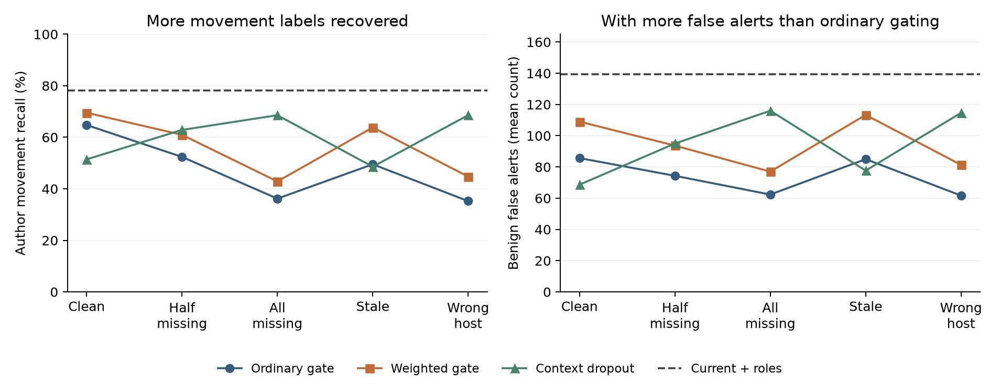

# When Historical Context Helps and Hurts

## Attack-stage recognition, evidence selection, and temporal evaluation

**Empirical praxis manuscript - completed development studies**
23 September 2026 | Reproducible results and limits of inference

## Abstract

Historical evidence can improve attack-stage classification, but missing or incorrectly associated records may make it misleading. We investigate two practical selectors and a temporal evaluation audit using 382,229 author-labeled UNRAVELED flows. A history selector learns the additional classification error caused by context; an acquisition policy chooses optional evidence under simulated costs and delivery constraints. Both use forward-held-out supervision and fixed controls. Weighting consequential stages raised movement recall over ordinary selection in all five tested history conditions, by 4.76-14.29 percentage points, but increased false alerts and weighted errors throughout. Error-focused acquisition reduced simulated spending by 32.24% against entropy selection in clean, maximum-budget replay, without a consistent detection advantage. Supplementary confusion analysis found that higher macro-F1 could accompany fewer exfiltration examples recognized as any attack. In a separate same-anchor audit, time-mixed training increased macro-F1 by 0.0632 for current evidence and 0.0383 with history. These are development findings from previously examined data, not independent-campaign confirmation or proof of a novel superior detector. They support an applied evaluation requirement: distinguish missed attack warnings from incorrect attack-stage labels when deciding whether context or additional evidence is useful. A secondary policy-transfer study and cloud data-qualification record accompany the main experiments.

**Keywords:** attack-stage classification; historical context; active feature acquisition; temporal evaluation; adversarial activity; reproducible cybersecurity research.

## 1. Introduction

An attack-stage detector must make a useful decision from the evidence available at that moment. Additional context can make an ambiguous connection understandable, but it can also encode a repeated workflow that does not hold in the next incident. Delayed collection creates a further choice: wait for more information, query a different source, or decide from current observations. A higher aggregate classification score alone does not show whether these choices preserve recognition of rare, consequential stages.

Recent provenance research supplies a concrete motivation. Bilot et al. (2025) document practical and evaluation shortcomings in complex provenance-based intrusion detectors and demonstrate competitive simple alternatives. Kimm et al. (2026) examine incomplete and incorrectly connected provenance, providing evidence that collection context itself requires attention. These findings motivate simple controls and explicit evidence-availability tests; they do not establish that the particular selector investigated here is new.

The applied problem is therefore conditional evidence use: can earlier context improve stage recognition without suppressing useful current-event evidence, and can a policy choose additional evidence under limited availability? A companion measurement asks whether the apparent usefulness changes when training is allowed to mix earlier and later observations. The three studies use an already-qualified APT trace and deliberately separate method development from independent confirmation.

## 2. Related work and proposed contribution

Temporal evaluation is established research. Pendlebury et al. (2019) formalize temporal and distribution constraints for malware evaluation. More recently, Guerra et al. (2026) show how APT provenance benchmarks and evaluation protocols shape architectural conclusions. The present audit is a bounded measurement on one author-labeled flow corpus, not the first temporal security evaluation or evidence that all published APT results are inflated.

History fusion and stage reasoning also have precedents. StageFinder (Phan & Bauschert, 2026) combines structural and temporal information for attack-stage estimation. KnowHow (Meng et al., 2026) links threat knowledge with lower-level events and considers attack-step relationships. A third model choosing between two experts is not itself a new algorithm. Our narrower hypothesis is that supervision on the additional stage error introduced by history may lead to different decisions from ordinary confidence or unweighted selection under missing, stale, and incorrectly linked context.

Active feature acquisition supplies the second method family. Guney et al. (2025) learn acquisition decisions from explanatory rankings; Norcliffe et al. (2025) model complementary observations. Learning-To-Measure (Kobayashi et al., 2026) discusses fixed features and uniform costs in its formulation, motivating further work on changing observations and richer cost-sensitive decisions. Security-specific Sim-CTKG already considers resource-constrained logging with latency (Basak & Shin, 2026). The current replay tests a simple stage-error objective against an uncertainty-reduction proxy. It does not reproduce these full systems or establish superiority to them.

The contribution supported by this batch is a reproducible empirical characterization: forward-trained selectors, matched policy inputs and resource limits, explicit context interventions, and a temporal sensitivity audit. Whether a revised method provides sufficiently distinct practical value remains an empirical and academic question. No publication, universal safety guarantee, or first-use claim follows from executing the experiments.

## 3. Data, target meanings, and access conditions

All three primary studies use the same immutable prepared UNRAVELED artifact: 382,229 flows from eleven complete IT-sensor captures. Its SHA-256 is b2a491474e722f4dabcd4c419c83a4a6b49f08dfc3bc059aa42ef2aaa4c3de14. Preparation validates an intact numeric prefix and right-anchored author annotations in source CSVs that contain malformed descriptive fields. Exact observable-event duplicates were handled upstream. Literal host identities, absolute timestamps, source identifiers, and target labels are excluded from classifier inputs.

The four targets are benign, other attack stage, lateral movement, and data exfiltration. Their names retain the author's annotations. In this sensor, movement examples describe Remote System Discovery on one host pair. The study does not independently verify successful remote access or stolen-file receipt. Identifying an author stage is a narrower task than proving attacker intent or completed exfiltration.

Original captures 0-4 provide fitting data, capture 5 a separate calibration period, and captures 6-10 later-period evaluation. The latter contains 208,094 flows: 192,193 benign, 12,424 other-stage, 35 movement, and 3,442 exfiltration annotations. Current features summarize completed flows. Historical summaries use only events that finished before the current flow started. Consequently, none of the experiments measures warning before exfiltration onset or real-time recognition before the current flow completes.

Coarse host roles come from the released topology. History describes earlier completed traffic over five- and thirty-minute windows without earlier stage labels. The corpus has been examined in prior project work and represents one campaign. New source code and held-out training folds do not make its evaluation partition fresh independent confirmation.

## 4. Methods

### 4.1 Learning when to use history

PX-080 compares a current-flow-plus-role classifier with an otherwise comparable context classifier. Four forward folds train on captures strictly earlier than the evaluated fitting capture. Their out-of-fold probabilities supply selector supervision; evaluated fold rows are never used to fit the expert producing their probabilities. All base models and fitting caps are fixed before the run.

The ordinary selector predicts the difference between the context and current classifiers' 0/1 errors. The proposed selector weights that difference by four for movement and exfiltration examples and by one otherwise. These priorities are illustrative engineering choices, not a literature threshold or measured economic loss. At inference, the selector receives expert probabilities, relative evidence age, and availability. It selects context only when its estimated additional error is negative; it never receives the true stage.

Seven arms cover the current classifier, context classifier, equal probability fusion, maximum-confidence selection, ordinary learned selection, stage-weighted selection, and a classifier trained with context dropout and missingness indicators. Five conditions preserve all targets while varying the historical input: clean, half missing, all missing, a five-minute-old snapshot rebuilt from earlier observable events, and hidden wrong-host history. Ordinary and weighted selectors receive identical forward-fold training conditions. The dropout comparator is trained for missingness, not specifically for staleness; a stale-condition advantage over it alone cannot isolate the proposed loss function.

### 4.2 Choosing additional evidence

PX-081 fits classifiers for current evidence alone and for each subset of the two optional groups, roles and history. Four forward folds provide targets for transition regressors. One family estimates the reduction in stage-weighted classification error; the other estimates entropy reduction. Selection inputs include only current observations, already acquired groups, and the corresponding classifier probabilities. The unacquired group's values are not available to the policy.

The replay compares no acquisition, two fixed orders, deterministic random order, learned entropy reduction, and learned stage-error reduction. An unrestricted full-context reference is reported separately. Simulated role and history costs are one and two units, with budgets of one, two, and three. Quoted delays are 0.25 and 0.75 time units and the deadline is one. Failed and late queries still consume budget. A policy can decline a query whose predicted benefit is nonpositive.

Every policy shares the same row-specific availability and delay schedule, generated without stage labels. Conditions include clean delivery, delayed or unavailable channels, and wrong-host history. The costs and delivery times are simulated, not measured log-collection overhead. Values are precomputed; this does not implement dynamically changing feature values or prove a real deployment saving. Final predictions use the last successfully delivered subset, so failed acquisition is not silently counted as a correct abstention.

### 4.3 Temporal sensitivity measurement

PX-082 constructs a fixed anchor containing half of each supported class within each later capture, sorted by observable-event hash. Both primary arms predict these same 104,051 anchor rows. The past-only arm trains strictly earlier; the time-mixed diagnostic may also train on non-anchor later rows. Per-class fitting counts match, and training candidates whose current-feature fingerprints occur in the anchor are removed from both pools.

The diagnostic intentionally permits information unavailable in earlier deployment training. When history features are used, future training histories can also aggregate earlier anchor-flow measurements. The contrast therefore measures temporal protocol sensitivity, not an isolated causal effect of future labels. A secondary conventional random-row split changes the test population and is reported separately. Its score difference is not a pure leakage estimate.

### 4.4 Reporting, reproducibility, and uncertainty

Each of the three primary experiments fixes three seeds and all comparison arms before fitting. The seeds measure fitting variation on shared events, not three independent campaigns. Stage precision, recall, F1, average precision, ROC-AUC where defined, false alerts, and confusion matrices remain available for every registered condition in the two selector studies; the temporal audit preserves its registered F1, recall, false-alert and confusion metrics. Acquisition additionally reports attempts, delivered groups, spending, and elapsed simulated time. Weighted error is never the sole measure of success. The supplementary policy-transfer study instead has two deterministic Ridge fits, as described with its results.

Protocols and executable source were committed before fitting. Outputs preserve private row-linked predictions and public aggregate results. Post-fit audits independently reconstruct arithmetic, check temporal or acquisition constraints, and verify hashes. Passing these checks establishes execution and calculation consistency, not correctness of the source annotations. The temporal audit uses descriptive capture-bootstrap intervals; only five later captures and 18 anchor movement rows make population-level inference inappropriate.

## 5. Results

### 5.1 A stage-weighted selector changes the tradeoff

The context study fitted 39 models and retained 105 arm-condition-seed probability tables. Mean movement recall of the weighted gate exceeded the matched ordinary gate in every registered history condition. The gain was smallest on clean history and largest on the stale snapshot. However, weighted error and benign false alerts were also higher in every condition. Thus, the weighting changed the operating tradeoff; it did not establish overall superiority.

**Table 1. History selection: all five conditions.** Recall refers to the exact author movement stage. False-alert counts are means over three fits on the same 192,193 benign rows. All methods share 35 movement evaluation rows. Current-plus-roles recall was 78.10% and its mean false-alert count was 139.3 in every condition.

| History condition | Ordinary recall | Weighted recall | Dropout recall | False alerts: ordinary / weighted |
|---|---|---|---|---|
| Clean | 64.76% | 69.52% | 51.43% | 85.7 / 109.0 |
| Half missing | 52.38% | 60.95% | 62.86% | 74.3 / 93.7 |
| All missing | 36.19% | 42.86% | 68.57% | 62.3 / 77.0 |
| Five-minute stale | 49.52% | 63.81% | 48.57% | 85.0 / 113.3 |
| Wrong host | 35.24% | 44.76% | 68.57% | 61.7 / 81.3 |

Under entirely missing history, ordinary dropout training achieved 68.57% movement recall compared with 42.86% for the proposed weighted gate. Under wrong-host history, the corresponding figures were 68.57% and 44.76%. The simple current-plus-roles baseline retained higher movement recall throughout. Clean macro-F1 was 0.7659 for ordinary gating and 0.7560 for weighted gating; their weighted error rates were 0.023988 and 0.024122. Costs therefore matter even where recall improves.

The absolute gain of 4.76-14.29 percentage points represents approximately 1.7-5.0 additional correctly classified movement rows, averaged over fitting seeds. Reusing those rows in several interventions does not create additional independent attack evidence. Full seven-arm metrics, per-capture results, ROC-AUC, average precision and selector help/harm counts are retained in the [complete context report](../px080_context_selector/results/REPORT.md).

### 5.2 Lower acquisition spending does not imply safer decisions

The acquisition study fitted 60 classifiers and 24 transition regressors. Table 2 presents every delivery condition at the largest registered budget; budgets one and two and all controls remain in the [complete acquisition report](../px081_evidence_acquisition/README.md). The unrestricted full-context reference is separate because it does not obey the same acquisition constraints.

**Table 2. Acquisition results at budget three.** The cost weights are 1/1/4/4; spending uses simulated units. The policies share budget caps but need not spend the same amount. Counts are three-fit means.

| Condition / policy | Macro-F1 | Movement recall | False alerts | Weighted errors | Spend |
|---|---|---|---|---|---|
| Clean / Current only | 0.7523 | 78.10% | 164.0 | 5065.7 | 0.000 |
| Clean / Entropy | 0.7148 | 65.71% | 111.3 | 5032.7 | 2.535 |
| Clean / Error focused | 0.7379 | 69.52% | 122.3 | 5056.0 | 1.717 |
| Delayed/unavailable / Current only | 0.7523 | 78.10% | 164.0 | 5065.7 | 0.000 |
| Delayed/unavailable / Entropy | 0.7180 | 75.24% | 144.0 | 5050.0 | 1.946 |
| Delayed/unavailable / Error focused | 0.7427 | 75.24% | 146.3 | 5054.0 | 1.438 |
| Wrong host / Current only | 0.7523 | 78.10% | 164.0 | 5065.7 | 0.000 |
| Wrong host / Entropy | 0.6873 | 40.00% | 73.0 | 7279.7 | 2.369 |
| Wrong host / Error focused | 0.6763 | 43.81% | 87.0 | 7791.3 | 1.716 |

Error-focused acquisition spent 32.24% less than entropy acquisition in clean replay and 26.12% less with delayed or unavailable evidence. It nevertheless made more weighted stage errors in both comparisons. Wrong-host history increased its weighted errors by 53.81% relative to current evidence alone. The policy has no post-acquisition rejection mechanism: a successfully delivered but misleading group can change the final classifier.

There are favorable isolated operating points. With budget one, the error-focused policy slightly reduced weighted error against entropy and current-only controls. That budget cannot retrieve history, so it cannot establish robustness to bad history. With budget two under wrong-host corruption it avoided some of entropy selection's harm. Reporting these observations alongside unfavorable conditions preserves the complete experimental record without treating the most favorable cell as confirmation.

### 5.3 Wrong stage and missed attack are different errors

A supplementary analysis, added after inspection of the first acquisition seed, calculated whether true exfiltration received any non-benign label. It uses unchanged saved confusion matrices and is not a new fitted endpoint. At budget three, clean macro-F1 increased from 0.7148 with entropy acquisition to 0.7379 with error-focused acquisition, while exfiltration recognized as any attack decreased from 85.18% to 76.25%. Under delayed delivery, macro-F1 increased from 0.7180 to 0.7427 while any-attack exfiltration recall decreased from 81.00% to 69.20%.

Some entropy predictions assigned exfiltration to movement. That stage was incorrect, but it still raised an attack warning. Some error-focused predictions instead assigned benign. The true-class weighted loss charges both mistakes equally; macro-F1 can improve through their different effects on other classes' precision. This is a concrete measurement mismatch, not evidence that F1 is invalid for its defined task.

### 5.4 Training composition materially changes measured performance

The temporal audit fitted 18 classifiers across two feature views, three protocols and three seeds. Its primary comparison fixes the same 104,051 later anchor rows and matches training class counts after fingerprint exclusion. The random-row diagnostic has a different evaluation population of 210,226 rows and must be interpreted separately.

**Table 3. Temporal protocols.** Past-only and time-mixed rows within each view share the anchor. Random-row results are descriptive. False-alert rate uses the benign denominator in each corresponding evaluation population.

| Features / training | Macro-F1 | Movement recall | Movement F1 | Exfil. F1 | False-alert rate |
|---|---|---|---|---|---|
| Current / Past only | 0.7365 | 25.93% | 0.2091 | 0.7565 | 0.02% |
| Current / Time mixed | 0.7997 | 61.11% | 0.2582 | 0.9523 | 0.09% |
| Current / Random rows | 0.8093 | 57.84% | 0.3116 | 0.9404 | 0.04% |
| Current + history / Past only | 0.7582 | 29.63% | 0.2836 | 0.7671 | 0.01% |
| Current + history / Time mixed | 0.7964 | 57.41% | 0.2798 | 0.9092 | 0.05% |
| Current + history / Random rows | 0.8507 | 64.71% | 0.4336 | 0.9753 | 0.03% |

Time-mixed training raised macro-F1 by 0.0632 with current features and 0.0383 with history. Movement recall increased by 35.19 and 27.78 percentage points. The time-mixed pool deliberately includes later examples and can represent different workflows. For history, its training summaries may also incorporate earlier anchor observations. These effects are part of the diagnostic rather than an acceptable deployment-training procedure.

The chronological history comparison also contains a limited favorable result: macro-F1 increased from 0.7365 to 0.7582, movement F1 from 0.2091 to 0.2836, and exfiltration F1 from 0.7565 to 0.7671, while mean false alerts fell from 24.0 to 14.3. This cross-view comparison is supplementary to the primary training-pool contrast. Movement recall increased in only one seed, by two of eighteen anchor rows. Exfiltration-to-benign errors increased in all seeds, from 565/563/563 to 572/569/571. An improved aggregate score therefore does not establish uniformly safer classification even in the favorable chronological comparison.

The [temporal report](../px082_temporal_audit/REPORT.md) preserves every seed and descriptive capture-bootstrap interval. Those intervals describe resampling five captures within this campaign; they do not estimate independent-campaign generalization. One history seed's interval for the time-mixed macro-F1 difference includes zero.

### 5.5 Secondary transfer of a score-selection policy

PX-083 tested whether a selector trained on CasinoLimit could choose between current-event and historical-context scores on CAM-LDS. The target was **T1105, Ingress Tool Transfer**. This was neither lateral-movement recognition nor exfiltration prediction. Negative examples carried other technique labels; their flag counts are not estimates of benign false alarms. Casino targets represented annotation-onset proxies, whereas CAM-LDS targets represented labeled interval states. Consequently, results were reported separately.

The underlying current-event and context classifiers remained trained on their respective native datasets. Only the selector transferred. Two deterministic Ridge regressions (alpha=10) were fitted on Casino's 1,494 clean-calibration examples, including **87 T1105 positives**. The ordinary target was the context-minus-current binary error; the cost-sensitive target multiplied this difference by four on T1105 examples. The multiplier was a declared research choice. Both selectors received the same observable scores and visibility flags. Only **11 calibration examples produced nonzero expert-error comparisons**, limiting direct supervision about which expert was preferable. No CAM-LDS example trained or tuned either selector.

Seven arms were evaluated at the frozen strict score >0.5 operating rule across 21 condition/perturbation views per dataset. The two fits were deterministic; three perturbation seeds for random record removal were not three independent fitted models. Evaluation uses an annotation-defined offline target roster, not a deployable event trigger. Invisible targets remain in denominators and receive no alarm; invisible positive targets count as misses. Native score calibration may differ across datasets, limiting the portability of a score-selection policy. The following table shows clean-condition results. AP denotes average precision.

| Dataset | Method | Recall | F1 | AP | Other-label flags |
|---|---|---:|---:|---:|---:|
| Casino | Current event | 82.35% | 0.7368 | 0.8674 | 7 |
| Casino | Context expert | 82.35% | 0.5957 | 0.8522 | 16 |
| Casino | Ordinary selector | 82.35% | 0.7368 | 0.8672 | 7 |
| Casino | Cost-sensitive selector | 82.35% | 0.5957 | 0.8580 | 16 |
| Casino | Mixed dropout | 82.35% | 0.5833 | 0.8438 | 17 |
| CAM-LDS | Current event | 87.00% | 0.0495 | 0.0238 | 3,329 |
| CAM-LDS | Context expert | 88.00% | 0.0534 | 0.0277 | 3,108 |
| CAM-LDS | Ordinary selector | 87.00% | 0.0495 | 0.0234 | 3,325 |
| CAM-LDS | Cost-sensitive selector | 88.00% | 0.0534 | 0.0277 | 3,108 |
| CAM-LDS | Mixed dropout | 85.00% | 0.0527 | 0.0276 | 3,038 |

A post-result diagnostic established that the cost-sensitive selector's **hard decisions matched the context expert in all 42 views**. Its selected score sources and probabilities were not identical to that expert. Thus, switching experts did not establish an additional decision benefit at the registered operating point. Ordinary selection matched current-event decisions in all 21 Casino views and nine CAM-LDS views; remaining CAM-LDS views differed by at most eight decisions. CAM-LDS cost-sensitive AP was 0.02773 against a target prevalence of 0.02376, providing little evidence of useful discrimination.

Existing native calibration did not resolve the CAM-LDS limitation. At the older clean-calibration thresholds, clean test recall was 0% for current-event and mixed-dropout models and 1% for context. Those thresholds came from only 68 calibration examples, including eight positives, from one run. They are retained as descriptive controls and were not used to optimize the new selectors.

Both sources and their original test outcomes were previously exposed. Casino evaluation contained 920 targets/17 positives across 18 runs; CAM-LDS contained 4,209 targets/100 positives across 18 runs from one held-out family. The result therefore provides secondary development evidence about score-policy portability, not untouched confirmation. All conditions, native-threshold controls and per-run results are available in the [PX-083 evidence package](../px083_policy_transfer/results/REPORT.md). The [audit](../px083_policy_transfer/results/AUDIT.json) verified 220 source prediction files, reproduced 294 output score arrays exactly, and independently recalculated 5,586 metric tables and 126 original-threshold tables. Four invariant tests passed. No native classifiers were retrained, and no movement-preservation or theft-warning claim follows from this experiment.

## 6. Discussion

### 6.1 What the results support

The measured benefits are real but conditional. Prior traffic can improve stage F1 and reduce false alerts in a chronological comparison. Weighting a selector can recover more rare stage labels. Error-focused acquisition can use fewer simulated collection units. None of those statements alone establishes that an operational detector preserves attack warnings or dominates simpler controls.

The strongest substantial result in the primary batch is protocol sensitivity: changing the available training periods changes conclusions even on the same evaluation rows and with matched class counts. This is useful evidence for an evaluation-centered praxis, alongside recent security work questioning benchmark comparability. Its contribution is a specific controlled measurement and a reproducible workflow on these data, not discovery of temporal bias itself.

### 6.2 The practical literature gap remains narrow

The unresolved applied question is whether a policy can use imperfect supporting evidence while preserving dangerous-activity recognition at a comparable false-alert workload. Existing temporal fusion, mixture-of-experts selection and feature acquisition make a broad claim of algorithm novelty untenable. The new work must show a distinct objective, observable evidence assumptions, and a material advantage against strong matched controls. These pilots implement plausible objectives but do not supply that superiority result.

A subsequent method could distinguish three consequences explicitly: a benign event flagged as an attack, an attack assigned the wrong stage, and an attack declared benign. Evidence acquisition could be followed by a trust decision before changing an existing warning. This is a proposed research direction, not a tested solution in this manuscript. Avoiding all changes to attack labels would trivially retain warnings and could also preserve false alarms; a useful system must measure that cost rather than claim safety by construction.

### 6.3 Operational reporting supported by the evidence

A defensible evaluation should retain current-evidence-only and missingness-trained controls; report exact-stage and any-attack recall together; disclose false-alert counts with denominators; and evaluate complete condition tables. Acquisition studies additionally need actual spend, failure and late-delivery rates, with failed requests kept in the accounting. Temporal studies need deployment-valid fitting periods and grouped source identities. These reporting choices expose practical tradeoffs demonstrated here, without purporting to constitute a new detection algorithm.

## 7. Validity, limitations, and reproducibility

**Target validity.** Author stage labels are not independent evidence of completed theft or remote execution. The movement class here represents discovery on one host pair. Current-flow features are available after completion; no lead time or forecasting result was measured. Technique-level transfer proxies in the supplementary study have a different meaning and cannot repair that limitation.

**Statistical independence and exposure.** Eleven captures come from one previously examined UNRAVELED campaign. The selectors' forward-held-out training has only eighteen distinct movement rows; all 1,299 exfiltration targets in those selector folds occur in one capture. Repeated fitting seeds and simulated copies increase computation, not independent event support. The full evaluation has thirty-five movement rows and the temporal anchor has eighteen. There was no untouched confirmatory campaign for the primary studies.

**Design choices.** Costs, budgets, simulated delays, degradation conditions, model capacities and the 4:1 stage weights were fixed research settings. They are not requirements established by the literature. No self-imposed 90% rule determines the interpretation. Inference compares observed benefits and costs against fixed controls. Score thresholds were not optimized on test results. Matched resource caps do not imply equal actual expenditure.

**Scope of comparisons.** These lightweight learned selectors do not reproduce SEFA, Learning-To-Measure or Sim-CTKG. TabM motivates a possible future base-model comparison but was not fitted in this batch. Differences among the three primary studies' raw scores also reflect feature sets, training details and evaluation populations; they cannot rank architectures across experiment identifiers.

**Audits.** The history audit replayed all 105 final probability arrays and checked 735 metric tables and twelve forward folds. The acquisition audit checked 981 metric tables, 162 sequential acquisition traces and twelve forward folds. The temporal audit checked eighteen prediction tables, 378 scalar calculations and nineteen output hashes. All passed. These are computational checks, not external human validation or a guarantee that source labels match physical attack outcomes.

**Source preservation.** Scientific protocols and programs were committed before fits. PX-080 binds to 06c5037; PX-081 and PX-082 bind to 2da1a1c. A [byte-format note](../FREEZE_BYTE_NOTE.md) records Git line-ending serialization of early JSON receipts; executed scientific source and protocols matched committed bytes. Private row-linked predictions, fold inputs and fitted models remain locally preserved, while public aggregate results, audit receipts and code are published in the experiment branch. Public links do not redistribute restricted raw datasets.

## 8. Conclusion

The experiments produced defensible empirical findings and working research infrastructure, but not a proven superior context selector or acquisition method. The weighted history selector recovered more movement annotations at a false-alert cost. Error-focused acquisition reduced simulated spending while sometimes suppressing attack warnings. A controlled temporal audit showed substantial score sensitivity to access to later training examples. Together these findings support a clear praxis question: how should a system value additional evidence when assigning a more accurate stage can come at the cost of losing the attack warning? Answering that method question requires independent, outcome-verified executions and comparison at explicit operational costs. The present manuscript supplies the measured motivation and limitations for that next study.

## Appendix A. Artifact guide

| Artifact | Purpose |
|---|---|
| [Experiment registry](../REGISTRY.json) | Study identifiers, statuses and claim limits |
| [Context study](../px080_context_selector/README.md) | Frozen method, all conditions, saved metrics and audit |
| [Acquisition study](../px081_evidence_acquisition/README.md) | Every budget, policy and delivery condition |
| [Temporal audit](../px082_temporal_audit/REPORT.md) | Same-anchor comparison and random-row diagnostic |
| [Policy transfer](../px083_policy_transfer/README.md) | Secondary recent-dataset score-policy replication |
| [Cloud compute record](../compute/README.md) | Actual AWS use, resource bounds and cleanup evidence |
| [Data qualification](../data_qualification/README.md) | Acquisition results and target validity checks |

Tables 1-3 and Figure 1 are generated from audited aggregate JSON by build_manuscript.py. The supplementary transfer table was independently checked against its saved aggregates. BUILD_INPUTS.json binds those aggregate results and the narrative sources. Rendering is separate from experiment execution and performs no fitting. The supplementary acquisition any-attack analysis and chronological cross-view reading are explicitly post-fit interpretations of preserved outputs.

## Appendix B. Compute and new-data qualification

All 143 new models were fitted locally on CPU. AWS used the designated g5.xlarge host for dataset acquisition; its GPU was unused.

The first cloud attempt stopped before a dataset request because the available Python environments lacked pandas. The second stopped during its disk-capacity preflight. The final attempt used qualified existing storage and an isolated package environment, acquired all seven requested files, and returned a checksummed archive. All three attempts were verified stopped; the final attempt's watchdog was removed only after that verification. These setup failures were resolved without deleting existing data or provisioning storage. The [compute record](../compute/README.md) preserves the attempt receipts and shutdown observations.

ProvICS (Shibbir & Tosh, 2026) is a preprint-backed ICS resource. The subset is bound to author revision 18b4b0e1359d3d02347301c55f97c3d98f5dab5c: 130,940 benign-recording rows, 51,425 attack-recording rows, 22 process variables and 32 phases across four scripts. Only six physical rows intersect the three movement intervals (five, one and zero). The author's cred_exfil phase, labeled Collection rather than Exfiltration, has zero samples. Four intervals have zero samples overall. Counts reflect timestamp intersections, with second-precision samples against sub-second annotations; annotation boundaries remain unverified. Failed or skipped actions also occur. Neither phase names nor interval overlaps establish successful execution or absence of evidence in other telemetry.

Measured recording rates are approximately 0.699 and 0.680 samples per second, with maximum gaps of 348 and 1,110 seconds; the files are not complete 1 Hz grids. The benign recording is dated April 18-20, after the April 16-17 attack recording. Training on that benign session and evaluating the attack session would therefore be a retrospective separate-session design, not chronological deployment. Of the attack file's rows, 4,256 fall in an annotated interval; the remaining 47,169 are not thereby certified benign. The [actual-byte qualification](../data_qualification/README.md) supports a narrower ICS process-history investigation, but this physical subset is inadequate confirmation of enterprise movement, completed theft, real log-acquisition costs or independent attack campaigns. No models were fitted to it in this batch.

## References

Basak, M., & Shin, G.-Y. (2026). A framework for budget-constrained zero-day cyber threat mitigation: A knowledge-guided reinforcement learning approach. *Sensors, 26*(1), Article 21. [doi:10.3390/s26010021](https://doi.org/10.3390/s26010021)

Bilot, T., Jiang, B., Li, Z., El Madhoun, N., Al Agha, K., Zouaoui, A., & Pasquier, T. (2025). Sometimes simpler is better: A comprehensive analysis of state-of-the-art provenance-based intrusion detection systems. In *34th USENIX Security Symposium* (pp. 7193–7212). USENIX Association. [Official proceedings record](https://www.usenix.org/conference/usenixsecurity25/presentation/bilot)

Gorishniy, Y., Kotelnikov, A., & Babenko, A. (2025). TabM: Advancing tabular deep learning with parameter-efficient ensembling. In *The Thirteenth International Conference on Learning Representations*. [Official proceedings record](https://proceedings.iclr.cc/paper_files/paper/2025/hash/c1ba41c694834aeef91ae161711d4939-Abstract-Conference.html)

Guerra, L., Chapuis, T., Duc, G., Mozharovskyi, P., & Nguyen, V.-T. (2026). *How benchmarks and evaluation protocols shape conclusions in provenance-based intrusion detection* (Version 3) [Preprint]. arXiv. [Inspected version](https://arxiv.org/abs/2608.01454v3)

Guney, O. B., Saichandran, K. S., Elzokm, K., Zhang, Z., & Kolachalama, V. B. (2025). Active feature acquisition via explainability-driven ranking. In *Proceedings of the 42nd International Conference on Machine Learning* (*Proceedings of Machine Learning Research*, Vol. 267, pp. 20748–20765). PMLR. [Official proceedings record](https://proceedings.mlr.press/v267/guney25a.html)

Kilian, S., Viet Triem Tong, V., Lalande, J.-F., Majorczyk, F., Sanchez, A., Talon, N., Besson, P.-V., Orsini, H., Lledo, P., & Gimenez, P.-F. (2025). CasinoLimit: An offensive dataset labeled with MITRE ATT&CK techniques. In *2025 28th International Symposium on Research in Attacks, Intrusions and Defenses (RAID)*. IEEE. [doi:10.1109/RAID67961.2025.00039](https://doi.org/10.1109/RAID67961.2025.00039)

Kimm, H., Mishra, S., & Sekar, R. (2026). Minding the gap: Bridging causal disconnects in system provenance. In *Workshop on Attack Provenance, Reasoning, and Investigation for Security in the Monitored Environment (PRISM)*. [doi:10.14722/prism.2026.23023](https://doi.org/10.14722/prism.2026.23023)

Kobayashi, Y., Jing, Z., Yao, J., Namkoong, H., & Joshi, S. (2026). *Learning-to-measure: In-context active feature acquisition* (Version 2) [Author manuscript]. arXiv. [Inspected version](https://arxiv.org/abs/2510.12624v2)

Landauer, M., Hotwagner, W., Boenke, T., Skopik, F., & Wurzenberger, M. (2026). CAM-LDS: Cyber attack manifestations for automatic interpretation of system logs and security alerts. *International Journal of Information Security, 25*(5), Article 148. [doi:10.1007/s10207-026-01318-x](https://doi.org/10.1007/s10207-026-01318-x)

Meng, Y., Li, S., Gui, J., Jiang, P., & Li, D. (2026). KnowHow: Automatically applying high-level CTI knowledge for interpretable and accurate provenance analysis. In *Network and Distributed System Security Symposium*. [doi:10.14722/ndss.2026.230199](https://doi.org/10.14722/ndss.2026.230199)

Myneni, S., Jha, K., Sabur, A., Agrawal, G., Deng, Y., Chowdhary, A., & Huang, D. (2023). Unraveled—A semi-synthetic dataset for advanced persistent threats. *Computer Networks, 227*, Article 109688. [doi:10.1016/j.comnet.2023.109688](https://doi.org/10.1016/j.comnet.2023.109688)

Norcliffe, A. L. I., Lee, C., Imrie, F., van der Schaar, M., & Liò, P. (2025). Stochastic encodings for active feature acquisition. In *Proceedings of the 42nd International Conference on Machine Learning* (*Proceedings of Machine Learning Research*, Vol. 267, pp. 46784–46814). PMLR. [Official proceedings record](https://proceedings.mlr.press/v267/norcliffe25a.html)

Pendlebury, F., Pierazzi, F., Jordaney, R., Kinder, J., & Cavallaro, L. (2019). TESSERACT: Eliminating experimental bias in malware classification across space and time. In *28th USENIX Security Symposium* (pp. 729–746). USENIX Association. [Official proceedings record](https://www.usenix.org/conference/usenixsecurity19/presentation/pendlebury)

Phan, T. V., & Bauschert, T. (2026). *Learning the APT kill chain: Temporal reasoning over provenance data for attack stage estimation* (Version 2) [Preprint]. arXiv. [Inspected version](https://arxiv.org/abs/2603.07560v2)

Shibbir, M. N. I., & Tosh, D. K. (2026). *ProvICS: A provenance-based intrusion detection for industrial control systems* [Preprint]. arXiv. [doi:10.48550/arXiv.2607.05989](https://doi.org/10.48550/arXiv.2607.05989)

Publication status: Guerra and StageFinder are inspected preprints with author-reported future-conference acceptance. Learning-To-Measure is the inspected 2026 revision, listed in the ICML 2026 program. ProvICS is a preprint. UNRAVELED (2023) and TESSERACT (2019) provide data provenance and foundational prior art outside the two-year motivation window. See the [primary-source reference audit](REFERENCES.md) for publication/version details and the closest-work novelty assessment.
