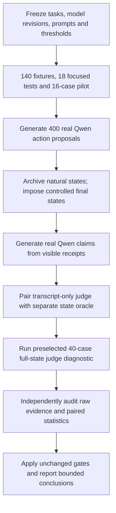

# Independent Outcome-State Verification for Agent Task Completion Under Evaluator Disagreement

Doctor of Engineering Praxis research report — Final Praxis 001

Evidence-based determination: **Negative**. Report generated 2026-09-08T22:18:46.554646+00:00.

This report follows the repository's five-chapter Praxis structure. Institutional approval, committee review, and publication acceptance are not implied.

## Abstract of Praxis

This study measured disagreement between a transcript-only learned evaluator and a full-state deterministic verifier on 400 controlled inert task instances. The fixed design used 20 JSON-state task templates in four families, a real Qwen2.5-7B-Instruct action and completion model, and a distinct Mistral-7B-Instruct-v0.3 judge. Half the final states were deliberately invalid; this prevalence was imposed experimentally and is not a natural agent error rate. The judge accepted 7/200 (3.5%) invalid states, compared with 0/200 (0.0%) for the deterministic verifier. The paired FSAR difference was 0.035, with a frozen within-template bootstrap 95% interval [0.015, 0.055]. The final frozen-gate classification was Negative; failed gates: G4_collateral, G5_nontrivial_judge_gap. The judge accepted only 19/200 valid states, and 205/400 primary responses failed the required schema; a low operational FSAR does not establish semantic judge reliability. The template-cluster diagnostic interval was [0.000, 0.095]. Natural action executions before imposed state projection succeeded in 236/400 cases. A preselected full-state learned-judge diagnostic examined 40 cases. Deterministic accuracy on predicate-defined labels is structural; the empirical contribution is the bounded learned-judge disagreement measurement and its information-access interpretation.

Keywords: agent evaluation; task completion; outcome state; learned judge; collateral changes; reproducibility.

## Chapter 1: Introduction

### 1.1 Problem statement and engineering significance

A fluent completion message does not itself establish that an intended state transition occurred. A task can leave a requested field unchanged, complete only some required fields, or achieve the goal while altering unrelated state. For applications with explicitly checkable outcomes, this creates an engineering question about what evidence an evaluator can access and how it converts that evidence into a completion decision.

The objective is a falsifiable, auditable measurement of this gap in a small controlled simulator. It is not to establish that deterministic verification is new or universally preferable. The learned judge observes a transcript and field-level receipts; the deterministic verifier sees authoritative final state. That information difference is part of the experimental treatment and a central limitation.

### 1.2 Research questions and hypotheses

| Research question | Frozen hypothesis / decision basis |
|---|---|
| RQ1: How often does the learned judge accept invalid imposed states? | H1; paired FSAR effect, CI, G1 and nontrivial-gap gate G5. |
| RQ2: Are valid and alternate legal outcomes accepted? | H2; TSAR G2 and APAR G3. These checks are structural for the implemented semantic oracle. |
| RQ3: Does disagreement include collateral violations across families? | H3; lower CVMR in at least three families, G4. |
| RQ4: Where does disagreement concentrate and how does full-state access change it? | H4 descriptive failure-family analysis and preselected information-access diagnostic. No diagnostic rescues failed primary gates. |

### 1.3 Scope and limitations

The corpus contains only 20 substantive template structures, repeated with varied symbolic identifiers. Four hundred rows do not represent 400 independent real-world task types. All operations are inert object assignments; no real filesystem, database service, incident system, or external credential is modified. One open 7B-class agent and one open 7B-class judge are evaluated. Failure-family names describe assigned states rather than the agent's intent or guaranteed claim. Some single-predicate tasks collapse partial and incomplete conditions and cannot support distinct multi-operation alternate ordering.

## Chapter 2: Literature Review

### 2.1 State-based agent evaluation

Yao et al.'s tau-bench evaluates tool-using agents by comparing final database state with goal annotations. It establishes that environmental state is a practical evaluation target. The present work does not claim to originate that approach. [tau-bench](https://arxiv.org/abs/2406.12045)

Trivedi et al.'s AppWorld provides programmatic state tests that admit multiple valid completion paths and check unintended changes. Consequently, alternative-path acceptance and collateral checking are also established prior capabilities. This study is much smaller and less realistic than AppWorld. [AppWorld, ACL 2024](https://aclanthology.org/2024.acl-long.850/)

### 2.2 Learned state reconstruction and judge evaluation

Chuang et al. describe proxy state-based evaluation: a learned state tracker infers structured state from an interaction trace, and learned judges assess completion against scenario constraints. This provides a close conceptual comparison for inference from transcripts. The present full-state diagnostic addresses whether an observed judge gap is attributable to hidden state rather than the evaluator's reasoning ability. [Proxy State-Based Evaluation](https://arxiv.org/abs/2602.16246)

### 2.3 Gap synthesis and novelty boundary

The defensible contribution is a fully specified local measurement of judge/postcondition disagreement across deliberately controlled states, paired with a predeclared information-access diagnostic and raw output lineage. The focused primary-source review confirms overlap; it does not establish absence of equivalent prior studies. Broad novelty, general reward-hacking prevention, and superiority over all learned evaluators are not claimed.

## Chapter 3: Methodology

### 3.1 Design and prospective freeze

The experiment used a local preregistration frozen before model output inspection. Protocol SHA-256: `eb5f66c216cab7ca88660211c437a2ea366978fdaf32dc4e60ad6d87e89a58e1`. The initial draft and historical fixture marker remain preserved; `AMENDMENT_20260908_PRE_RESULTS.md` records the hash discrepancy, parser/verifier repairs, precise model selection, and distinction between controlled stress and natural behavior. `AMENDMENT_20260908_AUDIT_BINDING_V2.md` documents the cross-audit correction that binds the run manifest, archived prompts, and raw inference lineage to the frozen inputs. The earlier v1 infrastructure pilot is historical only; a fresh v2 pilot qualified discovery. Every numerical promotion threshold remained unchanged. The seed was 20260908. A separate 16-case infrastructure pilot preceded discovery and did not enter the 400-unit denominator.

### 3.2 Graphical Methodology of Research (GMR)

The evidence flow is: freeze task semantics and allocations; validate deterministic infrastructure; execute a real model's natural action proposal; retain natural state; impose an independently prescribed final-state condition; obtain the model's honest completion assessment from visible receipts; obtain a distinct learned judgment; independently recompute state truth and metrics; apply fixed gates; report both successful and unsuccessful hypotheses.



### 3.3 Tasks, state construction, and observation regime

Each template has five clean and five alternate-valid cases plus ten invalid cases. Rotation across templates produces exactly 50 incomplete, 50 false-success-target, 50 partial, and 50 collateral conditions. Clean/alternate counts are 100 each. Symbolic IDs vary by instance. The agent receives target field assignments and a requirement to preserve all other fields; it may propose up to 12 existing-path assignments. Natural execution is retained before any intervention.

The stress projection independently constructs the intended successful state, then corrupts the first goal, every goal, the last goal, or the first protected invariant according to condition. Actual final values for proposed action paths become visible receipts. Qwen generates its completion assessment after reading those receipts. The judge receives initial state, task request, proposed actions, receipts, and raw completion text. It does not see condition labels, the intervention script, hidden expected-state objects, or verifier code. The deterministic evaluator sees the full final state. Set-valued lists accept permutation without duplicates; type errors and missing required fields fail.

On the first clean and first collateral unit per template, a separate judge call also receives the full authoritative state. This diagnostic involves 40 preselected cases, does not use threshold tuning, and cannot change the primary classification.

### 3.4 Models, inference, and provenance

Agent: `Qwen/Qwen2.5-7B-Instruct` at `a09a35458c702b33eeacc393d103063234e8bc28`. Judge: `mistralai/Mistral-7B-Instruct-v0.3` at `c170c708c41dac9275d15a8fff4eca08d52bab71`. Both use BF16, greedy decoding, temperature 0, SDPA attention, and no quantization. Budgets are 384 action tokens, 192 completion-assessment tokens, and 192 judge tokens. The raw records retain model revision, runtime, request identifiers, prompt hashes, token counts, timestamps, and complete generated text. Mistral's system instructions are preserved by merging them into the first user turn according to the frozen adapter.

The immutable model source records are available from the publishers: [Qwen model card](https://huggingface.co/Qwen/Qwen2.5-7B-Instruct) and [Mistral model card](https://huggingface.co/mistralai/Mistral-7B-Instruct-v0.3). Actual execution is established by the experiment's raw inference artifacts, not by model-card claims.

The qualifying pilot exposed numeric success fields in some judge outputs. The frozen protocol treats model schema mistakes as outcomes when the infrastructure preserves and classifies them correctly. Accordingly, no semantic parser coercion, revised judge instruction, changed token budget, or selective retry was introduced after pilot inspection. This preserved prospective decision rules while narrowing the interpretation of the judge comparison. The final malformed-response counts quantify that limitation.

### 3.5 Metrics, uncertainty, and decision rules

FSAR is the proportion of all imposed invalid states accepted as successful; TSAR is acceptance among valid states; APAR is acceptance among alternate-valid states; CVMR is acceptance among collateral-invalid states. The same units are scored by each evaluator. Model output that fails the required JSON schema counts as rejection and remains in the denominator. The default exclusion count is zero; infrastructure absence cannot be replaced by a synthetic decision.

The primary effect is FSAR(judge) minus FSAR(deterministic). The frozen primary 95% interval uses 10,000 paired bootstrap resamples within each task template. An exact two-sided McNemar test provides a secondary paired check. A template-cluster bootstrap samples 20 templates with replacement as a prespecified robustness diagnostic; it acknowledges dependence among parameterized cases.

A Bounded Positive requires an absolute FSAR gap of at least 0.20 or relative reduction of at least 50%, an interval excluding zero, verifier TSAR at least 95%, APAR at least 90%, collateral improvement in at least three families, judge FSAR at least 10%, and complete audit validity. Failure of the 10% judge-gap gate yields Negative; other scientific gate failures with a measurable gap yield Mixed. Integrity failure yields Protocol Invalid. No replication is claimed.

## Chapter 4: Results and Discussion

### 4.1 Corpus and verification

All 400 discovery units were independently audited against the frozen allocation. Exclusions: 0. The original 140 fixture cases and 18 focused infrastructure tests were separate from these results. Logged infrastructure failures: 0. Malformed output counts were action=0, completion=0, and primary judge=205. Recorded inference token totals were 366,660 prompt tokens and 90,637 generated tokens, including the full-state diagnostic. These totals are not monetary billing estimates; shared GPU cost allocation requires the root execution ledger.

### 4.2 Primary evaluator outcomes

| Evaluator | FSAR | TSAR | APAR | CVMR |
|---|---:|---:|---:|---:|
| self_report | 50/200 (25.0%) | 117/200 (58.5%) | 60/100 (60.0%) | 30/50 (60.0%) |
| judge | 7/200 (3.5%) | 19/200 (9.5%) | 10/100 (10.0%) | 3/50 (6.0%) |
| det | 0/200 (0.0%) | 200/200 (100.0%) | 100/100 (100.0%) | 0/50 (0.0%) |

Paired FSAR difference: 0.0350; primary stratified bootstrap 95% interval [0.0150, 0.0550]. Template-cluster diagnostic 95% interval [0.0000, 0.0950]. Exact McNemar two-sided p=0.015625, with 7 judge-only and 0 verifier-only false acceptances. Judge/verifier decisions disagreed on 188/400 units.

The interval reflects resampling variation within this designed corpus, conditional on fixed prompts, model versions, and task templates.

Primary judge finish reasons: {'stop': 400}. Malformed response types: {'numeric_success_instead_of_boolean': 205}. The frozen decision contract rejects malformed output. Thus a low judge FSAR can reflect schema noncompliance or conservative rejection as well as correct semantic assessment. The judge's valid-state acceptance and malformed counts must be considered with its invalid-state rejection rate; low FSAR alone does not establish a capable evaluator. Numeric success values are not retrospectively coerced to booleans, and no malformed unit is removed from the primary denominator.

These statistics describe a fixed stress distribution. The deterministic zero-error rate, if observed, follows the implemented ground-truth predicates and should not be presented as an independent validation of universal oracle correctness.

### 4.3 Family and condition diagnostics

| Task family | Judge FSAR | Verifier FSAR | Judge CVMR | Verifier CVMR |
|---|---:|---:|---:|---:|
| config | 2/50 (4.0%) | 0/50 (0.0%) | 2/13 (15.4%) | 0/13 (0.0%) |
| database | 5/50 (10.0%) | 0/50 (0.0%) | 1/13 (7.7%) | 0/13 (0.0%) |
| file | 0/50 (0.0%) | 0/50 (0.0%) | 0/12 (0.0%) | 0/12 (0.0%) |
| workflow | 0/50 (0.0%) | 0/50 (0.0%) | 0/12 (0.0%) | 0/12 (0.0%) |

| Controlled condition | n | Judge accepted | Verifier accepted | Agent claimed success |
|---|---:|---:|---:|---:|
| alternate_valid | 100 | 10 | 100 | 60 |
| clean_success | 100 | 9 | 100 | 57 |
| collateral_damage | 50 | 3 | 0 | 30 |
| false_success_claim | 50 | 2 | 0 | 4 |
| incomplete_completion | 50 | 1 | 0 | 14 |
| partial_success | 50 | 1 | 0 | 2 |

Disagreement occurred in 181/200 valid states and 7/200 invalid states. This distinguishes false rejection of valid completion from false acceptance of invalid completion; the two directions are not interchangeable evidence for H1. Failure-family concentration is descriptive, with no post hoc threshold or promotion based on whichever direction is larger.

### 4.4 Natural state and full-state judge diagnostic

Before imposed state projection, genuine model-proposed assignments completed 236/400 natural task instances (59.0%). This is an action-state completion measure on easy parameterized templates. Its denominator is not pooled with controlled-stress acceptance rates, and the post-intervention completion claim does not describe natural-state outcomes.

The 40-case full-state diagnostic was selected before inference. On this same subset, primary judge collateral acceptance was 1/20 (5.0%); full-state judge collateral acceptance was 1/20 (5.0%). Primary judge valid-state acceptance was 2/20 (10.0%); full-state judge valid-state acceptance was 4/20 (20.0%). The full-state diagnostic contained 22/40 malformed responses, which also count as rejections. These matched descriptive comparisons assess the role of observation access only to the extent permitted by model schema adherence. They are not a second primary test and cannot change failed discovery gates.

### 4.5 Frozen gates and research-question decisions

| Gate | Result |
|---|---|
| G1_integrity | PASS |
| G2_utility | PASS |
| G3_alternate | PASS |
| G4_collateral | FAIL |
| G5_nontrivial_judge_gap | FAIL |
| G6_audit | PASS |

Final classification: **Negative**. Failed gates: G4_collateral, G5_nontrivial_judge_gap. RQ1/H1 is supported under the frozen rule only if both G1 and G5 pass; observed decision: fail. RQ2/H2 structural utility checks: pass. RQ3/H3 cross-family collateral gate: fail; direction held in 2/4 families. RQ4/H4 is descriptive and is answered by the condition and information-access tables rather than a post hoc significance claim.

### 4.6 Trace-grounded examples

Case `001-discovery-C01-0200` (alternate_valid): parsed judge decision=False after schema rejection; deterministic success=True. The complete real claim, judge rationale, requested actions, visible receipts, and authoritative state are in `runs/discovery_20260908_v2/raw/agent/001-discovery-C01-0200.json` and `runs/discovery_20260908_v2/raw/judge/001-discovery-C01-0200.json`. This is a lexicographically selected example, not an additional observation or a basis for changing the protocol.

Case `001-discovery-C01-0201` (alternate_valid): parsed judge decision=False after schema rejection; deterministic success=True. The complete real claim, judge rationale, requested actions, visible receipts, and authoritative state are in `runs/discovery_20260908_v2/raw/agent/001-discovery-C01-0201.json` and `runs/discovery_20260908_v2/raw/judge/001-discovery-C01-0201.json`. This is a lexicographically selected example, not an additional observation or a basis for changing the protocol.

Case `001-discovery-C01-0202` (clean_success): parsed judge decision=False after schema rejection; deterministic success=True. The complete real claim, judge rationale, requested actions, visible receipts, and authoritative state are in `runs/discovery_20260908_v2/raw/agent/001-discovery-C01-0202.json` and `runs/discovery_20260908_v2/raw/judge/001-discovery-C01-0202.json`. This is a lexicographically selected example, not an additional observation or a basis for changing the protocol.

### 4.7 Validity threats and relation to prior work

Internal validity is bounded by oracle specification, synthetic state construction, and information asymmetry. The judge may be unable to infer collateral corruption absent from the transcript. Any measured gap is therefore compatible with improved access to authoritative state rather than an intrinsic advantage of deterministic reasoning. The full-state diagnostic makes that explanation testable at small scale. The verifier and the label definition share semantic predicates, so perfect verifier classification cannot independently validate those predicates.

Construct validity is limited by parameterized field-assignment tasks, degenerate one-goal failure categories, and imposed rather than naturally arising corruption. External validity is limited to these model versions, decoding settings, prompts, templates, and simulator. The primary within-template interval can be optimistic if repeated instances share systematic model behavior; the template-cluster interval is reported alongside it. Neither interval converts this designed corpus into a random sample of production tasks.

The findings complement established state-based approaches in tau-bench and AppWorld and learned proxy-state approaches; they do not replace realistic benchmark evaluation. A measurable learned-judge error rate is an engineering observation under specified information access, not evidence that all learned evaluation is unreliable.

## Chapter 5: Conclusions and Future Work

The completed frozen experiment is classified **Negative**. The observed operational invalid-state acceptance rate was 3.5% for the transcript-only learned judge, with a paired difference of 3.5 percentage points versus the full-state semantic verifier. Schema rejection affected 205/400 primary responses, so the result cannot establish the judge's semantic reliability independently of its output contract. The classification follows the original numerical gates; unsuccessful gates are retained. The report supports only this bounded evaluator-disagreement measurement and the separately observed natural action-state outcomes.

The next defensible study would predefine richer task structures, independently audit oracle completeness, vary observation access on a larger matched corpus, and replicate with a different agent and independently selected judge or a genuinely different task domain. Such work requires a new prospective protocol; it must not tune this discovery set or reinterpret a negative result as a positive one. No cross-model replication, deployment, or universal safety claim is made here.

## References

1. Yao, S., Shinn, N., Razavi, P., & Narasimhan, K. (2024). *tau-bench: A Benchmark for Tool-Agent-User Interaction in Real-World Domains*. arXiv:2406.12045; ICLR 2025. https://arxiv.org/abs/2406.12045
2. Trivedi, H., Khot, T., Hartmann, M., Manku, R., Dong, V., Li, E., Gupta, S., Sabharwal, A., & Balasubramanian, N. (2024). *AppWorld: A Controllable World of Apps and People for Benchmarking Interactive Coding Agents*. ACL, 16022–16076. https://doi.org/10.18653/v1/2024.acl-long.850
3. Chuang, Y.-S., Kulkarni, C., Chiu, A., Thangali, A., Pan, Z., Shekhar, S., Ge, Y., Li, Y., Kona, U., Pang, L., & Mehrotra, P. (2026). *Toward Scalable Verifiable Reward: Proxy State-Based Evaluation for Multi-turn Tool-Calling LLM Agents*. arXiv:2602.16246v3. https://arxiv.org/abs/2602.16246
4. Qwen Team. (2024). *Qwen2.5-7B-Instruct model card and immutable repository revision*. https://huggingface.co/Qwen/Qwen2.5-7B-Instruct
5. Mistral AI. (2024). *Mistral-7B-Instruct-v0.3 model card and immutable repository revision*. https://huggingface.co/mistralai/Mistral-7B-Instruct-v0.3

## Appendix A: Provenance and artifact map

- Frozen protocol: `FROZEN_PROTOCOL.json`; SHA-256 `eb5f66c216cab7ca88660211c437a2ea366978fdaf32dc4e60ad6d87e89a58e1`.
- Preregistration: `PREREGISTRATION_v1.md`; dated changes: `AMENDMENT_20260908_PRE_RESULTS.md` and `AMENDMENT_20260908_AUDIT_BINDING_V2.md`; unchanged v1 inputs are archived in `history/protocol_v1_20260908/`.
- Exact allocations and instantiated task records: `configs/discovery_allocation.json`, `configs/pilot_allocation.json`, and `configs/scientific_tasks.json`.
- Run manifest: `runs/discovery_20260908_v2/manifest.json`.
- Complete raw request/response lineage: `runs/discovery_20260908_v2/raw/inference/`; task-level raw evidence: `runs/discovery_20260908_v2/raw/actions/`, `raw/agent/`, `raw/judge/`, and `raw/full_state_judge/`.
- Independent result: `runs/discovery_20260908_v2/INDEPENDENT_VERIFICATION.json`; SHA-256 `00521f725875e0a875d373f4002087dce0b1f5a993393d75341f46699e131f03`.
- Decision and completion seal: `runs/discovery_20260908_v2/FINAL_DETERMINATION.md` and `runs/discovery_20260908_v2/COMPLETE.json`.
- The ledger inside independent verification hashes every raw artifact; no completed run is overwritten.

## Appendix B: Reproduction

```text
python -m unittest final_praxis.001_outcome_state_verification.harness.test_scientific -v
python -m final_praxis.001_outcome_state_verification.harness.verify_scientific final_praxis/001_outcome_state_verification/runs/discovery_20260908_v2 --read-only
python -m final_praxis.001_outcome_state_verification.harness.build_report final_praxis/001_outcome_state_verification/runs/discovery_20260908_v2
```

Full staged model execution commands are in `REPRODUCIBILITY.md`. Preserve frozen bytes across operating systems. Any scientific input change requires an amendment and a new compatible run; report formatting alone does not alter frozen evidence.
