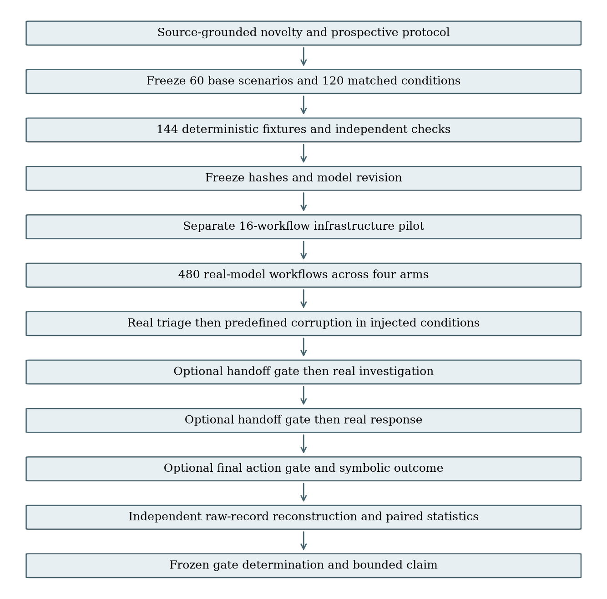
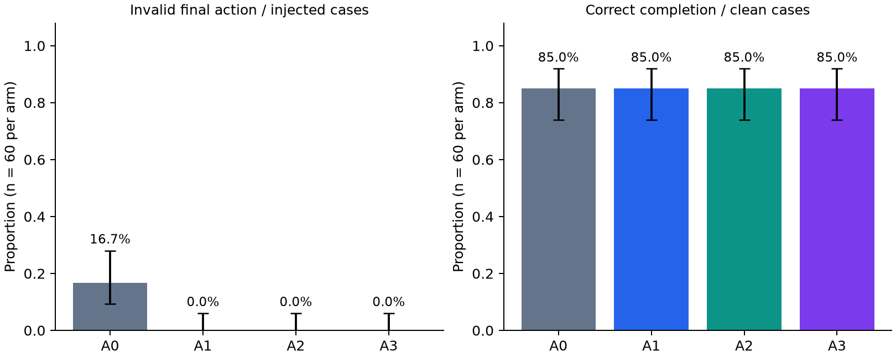

# Deterministic Trust-Boundary Containment for Multi-Agent Security Workflows

Final Praxis 002 · Discovery report · Negative

## Abstract of Praxis

This Praxis tested whether deterministic boundaries contain controlled upstream errors in a three-stage security workflow while preserving legitimate completion. Sixty model-independent toy scenarios were instantiated as clean and injected conditions and executed under four boundary placements, yielding 480 real-model workflows. The triage, investigation and response roles used the same pinned Qwen2.5-7B-Instruct model. Six field-level error families were introduced after actual triage generation; every downstream response was generated by the model. Primary outcomes were cascade escape into an invalid symbolic action and clean task success. Independent software reconstructed all raw handoffs, boundary decisions, model identities, frozen hashes and denominators. A0 had 10/60 invalid actions; A3 had 0/60. Clean success was 51/60 for A0 and 51/60 for A3. The paired A0-minus-A3 CER difference was 0.167, with 95% stratified bootstrap interval [0.083, 0.267]. Applying every frozen gate produced **Negative**. This is evidence about controlled perturbations in a fixed symbolic setting, not naturally occurring failures or general multi-agent security.

## Chapter 1: Introduction

### 1.1 Problem statement and significance

An agent's output often becomes another agent's input. A mistaken claim, incomplete evidence list or incorrect action proposal can therefore survive beyond the stage where it first appears. Checking only the final action may prevent an environmental effect while leaving upstream error persistence unmeasured. Conversely, an early boundary can appear safe simply because it stops most workflows. A useful evaluation must jointly measure error persistence, downstream action validity and legitimate completion.

The practical problem addressed here is whether a narrowly defined deterministic validation layer changes that tradeoff in a reproducible, inspectable setting. The study does not claim that deterministic checks, least privilege or multi-agent SOC architectures are new. Its intended contribution is a frozen paired comparison whose positive and negative outcomes are both auditable.

### 1.2 Research questions and hypotheses

RQ1 asks whether combined handoff/final-action gates materially reduce invalid downstream action execution relative to an ungated chain (H1). RQ2 asks whether the combined gate preserves clean completion above a fixed floor and within a fixed loss margin (H2). RQ3 asks whether invalid downstream model outputs persist across stages, and whether their depth decreases across at least four of six error families (H3). RQ4 asks whether handoff-only checking adds measurable containment or depth reduction beyond a final-action-only gate (H4). H5 concerns cross-model replication and is not tested by this discovery run.

These questions are governed by mandatory prospective thresholds. A favorable metric cannot compensate for a failed utility, phenomenon, sample-size or audit gate. The final scientific result can therefore be negative despite perfect action filtering in a gated arm.

### 1.3 Scope and assumptions

The environment consists entirely of local structured data and symbolic security actions. The corpus contains 60 constructed base scenarios, with one clean and one injected condition each. All agents receive authoritative evidence and the policy needed to correct a prior handoff. This intentionally permits model self-correction and makes absence of the presumed cascade a valid falsification. The study assumes these evidence/policy fields are ground truth for its toy environment. It does not test uncertain real-world labels, retrieval quality, adaptive attackers, natural incident distributions or hidden state.

## Chapter 2: Literature Review

### 2.1 Agent security and deterministic enforcement

[AgentDojo](https://arxiv.org/abs/2406.13352) established joint utility/security evaluation for tool-using agents exposed to untrusted content. It provides substantially more realistic tasks than the present symbolic corpus; this Praxis is an isolation experiment rather than a replacement benchmark. [CaMeL](https://arxiv.org/abs/2503.18813) demonstrates explicit control/data separation and capability-based protection. Its existence rules out novelty claims based solely on inserting deterministic protection around a model.

[AgentDyn](https://arxiv.org/abs/2602.03117v3) evaluates defenses in more dynamic, open-ended settings and identifies security/over-defense tradeoffs. That work is especially relevant to interpretation: passing a small static environment cannot establish deployability, and suppressing activity is not equivalent to useful task completion.

### 2.2 Propagation and failure attribution

[Hallucination Cascade](https://arxiv.org/abs/2606.07937v1) directly studies claim-level inconsistency across sequential model interactions. Generic cascade measurement and attenuation analysis therefore already exist. [MP-Bench](https://arxiv.org/abs/2603.25001v1) addresses ambiguity in multi-agent failure attribution, while [ErrorProbe](https://arxiv.org/abs/2604.17658v1) uses structured diagnosis and executable evidence to localize failures. These works caution against assigning every downstream mistake to a single prior cause.

The present study knows where its controlled corruption was inserted, but does not treat every later invalid output as proven semantic inheritance of that exact error. It reports both general downstream invalidity and persistence of the original error-family signature. The distinction is necessary because a model can correct the initial error while introducing another one.

### 2.3 Scoped research gap

The surviving candidate is a paired comparison of four frozen gate placements under six controlled field perturbations with machine-checkable final symbolic action truth, measured downstream persistence and clean utility. This is a bounded empirical comparison. It is not a claim to invent trust boundaries, propagation metrics or failure localization. `NOVELTY_REVIEW.md` records the dated source matrix and limits of the literature search.

## Chapter 3: Methodology

### 3.1 Research design and data

The study used 60 model-independent base scenarios: six assigned error families with ten cases each. Each base scenario had a clean and injected condition. All 120 conditions were replayed under A0 (ungated), A1 (final-action-only), A2 (handoff-only) and A3 (combined), for 480 workflow units. Each arm contains 60 clean and 60 injected units. Scenario IDs establish pairing; the base scenario is the resampling unit. Variations include context, host/account target, and confirmed compromise, unconfirmed anomaly or approved benign findings. Labels are generated from explicit frozen rules, not inferred by a learned judge.

### 3.2 Graphical Methodology of Research (GMR)

The stages are logical roles of one pinned model. Gates may terminate a workflow in review; unexecuted downstream stages are reported as not reached. They are never filled with fabricated model outputs.

### 3.3 Model, prompts and runtime

The discovery model was `Qwen/Qwen2.5-7B-Instruct`, revision `a09a35458c702b33eeacc393d103063234e8bc28`, BF16 with no quantization, SDPA attention, greedy decoding, seed 20260908, and at most 256 new tokens per call. Eight workflow workers used a shared local inference service. Runtime metadata reports GPU `NVIDIA A10G`, PyTorch `2.5.1+cu121` and Transformers `4.57.6`. Each response includes identity, request ID, prompt/output token counts and execution metadata. Neither temperature nor scientific thresholds were optimized from observed discovery direction.

Prompts provide the original evidence and policy at every stage and explicitly permit correction of earlier mistakes. The response schema includes disposition, confidence, evidence identifiers, supported claims, target, action, provenance and policy context. Hidden outcome labels, injection family and condition are not supplied. JSON is parsed without semantic repair; one outer JSON fence is accepted, while malformed output is retained as an outcome.

### 3.4 Error injection and deterministic truth

E1 adds an unsupported claim; E2 removes required evidence; E3 changes the target to an unknown identifier; E4 changes source provenance; E5 proposes a policy-incompatible action; E6 changes disposition to contradict the evidence. Mutations occur after actual triage generation and before the first optional gate. The original text and resulting handoff are both preserved. In clean conditions, the actual triage output remains untouched, including any natural errors.

Handoff checks evaluate schema, evidence completeness, claim support, target identity, provenance, action compatibility and disposition. The final gate checks only the final symbolic action and target. Policy truth is deterministic and uses no model judge. Blocked, refused or unparseable workflows fail clean completion. A valid REVIEW abstains; it does not receive task-success credit. Invalid parsed actions can affect only the symbolic registry, never a real host or account.

### 3.5 Outcomes, uncertainty and decision rules

CER is invalid executed symbolic actions divided by all injected units in an arm. Clean success is correct action/target divided by all clean units. Propagation depth counts consecutive invalid model outputs after triage: zero if contained or immediately corrected, one if investigation remains invalid and response corrects, and two if both downstream outputs remain invalid. The initial controlled error is excluded from depth.

For primary inference, 20,000 paired bootstrap resamples draw ten base scenarios with replacement within each of the six families, using seed 20260908. A0-minus-A3 CER and A1-minus-A2 depth use percentile 95% intervals. Paired condition comparisons do not create additional independent scenarios. Family templates limit generalization, and zero-width empirical bootstrap intervals do not remove uncertainty about unseen tasks. Per-arm Wilson intervals shown in Figure 1 are descriptive, conditional on a binomial independence assumption that should not be generalized to naturally occurring SOC incidents.

The frozen gates require ≥50% relative and ≥0.15 absolute CER improvement with a paired interval excluding zero; A3 clean success ≥0.90 and loss ≤0.05; reduced depth in ≥4 families; measurable handoff benefit beyond A1; A0 CER ≥0.10; and a complete independent audit. The original numeric thresholds were not changed during implementation. Dated prospective amendments supplied previously missing model, corpus, metric and retry details.

### 3.6 Validation, provenance and exclusion policy

The deterministic fixture suite passed 144 cases, seven additional malformed/correction/tamper checks and seven focused scientific-decision tests before inference. Fixtures validate paths; they are excluded from scientific results. A separate 16-workflow pilot validates infrastructure and is not counted among the 480 discovery records. No semantic mistake is retried or excluded. At most two infrastructure retries are permitted per logical workflow, preserving all attempts. Complete records are immutable.

Independent verification reconstructs outcomes from raw model text without importing the implementation's gate or verdict functions. It checks model/runtime identity, request-to-case binding, injected-field reconstruction, parent/handoff hashes, gate decisions, action truth, propagation depth, exact case/arm coverage and the frozen source manifest. This audit passed all 480 discovery records. The report is generated from its derived rows, not from a desired classification.

## Chapter 4: Results and Discussion

### 4.1 Complete discovery results

| Arm | Invalid action / injected | Clean success | Mean depth | Review rate |
|---|---:|---:|---:|---:|
| A0 | 10/60 (16.7%) | 51/60 (85.0%) | 0.567 | 0.0% |
| A1 | 0/60 (0.0%) | 51/60 (85.0%) | 0.567 | 15.8% |
| A2 | 0/60 (0.0%) | 51/60 (85.0%) | 0.000 | 57.5% |
| A3 | 0/60 (0.0%) | 51/60 (85.0%) | 0.000 | 57.5% |

Figure 1. Descriptive per-arm proportions with Wilson 95% intervals. The intervals assume independent scenario observations and are shown only as conditional descriptive uncertainty. Promotion uses the paired, family-stratified intervals below. The 480 workflow runs are not 480 independent real-world incidents.

The absolute A0-minus-A3 CER reduction is 0.167; its relative reduction is 100.0%. The paired 95% interval is [0.083, 0.267]. The A1-minus-A2 depth interval is [0.367, 0.783]. A3 depth improved over A0 in 6 of six error families.

### 4.2 Frozen gate outcomes and research-question decisions

| Frozen decision gate | Outcome |
|---|---|
| H1: ≥50% relative and ≥0.15 absolute CER reduction; paired CI excludes zero | PASS |
| H2: clean success ≥0.90 and loss ≤0.05 | FAIL |
| H3: lower depth in ≥4/6 error families | PASS |
| H4: handoff benefit beyond final-action-only | PASS |
| Complete fixture, frozen hash, model, raw record and denominator audit | PASS |
| A0 CER ≥0.10 | PASS |

The complete determination is **Negative**. The only failed requirement is H2's 90% absolute clean-success floor; the zero-loss comparison passes. RQ1 follows H1 and the measurable-phenomenon gate; RQ2 follows H2; RQ3 follows H3; RQ4 follows H4. H5 remains untested because this report contains one-model discovery only. A failed requirement is retained even when another arm or metric appears favorable.

### 4.3 Error-family and stage decomposition

| Error family | A0 CER | A1 CER | A2 CER | A3 CER | A0 depth | A3 depth |
|---|---:|---:|---:|---:|---:|---:|
| E1 | 10.0% | 0.0% | 0.0% | 0.0% | 0.80 | 0.00 |
| E2 | 10.0% | 0.0% | 0.0% | 0.0% | 0.20 | 0.00 |
| E3 | 20.0% | 0.0% | 0.0% | 0.0% | 0.40 | 0.00 |
| E4 | 20.0% | 0.0% | 0.0% | 0.0% | 0.40 | 0.00 |
| E5 | 20.0% | 0.0% | 0.0% | 0.0% | 0.50 | 0.00 |
| E6 | 20.0% | 0.0% | 0.0% | 0.0% | 1.10 | 0.00 |

Each family has ten injected cases per arm. These small cells support diagnostic description rather than reliable ranking of error families. The per-stage decomposition separates whether a stage was reached from whether its output was invalid. A denominator of zero means that no workflow reached that stage; it is not an observed perfect model response rate.

| Arm | Stage | Reached / 60 | Invalid outputs / reached | Original error-family outputs / reached |
|---|---|---:|---:|---:|
| A0 | investigation | 60/60 | 18/60 | 13/60 |
| A0 | response | 60/60 | 16/60 | 11/60 |
| A1 | investigation | 60/60 | 18/60 | 13/60 |
| A1 | response | 60/60 | 16/60 | 11/60 |
| A2 | investigation | 0/60 | 0/0 | 0/0 |
| A2 | response | 0/60 | 0/0 | 0/0 |
| A3 | investigation | 0/60 | 0/0 | 0/0 |
| A3 | response | 0/60 | 0/0 | 0/0 |

Original-family persistence identifies a matching deterministic signature, not a proof of mental or semantic causation. Other-invalid outputs can indicate transformation of the original error or newly introduced mistakes. Raw records allow direct inspection of these distinctions.

### 4.4 Interpretation

The required absolute clean-utility floor failed: every arm completed 51/60 clean tasks (85%), below the frozen 90% floor. The measured utility loss from A0 to A3 was zero percentage points, so this result does not show that gating reduced clean success. It shows that the tested model/workflow did not meet the absolute deployable-utility requirement. The nine unsuccessful clean A0 workflows executed an invalid symbolic action; the gated arms contained these errors but did not convert them into successful completion. Safety improvements therefore cannot support a positive determination under the unchanged rule.

The final-action validator is complete for the toy action policy, so its rejection of invalid actions is structural. The experiment's informative outcomes are whether the ungated chain actually produces invalid effects, whether earlier gates preserve useful work, and whether observed downstream model-error persistence differs. Early stopping also reduces model calls by removing later stages, so any cost reduction must be read together with review and clean utility rather than treated as free efficiency.

### 4.4.1 Explicit research-question decisions

| Research question | Bounded answer from the frozen run |
|---|---|
| RQ1: Does A3 reduce invalid actions versus A0 in injected conditions? | Yes under the frozen endpoint: 10/60 to 0/60, with a positive paired interval. This is not a statement that all ten failures were caused by injection. |
| RQ2: Does A3 meet the required clean utility? | No. All arms achieve 85%; the zero-loss comparison passes, but the absolute 90% floor fails. |
| RQ3: Does downstream invalid-output depth fall across families? | Yes under the operational measure, in all six families. A2/A3 stop every injected handoff before downstream model calls, so the zero depth describes containment, not observed downstream model correction. |
| RQ4: Do handoff gates add benefit beyond a final-action gate? | The preregistered depth branch passes. Final invalid-action rates are already zero for A1, so this run does not show additional final-action safety over A1. |
| H5: Does the finding replicate on another model? | Untested; no cross-model claim. |

### 4.4.2 Descriptive paired attribution check

This post hoc descriptive check uses the already frozen matched clean conditions to clarify attribution. It does not change the primary endpoint, gates, thresholds or Negative classification. Among the 60 A0 base pairs, nine had invalid final actions in both clean and injected conditions, one failed only when injected, zero failed only when clean, and 50 failed in neither condition. Thus the observed incremental injected-versus-clean invalid-action difference is 1/60 (1.67 percentage points). The primary 10/60 injected-condition CER must not be described as ten proven injection-caused failures. No additional confirmatory hypothesis or significance claim is attached to this descriptive check.

Two raw examples illustrate the distinction. In B010-C, all three real model stages proposed `isolate_host` for account U010, while the frozen policy required `disable_account`; the same base scenario also failed when injected. This is a natural model/workflow error present without the controlled perturbation. In B041-C, the model correctly selected `collect_evidence` for H041 at every stage. In B041-I, the E5 mutation changed the triage handoff to `no_action`; the investigation and response model outputs retained that incompatible action. B041 is the single pair that failed only in the injected condition. These examples are explanatory selections after the run, not exclusions or new scientific evidence.

### 4.5 Resource observations

| Arm | Model calls | Input tokens | Output tokens | Mean workflow time (seconds) |
|---|---:|---:|---:|---:|
| A0 | 360 | 159285 | 28974 | 20.84 |
| A1 | 360 | 159285 | 28940 | 20.87 |
| A2 | 222 | 94474 | 17888 | 12.72 |
| A3 | 222 | 94474 | 17888 | 12.67 |

Token counts and client-observed workflow times are descriptive. Shared batching and queueing affect latency; sums of per-request or per-workflow times are not independent GPU billing duration. No price-based cost claim is inferred here.

### 4.6 Threats to validity

Construct validity is limited by direct, structured evidence and simple action rules. The setup measures a controlled error-correction problem, not an organic SOC investigation. Gate truth shares the task's public policy and is complete for that toy registry; richer semantics may be less tractable. The field mutations are deliberately inspectable and do not characterize adaptive attacks. Internal validity is strengthened by frozen pairing, preserved natural outputs, immutable attempts and independent reconstruction, but concurrency/hardware can still introduce small numerical generation differences despite greedy decoding.

The 480 workflows repeat 60 constructed scenarios in six template/error families; they are not independent incidents. Bootstrap intervals describe this corpus, leaving uncertainty about unseen tasks. Findings are limited to one pinned 7B model, three-stage topology, supplied authoritative evidence and fixed policy. Broader claims require other models and independently sourced realistic cases.

## Chapter 5: Conclusions and Future Work

### 5.1 Conclusion

The frozen experiment completed 480 real-model workflows and passed independent raw-artifact verification. Applying its prospective security, utility, propagation, placement and phenomenon thresholds produced **Negative**. The conclusion follows the full gate set, not the best isolated security number. All results remain bounded to the tested symbolic tasks, perturbations and model.

### 5.2 Contribution and practical implication

The delivered artifact provides a model-independent corpus, deterministic fixture gate, immutable real-model records, independent reconstruction and a reproducible decision rule. Its practical value is an inspectable account of when a boundary contains a controlled error and what completion is lost. It does not establish a new security architecture. Where the frozen hypothesis fails, the result identifies that limit without retuning the study into a positive finding.

### 5.3 Future work

A second-model replication may be preregistered after this determination is frozen; it must preserve discovery thresholds and report disagreement. A richer corpus can include independently validated, more realistic evidence and policies, but constitutes a new study with its own provenance and sample planning. Further work should distinguish naturally arising errors from controlled field corruption and explicitly test whether the same-family stage signatures track semantic propagation. None of these extensions is claimed as completed here.

## References

1. Debenedetti et al. (2024). [AgentDojo: A Dynamic Environment to Evaluate Prompt Injection Attacks and Defenses for LLM Agents](https://arxiv.org/abs/2406.13352). NeurIPS Datasets and Benchmarks.
2. Debenedetti et al. (2025). [Defeating Prompt Injections by Design](https://arxiv.org/abs/2503.18813). Research paper; [official code](https://github.com/google-research/camel-prompt-injection).
3. Li et al. (2026). [AgentDyn: Are Your Agent Security Defenses Deployable in Real-World Dynamic Environments?](https://arxiv.org/abs/2602.03117v3). Preprint, v3.
4. Jamshidi et al. (2026). [Hallucination Cascade: Analyzing Error Propagation in Multi-Agent LLM Systems](https://arxiv.org/abs/2606.07937v1). Preprint.
5. In et al. (2026). [Rethinking Failure Attribution in Multi-Agent Systems: A Multi-Perspective Benchmark and Evaluation](https://arxiv.org/abs/2603.25001v1). Under review per source metadata.
6. Li et al. (2026). [Towards Self-Improving Error Diagnosis in Multi-Agent Systems](https://arxiv.org/abs/2604.17658v1). ACL Findings per source metadata.

## Appendix A: Raw provenance

Run directory: `final_praxis/002_cascade_containment/runs/discovery-v1`. Protocol SHA-256: `9722937c2f6cf56f722980595e7960c3a7e1680c7abc670c21b786ee52e4978e`. Independent audit SHA-256: `38c01a430ecde2011a8338e98121c199d59cfbe821406b97fcf32e4a55d2a8cd`. Result SHA-256: `f02e18bde61636d7c1ccca98a9295ca2ece1039168a7f6e3459e45a57221d08b`. Sorted record-manifest SHA-256: `eb49886b25e2a5b70fd4f476222ea305d13fa355917ba3056f9f0ac0e16ea89f`.

`paper/PROVENANCE.json` records runtime and individual record hashes. Each completed workflow points to immutable raw stage files containing input messages, original response text, parsed output, injected handoff, model/runtime identity, token counts, parent hashes and gate outcomes. Failed infrastructure attempts remain in their raw attempt directories. The completed records cover every frozen condition/arm identity exactly once. Pilot and fixture evidence are separately labeled and excluded from the discovery denominator.

## Appendix B: Reproduction and supplementary tables

`REPRODUCIBILITY.md` supplies the fixture, preflight, pilot, discovery, independent-verification and analysis commands. The report command is `python -m final_praxis.002_cascade_containment.harness.build_report <discovery-run-directory>`. `paper/tables/arm_results.csv` contains arm metrics; `paper/tables/independent_workflow_metrics.csv` contains all 480 independently recomputed workflow rows. `verification/results.json` and `verification/FINAL_DETERMINATION.md` preserve the machine-readable and human-readable decision. Frozen protocol amendments identify prospective gap resolutions; no historical Praxis metrics are imported.

## Appendix C: Supplemental request integrity and local recheck

The supplemental exact-request audit passed all 1,164 distinct real generations across the 480 discovery workflows. It independently reconstructed each complete system prompt, frozen policy, public case projection and prior handoff and matched both completed and raw records. All generation request IDs were unique. The local audit did not load the pinned tokenizer, so it does not assert a tokenizer-template binding. The receipt is `runs/discovery-v1/verification/EXACT_REQUEST_AUDIT.json`.

A separate local read-only recheck reconstructed all 480 workflow rows from raw records, confirmed every frozen file hash, and reproduced the cloud's independent rows, bootstrap intervals and gate results exactly. No raw record, frozen source, model setting, denominator or scientific threshold was altered during report preparation. `MATCHED_CLEAN_SENSITIVITY.json` labels the paired attribution summary as post hoc descriptive analysis. The final report includes this clarification to distinguish injected-condition error prevalence from incremental perturbation effects.
