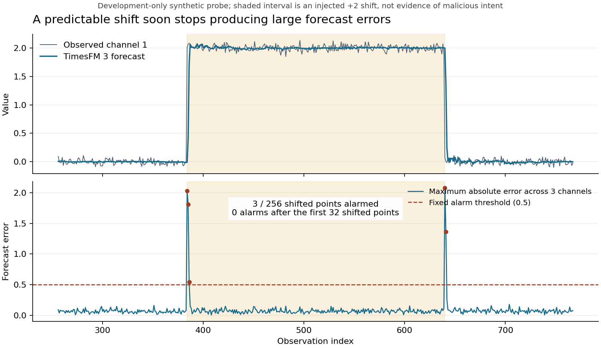

# Final Praxis010 — Attack-aware forecasting

Current gate: **Actual TimesFM 3 feasibility PASS; CPU/source/data checks PASS; original TimesFM 2.5 comparisons and Chronos/W1ACAS calibration pending.** Overall qualification remains **PENDING**. No heldout cyber efficacy or novel defense has been established.

The actual TimesFM 3 run completed in 71.03 seconds, with 0.12847-second median forecast-batch latency, 2.464 GiB peak GPU allocation, and zero repeated-forecast difference. On the fixed three-channel synthetic +2 shift, it alarmed on 3 of 256 shifted observations and on none after the first 32 shifted observations. This demonstrates adaptation on one development probe; it is not malicious-intent detection or a validated defense. Its [receipt and raw forecasts](completed_qualification/new3/QUALIFICATION_RECEIPT.json) passed [11/11 artifact checks](completed_qualification/NEW3_PARTIAL_AUDIT.json).



This candidate asks whether a detector can retain persistent-attack evidence while recovering after legitimate changes. Published context protection and adaptive calibration already exist. The literature-grounded [qualification protocol](QUALIFICATION_PROTOCOL.md), [precompute freeze](PROTOCOL_FREEZE.json), and [source audit](SOURCE_AUDIT.md) define the narrower work needed before investing in a new method.

- [CPU receipt](results/cpu/CPU_QUALIFICATION_RECEIPT.json): 20 independent observer simulations match released code with maximum absolute difference 0; 600 attack and 600 matched clean positions retained. All 10 predetermined persistence-control seeds pass.
- [Runtime controls](results/RUNTIME_CONTROLS.json): 22/22 synthetic/source controls pass, including causal contexts, horizon alignment and W1ACAS future-suffix checks. No pretrained model was loaded for these tests.
- [Data accessibility](results/DATA_ACCESSIBILITY.json): HAI 21.03 training1 hash verified, 216,001 chronological rows; exact shipped NAB example hash verified, 4,031 rows. No HAI test outcomes opened.
- [GPU runbook](GPU_RUNBOOK.md): executable original TimesFM 2.5, native TimesFM 3 and Chronos/W1ACAS modes; root controls the shared bounded AWS runtime.
- [Cloud setup review](completed_qualification/setup/CLOUD_SETUP_REVIEW.json): all 29 downloaded asset hashes match pinned identities; 22/22 controls also passed in the isolated cloud runtime. Exact installed packages and downloaded-file receipts accompany it.
- [Runtime explanation](postrun/ORIGINAL25_RUNTIME_INTERPRETATION.md): why the original 2.5 configuration processes more work than its one-step/three-sensor interface suggests. The original run retains its 40-minute cap; source-printed intermediate metrics are not treated as audited final results.
- [Artifact auditor](postrun/audit_qualification.py): validates source/file identities, all assigned row universes, intervention arithmetic and report numerators without new inference; [7/7 synthetic controls](postrun/AUDITOR_CONTROLS.json) passed.

Local reproduction, using Python with NumPy/SciPy/Pandas/Torch/Transformers installed:

```text
python code/prepare_assets.py --cache EXTERNAL_CACHE
python code/cpu_pilot.py --cache EXTERNAL_CACHE --output NEW_CPU_RESULTS
python code/test_runtime_controls.py --cache EXTERNAL_CACHE --output NEW_CONTROL_RECEIPT.json
```

To repeat HAI accessibility, download the pinned `hai-21.03/train1.csv.gz` to EXTERNAL_CACHE/hai/hai-21.03 first, then run `python code/audit_data.py --cache EXTERNAL_CACHE --output NEW_DATA_RECEIPT.json`. Its exact upstream URL/blob/hash is in SOURCE_MANIFEST.json and results/DATA_ACCESSIBILITY.json. All third-party data/code/weights stay outside Git; public-license/source restrictions remain applicable. The original June repository has no explicit code license, so this branch distributes retrieval instructions and our wrapper rather than copies of those scripts.

The historical June code uses known attack onset when enabling prediction blending. That oracle path is reported separately from deployable alarm-only policies. The calibration demo tunes a label-informed PA-F1 threshold; our fixed-threshold evaluation change is disclosed. A successful qualification permits further development, not a claim of novelty or a replacement for a completed paper.
