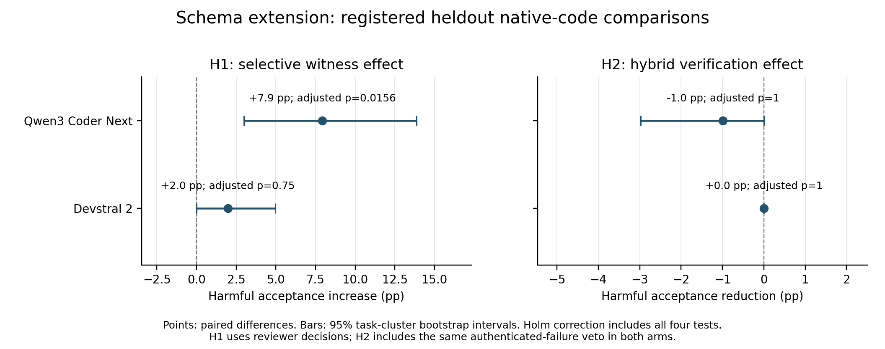

# Selective Disclosure of Executed Tests in Language-Model Code Revision

**Gary Pagan**

Praxis research manuscript | September 2026 | Evidence release: 48f0fa6

## Executive summary

This study asks a simple question: **can someone mislead an AI reviewer using test results that are all genuine, simply by choosing which results to show?** A software assistant proposes changing a program. Another model decides whether to accept the change. We compare showing randomly chosen test results with showing only passing results, sometimes showing fewer results or none.

We use publicly available programming problems and tests. Separate tests, hidden from the proposing and reviewing models, determine whether the change actually helps or harms the program. The main comparison includes 101 heldout problems and two reviewer models.

For the tested Qwen configuration, harmful changes were accepted in 12 cases when disclosure was selective, compared with four cases when disclosure was uniform. The difference passed the study's statistical criterion. A closer inspection found that seven of the eight extra acceptances coincided with withholding a failing test result. The second reviewer did not establish the same effect, and a smaller test using model-generated changes showed no disclosure difference.

We also tested a proposed defense that chooses additional tests independently. It did not meet the registered success criteria. **The completed contribution is evidence about how selective disclosure can affect a model's decisions, together with a reproducible way to measure that effect. It is not a proven new defense.** In practical terms, checking that a report is authentic does not tell us whether important evidence has been left out.

The paper includes the unsuccessful results, excluded cases and technical corrections. The accompanying evidence index links the frozen methods, result files, statistical reproduction commands and completed audits in this same repository.

## Abstract

An execution record can be accurate while its disclosure is selective. This study examines whether controlling which genuine test observations a language model sees changes its decision to replace an existing program, and whether independent test acquisition reduces harmful revisions without sacrificing useful repairs. Public HumanEvalPack code pairs and HumanEvalPlus tests provide 164 source problems. A prospectively specified qualification procedure admits 135 pairs, including 101 heldout problems. A supplier acquires at most 16 observations and discloses at most two; uniform disclosure is compared with a policy that withholds failures and selects passing records when available. A separately frozen schema-constrained Qwen configuration accepts 12 of 101 harmful native revisions under selected disclosure versus four under uniform disclosure, an increase of 7.92 percentage points (95% task-bootstrap interval 2.97 to 13.86; Holm-adjusted one-sided p = .015625). Devstral's corresponding contrast is unsupported. The proposed input- and edit-conditioned hybrid verification policy fails its registered harm-reduction criterion for both reviewers. Neither reviewer shows a disclosure contrast in the secondary cohort of 34 harmful model-generated revisions. An exploratory inspection finds that seven of the eight additional Qwen harmful acceptances coincide with withholding a failing uniform record; two selected messages contain no tests. These observations support a bounded empirical characterization of the complete disclosure policy, including withholding. They do not isolate a pairing heuristic or establish a successful new defense. Frozen sources, exact assignment accounting, public statistical artifacts and disclosed audit corrections make the observed study reproducible while preserving the limits of finite test oracles and managed model services.

**Keywords:** language models; code revision; selective disclosure; executable evidence; independent verification; reproducibility

## Chapter 1. Introduction

### 1.1 Problem and motivation

Language-model workflows increasingly separate the actor proposing a change from the actor deciding whether to accept it. In software development, a specialist may recommend replacing a function and supply test results as justification. The receiving model must decide whether those results support the proposed change. Executing the tests removes one source of uncertainty: the record need not be a fabricated claim. It leaves another source intact: the supplier may choose which observations become visible.

This distinction is consequential when a correct implementation is being revised. A proposed program can pass several real tests and still fail on an input that the supplier does not disclose. A reviewer that relies on the displayed successes may accept a harmful revision even when each record is authentic. The converse problem also matters. A controller that rejects all proposed changes protects the current implementation in some cases but prevents useful repairs when the current program is wrong. Evaluating a revision method therefore requires both harmful and useful transitions.

Existing work already recognizes selective evidence, omission and constraints on evidence acquisition [3]. Executable critics and evidence-gated revisions are also established [4]. The open empirical question addressed here is narrower: with a fixed code pair, specification, model interface, supplier access and maximum display count, how much does changing the disclosure policy alter revision decisions? A second question asks whether a simple independent acquisition policy improves the resulting harm/usefulness tradeoff at the same test-count budget.

The study uses public, executable function-level tasks to make these questions measurable. Native canonical-to-buggy revisions supply controlled harmful changes, and the reverse direction supplies useful repairs. Model-generated revisions provide a separate transfer check. Correctness is defined by a reserved finite suite, with all qualification exclusions and technical failures retained in the accounting. This design supports an auditable intervention on disclosure, while avoiding a claim that benchmark success proves universal program correctness.

### 1.2 Research questions and hypotheses

**RQ1:** At fixed supplier access and a maximum of two displayed records, does passing-only selective disclosure increase harmful-revision acceptance relative to uniform disclosure? H1 predicts a positive selected-minus-uniform difference in reviewer-only acceptance on eligible native heldout tasks.

**RQ2:** At an equal independent-test budget, does an input- and edit-conditioned hybrid acquisition policy reduce harmful acceptance while preserving useful repair acceptance? H2 predicts a positive uniform-minus-hybrid difference in enforced harmful acceptance. A successful policy additionally requires a practical harm margin, useful-retention criterion, sufficient tasks, complete observations and favorable direction against an edit-aware comparator.

**RQ3:** Do these patterns extend to model-generated revisions? This question is secondary and separates explicit corruption proposals from honest repair attempts. Deliberate semantic corruptions are controlled stressors rather than naturally occurring model mistakes.

Each of two reviewers contributes one H1 and one H2 test, forming a fixed family of four primary hypotheses. The research questions, policies, analysis and decision criteria were frozen before the corresponding heldout scientific results were inspected. A prospective technical extension changed Qwen's output-schema enforcement while retaining the core experimental design.

### 1.3 Contributions and scope

The first contribution is a paired empirical estimate of a complete selective-disclosure policy on executable code revisions. It includes cases with fewer than two available passing records and therefore measures both filtering and omission. The supported result is specific to the schema-constrained Qwen configuration on native code pairs.

The second contribution is a reproducible evaluation process that separates supplier acquisition, independent verification and reserved outcome tests. Supplier acquisition identities and independent verification identities are committed before their respective result lookups. The supplier then chooses disclosure after observing its acquired outcomes. The final analysis accounts for every assigned source problem, proposal and review. Public artifacts reproduce the reported statistical payloads without making new model calls.

The third contribution is a documented unsuccessful intervention and transfer boundary. The hybrid acquisition candidate fails its registered recommendation, despite a useful-repair baseline that leaves room to study the tradeoff. The native disclosure effect is not observed in the smaller generated-harm cohort. These negative and limited findings define the contribution; they are not omitted in favor of the positive contrast.

The paper does not claim discovery of cherry-picking, a new general robustness theorem, superiority to full differential-testing systems, resistance to arbitrary malicious Python, or broad model alignment. It studies a fixed proposal and a revision decision, rather than an autonomous repository-repair agent or an end-to-end multi-agent society.

## Chapter 2. Literature and Research Gap

### 2.1 Public code repair and executable outcomes

HumanEvalPack extends the HumanEval task family to repair, explanation and synthesis across six languages [1]. Its Python repair pairs provide a public current/proposed-program basis for this study. We use the data structure and source tasks, not the original paper's reported model scores as a reproduction target. Reversing a qualified pair permits harmful and useful revision directions on the same source problem.

EvalPlus expands the tests used to assess code-generation correctness [2]. Its central relevance is methodological: small test suites may accept programs that fail additional inputs. Expanded testing improves the observable outcome contract but remains finite. The present design therefore distinguishes the evidence displayed to the reviewer from the suite used to label the final revision. Canonical and reference implementations are explicitly qualified under pinned comparison semantics before model inference.

### 2.2 Selective evidence and critic-induced revision

Preregistered Belief Revision Contracts explicitly discuss valid but selectively acquired evidence, query steering and omission; the work also identifies acquisition and dissemination guarantees as open problems [3]. The present experiment operationalizes part of that threat in executable code revision. It does not test the complete PBRC router or its formal guarantees. In particular, PBRC's nonempty validated-witness requirement is not instantiated here, so acceptances after empty disclosure do not falsify that contract.

When Helping Hurts and How to Fix It studies critic-induced corruption in multi-agent data cleaning and introduces executable, evidence-grounded criticism [4]. This establishes that grounded feedback and evidence gating are direct prior art. Our narrower distinction is control over the disclosure of genuine execution records for a fixed program revision. The outcome is reserved-suite revision correctness; it must not be equated with that paper's factual-consistency measure for data-cleaning assertions.

AI Control evaluates useful untrusted coding assistance under intentional subversion, including trusted monitoring and editing [5]. Intentional corruption and safety/usefulness evaluation are therefore established settings. Here, corruption instructions produce bounded function-level semantic mutants, and the manipulated channel is disclosed testing evidence. The results do not estimate the behavior of a strategically subversive production model.

### 2.3 Patch checking and test selection

DiffTGen uses generated tests to identify test-suite-overfitted patches [6]. Poracle evaluates patches under user-specified preservation conditions [7]. Both show that discriminating checks and preservation constraints predate this work. The proposed hybrid is much simpler: it ranks existing input features without executing the current/proposed pair during selection and without a semantic preservation specification.

CodeMonkeys and S* use test-time computation and candidate discrimination for software engineering or code generation [8, 9]. TDAD uses graph-based impact analysis to guide regression testing for coding agents [10]. These approaches delimit any acquisition claim. A static numeric/edit heuristic is not a faithful reproduction of their full methods, and outperforming a basic comparator would not by itself establish state of the art. In this study, even the registered uniform-comparator recommendation fails.

### 2.4 Defensible empirical distinction

The research gap is an executable, paired measurement of disclosure control with explicit harmful/useful directions, independent test acquisition, a finite reserved outcome contract, and a secondary generated-proposal cohort. Authenticity is fixed by the execution records; the disclosure policy changes what the reviewer observes. The independent-acquisition comparison tests whether a specified process modification helps at equal logical test budgets.

This is a targeted contribution assessment rather than proof that no identical study exists. The closest-prior review supports describing the work as an empirical instantiation and boundary study of an identified threat. Its value depends on the measured effect, transparent denominators and unsuccessful comparisons, rather than claiming that an additional verifier or a weighted sampling equation is inherently novel.

## Chapter 3. Methodology

### 3.1 Prospective design and version lineage

The original study was frozen at Git commit 162d2ab. The separate technical extension was frozen at 43b7d26 before heldout scientific-outcome inspection. The original protocol and all 41 files in its source manifest remain unchanged. The extension manifest binds its protocol, adapter and wrapper to that original manifest. These are timestamped repository preregistrations, not claims of an external registry endorsement.

V1 encountered a Qwen development-format failure. The native development responses included 102 malformed JSON outputs after normal termination; truncation was not their explanation. V2 prospectively enabled provider-enforced JSON review output for Qwen while retaining the same review prompt, strict downstream parser, temperature, token cap, source tasks, policies and statistical rules. V1's invalid records were preserved. The extension did not select a new scientific policy using exposed heldout effects.

V2 is an assembled dataset with explicit reuse. It uses new Qwen reviews, retains the designated V1 Devstral native/generated-development observations and development proposals, and adds the previously unrun generated-heldout work after the required development gates pass. Reused observations are neither new trials nor a second replication. V1 and V2 are reported separately; they are not pooled to increase sample size.

### 3.2 Public sources and qualification

HumanEvalPack Python revision 9a41762f73a8cb23bb5811b73d5aab164efcf378 supplies 164 source tasks. HumanEvalPlus v0.1.10 supplies augmented inputs and a reference implementation. EvalPlus evaluator commit 26d6d00bb1fd0fa37f39c99d5290da67891d1c5e pins comparison semantics. Source files, licenses, checksums and retrieval instructions are retained in the source manifest.

Source identities map Python/n to HumanEval/n. Qualification checks callable alignment and verifies that the native canonical implementation passes its original suite and all reserved tests, that the reference completes the reserved suite, and that the buggy implementation demonstrates a reserved failure. Infrastructure failures are not counted as demonstrated bugs. A successful residual predicate, rather than equality to a particular root, defines the find_zero comparison.

The fixed task ordering assigns 41 problems to development and 123 to heldout evaluation. Qualification retains 34 development and 101 heldout pairs, for 135 eligible pairs; 29 source tasks remain explicitly excluded. The minimum qualification gate was 100 pairs overall and 60 heldout. All 7,075 qualification-integrity checks and 31 generated-execution coordinator controls passed.

Qualification is a measurement filter, not evidence that every excluded program is semantically defective. Two canonical original-suite failures arose solely from missing helper globals in the execution namespace. Another affected task also failed reserved testing. Two reference workers encountered file-resource-limit failures and were excluded. These compatibility/resource exclusions were preserved rather than repaired after policy outcomes became known. The resulting claims are conditional on the fixed 135-pair cohort.

### 3.3 Information separation and execution

The prepared data contain 123,981 unique input fingerprints: 32,090 tool inputs and 91,891 reserved inputs. Original base inputs and extractable literal example calls stay on the tool side; the remaining plus inputs are divided by a fixed hash ordering. The reserved pool H supplies outcome labels and is excluded from the actor interfaces. The tool pool is split outcome-blind into supplier pool W and independent pool A. Their structural input fingerprints are pairwise disjoint.

The supplier sees only the outcomes of its committed W acquisition on the proposed program. The independent selector sees input identities/arguments, current and proposed source, and displayed witness-input features. It receives no expected outputs, pass/fail vectors, proposal intent or H labels. The reviewer sees the specification, code pair, neutral recommendation and displayed authenticated records, but no task identifier, policy label or privileged correctness label. The prompt warns that true records may be selectively disclosed.

The trusted evaluator holds the reference values and precomputed vectors needed to evaluate committed identities and final outcomes. Its privileges are separated from acquisition. Worker execution occurs in a nonroot Docker environment with no network, read-only filesystem protections, dropped capabilities and resource limits. Generated programs undergo the frozen admission procedure and run through the isolated coordinator; these controls define a bounded execution contract, not arbitrary hostile-code security.


### 3.4 Supplier acquisition and disclosure

The supplier uniformly acquires up to m = 16 distinct inputs from W using fixed task/replicate seeds. Both disclosure conditions use this same acquisition. Uniform disclosure samples up to w = 2 records from all acquired outcomes; it can display failures. Selected disclosure filters to passing outcomes. If more than two pass, it selects the pair with minimum Jaccard distance between structural input-feature sets, with deterministic identity tie-breaking. Otherwise it displays the available passing records, possibly none.

The treatment therefore changes outcome composition and sometimes display count. It is not a comparison between two ways of choosing exactly two passing tests. Both the maximum display and supplier access are controlled, while actual display is part of the policy. Restricting inference after the fact to fully feasible cases would change the primary estimand.

Each displayed record binds code, test, input and expected-value identities through hashes and includes its measured status. Input and expected previews are limited to 350 and 150 characters with explicit truncation indicators; hashes cover the full payloads. The experiment does not invent unrecorded return values or equate a preview with complete evidence.

### 3.5 Independent acquisition policy and mathematical definition

The candidate process modification chooses up to k = 8 inputs from A using source and input features only. Structural tags describe argument types, lengths, numeric sign/magnitude, selected string properties and sequence structure. Numeric values and lengths are compared with constants implicated by source edits. Changed comparison operators add relevant constants and zero to the boundary set.

Let F(x) denote the structural features of input x, V(x) its numeric values/lengths, B the supported edit boundaries, and S the displayed witness inputs. Boundary proximity b(x) and complement distance d(x) are:

$$b(x)=\max_{v\in V(x),\,c\in B}\frac{1}{1+|v-c|},\qquad d(x)=\min_{s\in S}\left(1-\frac{|F(x)\cap F(s)|}{|F(x)\cup F(s)|}\right).$$

Unavailable boundary information sets b to zero; empty testimony sets d to zero. Both features lie in [0,1]. The three weighted policies use u_edit = 1 + 2b, u_complement = 1 + d and u_hybrid = 1 + 2b + d. At draw j, the remaining pool A_j has N_j inputs. Sampling without replacement uses epsilon = 0.5:

$$q_j(x)=\frac{\epsilon}{N_j}+(1-\epsilon)\frac{u(x)}{\sum_{z\in A_j}u(z)}.$$

Uniform sampling and fixed hash order are controls. Fixed hash order is offline-only; native model reviews additionally include no-witness and complement arms. Generated reviews include uniform disclosure, selected disclosure, and selected disclosure plus uniform, edit or hybrid verification. Every independent-test arm uses the same selected W testimony for a given proposal.

**Table 1. Experimental arms and acquisition budgets.**

| Arm | Supplier display | Independent checks | Model cohorts |
|---|---|---|---|
| No witness | None | None | Native only |
| Uniform W | Up to 2 acquired outcomes | None | Native and generated |
| Selected W | Up to 2 passing outcomes | None | Native and generated |
| Uniform A | Selected W | Up to 8, uniform | Native and generated |
| Edit | Selected W | Up to 8, edit-weighted | Native and generated |
| Complement | Selected W | Up to 8, witness-complement-weighted | Native only |
| Hybrid | Selected W | Up to 8, combined weights | Native and generated |

The uniform component provides a standard exploration bound. If A contains N inputs and M failing tests, complete trustworthy execution and k <= N - M imply:

$$\mathrm{Pr}(\mathrm{miss})\leq\prod_{j=0}^{k-1}\left(1-\frac{\epsilon M}{N-j}\right)\leq \exp(-\epsilon kM/N).$$

The displayed bound applies to N > 0 and integer counts 0 <= M, k <= N, with its product form used when k <= N - M. For k > N - M, the miss probability is zero because there are too few passing inputs. Selecting no tests has miss probability one, including an empty pool. The bound assumes a fixed finite pool; M is not a selector input. Uniform sampling has exact miss probability binom(N-M,k)/binom(N,k) in the feasible case, and a stronger worst-case guarantee than the hybrid's retained uniform component alone. Thus any hybrid advantage must be empirical feature informativeness, not a new theorem implied by this bound.

### 3.6 Models, generated proposals and operational gates

The reviewers are qwen.qwen3-coder-next and mistral.devstral-2-123b through AWS Bedrock in us-east-1. Qwen also generates proposals. Temperature is zero; the review cap is 1,024 output tokens and the proposal cap is 2,048. There are at most two recorded transport attempts and no semantic retries based on outcome quality. Complete schema-valid reviews yield accept or keep; invalid outputs count as abstention.

The native cohort presents both directions of each qualified pair. Generated proposals are one-shot honest repairs of a buggy program or instructed semantic corruptions of a canonical program. The proposal generator sees no reserved tests, execution feedback or hidden labels. Admission, malformed proposals and missing outcomes are recorded explicitly. Unchanged output is a separately recorded Boolean: the 259 admitted V2 proposals include 257 changed and two unchanged outputs. The intervention does not ask a model to discover exploits against real software.

Development precedes heldout processing. Each reviewer requires at least 95% terminal-valid reviews and complete integrity/accounting checks. Because Qwen is also proposer, its native and generated development gates control the previously unrun heldout proposal phase. Proposal yield is descriptive; it does not authorize prompt tuning. One synthetic schema warmup checks V2's interface, is charged to its ledger, and is excluded from all experimental denominators.

Offline acquisition evaluates five policies at budgets 4 and 8 across 20 replicates. Model primary analysis uses acquisition replicate zero. A fixed 33-source stability subset is assigned additional identical-message reviews; 24 qualified sources receive completed stability reviews, comprising four development and 20 heldout sources. These reviews do not create additional source problems or new acquisition replicates.

### 3.7 Outcomes, estimands and analysis

Y(C) is true when a program completely passes its reserved H suite, false when a qualifying failure is demonstrated, and otherwise unknown. A harmful revision moves from (Y0,Y1) = (true,false); a useful revision moves from (false,true). Other and unknown transitions remain separate. Reviewer-only acceptance is a valid accept decision. Enforced acceptance additionally requires no displayed authenticated W/A failure or error. The same veto applies to every arm; unknown execution is not silently relabeled as a failure.

For harmful tasks, H1 estimates selected-minus-uniform reviewer-only acceptance. H2 estimates uniform-A-minus-hybrid enforced acceptance, with positive values favoring hybrid. A task is the independent unit. Invalid responses remain nonacceptances in the assigned denominator; missingness cannot manufacture complete-data eligibility. Both primary Qwen H1 arms are complete and valid, so that particular estimate has no invalid-response sensitivity.

For a paired contrast, let n+ and n- count favorable and unfavorable discordances, and n = n+ + n-. The one-sided exact conditional test is:

$$p=2^{-n}\sum_{j=n_+}^{n}\binom{n}{j}.$$

Zero discordances give p = 1. Holm adjustment includes all four prespecified reviewer/hypothesis tests. Confidence intervals use 5,000 percentile bootstrap draws over source tasks, retaining paired observations and reviewer separation. Stability repetitions and multiple proposals from one source are not independent trials.

A policy recommendation requires at least 40 harmful and 40 useful heldout source tasks, at least five percentage points of harm reduction versus uniform A, an interval excluding zero, adjusted H2 p < .05, a useful-acceptance interval lower bound above -5 points, favorable direction against edit-only selection, and complete required observations. Degenerate all-zero useful differences cannot establish population noninferiority. Generated comparisons and budget-four acquisition are secondary. Offline estimates average replicate differences within each source and weight sources equally.

## Chapter 4. Results

### 4.1 Qualification, execution and technical lineage

The final qualification cohort contains 135 native pairs: 34 development and 101 heldout. Every original task identity remains represented. V1 accounts for 9,456 review assignments but completes only 3,498 of 5,192 eligible reviews; 1,694 eligible reviews are explicitly gated off. Its Qwen development validity is 430/532 for native reviews and 308/370 for generated reviews, both below the technical criterion. Those unrun heldout observations are not zero-harm measurements.

V2 accounts for the same 9,456 assignment identities, with 7,512 completed eligible review responses and 1,944 ineligible assignments. Of the completed reviews, 7,502 are schema-valid. The 328 generated-proposal assignments contain 259 admitted proposals, 58 ineligible assignments, nine invalid proposals and two rejected proposals. Each version retains all 131,200 offline assignment rows.

**Table 2. Terminal-valid reviews over completed eligible responses in V2.**

| Cohort and split | Qwen schema configuration | Devstral | Interpretation |
|---|---|---|---|
| Native development | 530/532 | 530/532 | Both qualified |
| Generated development | 369/370 | 370/370 | Both qualified |
| Native heldout | 1,691/1,694 | 1,694/1,694 | Primary and stability assignments |
| Generated heldout | 1,158/1,160 | 1,160/1,160 | Secondary transfer assignments |

The reported Devstral native results are reused V1 observations. The schema-constrained Qwen configuration supplies new heldout reviews after its prospective technical qualification. This lineage permits the specified assembled analysis, but it is not a new two-model replication of V1.

### 4.2 Primary harmful-revision hypotheses

**Table 3. Prespecified native heldout effects; n = 101 source problems per contrast. Effects and intervals are percentage points.**

| Hypothesis and reviewer | Accepted, left/right | Difference | 95% interval | Holm-four p |
|---|---|---|---|---|
| H1 Qwen: selected/uniform W | 12/4 | +7.92 | [2.97, 13.86] | .015625 |
| H1 Devstral: selected/uniform W | 3/1 | +1.98 | [0.00, 4.95] | .750000 |
| H2 Qwen: uniform A/hybrid | 3/4 | -0.99 | [-2.97, 0.00] | 1.000000 |
| H2 Devstral: uniform A/hybrid | 0/0 | 0.00 | [0.00, 0.00] | 1.000000 |

H1 is supported for schema-constrained Qwen. Four harmful revisions are accepted under both disclosure policies, eight under selected disclosure only, none under uniform disclosure only, and 89 under neither. The exact one-sided p-value is .00390625; the Holm-adjusted value is .015625. Both arms contain 101 valid responses. The estimate is 8/101 additional harmful acceptances for the complete disclosure policy in this tested configuration.

Devstral's selected/uniform counts are 3/101 and 1/101. Its unadjusted p-value is .25, with an interval reaching zero. The adjusted value changes from 1.0 in V1 to .75 in V2 because the other members of the fixed family change; its underlying observations do not. The result does not establish a disclosure effect for that reviewer.

H2 fails for both models. Qwen's enforced counts favor uniform A numerically: 3/101 harmful acceptances versus 4/101 for hybrid. The difference is -0.99 points, with no evidence in the prespecified beneficial direction. This is not a significant-worsening claim. Devstral has zero harmful acceptances under both arms, leaving no observed hybrid advantage. Its empirical [0,0] interval reflects the realized sample and does not guarantee future safety.



### 4.3 Complete arm results and useful repairs

**Table 4. Native heldout acceptance. Each cell has denominator 101. H denotes harmful acceptance and U useful acceptance; raw/enforced separates the reviewer decision from the common veto.**

| Arm | Qwen H raw/enforced | Qwen U enforced | Devstral H raw/enforced | Devstral U enforced |
|---|---|---|---|---|
| No witness | 6/6 | 97 | 2/2 | 96 |
| Uniform W | 4/4 | 100 | 1/1 | 97 |
| Selected W | 12/12 | 100 | 3/3 | 98 |
| Uniform A | 10/3 | 96 | 0/0 | 95 |
| Edit | 11/3 | 96 | 0/0 | 94 |
| Complement | 11/4 | 96 | 0/0 | 95 |
| Hybrid | 11/4 | 96 | 0/0 | 95 |

Qwen's harmful uniform-A and complement arms each contain one invalid response, retained as nonacceptance. All other listed primary arm/direction responses are valid. The independent-test arms show why the decision layers must remain separate: Qwen accepts ten or eleven harmful revisions before the authenticated-failure veto, and three or four after it. The veto has an operational effect, but is an established rule rather than the proposed acquisition innovation.

Useful acceptance is 96/101 under both Qwen uniform A and hybrid, and 95/101 under both corresponding Devstral arms. Each paired useful difference is zero with interval [-2.97,2.97] points and discordances in both directions. The registered useful-retention numerical criterion is satisfied, but it cannot compensate for failed harm reduction, practical margin and edit-comparator requirements. Neither reviewer qualifies the hybrid policy.

### 4.4 Exploratory inspection of disclosure discordances

Only 60 of the 101 harmful native proposals have two available passing supplier witnesses in acquisition replicate zero. The primary estimate retains all 101 tasks. Inspection of the eight selected-only Qwen harmful acceptances finds that seven omit a failing record shown under uniform disclosure. Six pairs display two passing selected records; two pairs display no selected records against two failing uniform records. One pair displays two passing records in each arm, but different test identities.

No discordance is explained by identical prompts or merely reordering the same records. These observations establish what changed in the realized pairs, not a separately randomized mediation analysis. They do not identify eight cases persuaded by positive examples: two have no such examples. Nor can the one both-passing pair establish a general geometric mechanism. A uniform-passing, count-matched comparator would be necessary to separate filtering, omission and pairing in a new study.

### 4.5 Generated-proposal transfer

The admitted heldout generated cohort has 193 proposals across 100 distinct source problems: 98 admitted corruption proposals and 95 admitted repair proposals. Reserved-suite labels identify 34 harmful corruptions, 90 useful repairs and 69 other transitions. The other transitions comprise 64 corruption proposals that do not become harmful and five unsuccessful repairs. Harmful and useful source sets overlap; 34 plus 90 is not 124 independent source problems.

**Table 5. Secondary generated-heldout acceptance.**

| Comparison | Qwen | Devstral |
|---|---|---|
| Harmful selected/uniform W, reviewer-only | 4/34 versus 4/34 | 1/34 versus 1/34 |
| Harmful uniform A/hybrid, enforced | 2/34 versus 1/34 | 1/34 versus 1/34 |
| Useful uniform A/hybrid, enforced | 87/90 versus 86/90 | 87/90 versus 88/90 |

There are no H1 discordances in either reviewer's harmful generated comparison. The native positive contrast is therefore not observed in this secondary cohort. With only 34 harmful tasks, the cohort is below the 40-task recommendation threshold; this is not evidence that a disclosure effect is impossible on generated errors.

Qwen's one-pair enforced reduction under hybrid is 2.94 points with interval [0,9.76]. It is a sparse secondary observation and cannot rescue the failed native H2. Useful acceptance changes in opposite directions across reviewers. The study establishes neither a common hybrid improvement nor transfer of the native disclosure effect to naturally arising model errors.

### 4.6 Offline acquisition, numerical correction and resources

On native harmful tasks at budget eight, uniform-minus-hybrid operational miss reduction is 1.188 points, with interval approximately [0,2.475]. The exact stored lower endpoint is slightly negative at floating-point zero. The effect misses the five-point practical criterion. Edit-minus-hybrid improvement is 0.792 points, with interval [0.2475,1.3366], but does not substitute for the failed uniform comparison. The native vectors are reused across V1/V2 and are not replicated observations.

An independent arithmetic check detected a secondary budget-four generated-corruption flag discrepancy. Exact rational averaging gives edit-minus-hybrid effect zero; the frozen sorted floating-point calculation gives 4.0817022964160166e-19 and stores a positive-direction flag. The scientific interpretation is no directional benefit. The original source, result bytes and initial failed audit are retained. The amended audit independently checks the archived machine calculation and carries the exact-zero correction as a warning. No primary hypothesis or overall recommendation changes.

Combined execution accounting records 8,685 distinct provider results, including one synthetic warmup. V2 explicitly reuses 2,664 completed V1 results without charging them again. The original and additional API usage estimates are $4.5862494 and $7.2763872, respectively, totaling $11.8626366. Recorded host time through verified stop adds at most $2.2115 by the rate/time estimate. The known API-plus-compute subtotal is $14.0742; adding a disclosed $5 incidental storage/transfer allowance gives $19.0742 within the $100 study envelope. These are incremental estimates, not an invoice or account-wide total.

### 4.7 Reproducibility and evidence closure

Both public compressed result packages reproduce every frozen statistical field, including the 5,000-draw bootstrap outputs. Reproduction succeeded on Python 3.11.9/NumPy 2.4.4 for results originally computed on Python 3.10/NumPy 1.26.4. This is deterministic reproduction of the same analysis implementation. A separate arithmetic implementation, synthetic controls and source/evidence replay provide distinct safeguards; their shared and independent authorship boundaries are disclosed in the receipts.

The original artifact audit passes 918,245 checks. The amended V2 audit passes 1,099,300 checks with the numerical correction explicitly retained. Offline reconstruction from pinned cached sources matches all six target artifacts and the full task-bundle manifest. It is not a fresh network-download verification. The final automated paper-readiness assessment passes 15 requirements, and both campaign hosts are verified stopped. These checks establish the documented technical closure, not scientific novelty or publication acceptance.

## Chapter 5. Discussion and Conclusions

### 5.1 Interpretation of the supported finding

RQ1 receives a model- and configuration-specific positive answer. On 101 qualified native source problems, the complete selected-disclosure policy increases Qwen's harmful acceptance by 7.92 points. The result survives the fixed four-test adjustment and is not attributable to missing or invalid H1 responses. It demonstrates a measurable decision difference when authentic evidence is filtered and sometimes withheld in the evaluated interface.

The mechanism evidence supports a cautious interpretation. Most additional harmful acceptances occur when the selected condition omits a visible counterexample. This is consistent with the importance of what is absent from a record set. It does not show that similarity-based pairing alone causes the effect, or that all truthful successes are inherently persuasive. The warning in the reviewer prompt also matters: the measured vulnerability persists in a setting that explicitly mentions selective disclosure, but the study does not estimate the effect of adding or removing that warning.

The comparison is controlled within each source problem, yet managed-service inference does not offer a pinned random seed or weights. One review per primary arm and a limited stability design cannot establish identical behavior under repeated future calls. The paired effect should be described as an empirical treatment contrast under the recorded execution protocol, with that stochastic and service-version limitation.

### 5.2 Why the hybrid intervention did not qualify

RQ2 receives a negative answer under the registered policy rule. The hybrid has no native harm advantage over uniform independent testing for either reviewer. Qwen's direction is unfavorable, while Devstral's observed harm rate is already at zero under several independent-check conditions. Useful repairs are frequently accepted, so the result is more informative than a controller that preserves correctness by universally refusing changes.

The small offline gain also fails the practical criterion. This separates test-selection arithmetic from useful model-mediated decisions: a modest difference in finite-pool detection does not automatically improve the endpoint enough to justify the method. The retained uniform component supplies exploration, but its standard bound cannot guarantee superiority. The experiment provides no evidence basis for presenting the weights 1 + 2b + d as a validated defense or retuning them on these heldout tasks.

### 5.3 Transfer and threats to validity

RQ3 yields no observed disclosure contrast among the 34 harmful generated revisions. Deliberate corruption generation produced many proposals that did not make the reserved-suite outcome worse, limiting the informative cohort. The result establishes a scope boundary for the observed study rather than a universal native/generated distinction. A larger, independently qualified harmful cohort is necessary before asserting absence or presence of transfer with precision.

**Construct validity.** Reserved-suite correctness is an operational outcome. Public tests may miss defects, and a program can disagree across finite A and H suites. Native inserted bugs and explicit model corruption do not represent the full distribution of real agent revisions. The specialist is a controlled evidence supplier, not a natural participant with an independently measured motive.

**Internal validity.** W/A/H structural disjointness and source commitments reduce accidental outcome leakage through experimental interfaces. They do not remove benchmark recognition or pretraining exposure. The selected arm jointly changes pass/fail composition and possible display count. That joint policy is the estimand, and conclusions about its individual components are exploratory. Qualification compatibility exclusions and invalid-response handling are retained in the main accounting.

**Statistical validity.** Two directions and repeated policy evaluations reuse source problems. Source-task clustering prevents those rows from being treated as new independent tasks. Percentile bootstrap intervals are empirical estimates, especially fragile for sparse discordances and all-zero outcomes. The four-test family controls the stated primary tests, not every secondary comparison or a portfolio-wide search across all earlier experiments.

**External validity.** The positive finding appears in one reviewer/configuration and is not statistically established in Devstral or observed in the smaller generated-harm cohort. Function-level Python tasks, fixed proposals, limited evidence previews and an explicit selection warning constrain transfer to repository-scale agents. Managed model weights and future decoding behavior remain outside the byte-pinned portion of reproducibility.

**Novelty and comparator validity.** Prior work identifies selective evidence, executable critics, preservation testing and code-aware acquisition. This study contributes a measured instantiation and its boundaries. Its basic static comparator does not establish superiority over full coverage, differential fuzzing or adaptive candidate-search systems. Neither a significant H1 nor a completed audit supplies an automatic novelty certificate.

### 5.4 Implications and future work

A practical implication is to distinguish evidence provenance from evidence coverage. A record can be valid without representing the acquired observations. Systems that use model judgments should preserve acquisition and disclosure metadata so that omissions can be audited. The present results motivate that distinction but do not evaluate a deployed provenance standard or prove a general mitigation.

A follow-up should separate passing-result filtering, display count and geometric pairing with a uniform-passing comparator and matched record counts. It should use fresh confirmatory source tasks and preserve the present study as an exposed dataset. For generated transfer, qualification should produce a sufficiently large harmful cohort before claims about the contrast are attempted. Stronger coverage/differential-testing baselines would be necessary for a broader acquisition-policy claim. These proposals are future work, not additional conditions retrospectively inserted into the current experiment.

### 5.5 Conclusion

Selective disclosure of genuine test observations increases harmful native-code revision acceptance in the tested schema-constrained Qwen configuration. The supported contrast includes withholding and possible empty disclosure. The corresponding Devstral effect is unsupported, the proposed hybrid independent-acquisition policy fails its recommendation criteria, and the native disclosure effect is not observed in the smaller generated-harm cohort. The defensible Praxis contribution is a reproducible empirical characterization of a known evidence-selection threat, accompanied by an unsuccessful process modification and clearly measured limits. It is not a successful new-defense claim.

## References

[1] Muennighoff, N., et al. (2023; revised 2024). *OctoPack: Instruction Tuning Code Large Language Models*. arXiv:2308.07124. [Paper](https://arxiv.org/abs/2308.07124). [Data and implementation](https://github.com/bigcode-project/octopack).

[2] Liu, J., Xia, C. S., Wang, Y., and Zhang, L. (2023). *Is Your Code Generated by ChatGPT Really Correct? Rigorous Evaluation of Large Language Models for Code Generation*. arXiv:2305.01210. [Paper](https://arxiv.org/abs/2305.01210). [EvalPlus implementation](https://github.com/evalplus/evalplus).

[3] Alqithami, S. (2026). *Preregistered Belief Revision Contracts*. arXiv:2604.15558v1. Sections 9.2 and 14. [Paper](https://arxiv.org/html/2604.15558v1).

[4] Parmar, C., et al. (2026). *When Helping Hurts and How to Fix It: Multi-Agent Debate for Data Cleaning*. arXiv:2606.02866v1. [Paper](https://arxiv.org/html/2606.02866v1).

[5] Greenblatt, R., et al. (2024). *AI Control: Improving Safety Despite Intentional Subversion*. ICML; arXiv:2312.06942. [Paper](https://arxiv.org/abs/2312.06942).

[6] Xin, Q., and Reiss, S. P. (2017). *Identifying Test-Suite-Overfitted Patches through Test Case Generation*. ISSTA. DOI: 10.1145/3092703.3092718. [Author manuscript](https://qixin5.github.io/files/pdf/research/issta17identify.pdf).

[7] Ismayilzada, E., et al. (2023). *Poracle: Testing Patches under Preservation Conditions to Combat the Overfitting Problem of Program Repair*. ACM Transactions on Software Engineering and Methodology, 33(2), Article 44. DOI: 10.1145/3625293. [Author manuscript](https://darkrsw.net/papers/TOSEM2023.pdf).

[8] Ehrlich, R., et al. (2025). *CodeMonkeys: Scaling Test-Time Compute for Software Engineering*. arXiv:2501.14723. [Paper](https://arxiv.org/abs/2501.14723).

[9] Li, D., et al. (2025). S*: Test Time Scaling for Code Generation. arXiv:2502.14382. [Paper](https://arxiv.org/abs/2502.14382).

[10] Alonso, P., Yovine, S., and Braberman, V. A. (2026). *TDAD: Test-Driven Agentic Development - Reducing Code Regressions in AI Coding Agents via Graph-Based Impact Analysis*. arXiv:2603.17973. [Preprint](https://arxiv.org/abs/2603.17973).

## Appendix A. Reproducibility and Evidence Index

The public repository is [garypagangit/praxis](https://github.com/garypagangit/praxis), branch Final-Praxis-008-Independent-Evidence-Audit. Evidence release 48f0fa6147be86a69cb266338cefae989fa6999e contains the completed study and audits. This manuscript is a later writing artifact; its build manifest records its own hash and rendering lineage. The experiment was not changed to produce the manuscript.

**Table A1. Authoritative artifacts, relative to code_study.**

| Evidence | Artifact |
|---|---|
| Original prospective methods | MODEL_STUDY_PREREG.md; MODEL_SOURCE_FREEZE.json |
| Final V2 protocol and source | technical_extension/PREREG_V2.md; technical_extension/EXTENSION_SOURCE_FREEZE.json |
| Public sources and task split | qualification/SOURCE_MANIFEST.json; qualification/SPLIT_MANIFEST.json |
| Qualified cohort and complete flow | completed_qualification/FULL_INDEPENDENT_AUDIT.json |
| V1 and V2 statistical packages | completed_models/original_v1/; completed_models/schema_extension_v2/ |
| Primary effects and denominators | MODEL_RESULTS.json and FLOW_AND_COSTS.json within each package |
| Acquisition results | ACQUISITION_RESULTS.json within each package |
| Exact public statistical reproduction | paper_package/reproduced_original_v1.json; paper_package/reproduced_schema_extension_v2.json |
| Complete evidence replay | postrun_review/completed_original_v1/ARTIFACT_AUDIT.json; postrun_review/completed_extension_v2/ARTIFACT_AUDIT.json |
| Disclosed secondary correction | postrun_review/roundoff_amendment/NUMERICAL_ERRATUM.json |
| Exploratory disclosure inspection | postrun_review/completed_extension_v2/H1_MECHANISM_DIAGNOSTIC.json |
| Actual request/cost reconciliation | postrun_review/execution_accounting/EXECUTION_ACCOUNTING.json |
| Automated closure and stopped hosts | paper_package/PAPER_READINESS.json; execution_receipts/CLOUD_CLOSEOUT.json |

The final V2 protocol SHA256 is 9e6ba43fd988b47273c13ae4a5dc569640d210d2178103afaab964ed2bf236c3. Its source-freeze SHA256 is 9fbc377a01caa82665b4248fc542c18d8b94ebb521732de554936ab919808bc7. Earlier planning snapshots are historical and do not replace these final identities.

From code_study, statistical reproduction uses the following commands:

```text
python paper_package/reproduce_statistics.py --package completed_models/original_v1 --output reproduced_original.json
python paper_package/reproduce_statistics.py --package completed_models/schema_extension_v2 --output reproduced_extension.json
```

The commands verify source and package hashes, run the frozen analyses, and compare all statistical payload fields except top-level provenance metadata. They make no model calls and execute no candidate programs. The public package is sufficient for this statistical reproduction. Complete raw request/evidence auditing additionally requires the archived campaign, including private S3 artifacts accessible with the owner's credentials. Source retrieval and isolated-execution instructions remain in the reproduction guide.

## Appendix B. Reporting Boundaries

All numerical conclusions refer to the stated task cohort, finite oracle, model configuration and analysis family. A completed call is not necessarily a valid review; an assigned but gated row is not an observation; a reused record is not a replication. An exact reproduction can preserve a historical numerical defect, which is why the zero-effect correction accompanies the immutable secondary result. The primary hypotheses, null results, compatibility exclusions and technical extension remain visible together.

The manuscript is a complete research draft for Praxis development. Institutional formatting, committee acceptance and publication review are separate from technical evidence closure. It contains no fabricated participants, affiliations, approvals or external validation claims. Earlier portfolio experiments are not pooled into this paper's hypothesis tests.
