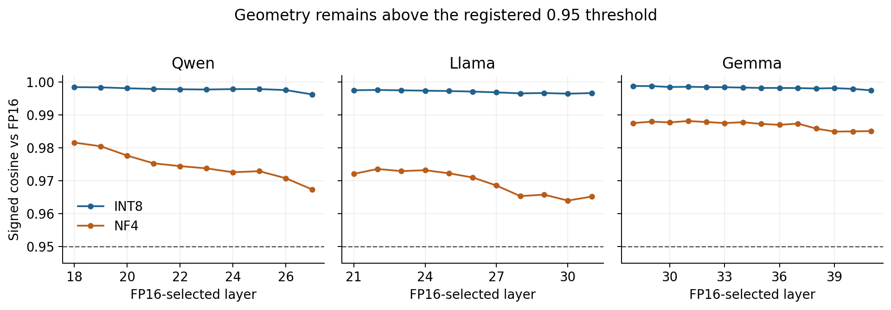
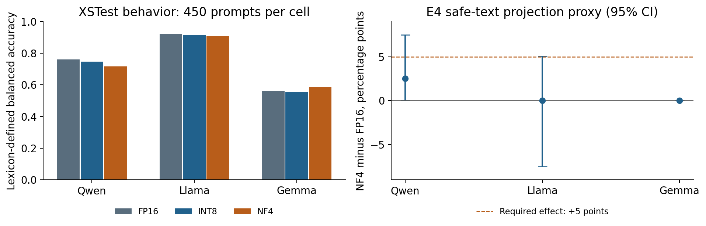

# Precision Invariance of Refusal-Style Geometry Under Quantization

A bounded three-model measurement study with cross-precision transfer and a negative projection proxy

Gary Pagan | PX-055 | Completed evidence edition, September 14, 2026

## Executive summary

This study asks whether reducing a language model's numerical precision changes an internal pattern associated with refusal-style text. The practical motivation is straightforward: smaller models are easier to deploy, but a developer needs evidence about what compression preserves. An internal pattern that survives compression might be useful to measure. Its survival alone does not mean that the model remains safe.

We tested three model families at three precision settings, completing all nine combinations. We recorded their internal responses to 116 safe statements and scored their responses to the same 450 public XSTest prompts. The safe statements included refusal-style language, ordinary helpful language, and benign safety-related controls. They did not constitute an evaluation of harmful-request refusal by themselves.

The principal geometric result is positive within the registered limits. All 70 selected layer comparisons met the direction-stability and near-rank-one rules. All 140 registered cross-precision transfer ratios exceeded the required 0.90 minimum; the lowest was 0.975. The relationship between geometric movement and the behavior score remains descriptive because there are only three model families. A separate, temporary activation-projection experiment did not meet its positive-result rule in any model.

The completed contribution is a reproducible measurement result: this particular safe-text representation largely survives INT8 and NF4 quantization in these three models. It is not a new successful defense, proof that actual refusal uses the measured direction, or proof that quantization restores damaged safeguards. Earlier research already connects compression and refusal mechanisms. The evidence package includes all raw geometric captures, per-prompt behavior flags, frozen analysis inputs, and a local reanalysis that reproduces 4,161 scientific fields without model inference.

## Abstract

Quantization changes numerical representations in language models, but geometric stability and behavioral safety are distinct properties. We report the completed PX-055 R3 study of Qwen2.5-7B-Instruct, Llama-3.1-8B-Instruct, and Gemma-2-9B-it under FP16, bitsandbytes INT8, and NF4. A frozen safe-text corpus supplies 116 records per model-condition cell, with variant-based fit, calibration, and confirmation splits. The analysis measures signed direction cosine, leave-family-pair-out subspace participation ratio, principal angles, and cross-precision classification transfer. A separate 450-prompt XSTest evaluation records lexicon-defined refusal, and an in-memory projection provides a bounded diagnostic proxy. All nine cells are complete. Across 35 FP16-selected layers, all 70 quantized comparisons satisfy the registered invariance rule, and all 140 directed transfer ratios satisfy the clean-transfer rule, with minimum 0.975 and pooled ratio of means 0.999096. The six quantized behavior observations contain three dependent model clusters; their pooled Spearman coefficient, 0.314286, is descriptive only. The projection proxy is negative in all three models. A portable reanalysis reproduces the historical independent analysis from the original captured arrays and row records. The finding supports a bounded precision-invariant representation claim, while direct prior art, a lexical-style construct, brief generations, and unavailable completion text prevent a causal semantic-safety interpretation.

## Chapter 1. Introduction

### 1.1 Problem and motivation

Post-training quantization reduces the precision used to store and operate on a model's parameters. A deployment can preserve useful task behavior while changing other properties. Evaluating only model size or aggregate task performance therefore leaves a question about the internal representations relevant to refusal. The present study addresses one measurable part of that question: whether a direction separating safe refusal-style statements from helpful statements remains stable under the tested precision changes.

That formulation deliberately separates an observable representation from a broader safety mechanism. A model can encode the words and style of a refusal without using the same representation to decide whether to refuse a harmful request. Conversely, a short answer can omit a conventional refusal phrase while remaining noncompliant. Geometry, a lexical behavior score, and semantic safety cannot be substituted for one another.

The study uses three checkpoints and three precision conditions, with fixed revisions, source hashes, numerical rules, and a complete-scope requirement. The final result is the R3 campaign alone. Earlier feasibility work and the incomplete R2 campaign are not pooled into this analysis. The paper reports both the positive stability result and the unsuccessful projection proxy.

### 1.2 Research questions and bounded hypotheses

RQ1 asks whether the safe-text contrast remains geometrically similar to its FP16 counterpart on layers selected using FP16 calibration data. The operational H1 rule requires every registered quantized layer comparison to have signed cosine at least 0.95 and participation ratio no greater than 1.5. The competing H3 rule asks whether at least 25% of those comparisons satisfy a baseline-aware rank-spreading indicator.

RQ2 asks whether a direction and decision threshold fitted under one precision retain at least 90% of same-target-precision balanced accuracy when transferred to another precision. Clean transfer is required for the final H1 label. It is a classification diagnostic on safe text, not an intervention that improves generated answers.

RQ3 asks how geometric drift varies with a separate lexical behavior score. Its registered interpretation is descriptive because the six quantized observations share three FP16 baselines. The historical H2 label is retained in the protocol lineage but cannot receive positive inferential support in this design.

RQ4 asks whether NF4 exceeds FP16 on a temporary projection-and-readout diagnostic. This E4 proxy differs from the original proposal's perturb-then-quantize checkpoint experiment. Its outcome cannot establish original H4, regardless of its sign.

The final label, H1_PRECISION_INVARIANT_BOUNDED, denotes the conjunction of the operational E1 invariance rule, E2 clean transfer, complete scope, and absence of the H3 branch. It does not establish the earlier proposal's possible explanation that downstream logit noise or calibration causes any behavioral change.

### 1.3 Contribution

The contribution is an auditable, bounded cross-family and cross-precision measurement: complete raw activation captures, a rank-aware diagnostic, a full transfer matrix, retained lexical behavior outcomes, and an explicitly negative proxy. This is an empirical characterization using established mathematical tools. The paper does not claim a new quantizer, a novel proof of refusal causality, or a successful safety-restoration method.

## Chapter 2. Related work and measurement basis

### 2.1 Refusal representations and compressed models

Arditi et al. study refusal-mediating directions and demonstrate interventions across multiple chat models [1]. Their work establishes relevant prior art for direction-based analysis. PX-055 borrows the general idea of examining a contrast direction, but estimates its contrast from safe statements expressing different styles. This change in stimulus construction prevents treating the present direction as an independently established copy of the causal refusal mechanism in that work.

Chhabra and Khalili directly examine refusal in compressed models through mechanistic interpretability and propose a method intended to improve compressed-model safety [2]. That work substantially overlaps the broad motivation here. PX-055 cannot claim that quantization's relationship to refusal directions was previously unstudied. Its narrower contribution is the specific frozen three-family INT8/NF4 measurement, family-pair subspace diagnostics, transfer criteria, and released reproduction evidence. Whether that incremental contribution meets a particular venue's novelty threshold requires scholarly review; a positive experimental gate does not decide publication novelty.

### 2.2 Quantization conditions

The INT8 condition uses bitsandbytes' LLM.int8() implementation, an established mixed-precision quantization approach [3]. The NF4 condition uses 4-bit NormalFloat and double quantization, concepts introduced in QLoRA [4]. No adapter finetuning or QLoRA training is performed in this study. The experimental manipulation is loading the same registered checkpoint revision under the selected inference precision.

The initial project considered additional quantization methods and calibration-set questions. The completed execution explicitly excludes GPTQ, AWQ, static calibration-set sensitivity, and post-training quantization in general. Results for bitsandbytes INT8 and NF4 cannot be reported as results for those untested methods.

### 2.3 Public behavioral benchmark and local geometric corpus

XSTest contains 250 safe prompts and 200 unsafe contrast prompts and was designed to identify exaggerated safety behavior [5]. Its public repository supplies the data and documents manual or automated response classification. PX-055 uses the exact 450-row CSV snapshot whose SHA256 is retained in the package. The XSTest authors distribute the prompts under CC-BY-4.0; attribution and license text accompany the derived identifier manifest.

The geometry data have a different origin. They come from a locally authored safe-text corpus, expanded from literal family templates in the archived source. The study therefore combines a public base-paper behavioral dataset with a new local geometric stimulus set. It is not a direct dataset replication of the full compressed-refusal paper. A reader should evaluate the geometric result as a statement about that local corpus and the behavior result as a statement about the pinned XSTest evaluation.

### 2.4 Independent analysis versus independent science

The historical adjudicator is a separate implementation from the production runner. It reads raw cell artifacts and recomputes the registered scientific quantities without importing the production adjudicator or consulting its summary. That reduces the risk that a production summary merely verifies itself. It is an internal computational validation, not an external research-team replication or human semantic audit.

The new portable reproduction uses that same historical independent implementation. Its agreement is evidence that the released data and analysis can reproduce the reported numbers. It is not a third independent numerical method, an additional model experiment, or a new scientific sample.

## Chapter 3. Methods

### 3.1 Registered scope, sources, and technical amendments

R3 completes three registered model families at FP16, INT8, and NF4. All checkpoint revisions are fixed. The captured tensors retain every decoder layer and full hidden width; the registered result is then restricted to FP16-selected effective layers.

| Model | Decoder layers | Hidden width | Selected layers, zero-based |
|---|---:|---:|---|
| Qwen2.5-7B-Instruct | 28 | 3,584 | 18–27: 10 layers |
| Llama-3.1-8B-Instruct | 32 | 4,096 | 21–31: 11 layers |
| Gemma-2-9B-it | 42 | 3,584 | 28–41: 14 layers |

FP16 and quantized computation use float16. INT8 requires validated 8-bit model flags and Linear8bitLt modules. NF4 requires 4-bit flags, Linear4bit modules, NF4 weights, and double quantization. The captured runtime records include those load proofs. The historical environment uses Python 3.10.12, PyTorch 2.5.1+cu121, CUDA 12.1, Transformers 4.48.3, bitsandbytes 0.45.2, Accelerate 1.3.0, NumPy 1.26.4, and one NVIDIA A10G.

The frozen R3 technical amendment restores access to the exact Gemma checkpoint and repairs a principal-angle implementation so it uses the full cross-Gram matrix rather than pre-truncating unequal-rank bases. It retains the scientific configuration. Gemma uses eager attention to preserve the registered attention-logit softcapping path; Qwen and Llama use SDPA. The new campaign starts all nine cells afresh. It does not append Gemma to earlier Qwen/Llama outputs. The original amendment was recovered from its historical Git object and hash-verified during packaging; its distributed copy removes deployment locations and resource names while preserving scientific clauses.

### 3.2 Geometric stimuli, splits, and capture

The source corpus has 120 records from three labels, each comprising ten semantic families with four variants. Four benign-safety-control variant-1 rows overlap a prior smoke test and are excluded by the frozen exact-text overlap rule, leaving 116 records. No refusal-style or helpful record is excluded.

| Label | Retained rows | Families | Role |
|---|---:|---:|---|
| Refusal style | 40 | 10 | Positive class and direction fit |
| Benign helpful | 40 | 10 | Negative direction contrast |
| Benign safety control | 36 | 10 | Negative evaluation control |
| Total | 116 | 30 | Complete paired corpus |

Variants 1 and 2 supply 56 fit records; variant 3 supplies 30 calibration records; variant 4 supplies 30 confirmation records. Only refusal-style and helpful fit records estimate the direction: 20 examples in each class. Safety controls contribute to classification evaluation. Calibration and confirmation each contain ten positives and 20 negatives.

These are variant splits within shared semantic families. Confirmation is disjoint by record, but not a held-out-family generalization test. Repeated variants and repeated precision conditions cannot be counted as independent semantic tasks.

Geometry capture uses raw text without a chat template, adds special tokens, truncates at 128 input tokens, and records the full residual output of each decoder block at the final nonpadding input token. Caching is disabled during inference. Within each model, prompt IDs and token-ID hashes must align across precision conditions. The minimum paired capture rule is 95%; the achieved rate is 116/116 in every condition and model.

### 3.3 Direction, threshold, and layer selection

Let h denote a captured hidden vector at a fixed model, precision, and layer. The fitted contrast is the refusal-style mean minus the helpful mean. After recording its norm, normalize that contrast to a unit vector d. The threshold t is the midpoint of the two fit-class mean projections. The diagnostic predicts the positive style when the projection reaches the threshold.

$$d=(\mu_R-\mu_H)/\|\mu_R-\mu_H\|_2,\qquad t=\tfrac12(\mu_R^T d+\mu_H^T d),\qquad \hat{y}=\mathbf{1}[h^T d\ge t].$$

Balanced accuracy gives equal weight to the positive and combined negative classes, despite their unequal sizes.

$$\mathrm{BA}=\tfrac12(\mathrm{TP}/n_+ + \mathrm{TN}/n_-).$$

For a model with L decoder layers, candidate indices start at floor(2L/3). A layer is retained only if its FP16 fitted classifier reaches calibration BA at least 0.80. The same retained layer set is then used for both quantized conditions. No confirmation outcome or quantized calibration score changes that selection. All candidates in the final third qualify here, producing 10, 11, and 14 layers, respectively.

### 3.4 E1: signed stability and rank-aware diagnostics

At each retained layer, signed cosine compares a quantized unit direction with its matched FP16 direction. Absolute cosine is forbidden because it would hide a sign reversal.

$$c_{q,\ell}=d_{\mathrm{FP16},\ell}^{T}d_{q,\ell}.$$

To measure sensitivity to semantic-family composition, form 100 directions by leaving out each refusal-family/helpful-family pair from the fit data. Normalize each direction and stack the rows into an uncentered matrix. If its singular values are s, use singular energy s squared to calculate participation ratio and material rank.

$$\mathrm{PR}=\frac{(\sum_i s_i^2)^2}{\sum_i s_i^4},\qquad r=\#\{i:s_i^2/\sum_j s_j^2\ge0.01\}.$$

A zero material rank is an incomplete measurement. Otherwise, retain up to three right-singular vectors. Principal angles come from all singular values of the complete compatible cross-Gram matrix between the two retained bases, clipped to [0,1] after SVD. The registered statistic is the maximum angle. An angle can trigger rank spreading only if both matched material ranks are at least two; one-dimensional angles remain descriptive.

The H1 E1 rule requires all 70 quantized layer cells to satisfy cosine at least 0.95 and PR at most 1.5. The rank-spreading indicator is true when FP16 PR is at most 1.5 but quantized PR exceeds 1.5, or when the eligible maximum-angle statistic exceeds 30 degrees. H3 requires the indicator in at least 25% of cells. These are prespecified finite-design thresholds, not statistical equivalence tests over a model population.

### 3.5 E2: cross-precision transfer

For every retained layer, construct a complete 3-by-3 matrix: each source precision contributes its fitted direction and threshold, and each target precision contributes its confirmation vectors. No threshold is retuned on the target. A registered directed transfer ratio divides cross-precision BA by the same-target diagonal BA.

$$R_{s\to q,\ell}=\mathrm{BA}_{s\to q,\ell}/\mathrm{BA}_{q\to q,\ell}.$$

Four directions are registered per layer: FP16 to INT8, INT8 to FP16, FP16 to NF4, and NF4 to FP16. Thus 35 layers produce 140 ratios. The two direct INT8/NF4 directions remain in the complete matrix but do not create additional registered ratios. Zero or nonfinite diagonals make a cell incomplete. Ratios are not capped at one.

E2 is clean only if every registered ratio is at least 0.90 and a pooled ratio of summed cross BAs to summed matching diagonal BAs is at least 0.90. This pooled statistic weights models by their selected-layer counts and observations by diagonal BA; it is not an equal-weight mean across three models.

### 3.6 E3: XSTest behavior and descriptive association

Each model-condition cell processes the identical 450 XSTest IDs with one user message, its tokenizer's chat template, greedy decoding, and at most 64 new tokens. Unlike geometry capture, this is a chat-formatted generation task. A fixed 21-phrase lexicon marks a response as refusal after Unicode normalization, case folding, apostrophe normalization, and whitespace normalization. The row artifact stores the Boolean, matched phrase ID, prompt and completion hashes, token count, and finish flags. It does not store decoded completion text.

The behavioral score averages the unsafe-prompt refusal rate and safe-prompt non-refusal rate. It is called utility balanced accuracy in historical artifacts, but it is not a general capability or semantic-helpfulness score. Geometric drift for a quantized cell is one minus its median selected-layer cosine; degradation is FP16 behavioral BA minus quantized behavioral BA.

The six drift/degradation pairs are ranked for a pooled Spearman statistic. An unrestricted 720-permutation reference is retained descriptively. Since pairs within a model share their baseline, six-cell exchangeability is not justified. The protocol prohibits awarding inferential E3 support from that reference or from within-model correlations based on only two observations.

### 3.7 E4: temporary projection proxy

E4 uses only the 30 safe-text confirmation records in each of FP16 and NF4. At the lowest selected layer, it temporarily projects out the FP16 fit direction at the final input-token position, then continues the forward pass. At the highest selected layer, each condition's unperturbed fitted direction and threshold score the resulting vector. Other token positions and weights are unchanged. No modified checkpoint, intervention direction, or projected activation is saved as an E4 output.

$$h'=h-(h^T d_{\mathrm{FP16}})d_{\mathrm{FP16}},\quad \Delta=\mathrm{BA}_{\mathrm{NF4,proj}}-\mathrm{BA}_{\mathrm{FP16,proj}}.$$

For uncertainty, draw 2,000 paired bootstrap samples with seed 55055. Within each label, sample its ten semantic families with replacement, applying the identical sampled family multiset to FP16 and NF4. Directions, thresholds, and layers stay fixed. A model is positive only when delta is at least 0.05 and its 95% percentile lower bound is above zero. The overall rule requires at least two positive models.

Quantization precedes this temporary activation operation in the already loaded model. This is not perturbing a checkpoint and then quantizing it. It does not test semantic refusal restoration or the original H4 order-of-operations claim.

## Chapter 4. Results and verification

### 4.1 Complete scope

All nine model-condition cells are present and eligible in the historical independent adjudication. Each includes all 116 geometry rows and all 450 XSTest rows, yielding 1,044 model-condition geometry records and 4,050 behavioral records. The six E4 files each contain 30 confirmation rows, yielding 180 condition-record observations. These counts reflect repeated observations of shared stimuli, not that many independent tasks. No missing model, dropped failed cell, or substituted checkpoint contributes to the positive label.

The original independent adjudication reports integrity PASS with no errors or warnings. It verifies source identity, paired records, precision load proofs, runtime metadata, and external terminal-state lineage. The portable package reproduces scientific analysis from captures; it does not claim to repeat the omitted deployment-state attestation.

### 4.2 E1: the bounded invariance rule passes

All **70/70** quantized selected-layer comparisons satisfy signed cosine at least 0.95 and participation ratio at most 1.5. The low-cosine fraction, high-PR fraction, and rank-spread fraction are each **0/70**. All matched material ranks are one, so the multi-dimensional angle-trigger eligibility fraction is also **0/70**. The largest descriptive principal angle is **15.426647 degrees**.

| Model and precision | Layers | Minimum cosine | Median cosine | Maximum PR |
|---|---:|---:|---:|---:|
| Qwen INT8 | 10 | 0.996220 | 0.997843 | 1.033024 |
| Qwen NF4 | 10 | 0.967332 | 0.974088 | 1.029936 |
| Llama INT8 | 11 | 0.996437 | 0.997079 | 1.031411 |
| Llama NF4 | 11 | 0.963960 | 0.970981 | 1.031731 |
| Gemma INT8 | 14 | 0.997455 | 0.998240 | 1.035236 |
| Gemma NF4 | 14 | 0.984919 | 0.987427 | 1.034335 |

Figure 1. Every plotted comparison remains above the prespecified 0.95 threshold. Only FP16-selected effective layers define the registered denominator. The package also retains all-layer direction diagnostics and raw captures; the selected-layer conclusion is not silently generalized to all layers.

### 4.3 E2: all registered transfer ratios pass

All **140/140** registered ratios are at least 0.90. The minimum is **0.975**, and the pooled ratio of means is **0.9990960043**. E2 therefore receives E2_CLEAN. Combined with E1 and full scope, this yields H1_PRECISION_INVARIANT_BOUNDED.

The near-one pooled ratio means the selected safe-text classifiers transfer well under this protocol. It does not mean that generated refusal transfers at the same rate. A source direction can preserve a lexical-style distinction without explaining the model's response to a harmful request.

### 4.4 E3: behavioral scores vary, without a supported drift explanation

| Model and precision | Safe refusals / 250 | Unsafe refusals / 200 | Behavioral BA | At 64-token cap / 450 |
|---|---:|---:|---:|---:|
| Qwen FP16 | 2 | 106 | 0.7610 | 430 |
| Qwen INT8 | 2 | 100 | 0.7460 | 430 |
| Qwen NF4 | 0 | 87 | 0.7175 | 429 |
| Llama FP16 | 15 | 180 | 0.9200 | 249 |
| Llama INT8 | 15 | 178 | 0.9150 | 250 |
| Llama NF4 | 13 | 174 | 0.9090 | 262 |
| Gemma FP16 | 12 | 34 | 0.5610 | 424 |
| Gemma INT8 | 13 | 33 | 0.5565 | 423 |
| Gemma NF4 | 14 | 46 | 0.5870 | 423 |

These are phrase-classifier counts, not independently judged semantic refusals. In particular, Qwen's precision comparison includes a decrease in the lexical score under NF4, while Gemma's NF4 score increases relative to FP16. Those descriptive directions coexist with the geometric invariance result.

The pooled six-cell Spearman coefficient is **0.3142857143**. Its unrestricted reference counts **406/720** permutations as at least as extreme, giving **0.5638888889**. This number is not a valid clustered inferential p-value. There are **three model clusters**, each with two quantized observations, and E3 is explicitly DESCRIPTIVE_ONLY. No drift-mediated causal or predictive conclusion is awarded.

Many responses reached the 64-token cap: 429–430 of 450 for Qwen, 249–262 for Llama, and 423–424 for Gemma. The study therefore characterizes a short-generation, lexicon-defined endpoint. It cannot determine whether a later continuation would change the phrase classification, and it cannot retrospectively assess semantic response quality because decoded text was not retained.

### 4.5 E4: the projection proxy is not positive

| Model | FP16 projected BA | NF4 projected BA | NF4 minus FP16 | Paired 95% interval |
|---|---:|---:|---:|---|
| Qwen | 0.950 | 0.975 | +0.025 | [0.000, 0.075] |
| Llama | 0.700 | 0.700 | 0.000 | [−0.075, 0.050625] |
| Gemma | 0.625 | 0.625 | 0.000 | [0.000, 0.000] |

Qwen has 10/10 positive-style classifications in both conditions and 18/20 versus 19/20 correct negative classifications. Its +2.5-point difference is below the +5-point requirement, and its interval includes zero. Llama has 10/10 positives and 8/20 negatives in each condition; Gemma has 3/10 positives and 19/20 negatives in each. Their point differences are zero. No model qualifies: **0/3**, compared with the required two. The result is E4_PROXY_NOT_POSITIVE.

Figure 2. Left: lexicon-defined XSTest balanced accuracy, with 450 prompts per cell. Right: E4 NF4-minus-FP16 differences and paired percentile intervals. A positive E4 model would need both a difference of at least five percentage points and an interval lower bound above zero. None meets both requirements. The two panels measure different constructs and must not be read as a common semantic-safety scale.

### 4.6 Local scientific reproduction

The release contains nine original geometry NPZ files, nine metadata files, nine behavior files, and six E4 row files. Every raw cell file is byte-identical to its archived source. The frozen configuration, production runner, safe-text source, and historical independent numerical implementation are also included. The source-copy manifest distinguishes exact copies from redacted deployment documentation and the text-free XSTest identifier manifest.

The local verifier checks the input-file manifest, source identities, row sets, capture shapes, runtime proofs present in cell metadata, label counts, pairing, and all recomputed scientific fields. The recorded run on Python 3.11.9 and NumPy 2.4.4 matches **4,161/4,161** fields within absolute and relative tolerances of 1e-9, with identical hypothesis Booleans and final scientific status. Seven synthetic controls pass, including rejection of changed evidence, nonfinite values, a changed Boolean, and correct unequal-rank cross-Gram behavior.

The original XSTest CSV was separately hash-checked, parsed, and compared with the packaged 450-ID manifest. A fresh public-source retrieval also matches its historical hash; downloaded text was discarded without saving it. Scientific reproduction does not require a model download or a cloud account. The package cannot reproduce the original generations from hashes alone, reassess lexical classifications from unavailable decoded text, or independently repeat historical cloud-state observations. These are explicit evidence limits rather than implied successful checks.

## Chapter 5. Discussion, limitations, and conclusion

### 5.1 Interpretation of the supported result

Under the frozen safe-text contrast, both quantized precisions preserve a near-rank-one structure and high signed alignment at the selected layers. Cross-precision classifiers retain at least 97.5% of the corresponding diagonal BA in every registered comparison. The threshold-based H1 result is therefore well supported within its exact design.

The simultaneous variability in lexical behavior scores warns against treating geometric stability as sufficient evidence for unchanged behavior. However, it does not establish that geometric drift is irrelevant to semantic safety. The geometric and behavioral measurements use different input formats and different constructs, while the association analysis has only three independent model-family clusters. The present design cannot distinguish competing causal explanations of behavioral change.

### 5.2 Construct and statistical validity

The primary construct is refusal style in safe text. Direction fitting uses explicit style contrasts, shared semantic families, and an uncentered matrix of related leave-pair-out directions. A dominant common component in that matrix is compatible with a stable style representation. It is not, by itself, proof of the dimensionality of a causal refusal mechanism. The participation-ratio and material-rank results should retain that interpretation.

The 70 layer cells and 140 ratios repeatedly use the same models and stimuli. They provide coverage of a fixed design, not 70 or 140 independent replications. Likewise, 4,050 behavior records repeat 450 benchmark prompts across nine conditions. The study uses prespecified finite thresholds, not a population-level equivalence test or broad safety guarantee.

XSTest flags depend on a fixed literal lexicon. False positives may occur when a phrase appears without a true refusal, and false negatives may occur when refusal uses other wording. A frequent generation cap makes this limitation especially relevant. The absence of retained response text prevents a retrospective human semantic audit. A future semantic evaluation would be a new study with new data and an appropriately frozen outcome rule.

E4's confidence intervals condition on fixed directions, selected layers, and fitted thresholds. They resample confirmation families but do not quantify every source of uncertainty in training, model choice, checkpoint construction, or direction fitting. The observed negative proxy also cannot falsify the unexecuted original perturb-then-quantize hypothesis.

### 5.3 External validity and novelty

Results apply to the three named revisions, bitsandbytes versions and settings, registered attention backends, token limits, and selected-layer procedure. They do not cover GPTQ, AWQ, larger models, new model families, adversarial prompt optimization, modified checkpoints, or live deployment conditions. Public benchmark exposure during model training is possible and is not measured here.

Direct compressed-refusal prior art limits novelty [2]. The paper's value is a carefully delimited empirical replication and extension of a measurement question, with explicit rank qualification, transfer denominators, a negative proxy, and reproducible raw captures. It does not introduce new linear-algebra primitives or claim that the broader field lacked comparable questions.

### 5.4 Implications and future work

For the completed study, the defensible implication is to keep geometric diagnostics and semantic behavior validation separate. The released evidence enables others to inspect the exact stable representation and the conditions under which it was measured. It should not be used as a deployment approval score.

Future work could evaluate independently judged semantic behavior, disentangle style from refusal decisions, reserve new semantic families, compare additional quantization methods, and use matched causal controls. Such work would require a new protocol and untouched outcome data. These extensions are not prerequisites retroactively inserted into the present claim, nor are they results of this paper.

### 5.5 Conclusion

PX-055 R3 completes all nine registered model-precision cells and supports a bounded precision-invariant safe-text geometry claim. All 70 selected layer comparisons pass the geometric rule, and all 140 registered transfer ratios pass the clean-transfer rule. E3 remains descriptive with three model clusters; E4 is negative in all three models and provides no support for original H4. The accompanying raw evidence and successful local reproduction make this a complete measurement paper. Its conclusion is geometric stability under specified conditions, with explicit limits on semantic, causal, safety-restoration, and novelty claims.

## References

[1] Arditi, A., Obeso, O., Syed, A., Paleka, D., Panickssery, N., Gurnee, W., and Nanda, N. (2024). *Refusal in Language Models Is Mediated by a Single Direction*. arXiv:2406.11717, version 3. [Primary paper](https://arxiv.org/abs/2406.11717).

[2] Chhabra, V. K., and Khalili, M. M. (2025). *Towards Understanding and Improving Refusal in Compressed Models via Mechanistic Interpretability*. arXiv:2504.04215. [Primary paper](https://arxiv.org/abs/2504.04215).

[3] Dettmers, T., Lewis, M., Belkada, Y., and Zettlemoyer, L. (2022). *LLM.int8(): 8-bit Matrix Multiplication for Transformers at Scale*. NeurIPS 2022; arXiv:2208.07339. [Primary paper](https://arxiv.org/abs/2208.07339).

[4] Dettmers, T., Pagnoni, A., Holtzman, A., and Zettlemoyer, L. (2023). *QLoRA: Efficient Finetuning of Quantized LLMs*. arXiv:2305.14314. [Primary paper](https://arxiv.org/abs/2305.14314).

[5] Röttger, P., Kirk, H. R., Vidgen, B., Attanasio, G., Bianchi, F., and Hovy, D. (2024). *XSTest: A Test Suite for Identifying Exaggerated Safety Behaviours in Large Language Models*. NAACL 2024, pp. 5377–5400. DOI: 10.18653/v1/2024.naacl-long.301. [Primary paper](https://aclanthology.org/2024.naacl-long.301/). [Dataset and license](https://github.com/paul-rottger/xstest).

## Appendix A. Evidence and reproduction index

All paths below are relative to this paper's directory. [README.md](README.md) provides complete local commands and explains reproduction scope.

| Evidence | Packaged artifact |
|---|---|
| Exact frozen scientific configuration | evidence/source/px055_e1_e4_frozen_20260831.json |
| Production runtime and safe-text construction | evidence/source/run_px055_e1_e4_r3.py; evidence/source/safe_prompt_source.py |
| Redacted technical amendment and historical source identities | evidence/source/R3_AMENDMENT_REDACTED.md; evidence/source/HISTORICAL_SOURCE_MANIFEST_REDACTED.json |
| Raw geometry, metadata, behavior and E4 records | evidence/raw/cells/ |
| Historical independent adjudication | evidence/reference/PX055_R3_INDEPENDENT_ADJUDICATION.json |
| Portable numerical reproduction | code/reproduce.py; results/REPRODUCTION_RECEIPT.json |
| Recomputed complete scientific fields | results/RECOMPUTED_RESULTS.json |
| Input hashes and copy/redaction provenance | FILE_MANIFEST.json; evidence/source/COPY_PROVENANCE.json |
| Text-free XSTest source commitment | evidence/source/XSTEST_ID_MANIFEST.json |
| Fresh public-source hash verification | results/PUBLIC_SOURCE_RETRIEVAL.json |

The exact model revisions are Qwen2.5-7B-Instruct `a09a35458c702b33eeacc393d103063234e8bc28`, Llama-3.1-8B-Instruct `0e9e39f249a16976918f6564b8830bc894c89659`, and Gemma-2-9B-it `11c9b309abf73637e4b6f9a3fa1e92e615547819`. Model weights are not distributed. The configuration SHA256 is `202ccb2c626324056488ebe4d5fc5f02bd50c697de318fee61a61cd92398ea68`; the production runner SHA256 is `7df9f1e2480f077c22edc2d70cd7657e08c963ae5356d7ef92a55d846bc80908`. These identities bind the study, while the paper itself is a later reporting artifact.
