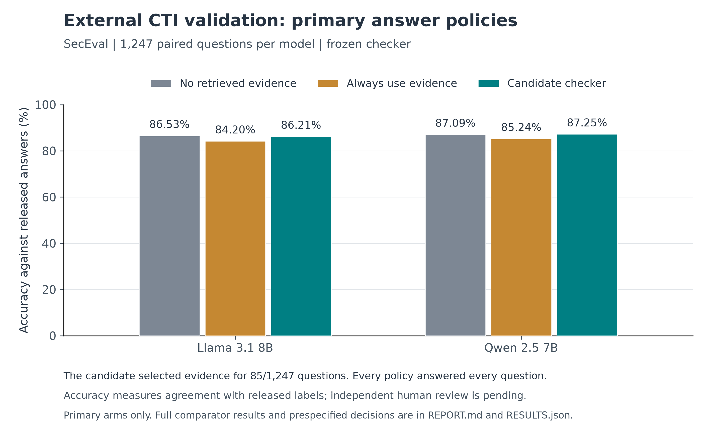
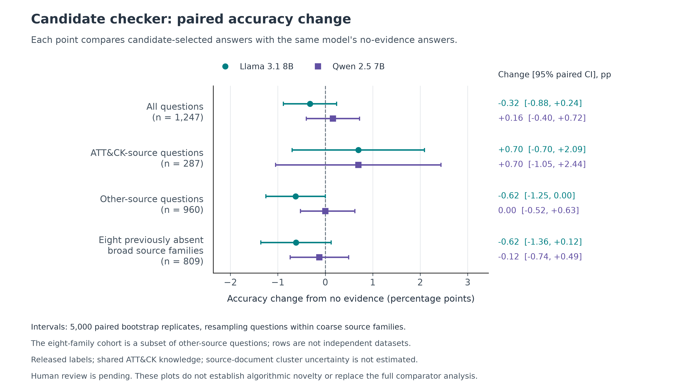

# CTI checker: external benchmark results

**The frozen checker did not meet the combined external transport criteria. Individual benefits and harms remain visible below.**

Recorded decision: `EXTERNAL_TRANSPORT_CRITERIA_NOT_MET`. Completed 1,247 paired questions, 4,988 fresh generator outputs and 32 format-qualification outputs.

The practical question is whether the checker can choose useful extra security facts without allowing irrelevant facts to damage the answer. Each policy selects between the same model's recorded answer with and without those facts.

Changes and intervals below are in percentage points (pp). A move from 60% to 65% is +5 pp. Brackets show 95% bootstrap intervals.

| Model | No evidence | Candidate | Candidate change, pp [95% CI] |
| --- | --- | --- | --- |
| Llama 3.1 8B | 1079/1247 (86.53%) | 1075/1247 (86.21%) | -0.32 [-0.88, +0.24] |
| Qwen 2.5 7B | 1086/1247 (87.09%) | 1088/1247 (87.25%) | +0.16 [-0.40, +0.72] |

The candidate used evidence for **85/1247 questions (6.82%)**. Its mean accuracy change across the two models was **-0.08 [-0.52, +0.36] pp**.

## All policies

| Policy | Evidence use | Llama accuracy | Qwen accuracy | Mean accuracy |
| --- | --- | --- | --- | --- |
| No retrieved evidence | 0 (0.00%) | 86.53% | 87.09% | 86.81% |
| Always use retrieved evidence | 1247 (100.00%) | 84.20% | 85.24% | 84.72% |
| Question relevance | 130 (10.43%) | 86.29% | 87.81% | 87.05% |
| Question + options relevance | 197 (15.80%) | 85.81% | 87.33% | 86.57% |
| Question source classifier | 69 (5.53%) | 86.77% | 87.17% | 86.97% |
| Question utility checker | 361 (28.95%) | 85.57% | 86.93% | 86.25% |
| Evidence-aware utility checker (candidate) | 85 (6.82%) | 86.21% | 87.25% | 86.73% |
| Question relevance (matched count) | 85 (6.82%) | 86.53% | 87.73% | 87.13% |
| Question + options relevance (matched count) | 85 (6.82%) | 86.29% | 87.25% | 86.77% |
| Question source classifier (matched count) | 85 (6.82%) | 86.77% | 87.17% | 86.97% |
| Question utility checker (matched count) | 85 (6.82%) | 86.61% | 87.41% | 87.01% |

Matched-count rows use each comparator's highest scores for exactly as many questions as the candidate uses evidence. Selection uses no new answer labels or outcomes.

## Candidate results by source cohort

| Cohort | N | Model | No evidence | Always evidence | Candidate | Candidate change, pp [95% CI] |
| --- | --- | --- | --- | --- | --- | --- |
| All questions | 1247 | Llama 3.1 8B | 86.53% | 84.20% | 86.21% | -0.32 [-0.88, +0.24] |
| All questions | 1247 | Qwen 2.5 7B | 87.09% | 85.24% | 87.25% | +0.16 [-0.40, +0.72] |
| ATT&CK-source questions | 287 | Llama 3.1 8B | 87.46% | 89.55% | 88.15% | +0.70 [-0.70, +2.09] |
| ATT&CK-source questions | 287 | Qwen 2.5 7B | 86.06% | 88.85% | 86.76% | +0.70 [-1.05, +2.44] |
| Other-source questions | 960 | Llama 3.1 8B | 86.25% | 82.60% | 85.62% | -0.62 [-1.25, 0.00] |
| Other-source questions | 960 | Qwen 2.5 7B | 87.40% | 84.17% | 87.40% | +0.00 [-0.52, +0.63] |
| Eight previously absent broad source families | 809 | Llama 3.1 8B | 84.80% | 81.33% | 84.18% | -0.62 [-1.36, +0.12] |
| Eight previously absent broad source families | 809 | Qwen 2.5 7B | 87.14% | 82.82% | 87.02% | -0.12 [-0.74, +0.49] |

## Recoveries and harms

A recovery changes a wrong baseline answer to a correct one. An induced error changes a correct baseline answer to a wrong one. A prevented error is an always-evidence error avoided by choosing the baseline; a lost improvement is a useful evidence answer not selected.

| Cohort | Model | Recovered | Induced errors | Prevented errors | Lost improvements |
| --- | --- | --- | --- | --- | --- |
| All questions | Llama 3.1 8B | 5 | 9 | 62 | 37 |
| All questions | Qwen 2.5 7B | 8 | 6 | 72 | 47 |
| ATT&CK-source questions | Llama 3.1 8B | 3 | 1 | 12 | 16 |
| ATT&CK-source questions | Qwen 2.5 7B | 4 | 2 | 13 | 19 |
| Other-source questions | Llama 3.1 8B | 2 | 8 | 50 | 21 |
| Other-source questions | Qwen 2.5 7B | 4 | 4 | 59 | 28 |
| Eight previously absent broad source families | Llama 3.1 8B | 2 | 7 | 42 | 19 |
| Eight previously absent broad source families | Qwen 2.5 7B | 3 | 4 | 53 | 19 |

## Prespecified decision criteria

| Usefulness criterion | Llama | Qwen |
| --- | --- | --- |
| Overall gain at least 3 percentage points | FAIL | FAIL |
| Positive ATT&CK-source gain retains half of a positive always-evidence gain | FAIL | FAIL |
| Other-source loss no greater than 2 percentage points | PASS | PASS |
| Other-source interval lower bound above -5 percentage points | PASS | PASS |

Combined usefulness criteria: **FAIL**. Added-value criteria against every matched comparator: **FAIL**.

The ATT&CK-source retention criterion requires a positive always-evidence benefit and a positive candidate benefit retaining at least half of it. Avoiding a harmful always-evidence intervention does not satisfy that criterion.

| Matched comparator | Llama difference, pp [95% CI] | Qwen difference, pp [95% CI] | Mean difference, pp [95% CI] | Gate |
| --- | --- | --- | --- | --- |
| Question relevance | -0.32 [-0.96, +0.32] | -0.48 [-1.12, +0.08] | -0.40 [-0.88, +0.08] | FAIL |
| Question + options relevance | -0.08 [-0.72, +0.48] | +0.00 [-0.64, +0.64] | -0.04 [-0.48, +0.44] | FAIL |
| Question source classifier | -0.56 [-1.36, +0.16] | +0.08 [-0.64, +0.80] | -0.24 [-0.76, +0.32] | FAIL |
| Question utility checker | -0.40 [-0.96, +0.16] | -0.16 [-0.72, +0.40] | -0.28 [-0.76, +0.16] | FAIL |

Added-value gates require at least +1 pp in each generator and a positive lower interval bound for their mean, against each comparator.

## Individual source-family diagnostics

| Source family | N | Llama candidate accuracy; change [CI] | Qwen candidate accuracy; change [CI] |
| --- | --- | --- | --- |
| android_sec_doc | 111 | 78.38%; +0.00 [+0.00, +0.00] pp | 82.88%; +0.00 [+0.00, +0.00] pp |
| apple_platform_security | 27 | 74.07%; +0.00 [+0.00, +0.00] pp | 85.19%; +0.00 [+0.00, +0.00] pp |
| attck | 287 | 88.15%; +0.70 [-0.70, +2.09] pp | 86.76%; +0.70 [-1.05, +2.44] pp |
| cs161_textbook | 122 | 82.79%; -2.46 [-5.74, +0.00] pp | 88.52%; +0.00 [+0.00, +0.00] pp |
| cwe | 151 | 93.38%; -0.66 [-1.99, +0.00] pp | 89.40%; +0.66 [+0.00, +1.99] pp |
| d3fend | 13 | 92.31%; +0.00 [+0.00, +0.00] pp | 92.31%; +0.00 [+0.00, +0.00] pp |
| mozilla_security | 47 | 89.36%; -4.26 [-10.64, +0.00] pp | 91.49%; -2.13 [-6.38, +0.00] pp |
| owasp_mastg | 142 | 91.55%; +0.70 [+0.00, +2.11] pp | 88.73%; +0.70 [-1.41, +2.83] pp |
| owasp_wstg | 207 | 90.82%; -0.48 [-1.45, +0.00] pp | 90.34%; -0.48 [-2.42, +0.97] pp |
| windows_security | 140 | 72.14%; +0.00 [-2.14, +2.14] pp | 80.71%; +0.00 [+0.00, +0.00] pp |

These small source-family slices are descriptive; they did not tune the policy or its gates.

## Output validity and provenance

| Model / condition | Invalid outputs retained as incorrect |
| --- | --- |
| Llama 3.1 8B / vanilla | 0 |
| Llama 3.1 8B / relationship_evidence | 0 |
| Qwen 2.5 7B / vanilla | 0 |
| Qwen 2.5 7B / relationship_evidence | 0 |

Analysis completion: `2026-09-18T21:35:42.219382+00:00`. Results SHA-256: `4211fb59742b0765dd4f7b21adba2e62821fd41d7504eb577f8193f705f3b947`. Scientific freeze SHA-256: `0ea00fb10e13ae71f09278aeab71993e99dca87bc7b6faeda3c3c4a4b428cc30`.

[Machine-readable results](RESULTS.json) retain counts, intervals, gates, and generator receipt hashes. [Scored records](scored_records.jsonl) preserve the per-question paired outcomes.

## Relationship to the earlier pilot

This external experiment adds evidence about transfer to another benchmark. It does not replace or erase the earlier CTIBench pilot, which used different questions and finer eligibility labels.

Earlier recorded status: `USEFUL_SELECTION_SIGNAL_ADDED_VALUE_UNPROVEN`. Usefulness criteria: **PASS**; added-value criteria: **FAIL**.

| Earlier pilot model | No evidence | Candidate | Change, pp |
| --- | --- | --- | --- |
| Llama 3.1 8B | 64.72% | 76.96% | +12.24 |
| Qwen 2.5 7B | 62.84% | 72.48% | +9.64 |

Earlier results SHA-256: `9a0c99d21069fd66d8d4dac31da5766a7688090e2b13ac364a0330f5c06cb029`.

See the [earlier pilot report](../cti_checker_pilot_20260918/REPORT.md) and [research-gap review](../cti_checker_gap_review_20260918/RESEARCH_GAP.md).

## What these results can support

The reported accuracy is agreement with released SecEval answers. The dataset's authors used GPT-4 to generate and calibrate labels; this study has not established their independent correctness.

The pinned source has 2,189 records. All 1,247 records meeting the fixed single-answer/four-distinct-options rule were retained; 942 were excluded by that format rule before generator outcomes. The original dataset is public and predates this experiment, so model pretraining exposure remains possible.

The ATT&CK knowledge family and retrieval corpus are shared with development. SecEval provides coarse source categories without per-question source-document or technique identifiers. ATT&CK-source is a provenance category, not a verified label that the retrieved facts apply. Zero exact lexical overlaps and low nearest-question similarities against the audited prior inventory do not establish semantic or source-document independence.

Source-version differences can matter: SecEval was originally described in 2023, while this experiment retains the frozen ATT&CK 19.1 corpus. A disagreement is not automatically evidence that the model is wrong about current security practice.

Confidence intervals resample questions within the observed coarse source-family counts, preserving each question's paired model outcomes. They are not source-document cluster intervals. They condition on the fixed benchmark, released labels, and frozen policy; comparisons are exploratory and not adjusted for multiple testing.

The relevance comparators use a published MiniLM reranker with question-only or question-plus-options inputs. They are not complete CRAG or CoRM-RAG systems. Matching the number of questions that use evidence does not equalize computation. Every policy answers every question, so evidence use is not abstention or answer coverage.

**Algorithmic novelty remains unproven under every result category.** A favorable result can justify further applied research; stronger published-checker comparisons and independently reviewed applied questions remain necessary for a final contribution claim.

The blinded 50-item review packet is ready; zero human reviews are recorded as completed. Two independent security reviewers and a third adjudicator are required.

See [human-review instructions](HUMAN_REVIEW.md). No automated review substitutes for actual human judgments.

## Evidence and references

- [Frozen protocol](PROTOCOL.md), [data audit](DATA_AUDIT.json), [analysis review](ANALYSIS_REVIEW.json).
- [SecEval author repository and dataset license](https://github.com/XuanwuAI/SecEval). Dataset license: CC BY-NC-SA 4.0; code licensing is separate.
- [Pinned SecEval revision](https://huggingface.co/datasets/XuanwuAI/SecEval/tree/205dab7b0888a06f4b53ca7d9c7093e1326683e1).
- [Prior Praxis pursuit decision](../cti_checker_gap_review_20260918/PURSUIT_DECISION.md).

## Post-run verification and closeout

The [independent audit](INDEPENDENT_RESULTS_AUDIT.json) reconstructed 2,671 comparisons using separate standard-library counters and ranking code. All point metrics, selections, parser checks, frozen hashes and gate decisions matched across 14 cohorts, 11 policies and two models. It did not independently repeat the bootstrap draws; it checked the reported intervals' structure and their use in decision gates.

The Llama other-source interval's recorded upper endpoint is approximately -0.000000012 percentage points, a floating-point residue displayed here as 0.00. It should not be interpreted as a meaningful exclusion of zero. Machine-readable results remain unchanged.

Both generators returned all 2,494 expected test outputs with no invalid answers. Test inference took 738.88 seconds for Llama and 729.19 seconds for Qwen, excluding model loading, qualification and operational overhead. MiniLM question-only scoring used 356.79 seconds of CPU inference over 7,482 fact pairs; question-plus-options scoring used 579.84 seconds. No question-only pairs were truncated; 3 of 7,482 question-plus-options pairs were truncated under the frozen 512-token scoring limit. These timings describe this run, not an equal-cost comparison of deployed policies. See [checker validation](CHECKER_VALIDATION.json) and the [worker receipt](execution_outputs/runtime.json).

The GPU run completed once and the host was verified stopped. Downloaded outputs required a local Windows filename recovery because Linux produced both `RUNTIME.json` and `runtime.json`; the environment file alone was renamed to `environment_runtime.json`. All recovered contents match the original archive byte-for-byte. The original collector failure remains recorded. See [operations and cost estimate](OPERATIONS.md) and [recovery verification](COLLECTION_RECOVERY.json).

The [updated Praxis decision](DECISION.md) explains the conclusion in plain language. The [human-review handoff](REVIEW_HANDOFF.md) supplies the remaining human step; zero human reviews are complete.
