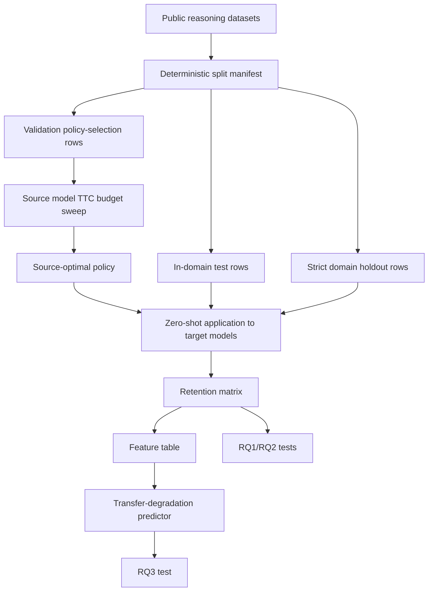

# Praxis EXP01 Protocol - Cross-Model Transferability of Test-Time Compute Strategies

Generated: 2026-06-18

Status: **preliminary full AWS result present; provisional / do not overclaim**

Source brief: `C:\Users\garyp\Downloads\AI_ML_Praxis_Experiment_Templates.docx`

## Experiment ID

`frontier-exp01-ttc-transfer`

## Working Title

**Cross-Model Transferability of Test-Time Compute Strategies**

## Thesis

Test-time compute strategies are often treated as portable inference recipes, but their effectiveness is likely conditional on model family, model scale, answer-distribution shape, and task difficulty. This experiment tests whether compute-optimal strategies selected on one model transfer zero-shot to other model families and scales, then fits a lightweight predictor of transfer degradation from cheap pre-run signals.

## One-Sentence Claim To Test

A test-time compute policy that is optimal for one model family will not always remain optimal on another; transfer retention can be measured with a source-to-target matrix and partially predicted from base accuracy, sampling entropy, model scale, and strategy features.

This remains a claim to test. The 2026-06-18 preliminary AWS run supports the measurement harness and gives first transfer-matrix evidence, but it does not yet promote the claim because verifier-based best-of-N and sequential refinement were not included.

## Research Questions

| ID | Research question | Decision evidence |
|---|---|---|
| RQ1 | Do compute-optimal TTC strategies discovered on one model family retain effectiveness when transferred zero-shot to a different family or scale? | Off-diagonal retention matrix with bootstrap confidence intervals. |
| RQ2 | Which TTC strategy class is most transferable across models, and which is most model-specific? | Mean off-diagonal retention by strategy class, with paired source-target comparisons. |
| RQ3 | Can a lightweight predictor forecast strategy degradation on an unseen target model from cheap signals? | Family-holdout predictor performance, target `R^2 >= 0.60` for promotion or a well-supported negative. |

## Hypotheses

| ID | Hypothesis | Gate |
|---|---|---|
| H1 | Verifier/scorer-based best-of-N transfers more robustly than verifier-free majority voting because selection depends less on the target model's raw answer-distribution shape. | Mean off-diagonal retention for best-of-N exceeds majority voting by at least `0.05`, with bootstrap CI excluding zero or clear paired evidence. |
| H2 | Transfer degradation correlates with source-target answer-distribution divergence, especially entropy and self-consistency margin divergence. | Entropy-divergence feature has non-zero importance in held-out predictor evaluation and a monotonic direction in sensitivity plots. |
| H3 | Sequential self-refinement transfers worse than parallel sampling strategies because it relies on model-specific instruction-following and self-correction behavior. | Sequential refinement ranks below majority voting and best-of-N in mean off-diagonal retention, or is explicitly rejected if preliminary logs show instability. |

## Literature Review

The immediate research area is test-time scaling: improving model behavior by spending more inference compute rather than changing training data or model weights. Snell et al. study compute-optimal test-time scaling and show that allocating inference compute adaptively can be more efficient than a plain best-of-N baseline, motivating a careful policy-selection protocol rather than a single fixed `K` sweep. Brown et al. show that repeated sampling increases coverage across tasks, but also note that selection methods such as majority voting and reward models can plateau when no exact verifier exists. Wu et al. frame compute-optimal inference as a cost-performance trade-off across model sizes and inference algorithms, including greedy search, majority voting, best-of-N, weighted voting, and tree search.

The newer s1 work is relevant because it demonstrates a simple test-time scaling intervention, budget forcing, but it also reminds this experiment to distinguish strategy transfer from model-specific recipes. Son et al. add a generalization warning: test-time scaling gains can be uneven across languages and settings once FLOPs are constrained. The gap for this Praxis experiment is therefore not "does TTC help?" but "does a TTC strategy selected on one model transfer to another, and can we predict failure before spending the full target budget?"

Dataset grounding comes from GSM8K and MATH/MATH-500. GSM8K supplies grade-school multi-step word problems; MATH and MATH-500 supply harder competition-style problems and a strict domain holdout. The formal matrix can later add AIME and HumanEval as out-of-domain checks, but the preliminary gate starts with GSM8K plus MATH-500 because both are small enough to smoke-test quickly and public enough for reproducible setup.

## APA Reference Anchors

Brown, B., Juravsky, J., Ehrlich, R., Clark, R., Le, Q. V., Re, C., & Mirhoseini, A. (2024). *Large language monkeys: Scaling inference compute with repeated sampling*. arXiv:2407.21787. https://arxiv.org/abs/2407.21787

Hendrycks, D., Burns, C., Kadavath, S., Arora, A., Basart, S., Tang, E., Song, D., & Steinhardt, J. (2021). *Measuring mathematical problem solving with the MATH dataset*. NeurIPS. https://github.com/hendrycks/math

Muennighoff, N., Yang, Z., Shi, W., Li, X. L., Fei-Fei, L., Hajishirzi, H., Zettlemoyer, L., Liang, P., Candes, E., & Hashimoto, T. (2025). *s1: Simple test-time scaling*. arXiv:2501.19393. https://arxiv.org/abs/2501.19393

Snell, C., Lee, J., Xu, K., & Kumar, A. (2024). *Scaling LLM test-time compute optimally can be more effective than scaling model parameters*. arXiv:2408.03314. https://arxiv.org/abs/2408.03314

Son, G., Hong, J., Ko, H., & Thorne, J. (2025). *Linguistic generalizability of test-time scaling in mathematical reasoning*. arXiv:2502.17407. https://arxiv.org/abs/2502.17407

Wu, Y., Sun, Z., Li, S., Welleck, S., & Yang, Y. (2024). *Inference scaling laws: An empirical analysis of compute-optimal inference for problem-solving with language models*. arXiv:2408.00724. https://arxiv.org/abs/2408.00724

## Dataset Plan

| Dataset | Role | Source | Split use |
|---|---|---|---|
| GSM8K | In-domain arithmetic word problems | `openai/gsm8k` on Hugging Face | Preliminary validation and in-domain test. |
| MATH-500 | Strict harder-domain holdout | `HuggingFaceH4/MATH-500` on Hugging Face | Preliminary strict domain holdout only. |
| MATH | Formal harder math pool | Hendrycks MATH / HF mirrors | Formal dev/test expansion after smoke. |
| AIME 2024/25 | Out-of-distribution difficulty check | Public archives / HF mirrors | Formal final OOD difficulty holdout. |
| HumanEval | Cross-domain coding check | OpenAI HumanEval | Optional cross-domain transfer check. |

### Split Discipline

This is an inference-time experiment, so base model weights are not trained. The word "training" applies to two derived objects only:

1. **Policy selection:** choosing the source-optimal strategy and compute budget on validation data.
2. **Transfer predictor:** fitting a small predictor over source-target-strategy cells after the transfer matrix exists.

| Data role | Used for | May inspect labels? | May tune? | Final claim use |
|---|---|---:|---:|---|
| Train/source cells | Fit transfer-degradation predictor and feature transforms after preliminary matrix exists. | Yes, after predictions are scored. | Yes, for predictor only. | Not used as final test evidence. |
| Validation/policy selection | Select source-optimal TTC policy and budget. | Yes, for policy selection. | Yes, for source policy only. | Reported as tuning evidence, not final effect. |
| In-domain test | Measure retention on held-out rows from the same dataset family. | Scoring only. | No. | Secondary final evidence. |
| Strict holdout | Measure retention on a withheld domain/model family. | Scoring only. | No. | Primary generalization evidence. |

Preliminary split rule:

- GSM8K smoke rows are split deterministically into `validation_policy_selection` and `test_in_domain`.
- MATH-500 smoke rows are assigned to `strict_domain_holdout_test`.
- Gold answers are written to a separate scoring-only label file; prompt construction must use the problem manifest, not the label file.

## GMR - Goal / Method / Rationale

**Goal.** Quantify cross-model transferability of TTC strategies and determine whether degradation can be predicted before spending target-model inference budget.

**Method.** For each source model, sweep a fixed budget grid over TTC strategies on validation rows, select the source-optimal policy, apply that source policy zero-shot to every target model on test rows, compute retention against target-optimal policy, and fit a predictor from cheap model/strategy features. The preliminary gate builds the data split manifest and logging contract before any model score is accepted.

**Rationale.** The field already shows that inference compute can improve reasoning, but deployment decisions require knowing which policies transfer. A transfer matrix and predictor remain useful even as specific model checkpoints age because the artifact describes cross-model behavior, not just a one-model score.

## Strategy Classes

| Strategy | Preliminary status | Formal role |
|---|---|---|
| `single_sample` | Required baseline | Baseline for TTC lift and cost. |
| `majority_vote` | Required first TTC strategy | Verifier-free transfer comparison. |
| `best_of_n_simple_scorer` | Optional until scorer is selected | Proxy for verifier/scorer-based selection. |
| `best_of_n_prm` | Formal phase | Process/reward-model selected best-of-N. |
| `sequential_refinement` | Formal phase after logging is stable | Tests H3. |
| `policy_verifier_allocation` | Formal phase | Tests budget allocation between generation and verification. |

## Feature Engineering And Optuna Plan

Optuna is not used to tune prompts or rescue test scores. It is allowed only for the transfer-degradation predictor after the transfer matrix exists.

| Feature group | Examples | Source |
|---|---|---|
| Base capability | `base_accuracy`, `validation_accuracy`, `strict_holdout_accuracy` | `K=1` logs. |
| Distribution shape | answer entropy, unique-answer rate, self-consistency margin, sample agreement | Candidate samples only. |
| Cost | tokens used, wall time, samples per problem, normalized cost | Generation logs. |
| Model descriptors | family, parameter scale, context length, quantization/backend | Model registry. |
| Strategy descriptors | strategy type, `K`, verifier/scorer type, refinement rounds | Config. |
| Dataset descriptors | dataset id, subject, difficulty, prompt length | Dataset manifest. |

Predictor discipline:

- Train/dev/test split happens at the source-target-strategy cell level, not row level.
- Strict family holdout is required for RQ3.
- Optuna may tune regression model hyperparameters on predictor train/dev cells only.
- Final held-out predictor performance is reported once and never used for additional tuning.
- Feature importance is reported through permutation importance or SHAP-style analysis when dependencies are available; otherwise, use leave-one-feature-group-out ablations.

## Preliminary Results Section

The start phase first produced split-readiness and logging-readiness evidence:

- public source access;
- deterministic sampled row ids;
- validation/test/strict-holdout separation;
- scoring-only label separation;
- model-call log schema fixed before generation;
- no metric claimed before model outputs exist.

The split-readiness report is:

`runs/frontier-exp01-ttc-transfer-smoke-20260618/PRELIMINARY_SPLIT_READINESS_20260618.md`

The full preliminary AWS run then produced frozen generation, scoring, and transfer artifacts:

| Result item | Value |
|---|---:|
| Run folder | `runs/frontier-exp01-ttc-transfer-full-20260618/` |
| Open models | `4` |
| Public benchmark rows | `160` |
| Score rows | `2,560` |
| Transfer rows | `32` |
| Strict MATH-500 holdout rows | `80` |
| Best Qwen2.5-7B selected validation policy | `majority_vote K=8` |
| Qwen2.5-7B validation accuracy | `0.8250` |
| Qwen2.5-7B in-domain test accuracy | `0.7250` |
| Qwen2.5-7B strict holdout accuracy | `0.2250` |
| Mean off-diagonal retention, in-domain | `1.5920` |
| Mean off-diagonal retention, strict holdout | `1.3111` |
| Predictor leave-one-target-family R2 | `-14.9408` |

Interpretation: the harness can measure cross-model TTC transfer under strict split discipline, but the result is preliminary. RQ3 is currently negative for the engineered predictor. H1 and H3 are not fully tested because verifier/scorer best-of-N and sequential refinement were deferred.

## Formal Results Template

| Result | Required before claim |
|---|---|
| RQ1 transfer matrix | Off-diagonal retention table with bootstrap CIs. |
| RQ2 strategy ranking | Mean retention by strategy and paired source-target comparisons. |
| RQ3 predictor | Held-out family performance and feature analysis. |
| Strict holdout | MATH/AIME/HumanEval or target model family withheld from tuning. |
| Negative controls | `K=1` baseline, target-optimal policy, and source-optimal transfer policy all reported. |

## Pass / Promote / Stop Rules

| Stage | Pass | Stop or reframe |
|---|---|---|
| Preliminary split readiness | Dataset rows are accessible, split manifest is deterministic, labels are separated, and logs are schema-fixed. | Dataset API unavailable or row schema unstable after retries. |
| Smoke model run | Exact-answer scorer manual agreement `>=0.95`; retention computable; fixed-seed rerun stable row count. | Scoring cannot be trusted or dev/test boundaries are violated. |
| Minimal transfer matrix | At least three models or family/scale variants and two strategies produce complete off-diagonal cells. | Compute cost exceeds budget before a complete matrix. |
| Formal promotion | RQ1/RQ2 supported or clearly falsified; RQ3 predictor clears `R^2 >= 0.60` or yields a well-supported negative. | Any result depends on post-hoc prompt/budget changes after test inspection. |

## What Not To Claim

- Do not claim TTC generally improves all models.
- Do not claim policy transfer from a same-family-only smoke.
- Do not tune budget or prompts on strict holdout rows.
- Do not report target-optimal policy as if it were source-policy transfer.
- Do not use Optuna on final test cells.
- Do not use illustrative target values from the source DOCX as measured results.
