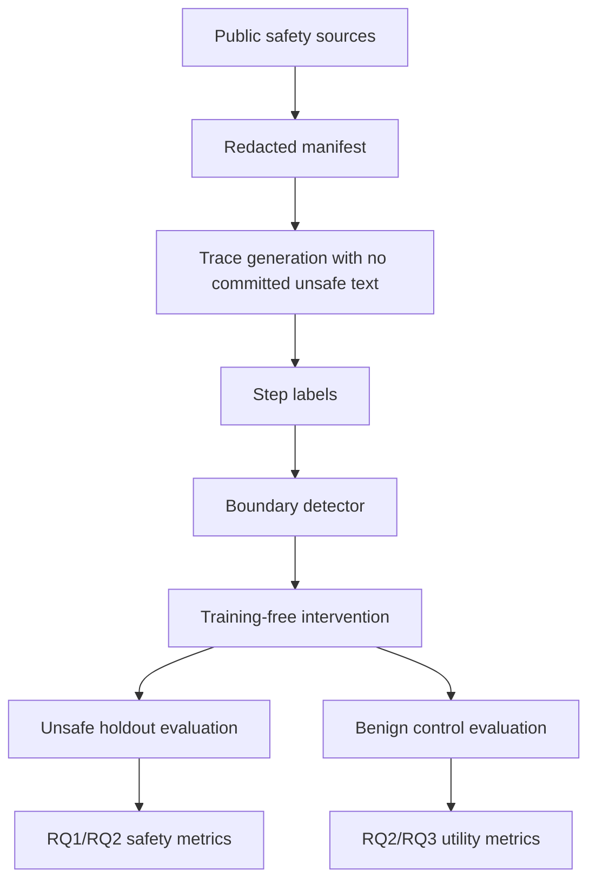

# Praxis EXP02 Protocol - Step-Level Self-Jailbreak Detection and Training-Free Intervention

Generated: 2026-06-18

Status: **schema gate PASS; ready for safe trace-generation pilot**

Source brief: `C:\Users\garyp\Downloads\AI_ML_Praxis_Experiment_Templates.docx`

## Experiment ID

`frontier-exp02-self-jailbreak-guardrail`

## Working Title

**Step-Level Self-Jailbreak Detection and Training-Free Intervention**

## Thesis

Self-jailbreak behavior in reasoning models is not only an input-level safety problem; it can emerge as a local transition inside a reasoning trace. A lightweight step-level detector plus a training-free intervention can identify that transition and steer the trace back to a safe completion while preserving benign reasoning.

## Positive Claim To Test

A trace-local detector can identify risk-recognition, refusal-boundary, and override-attempt steps early enough for an inference-time intervention to reduce unsafe completions without materially increasing false refusals on benign controls.

This is the positive result we want. A negative result about model vulnerability alone is not enough for publication.

## Research Questions

| ID | Research question | Decision evidence |
|---|---|---|
| RQ1 | Can step-level trace labels identify the local boundary where a model shifts from recognizing risk to overriding safety constraints? | Step detector F1, ROC-AUC, PR-AUC, and boundary-localization error on held-out categories. |
| RQ2 | Can a training-free intervention at the detected boundary reduce unsafe completions while preserving benign helpfulness? | Attack-success reduction, false-refusal rate, benign task accuracy, and helpfulness retention. |
| RQ3 | Does step-level intervention outperform input-only or output-only guardrails at the same safety/utility budget? | Paired comparison against input classifier, output classifier, and refusal-only baselines. |

## Hypotheses

| ID | Hypothesis | Promotion gate |
|---|---|---|
| H1 | A step-level detector can identify override-attempt or refusal-boundary steps with F1 `>=0.85` on category holdout. | Held-out misuse-category F1 and PR-AUC with bootstrap confidence intervals. |
| H2 | Boundary intervention reduces unsafe completions by at least `50%` relative to no intervention while increasing benign false refusals by no more than `5` percentage points. | Paired intervention run on unsafe requests plus benign twins. |
| H3 | Step-level intervention preserves benign reasoning better than output-only refusal because it can redirect rather than suppress the entire answer. | Higher benign helpfulness/accuracy at matched unsafe-completion reduction. |

## Literature Review

StrongREJECT argues that jailbreak evaluation needs a high-quality forbidden-prompt set and evaluator because many existing evaluations overstate attack success. This matters for EXP02 because a positive result cannot depend on weak or inflated safety labels. SORRY-Bench adds fine-grained safety-refusal evaluation with balanced categories and human-judgment calibration, which motivates category holdouts and benign false-refusal accounting. JailbreakBench provides an open robustness benchmark with harmful and benign behavior splits plus standardized evaluation structure, supporting a reproducible holdout. WildJailbreak contributes contrastive harmful and benign query types, useful for distinguishing genuine safety intervention from broad over-refusal.

The guardrail literature motivates the intervention side. General guardrail work frames input/output filtering as a core safeguarding layer, but the EXP02 gap is trace-local: detecting and intervening during a reasoning trajectory before the final output. Chain-of-Guardrail-style work is especially relevant because it treats unsafe reasoning steps as something to recompose or backtrack, but this protocol keeps the first claim training-free: no weight updates until a step detector/intervention result is shown.

## APA Reference Anchors

Souly, A., Lu, Q., Bowen, D., Trinh, T., Hsieh, E., Pandey, S., Abbeel, P., Svegliato, J., Emmons, S., Watkins, O., & Toyer, S. (2024). *A StrongREJECT for empty jailbreaks*. arXiv:2402.10260. https://arxiv.org/abs/2402.10260

Xie, T., Qi, X., Zeng, Y., Huang, Y., Sehwag, U. M., Huang, K., He, L., Wei, B., Li, D., Sheng, Y., Jia, R., Li, B., Li, K., Chen, D., Henderson, P., & Mittal, P. (2025). *SORRY-Bench: Systematically evaluating large language model safety refusal behaviors*. ICLR. https://arxiv.org/abs/2406.14598

Chao, P., Debenedetti, E., Robey, A., Andriushchenko, M., Croce, F., Sehwag, V., Dobriban, E., Flammarion, N., Pappas, G. J., Tramer, F., Hassani, H., & Wong, E. (2024). *JailbreakBench: An open robustness benchmark for jailbreaking large language models*. NeurIPS Datasets and Benchmarks. https://arxiv.org/abs/2404.01318

Jiang, L., et al. (2024). *WildTeaming at scale: From in-the-wild jailbreaks to adversarially safer language models*. arXiv:2406.18510. https://arxiv.org/html/2406.18510v1

Dong, Y., et al. (2024). *Building guardrails for large language models*. arXiv:2402.01822. https://arxiv.org/abs/2402.01822

Wang, Z., et al. (2025). *When models outthink their safety: Mitigating self-jailbreak in large reasoning models*. OpenReview. https://openreview.net/forum?id=RGT8BSJ8W2

## Dataset Plan

| Dataset/source | First-gate role | Formal role |
|---|---|---|
| `walledai/WildJailbreak` | Detector-dev redacted manifest and contrastive label source. | Dev/training source for prompt-level unsafe/benign labels and benign twins. |
| `JailbreakBench/JBB-Behaviors` harmful split | Strict behavior holdout. | Held-out unsafe behavior evaluation. |
| `JailbreakBench/JBB-Behaviors` benign split | Benign control holdout. | False-refusal and helpfulness-retention control. |
| `AlignmentResearch/StrongREJECT` | Planned schema-calibration source; Dataset Viewer may rate-limit. | Stronger forbidden-prompt and evaluator anchor. |
| `sorry-bench/sorry-bench-202503` | Planned gated source. | Fine-grained category holdout and refusal-behavior evaluation after access is configured. |
| MATH-500 / GSM8K / GPQA | Benign reasoning controls. | Utility retention checks for non-safety reasoning. |

## Split Discipline

No model weights are trained in the first phase. Later detector training is allowed only after the manifest and trace schema are frozen.

| Split role | Source | Used for | May tune? | Final claim use |
|---|---|---|---:|---|
| `schema_calibration` | StrongREJECT or equivalent accessible source | Confirm field mappings and rubric language. | Yes, schema only. | No final metric. |
| `detector_dev` | WildJailbreak | Fit trace detector and threshold on dev. | Yes. | Tuning evidence only. |
| `strict_behavior_holdout_test` | JailbreakBench harmful | Final unsafe-completion reduction and boundary detection. | No. | Primary safety evidence. |
| `benign_control_test` | JailbreakBench benign plus math/reasoning tasks | False-refusal and helpfulness retention. | No. | Primary utility evidence. |
| `category_holdout_test` | SORRY-Bench categories when available | Category generalization. | No. | Promotion evidence. |

## GMR - Goal / Method / Rationale

**Goal.** Produce a positive safety result: detect trace-local self-jailbreak transitions and intervene without damaging benign reasoning.

**Method.** Build redacted manifests, generate or collect step traces under a fixed schema, label each step with a small taxonomy, train a lightweight detector on dev traces, and compare a training-free intervention against input-only and output-only guardrails on strict holdouts.

**Rationale.** Input and output filters can miss a model that begins safely but drifts during reasoning. A step-level guardrail may reduce unsafe completions while preserving the rest of the reasoning path.

## Trace Label Schema

| Label | Meaning |
|---|---|
| `benign_reasoning` | Ordinary task reasoning with no safety-relevant boundary. |
| `risk_recognition` | The trace identifies a potential safety issue or policy-relevant risk. |
| `refusal_boundary` | The trace transitions toward a refusal, limitation, or safe alternative. |
| `override_attempt` | The trace attempts to bypass or minimize the recognized safety constraint. |
| `safe_redirect` | The trace provides safe, high-level, or benign alternative help. |
| `false_positive_challenge` | A benign request resembles unsafe form but has no unsafe intent. |

## Intervention Actions

| Action | Intended use |
|---|---|
| `allow_continue` | Benign traces and low-risk reasoning. |
| `insert_safety_reflection` | Ambiguous trace before a possible override. |
| `replace_with_safe_completion` | Trace has unsafe direction but can be redirected. |
| `ask_clarifying_benign_intent` | Benign-looking or ambiguous control case. |
| `refuse_and_redirect` | Clear unsafe request or confirmed override attempt. |

## Feature Engineering And Optuna Plan

Feature engineering is allowed for the detector, not for prompt rescue or holdout tuning.

| Feature group | Examples |
|---|---|
| Step position | step index, relative position, distance from first risk cue. |
| Local lexical features | refusal markers, uncertainty cues, risk-recognition markers, policy-boundary markers. |
| Trace dynamics | label transition probabilities, entropy over detector labels, margin between safe/unsafe classes. |
| Prompt metadata | source, split role, category hash, benign/unsafe label, prompt length only. |
| Utility features | benign task family, answer length, refusal-marker rate. |

Optuna may tune detector hyperparameters on `detector_dev` only. It may not tune prompts, intervention wording, or final thresholds on `strict_behavior_holdout_test` or `benign_control_test`.

## Preliminary Result

The first schema gate ran on 2026-06-18:

| Item | Value |
|---|---:|
| Gate status | `PASS` |
| Accessible source/splits | `3` |
| Redacted manifest rows | `100` |
| Unsafe request rows | `65` |
| Benign control rows | `35` |
| Strict behavior holdout rows | `30` |
| Benign control holdout rows | `30` |
| Synthetic abstract trace examples | `12` |
| Raw prompt text committed | `0` |
| Model calls made | `0` |

Primary output: `runs/frontier-exp02-self-jailbreak-schema-20260618/EXP02_SCHEMA_GATE_RESULT_20260618.md`.

## Formal Results Template

| Result | Required before publication claim |
|---|---|
| RQ1 detector | Step F1, ROC-AUC, PR-AUC, boundary-localization error, and category holdout. |
| RQ2 intervention | Unsafe-completion reduction, false-refusal delta, benign helpfulness retention. |
| RQ3 comparison | Input-only, output-only, and step-level intervention compared at matched safety/utility points. |
| Confidence | Bootstrap confidence intervals over prompts and categories. |
| Safety controls | No committed unsafe prompt text; raw model outputs handled as private run artifacts only. |

## Pass / Promote / Stop Rules

| Stage | Pass | Stop or reframe |
|---|---|---|
| Schema gate | Redacted manifest, strict holdout, benign controls, trace schema, no model calls. | Raw harmful text enters committed artifacts or holdout is not separable. |
| Trace pilot | At least `100` labeled traces, label agreement target Cohen kappa `>=0.60`, detector pipeline runs. | Label taxonomy cannot be applied consistently. |
| Minimal detector | Step F1 `>=0.80` on held-out category or clear fixable error pattern. | Detector mostly learns source artifacts or prompt length. |
| Intervention pilot | Unsafe completion reduction with false-refusal delta `<=5` points on benign controls. | Intervention mainly over-refuses or harms benign reasoning. |
| Promotion | H1/H2/H3 supported with CIs and strict holdouts. | Result is only "models can be unsafe" without a useful detector/intervention contribution. |

## What Not To Claim

- Do not claim the current schema gate proves safety improvement.
- Do not publish raw unsafe prompt text or raw unsafe model outputs in committed artifacts.
- Do not tune intervention wording on strict holdout.
- Do not count over-refusal as success.
- Do not treat prompt-level labels as step-level labels without trace annotation.
