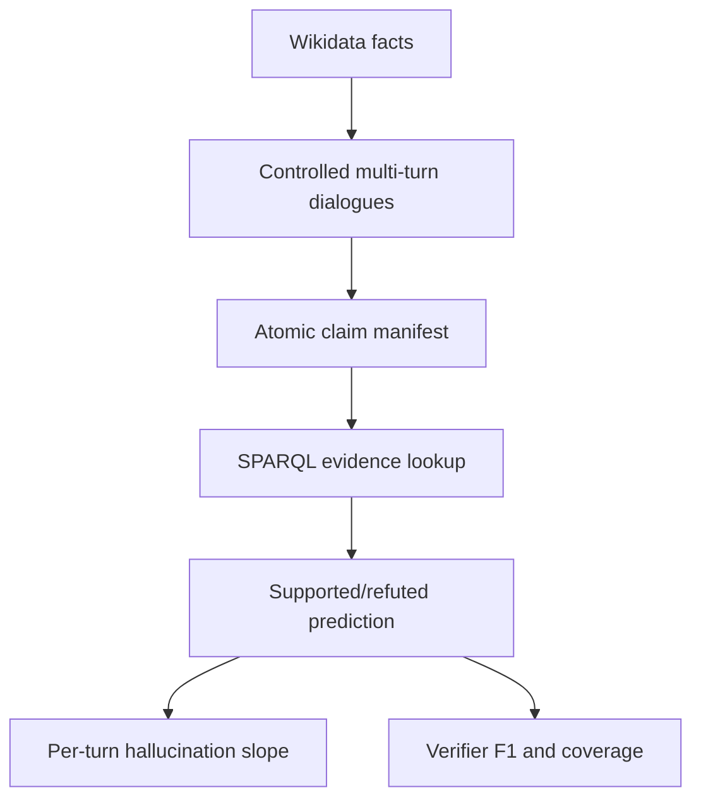

# Praxis EXP04 Protocol - Multi-Turn Hallucination Compounding and KG-Grounded Verification

Generated: 2026-06-19

Status: **active; smoke gate configured**

Source brief: `C:\Users\garyp\Downloads\AI_ML_Praxis_Experiment_Templates.docx`

## Experiment ID

`frontier-exp04-kg-hallucination-verifier`

## Working Title

**KG-Grounded Multi-Turn Hallucination Verifier**

## Thesis

Hallucination compounds across conversational turns when a later answer reuses an earlier unsupported entity or relation. A knowledge-graph-grounded verifier can expose this compounding more reliably than single-turn lexical checks because it evaluates each carried-forward claim against explicit evidence.

## Positive Claim To Test

A structured KG verifier can detect false carried-forward claims in multi-turn factual dialogues with high evidence coverage and higher hallucination-detection F1 than a naive single-turn baseline.

## Research Questions

| ID | Research question | Decision evidence |
|---|---|---|
| RQ1 | Does the hallucination rate increase on later turns when an earlier wrong entity is carried forward? | Per-turn hallucination rates and turn-3 minus turn-1 slope. |
| RQ2 | Can Wikidata-backed verification identify supported versus refuted atomic claims with high coverage? | Evidence coverage, verifier precision/recall/F1, and strict holdout accuracy. |
| RQ3 | Does KG verification outperform a non-evidence baseline? | F1 delta versus an always-supported lexical baseline on strict holdout. |

## Hypotheses

| ID | Hypothesis | Promotion gate |
|---|---|---|
| H1 | Multi-turn carryover increases false-claim rate by at least `0.10` from turn 1 to turn 3 in a controlled dialogue set. | Turn-3 hallucination rate minus turn-1 hallucination rate `>=0.10`. |
| H2 | KG verification reaches evidence coverage `>=0.80` and hallucination-detection F1 `>=0.85` on strict holdout claims. | WDQS evidence coverage, F1 with bootstrap CIs, and no holdout tuning. |
| H3 | KG verification beats a non-evidence always-supported baseline on hallucination-detection F1. | Positive F1 delta on strict holdout. |

## Literature Review

HaluEval motivates hallucination evaluation with generated and human-annotated hallucinated samples and reports that external knowledge can help recognition. FEVER frames claim verification as supported/refuted/not-enough-info over evidence. HotpotQA motivates multi-hop and supporting-fact structure, which is important for later turns that depend on earlier entities. Wikidata Query Service supplies a public SPARQL endpoint for structured evidence.

This EXP04 smoke gate narrows the first claim deliberately: it does not yet evaluate a live model. It first validates that multi-turn atomic claims can be generated, split, and verified against public KG evidence with defensible coverage.

## APA Reference Anchors

Li, J., Cheng, X., Zhao, W. X., Nie, J.-Y., & Wen, J.-R. (2023). *HaluEval: A large-scale hallucination evaluation benchmark for large language models*. EMNLP. https://arxiv.org/abs/2305.11747

Thorne, J., Vlachos, A., Christodoulopoulos, C., & Mittal, A. (2018). *FEVER: A large-scale dataset for fact extraction and verification*. NAACL. https://arxiv.org/abs/1803.05355

Yang, Z., Qi, P., Zhang, S., Bengio, Y., Cohen, W. W., Salakhutdinov, R., & Manning, C. D. (2018). *HotpotQA: A dataset for diverse, explainable multi-hop question answering*. EMNLP. https://arxiv.org/abs/1809.09600

Wikidata Query Service. *User manual and SPARQL endpoint*. https://www.wikidata.org/wiki/Wikidata:SPARQL_query_service/Wikidata_Query_Help

## Dataset Plan

| Dataset/source | First-gate role | Formal role |
|---|---|---|
| Wikidata | Primary KG evidence source for controlled claims. | Evidence backend for atomic claim verification. |
| HaluEval | Availability check and later hallucination-label benchmark. | External hallucination-detection comparison. |
| HotpotQA | Availability check and later multi-hop factual QA source. | Multi-hop dialogue source. |
| HaluBench / FaithEval-style sources | Availability check where accessible. | External domain holdout for grounded hallucination detection. |

## Split Discipline

| Split role | Source | Used for | May tune? | Final claim use |
|---|---|---|---:|---|
| `schema_dev` | First eight controlled dialogues | Validate claim schema and SPARQL parser. | Yes, schema only. | No headline metric. |
| `strict_dialogue_holdout` | Remaining twelve controlled dialogues | Primary smoke metrics. | No. | Yes, smoke result. |
| `external_dataset_holdout` | HaluEval/HotpotQA/HaluBench when configured | External validity. | No. | Later promotion only. |

## GMR - Goal / Method / Rationale

**Goal.** Build a defensible factuality experiment that measures whether unsupported facts compound over turns and whether KG evidence can detect them.

**Method.** Generate controlled multi-turn dialogues from Wikidata country/capital/location triples, inject entity carryover errors, atomize each turn into one structured claim, verify each claim with SPARQL, and compare KG predictions against expected supported/refuted labels and a baseline.

**Rationale.** A model can appear locally fluent while propagating an earlier wrong entity into later answers. KG verification gives a transparent evidence path for each carried-forward claim before moving to live-model generation.

## Feature Engineering Plan

| Feature group | Examples |
|---|---|
| Claim structure | subject QID, property PID, object QID, turn index, dependency flag. |
| Dialogue dynamics | whether a prior turn was false, propagated entity, turn depth. |
| KG evidence | exact triple match, alternative objects for same property, evidence coverage. |
| Baselines | always-supported baseline and later text-only NLI/LLM judge baselines. |

Optuna is not needed for the smoke gate. Later detector tuning may optimize thresholds only on `schema_dev` or a separate validation split, never on strict holdout.

## Results Gates

| Stage | Pass | Stop or reframe |
|---|---|---|
| Smoke schema | At least `20` dialogues, `60` atomic claims, strict holdout `>=24` rows. | Claim schema cannot preserve turn dependency or KG identifiers. |
| KG coverage | Evidence coverage `>=0.80`. | WDQS/entity linking leaves too many claims unverifiable. |
| Verifier smoke | Hallucination F1 `>=0.85` and positive F1 delta over baseline. | KG verifier mostly returns unknown or cannot distinguish refuted claims. |
| Promotion | Add live-model generations and external HaluEval/HotpotQA holdouts with CIs. | Result remains only a synthetic KG exercise. |

## What Not To Claim

- Do not claim this smoke gate proves live LLM hallucination reduction.
- Do not claim Wikidata has complete coverage for all factual domains.
- Do not treat controlled false claims as human-written hallucinations.
- Do not tune entity mappings on strict holdout.
