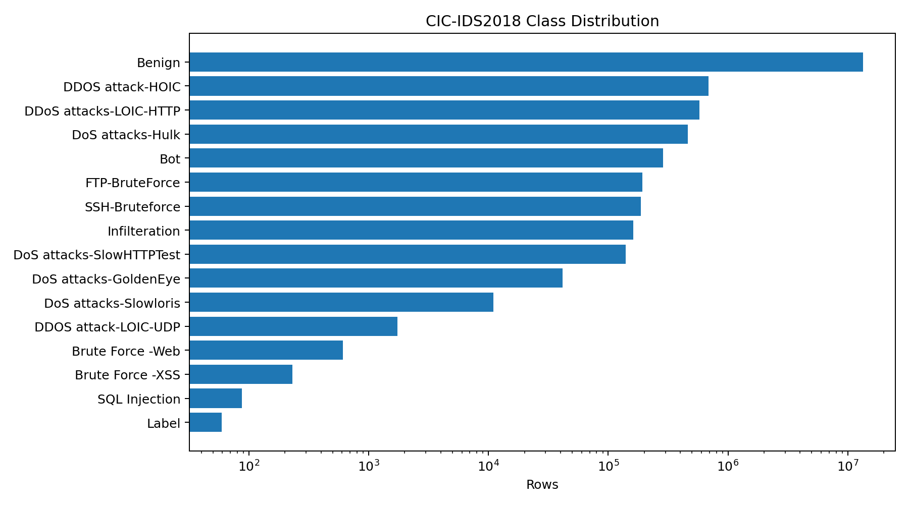
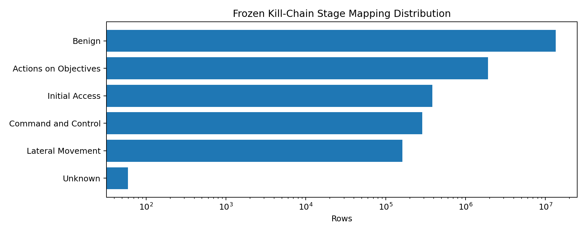
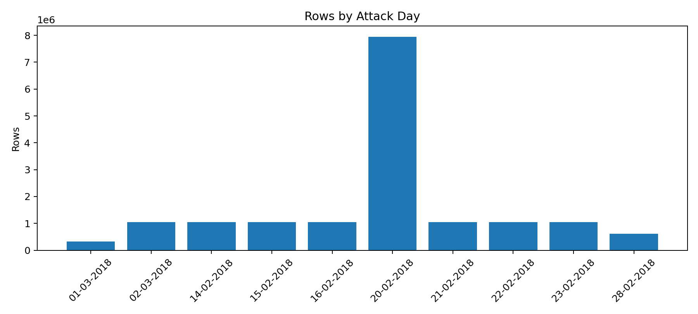
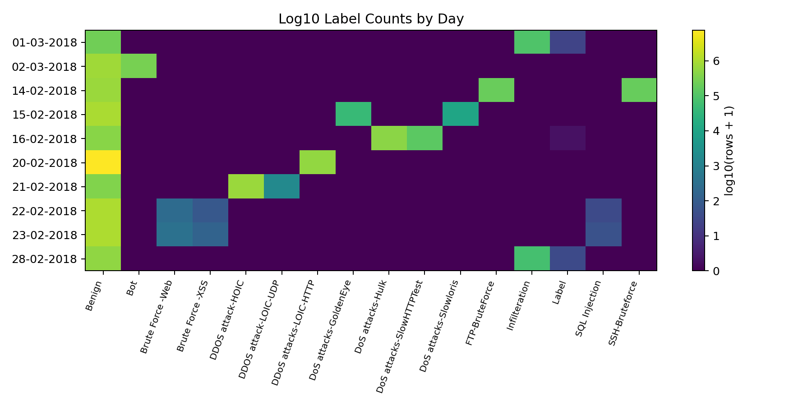
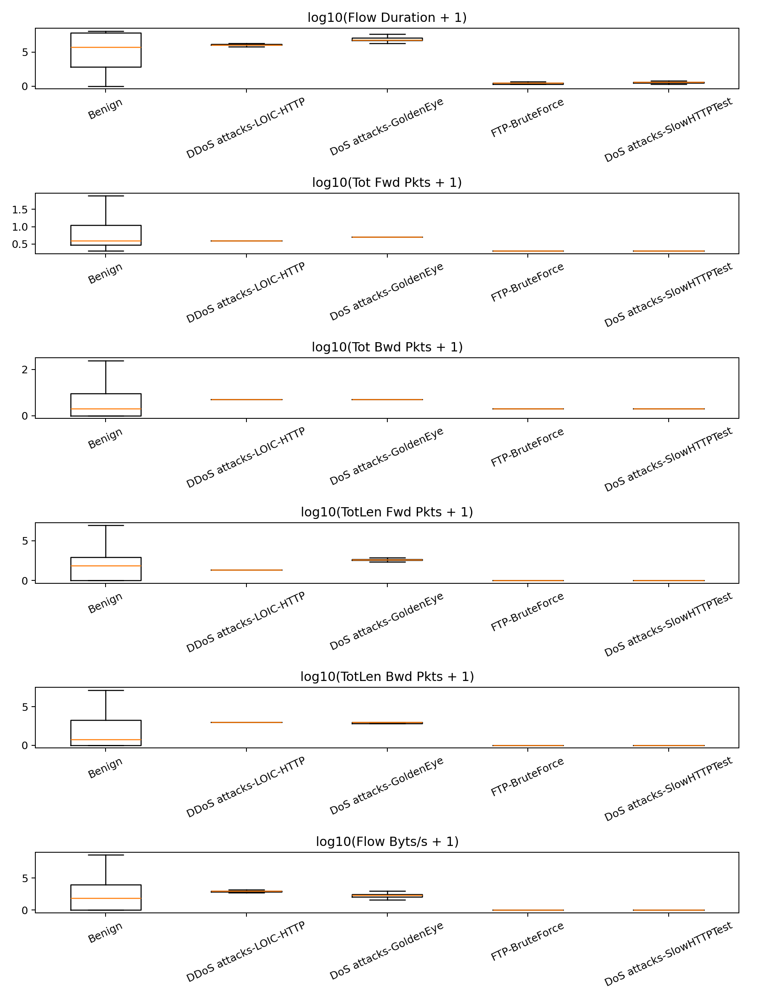
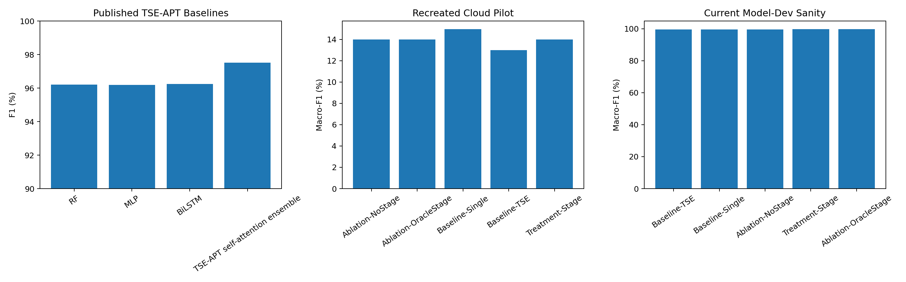

# Praxis 04 Full Run Report

Version: generated from local repo artifacts.

## 1. Dataset Evaluation / EDA

Dataset: CSE-CIC-IDS2018 processed flow CSVs. The raw data source is the Canadian Institute for Cybersecurity / CSE CIC-IDS2018 dataset hosted as AWS Open Data. The current local EDA found:

- Files: 10
- Rows: 16233002
- Attack labels: 16
- Frozen kill-chain stages: 6

Figures:

- 
- 
- 
- 
- 

Code explanation:

- `scripts/eda_praxis04.py` reads every CSV in chunks, discovers the label column, counts labels by day, applies the frozen stage mapping, and writes both CSV tables and PNG figures.
- `src/praxis/praxis04/stage_mapper.py` is the audit point for the deterministic ATT&CK / kill-chain mapping.
- `src/praxis/praxis04/data_loader.py` performs numeric coercion, known-bad-row filtering, temporal splitting, optional uniform sampling, and optional support-floor movement for model-development runs.

Key dataset finding:

The CIC-IDS2018 files are strongly day- and label-confounded. A strict holdout of `Friday-02-03-2018` puts `Bot` in test while the early pilot had no `Bot` support in train or router validation. That makes the strict pilot useful as a hard generalization stress test, but not sufficient for tuning a multi-class router. For model development we added explicit support-floor settings, and they are written into the run summary so the decision is auditable.

## 2. Feature and Resampling Decisions

Feature handling:

- We use numeric CICFlowMeter columns only.
- Non-numeric identifiers such as IPs, flow IDs, timestamps, and source filenames are excluded to reduce leakage risk.
- Infinite values, NaNs, and known bad negative initial window byte rows are dropped.
- Features are standardized after the train/validation/test split.

Resampling decision:

- The current reproducible path does **not** use SMOTE by default. For this network-flow setting, SMOTE can create synthetic flow vectors that are hard to defend semantically.
- Instead, the model-dev config uses tiny real-row support floors: `min_train_rows_per_label` and `min_val_rows_per_label`.
- Class imbalance is also handled in RF by class weights and in the router by balanced class weighting / Macro-F1 initialization.
- SMOTE can be added as a later ablation, but it should be reported as synthetic oversampling, not silently folded into the main result.

## 3. Published TSE-APT Baseline

Wu et al. report the following combined CIC-IDS2018 results for their TSE-APT pipeline:

|model|accuracy|precision|recall|f1|fpr|source|
|---|---|---|---|---|---|---|
|RF|96.2300|98.4200|94.1100|96.2000|1.1700|Wu et al. 2025 TSE-APT Table 4|
|MLP|96.3300|98.2000|93.4500|96.1900|0.5800|Wu et al. 2025 TSE-APT Table 4|
|BiLSTM|96.7800|98.9300|94.0600|96.2500|0.7700|Wu et al. 2025 TSE-APT Table 4|
|TSE-APT self-attention ensemble|97.3200|99.2600|96.2300|97.5100|0.6900|Wu et al. 2025 TSE-APT Table 6|

Important comparability note:

These are paper-reported percentage metrics. Our current pipeline reports Macro-F1 over the frozen label set and temporally held-out splits, so the numbers below are not direct claims of superiority over the paper until the full preregistered run is completed.

## 4. Recreated Runs and Current Experiment Numbers

Final results chart:



### Recreated GitHub Actions Cloud Pilot

This was the first automated cloud pilot before the model-dev router/sampling fixes:

|config_name|model|macro_f1_mean|macro_f1_std|seeds|run_family|
|---|---|---|---|---|---|
|praxis04-pilot-ablation-nostage|Ablation-NoStage|0.1398|0.0220|5|GitHub Actions cloud pilot, 10k head sample/file, pre-router-fix|
|praxis04-pilot-ablation-oraclestage|Ablation-OracleStage|0.1398|0.0220|5|GitHub Actions cloud pilot, 10k head sample/file, pre-router-fix|
|praxis04-pilot-baseline-single|Baseline-Single|0.1497|0.0000|5|GitHub Actions cloud pilot, 10k head sample/file, pre-router-fix|
|praxis04-pilot-baseline-tse|Baseline-TSE|0.1298|0.0271|5|GitHub Actions cloud pilot, 10k head sample/file, pre-router-fix|
|praxis04-pilot-treatment-stage|Treatment-Stage|0.1398|0.0220|5|GitHub Actions cloud pilot, 10k head sample/file, pre-router-fix|

Key finding:

Treatment-stage, no-stage, and oracle-stage collapsed together in this pilot. That was a useful negative debugging signal: the router was not getting meaningful stage leverage and the head-sampled pilot did not exercise enough rare-stage structure.

### Current Model-Dev Sanity Run

This local sanity run uses a 5k head sample per file, support floors, and Macro-F1 calibrated router priors:

|config_name|model|seed|macro_f1|router_entropy_mean|expert_RF_macro_f1|expert_MLP_macro_f1|expert_BiLSTM_macro_f1|expert_oracle_per_sample_expert_macro_f1|
|---|---|---|---|---|---|---|---|---|
|praxis04-modeldev-support-v6-ablation-nostage|Ablation-NoStage|13|0.9961|0.0896|0.9956|0.6635|0.1226|0.9987|
|praxis04-modeldev-support-v6-ablation-oraclestage|Ablation-OracleStage|13|0.9983|0.4635|0.9956|0.6635|0.1226|0.9987|
|praxis04-modeldev-support-v6-baseline-single|Baseline-Single|13|0.9956|0.0000|0.9956||||
|praxis04-modeldev-support-v6-baseline-tse|Baseline-TSE|13|0.9956|0.0092|0.9956|0.6635|0.1226|0.9987|
|praxis04-modeldev-support-v6-treatment-stage|Treatment-Stage|13|0.9974|0.3504|0.9956|0.6635|0.1226|0.9987|

Key finding:

The per-sample expert oracle is only slightly above RF in the current sanity run. That means the biggest bottleneck is expert diversity, not just routing. The stage router can only improve when at least one non-RF expert is better for a subset of stages/classes.

## 5. Optuna Tuning Plan

Smoke run:

```powershell
.\.venv\Scripts\python.exe scripts\run_praxis04_optuna.py --base-config configs\praxis04-representative-pilot.json --n-trials 12 --seed 13 --output-root runs\praxis04-optuna-smoke
```

Search space:

|parameter|range|
|---|---|
|rf_n_estimators|int[24, 160], step=8|
|rf_max_depth|categorical[8, 12, 16, 24, null]|
|mlp_hidden_layers|categorical[[64], [128], [128, 64], [256, 128]]|
|mlp_max_iter|int[30, 150], step=10|
|bilstm_hidden_dim|categorical[8, 16, 32, 64]|
|bilstm_epochs|int[1, 6]|
|router_init_metric|categorical[macro_f1, nll]|
|router_init_temperature|log_float[0.02, 0.50]|
|router_stage_scale|float[0.5, 4.0]|
|router_epochs|categorical[0, 10, 30, 60]|
|min_train_rows_per_label|categorical[0, 25, 50, 100]|
|min_val_rows_per_label|categorical[0, 10, 25, 50]|

Code explanation:

- `scripts/run_praxis04_optuna.py` performs single-seed Optuna tuning on the representative pilot.
- The objective is Macro-F1.
- Each trial writes full Praxis metrics into `runs/praxis04-optuna/trial_*/metrics.json`.
- `tuning_space.json`, `trials.csv`, and `best_trial.json` are emitted for reproducibility.

Completed 12-trial smoke, top trials:

|trial|macro_f1|rf_n_estimators|rf_max_depth|mlp_hidden_layers|router_init_metric|router_epochs|min_train_rows_per_label|min_val_rows_per_label|
|---|---|---|---|---|---|---|---|---|
|11|0.6634|152|12.0000|[128]|nll|0|100|0|
|10|0.6634|160|12.0000|[128]|nll|0|100|0|
|0|0.6590|128|24.0000|[128]|nll|0|100|25|
|7|0.6585|56|24.0000|[256, 128]|nll|30|100|50|
|5|0.4925|144|24.0000|[128, 64]|macro_f1|30|100|10|
|3|0.4907|32||[128, 64]|nll|30|25|10|
|9|0.4869|96|16.0000|[128]|nll|60|50|10|
|8|0.2807|40||[128]|nll|60|0|10|

Best smoke summary:

|best_trial|best_value|router_macro_f1|expert_RF_macro_f1|expert_MLP_macro_f1|expert_BiLSTM_macro_f1|expert_oracle_per_sample_macro_f1|stage_classifier_test_accuracy|router_entropy_mean|
|---|---|---|---|---|---|---|---|---|
|10|0.6634|0.6634|0.6428|0.6650|0.4941|0.6650|0.7384|1.0985|

Key tuning finding:

- The best two trials converged on the same score (`0.6634`) with strong RF settings, `nll` router initialization, `router_epochs=0`, and `min_train_rows_per_label=100`.
- Trials with `min_train_rows_per_label=0` consistently collapsed, confirming that rare-label train support is a core model-development decision rather than a cosmetic preprocessing choice.
- In the best trial, MLP (`0.6650` Macro-F1) slightly outperformed RF (`0.6428` Macro-F1), and the per-sample expert oracle was `0.6650`. That means there is some expert complementarity, but the router is still not beating the best single expert.
- This smoke tuned against final pilot Macro-F1, so it is **not** a preregistered result. It is a model-development artifact used to choose a candidate config for the next 5-seed pilot.

## 6. Full Repeatable Run

Representative pilot:

```powershell
.\.venv\Scripts\python.exe scripts\run_praxis04_local_pilot.py --base-config configs\praxis04-representative-pilot.json --output-root runs\praxis04-representative-pilot
.\.venv\Scripts\python.exe scripts\analyze_praxis04.py --results-dir runs\praxis04-representative-pilot --output runs\praxis04-representative-pilot\praxis04_headline_table.csv
```

Smoke-tuned 5-seed pilot:

```powershell
.\.venv\Scripts\python.exe scripts\run_praxis04_local_pilot.py --base-config configs\praxis04-tuned-stage-router-smoke.json --output-root runs\praxis04-tuned-stage-router-smoke-5seed
.\.venv\Scripts\python.exe scripts\analyze_praxis04.py --results-dir runs\praxis04-tuned-stage-router-smoke-5seed --output runs\praxis04-tuned-stage-router-smoke-5seed\praxis04_headline_table.csv
```

Strict preregistered full run:

```powershell
.\scripts\run_praxis04_all.ps1 -Python .\.venv\Scripts\python.exe -Full
```

SageMaker repeatable path:

```bash
python3 scripts/submit_praxis04_sagemaker.py \
  --region "$AWS_REGION" \
  --instance-type ml.g5.2xlarge \
  --volume-size 250 \
  --wait
```

## 7. Experiment Steps

1. Download CSE-CIC-IDS2018 processed CSVs and write SHA-256 manifest.
2. Run EDA and verify class/day/stage imbalance.
3. Freeze ATT&CK / kill-chain mapping before training.
4. Train RF, MLP, and BiLSTM experts.
5. Generate expert probability outputs for train/validation/test.
6. Train or initialize global TSE-style router on validation expert outputs.
7. Train or initialize stage-conditioned router with predicted or oracle stage signals.
8. Run ablations: no-stage random signal and oracle-stage upper bound.
9. Aggregate Macro-F1, per-class F1, AUPRC, FPR@95 benign recall, router entropy, and expert diagnostics.
10. Use paired bootstrap across seeds for treatment-vs-baseline comparisons.

## 8. Current Interpretation

- The original pilot was under-informative because the router and sampling setup hid the stage effect.
- The revised model-dev path makes the stage signal auditable and keeps strict-vs-support-floor behavior explicit.
- The 12-trial Optuna smoke found expert complementarity: MLP slightly beat RF on the tuned representative pilot, but the stage router still did not beat the best single expert.
- The next run should be the smoke-tuned 5-seed pilot. If treatment-stage does not beat Baseline-TSE and the best single expert across seeds, the research direction should shift toward improving expert diversity before the full preregistered run.

## 9. References

- Wu et al., TSE-APT, MDPI Electronics 14(15), 2025: https://www.mdpi.com/2079-9292/14/15/2924
- CSE-CIC-IDS2018 AWS Open Data: https://registry.opendata.aws/cse-cic-ids2018/
- CIC IDS 2018 dataset page: https://www.unb.ca/cic/datasets/ids-2018.html
