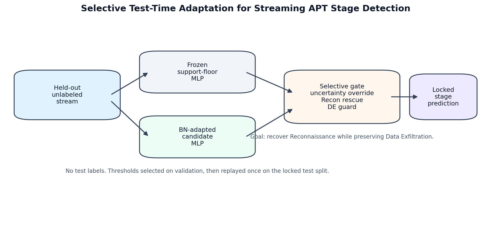

# Selective Test-Time Adaptation for Streaming APT Stage Detection Under Source-File Shift

Generated: 2026-05-12

Status: manuscript draft for Praxis 06 defense package.

## Abstract

Advanced persistent threat detectors often degrade when deployed across capture sources, days, and host/network conditions that differ from their training distribution. In a prior stage-conditional routing study, oracle stage information suggested room for rare-stage improvement, but predicted-stage routing failed under realistic held-out shift. This paper tests a different intervention: selective test-time adaptation for streaming APT stage detection. We adapt batch-normalization behavior at inference time and apply a conservative validation-selected gate that protects high-confidence Data Exfiltration predictions while allowing targeted recovery of uncertain or likely Reconnaissance rows. On a held-out source-file split with no train/validation/test source overlap, the locked policy improves mean Macro F1 from `0.7685` to `0.8658` and Reconnaissance F1 from `0.0250` to `0.5050`, while Data Exfiltration F1 changes from `0.9157` to `0.9202`. PR-AUC changes only from `0.8732` to `0.8738`, so the contribution is framed as a selective operating-point improvement rather than a claim that the underlying ranking representation substantially improves. Only `4.7%` of test rows are overridden. A matched-rate frozen confidence-rejection baseline leaves Reconnaissance F1 at `0.0000`, indicating that the gain is not explained by simply filtering uncertain frozen predictions. The result supports a narrow and defensible claim: selective no-label adaptation can recover a shifted rare APT stage when constrained by validation-selected safety guards.

## 1. Introduction

Advanced persistent threat detectors are usually evaluated as if the deployment distribution were a stable extension of the training distribution. In practice, this assumption is fragile. A detector trained on one set of capture sources, days, or host/network conditions may face a test stream whose rare-stage behavior is shifted enough that the model remains accurate on common or high-confidence behavior while collapsing on strategically important minority stages. This is not a minor benchmark nuisance for APT detection. Distribution shift is part of the operating environment.

Our earlier stage-conditional routing experiment exposed this problem directly. In that study, an oracle-stage router suggested that stage information could sometimes improve rare-stage behavior, but a predicted-stage router failed under realistic held-out conditions. The failure mode was not simply that the wrong submodel had been selected. The bottleneck was that stage predictions and rare-stage representations did not survive deployment-style shift.

This paper therefore asks a different question: can an APT detector adapt at inference time, without labels or retraining, while preserving high-consequence stage behavior?

We study selective test-time adaptation for streaming APT stage detection. The frozen detector is a support-floor MLP trained on the trusted Unraveled feature pipeline. At test time, we adapt batch-normalization behavior over the unlabeled stream and apply a conservative validation-selected gate. The gate is intentionally asymmetric: it permits targeted recovery of uncertain or likely Reconnaissance rows, but protects confident Data Exfiltration predictions from being overwritten. This design reflects a security constraint rather than a generic classification objective. Improving a rare class is not acceptable if it damages a high-consequence stage.

The locked final replay improves Macro F1 from `0.7685` to `0.8658` and Reconnaissance F1 from `0.0250` to `0.5050`. Data Exfiltration F1 changes from `0.9157` to `0.9202`, and only `4.7%` of test rows are overridden. A matched-rate frozen confidence-rejection baseline does not explain the result: rejecting the same fraction of low-confidence frozen predictions leaves Reconnaissance F1 at `0.0000`.

This result is not a claim that test-time adaptation universally solves APT detection. It is a deployment-realistic proof point for one important bottleneck: rare-stage collapse under source-level shift.

## 2. Contributions

1. We formulate no-label test-time adaptation for streaming APT stage detection under source-file held-out deployment shift.
2. We introduce a conservative hybrid gate that combines batch-normalization adaptation with explicit Data Exfiltration protection.
3. We show a locked final result with Macro F1 `0.8658`, Reconnaissance F1 `0.5050`, Data Exfiltration F1 `0.9202`, PR-AUC `0.8738`, and override rate `0.0470`.
4. We compare against a matched-rate frozen confidence-rejection baseline, which fails to recover Reconnaissance.
5. We connect the positive result to the prior negative stage-routing result, reframing the bottleneck as deployment-time adaptation rather than predicted-stage routing.

## 3. Background And Motivation

APT stage detectors are attractive because they promise more than binary intrusion detection: they can tell an analyst whether the observed behavior resembles Reconnaissance, Establish Foothold, Lateral Movement, or Data Exfiltration. This additional structure also creates a harder deployment problem. Stage support is imbalanced, and rare stages may be the ones most likely to shift across capture conditions.

Praxis 04 tested whether stage-conditioned routing could exploit predicted kill-chain stage to select a better downstream submodel. The main treatment failed: the Treatment-Stage Macro F1 was `0.5981` versus `0.6313` for the baseline. However, an oracle-stage pivot suggested that some rare-stage recovery was possible if the shift bottleneck could be addressed. Selective test-time adaptation is therefore motivated by the negative result: rather than route on a brittle predicted stage, adapt the detector's behavior at deployment time under strict safety constraints.

## 4. Problem Formulation

Let `f_theta` be a frozen multiclass APT stage detector trained before deployment. At test time the model receives an unlabeled stream `x_1, ..., x_n` from held-out capture sources. The detector must produce stage predictions without using test labels and without retraining on labeled target data.

The objective is not simply to maximize overall accuracy. The target is to improve Macro F1 and Reconnaissance F1 while preserving Data Exfiltration F1. The adaptation policy is selected on validation data only and then replayed once on the locked test split.

## 5. Method

Figure 1 summarizes the evaluation flow.

### 5.1 Frozen Detector

The frozen detector is the support-floor MLP from the trusted Unraveled ablation lineage, using the `adasyn_weighted_ce` recipe family. It provides baseline predictions, confidence values, and high-confidence Data Exfiltration guard decisions.

### 5.2 Split

The evaluation uses a held-out source-file split designed to approximate deployment shift. Train, validation, and test source files are disjoint, with zero source overlap across splits. Temporal delta features are reset within each split so that cross-split temporal state cannot leak from training into validation or test.

| Split | Rows | Source Files | Capture Days | Benign | Reconnaissance | Establish Foothold | Lateral Movement | Data Exfiltration |
| --- | --- | --- | --- | --- | --- | --- | --- | --- |
| `train` | `307733` | `142` | `25` | `268710` | `5151` | `15047` | `15748` | `3077` |
| `val` | `61886` | `6` | `1` | `22011` | `23791` | `5784` | `8047` | `2253` |
| `test` | `65869` | `25` | `5` | `47888` | `5852` | `6287` | `3650` | `2192` |

Leakage checks:

| Check | Overlap |
| --- | --- |
| `train_test` | `0` |
| `train_val` | `0` |
| `val_test` | `0` |

### 5.3 Test-Time Adaptation

The selected adaptation method is `bn_adapt`. During inference, batch-normalization behavior is adapted over the unlabeled evaluation stream. No test labels are used, and the classifier is not retrained on labeled target examples.

The locked replay uses a single pass over the evaluation stream with batch size `4096`. The stream is consumed in dataframe order through `DataLoader(..., shuffle=False)`. The model is put in evaluation mode, then only `BatchNorm1d` modules are toggled to train mode so their running statistics update; dropout remains disabled. The MLP uses PyTorch `BatchNorm1d` defaults, including the default momentum value, and the model state is reloaded from the frozen checkpoint before each split/method evaluation.

### 5.4 Selective Hybrid Gate

Naive adaptation can improve one stage while damaging another. The hybrid gate therefore does not blindly replace frozen predictions. It compares frozen and adapted predictions under validation-selected thresholds and applies three constraints:

- preserve confident frozen Data Exfiltration predictions;
- allow overrides on uncertain frozen predictions;
- allow Reconnaissance rescue only when the adapted prediction is sufficiently confident.

The locked policy is `recon_guarded` with `bn_adapt` and a Data Exfiltration delta guard of `0.05`. Per-seed validation thresholds were selected before final replay:

| Seed | Uncertainty threshold | Recon rescue threshold | DE keep threshold |
|---:|---:|---:|---:|
| 42 | `0.5` | `0.5` | `0.0` |
| 43 | `0.5` | `0.4` | `0.0` |
| 44 | `0.5` | `0.5` | `0.0` |

### 5.5 Locked Replay Protocol

After policy selection, the final replay reruns the locked policy without a new broad threshold sweep. This prevents test-set tuning. Final metrics are averaged across seeds `42`, `43`, and `44`.

## 6. Results

### 6.1 Main Locked Result

| Method | Macro F1 | Recon F1 | DE F1 | PR-AUC | Override/Reject Rate |
| --- | --- | --- | --- | --- | --- |
| `Frozen MLP` | `0.7685` | `0.0250` | `0.9157` | `0.8732` | `0.0000` |
| `Locked selective TTA` | `0.8658` | `0.5050` | `0.9202` | `0.8738` | `0.0470` |
| `Frozen confidence reject` | `0.7730` | `0.0000` | `0.9374` | `0.8533` | `0.0470` |

The locked policy improves Macro F1 by `+0.0974` and Reconnaissance F1 by `+0.4800`. Data Exfiltration F1 is not harmed in the mean result.

PR-AUC changes by only `+0.0006`. This is important for interpretation: the locked TTA result should not be described as the model learning a broadly better Reconnaissance representation or substantially improving probability ranking. The positive result is a decision-policy result. BatchNorm adaptation plus the validation-selected gate moves a small number of rows to a better operating point for Reconnaissance while retaining the frozen detector for most of the stream.

### 6.2 Per-Seed Locked Result

| Seed | Macro F1 | Recon F1 | DE F1 | PR-AUC | Override Rate | Macro Delta | Recon Delta | DE Delta |
| --- | --- | --- | --- | --- | --- | --- | --- | --- |
| `42` | `0.8821` | `0.5978` | `0.9177` | `0.8584` | `0.0593` | `0.1010` | `0.5264` | `-0.0088` |
| `43` | `0.8614` | `0.4776` | `0.9181` | `0.8925` | `0.0407` | `0.0951` | `0.4763` | `-0.0163` |
| `44` | `0.8539` | `0.4397` | `0.9246` | `0.8704` | `0.0409` | `0.0960` | `0.4372` | `0.0386` |

Every seed improves Macro F1 and Reconnaissance F1. Data Exfiltration F1 stays within the predeclared guard: two seeds show small negative deltas, and one seed improves.

### 6.3 Confidence-Reject Explanation Check

| method | coverage_mean | actual_reject_rate_mean | kept_macro_f1_mean | kept_recon_f1_mean | kept_de_f1_mean |
| --- | --- | --- | --- | --- | --- |
| `frozen_confidence_reject_matched_override_rate` | `0.9530` | `0.0470` | `0.7730` | `0.0000` | `0.9374` |

The matched-rate reject baseline does not recover Reconnaissance. The TTA gain is therefore not explained by simply removing low-confidence frozen predictions.

### 6.4 Override Sensitivity

| override_bin | rows | macro_mean | recon_mean | de_mean | val_macro_mean |
| --- | --- | --- | --- | --- | --- |
| `<=2%` | `108` | `0.7901` | `0.1282` | `0.9206` | `0.7313` |
| `2-5%` | `519` | `0.8288` | `0.3437` | `0.8961` | `0.7327` |
| `5-8%` | `648` | `0.8496` | `0.4926` | `0.8604` | `0.7288` |
| `8-12%` | `387` | `0.8254` | `0.4849` | `0.7846` | `0.6938` |
| `>12%` | `930` | `0.7699` | `0.5044` | `0.6463` | `0.6190` |

The selected policy sits near the conservative region: enough override to recover Reconnaissance, but far below the region where Data Exfiltration behavior degrades sharply.

### 6.5 Reproducibility Audit

The AWS/local audit compared local and AWS `summary_mean_std.csv` artifacts. The maximum absolute metric delta was `0.0000056058`, entirely from PR-AUC floating-point variation. Headline F1, accuracy, and override-rate metrics matched within the audit tolerance.

### 6.6 Defense-Hardening Addendum

A 2026-05-13 cloud hardening run trained four additional locked-recipe seeds (`45`-`48`) and replayed the same `recon_guarded` / `bn_adapt` policy family without using a new broad threshold search. The original locked seeds (`42`-`44`) remain the primary result and keep their validation-selected thresholds. Extra seeds use a fixed canonical extension: uncertainty threshold `0.50`, Reconnaissance rescue threshold `0.50`, and Data Exfiltration keep threshold `0.00`.

Across all seven seeds, locked selective TTA has mean Macro F1 `0.8477 +/- 0.0226`, Reconnaissance F1 `0.5147 +/- 0.0589`, Data Exfiltration F1 `0.8263 +/- 0.1220`, PR-AUC `0.8410 +/- 0.0404`, and override rate `0.0572 +/- 0.0200`. Mean deltas versus each seed's frozen detector remain positive: Macro F1 `+0.1089`, Reconnaissance F1 `+0.4688`, and Data Exfiltration F1 `+0.0728`. Two of seven seeds have negative Data Exfiltration deltas, both from the original locked set and both within the declared guard (`-0.0088`, `-0.0163`).

This hardening result strengthens the Reconnaissance recovery claim but also exposes a useful caveat: the extra frozen detectors have much more variable Data Exfiltration quality than the original locked three-seed set. The paper should present the original locked replay as the primary defense-grade result and the seven-seed run as a robustness addendum showing that the selective TTA effect persists while source-detector variance remains a real limitation.

The same hardening pass also tested validation-distribution sensitivity by downsampling validation to test-like Reconnaissance proportions (`~8.9%` rather than the original validation split's Recon-heavy mix). Across the seven-seed grid, the two test-like validation subsamples selected policies with mean test Macro F1 `0.8335` and `0.8428`, and mean test Reconnaissance F1 `0.4397` and `0.4858`. The result mostly survives but is not perfectly stable: one original seed selected a stricter Reconnaissance threshold under one subsample and lost much of the Reconnaissance recovery. This should be reported as a limitation and as evidence that the validation distribution matters.

The BN stream-order ablation shuffled the test stream before BatchNorm adaptation and then restored row order for evaluation. On the original locked seeds, shuffled BN adaptation still improves over frozen but weakens the result: Macro F1 `0.8352`, Reconnaissance F1 `0.3364`, and Data Exfiltration F1 `0.9293`. This suggests the result is not purely an order artifact, but the chronological/dataframe stream order contributes to the strength of the Reconnaissance recovery.

## 7. Discussion

The result is strong because it is small and targeted. The policy changes only `4.7%` of test rows, yet it recovers a large rare-stage failure. That pattern is easier to defend than a broad adaptation procedure that rewrites most predictions and risks accidental test-set fitting.

The result should also be framed narrowly. It does not show that TTA solves every APT deployment shift. It shows that a conservative, validation-selected adaptation policy can recover a particular rare-stage collapse while preserving a high-consequence stage under held-out source-file shift.

The confidence-reject baseline is essential. Without it, the result could be mistaken for a trivial artifact of avoiding uncertain rows. The matched-rate reject check fails to recover Reconnaissance, which supports the interpretation that adapted predictions are carrying useful rare-stage signal.

## 8. Threats To Validity

- The main positive result is on one dataset family and one trusted feature pipeline.
- The locked result currently uses three seeds, not a larger multi-seed sweep.
- Stage labels depend on the local mapping and should be documented in the appendix.
- BN adaptation assumes the evaluation stream has enough stable structure for test-time statistics to help rather than hurt.
- Held-out source-file shift is a deployment proxy, not live SOC deployment.
- Attackers could attempt to manipulate the adaptation stream.
- Cross-dataset generality is not yet proven. DAPT2020 and CIC-IDS2018 replication should be treated as external-validity checks, not prerequisites for reporting the locked result.

## 9. External-Validity Note: DAPT2020 Detector Recipe

As an appendix-level external-validity check on the detector recipe, we ran the same MLP + targeted ADASYN + weighted cross-entropy family on DAPT2020. Across three seeds it reached Macro F1 `0.6353 +/- 0.0043`, ROC-AUC `0.9723 +/- 0.0021`, and Reconnaissance F1 `0.8932 +/- 0.0089`.

We then ran a true DAPT TTA feasibility gate using the same frozen DAPT MLP checkpoints. BatchNorm-stat adaptation and a small TENT sweep were negative: validation selected `tent_lr_0.0001`, but on test it reduced Macro F1 by `0.2874`, Reconnaissance F1 by `0.6589`, and PR-AUC by `0.2923` relative to frozen.

This result should not be presented as a TTA replication. DAPT supports only the narrower claim that the detector recipe can run competitively on a second APT-flow dataset. It does not support cross-dataset TTA generality. Data Exfiltration conclusions are also unsupported on DAPT2020 because the validation and test splits each contain only `2` Data Exfiltration examples.

A lightweight feature-shift diagnostic suggests a plausible mechanism boundary. On Unraveled, train-to-test feature-scale shift is moderate in the scaled feature space: median absolute log standard-deviation ratio is `0.1192`, with `11` of `67` features exceeding a twofold standard-deviation ratio. On DAPT2020, the median train-to-test scale shift is also small, but the tail is extreme: p90 absolute log standard-deviation ratio is `26.9379`, with `16` of `82` features exceeding a twofold ratio. This supports, but does not prove, the hypothesis that BN adaptation helps when target-stream feature scales are compatible with the source-trained normalization layers and can hurt when a small set of features undergoes extreme scale mismatch or unstable batch composition.

Artifacts: `reports/tta_streaming_apt/DAPT2020_EXTERNAL_VALIDITY_NOTE_20260512.md` and `reports/tta_streaming_apt/DAPT2020_TTA_FEASIBILITY_GATE_20260512.md`.

## 10. Conclusion

Praxis 04 showed that predicted-stage routing was not enough. Praxis 06 shows that selective deployment-time adaptation can recover the bottleneck rare stage with a conservative safety guard. The strongest defensible claim is therefore not that TTA is universal, but that no-label selective adaptation can rescue rare APT-stage behavior under source-file shift while preserving Data Exfiltration behavior.

## Appendix Pointers

| Appendix item | Artifact |
|---|---|
| Locked replay report | `reports/tta_streaming_apt/LOCKED_FINAL_REPLAY_20260509.md` |
| Robustness audit | `reports/tta_streaming_apt/ROBUSTNESS_AUDIT_20260509.md` |
| Paper assets | `reports/tta_streaming_apt/paper_assets_20260509/` |
| Locked local run | `runs/tta-locked-final-20260509/` |
| S3 locked run | `s3://praxis-garypagan-272615233626-us-east-1/experiments/tta-streaming-apt/runs/tta-locked-final-20260509/` |
| Stage-label mapping | `reports/tta_streaming_apt/PRAXIS06_STAGE_LABEL_MAPPING_20260512.md` |
