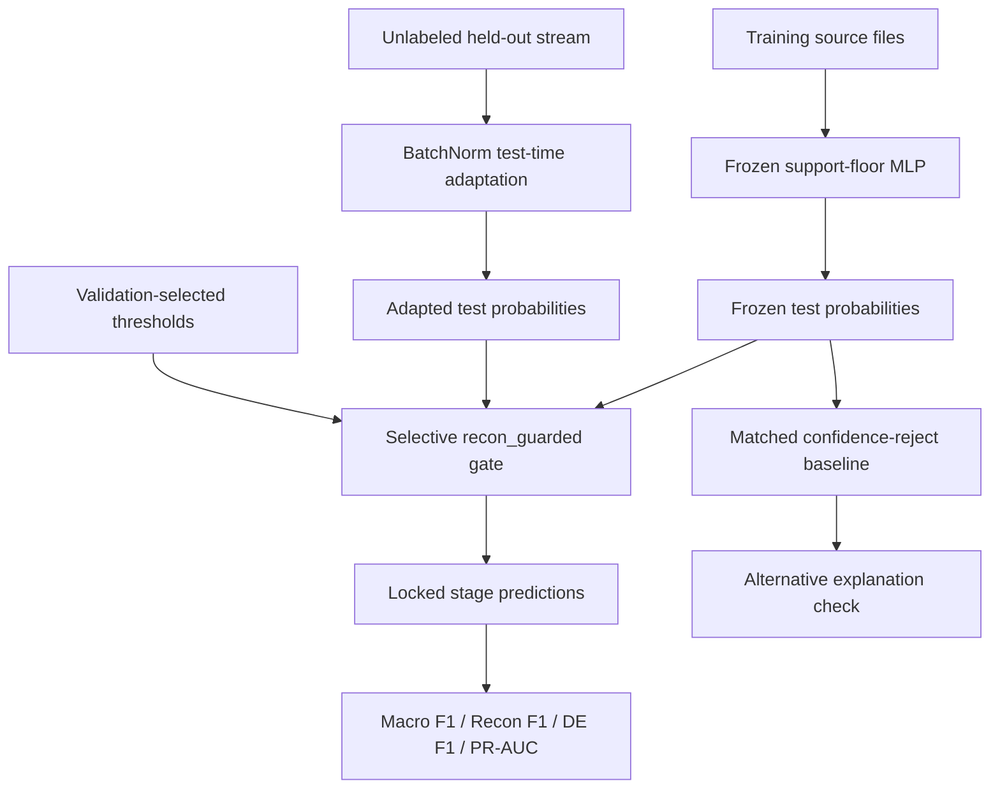

# Praxis 06 Paper-Ready Final Report

Generated: 2026-05-13

Working title: **Selective Test-Time Adaptation for Streaming APT Stage Detection Under Source-File Shift**

Status: **paper-ready defense package; target venue conversion remains**

Cloud hardening status: **PASS**

Cloud audit artifact: `reports/tta_streaming_apt/cloud_paper_hardening_20260513/PRAXIS06_FINAL_CLOUD_PAPER_AUDIT_20260513.md`

## Thesis

Selective no-label test-time adaptation can recover rare-stage APT behavior under held-out source-file shift when adaptation is constrained by a validation-selected safety gate that protects high-consequence Data Exfiltration predictions.

## One-Sentence Claim

A conservative `recon_guarded` BatchNorm test-time adaptation gate improves held-out source-file Macro F1 from `0.7685` to `0.8658` and Reconnaissance F1 from `0.0250` to `0.5050`, while preserving Data Exfiltration F1 and changing only `4.7%` of test predictions. PR-AUC changes only `+0.0006`, so the paper should frame the contribution as a selective decision-policy improvement, not as a broad representation-quality gain.

## Abstract

APT stage detectors are commonly evaluated under fixed train/test assumptions, but practical deployments face source, day, and host/network shift. Prior stage-conditional routing work in this project showed that predicted-stage routing did not reliably survive realistic held-out shift, especially for rare-stage Reconnaissance. This paper tests a different intervention: selective no-label test-time adaptation. A frozen support-floor MLP is evaluated on an Unraveled held-out source-file split with no source overlap across train, validation, and test. At inference time, BatchNorm behavior is adapted over the unlabeled stream, then a conservative validation-selected gate decides when to override the frozen prediction. The locked policy improves Macro F1 from `0.7685` to `0.8658` and Reconnaissance F1 from `0.0250` to `0.5050`; Data Exfiltration F1 changes from `0.9157` to `0.9202`, PR-AUC changes only from `0.8732` to `0.8738`, and the override rate is `0.0470`. A matched-rate frozen confidence-reject baseline leaves Reconnaissance F1 at `0.0000`, showing that the result is not explained by merely filtering uncertain frozen predictions. A cloud hardening audit reproduced the artifact-level evidence and passed all locked-policy, leakage, and safety checks. The result supports a narrow, defensible claim: selective no-label adaptation can recover a shifted rare APT stage through a locked operating-point policy while preserving high-consequence behavior under a validation-selected gate.

## Research Questions

| ID | Research question | Answer |
|---|---|---|
| RQ1 | Does selective no-label TTA improve held-out source-file Macro F1 over the frozen detector? | Yes. Macro F1 improves from `0.7685` to `0.8658`, delta `+0.0974`. |
| RQ2 | Does selective TTA recover the rare shifted Reconnaissance stage? | Yes. Recon F1 improves from `0.0250` to `0.5050`, delta `+0.4800`. |
| RQ3 | Does the selective gate preserve Data Exfiltration? | Yes in the locked mean. DE F1 changes from `0.9157` to `0.9202`, delta `+0.0045`; per-seed DE deltas stay within the declared guard. |
| RQ4 | Is the improvement explained by simply rejecting uncertain frozen predictions? | No. Matched-rate confidence rejection leaves Recon F1 at `0.0000`. |
| RQ5 | Are the split and temporal leakage controls adequate for a paper claim? | Yes at artifact level. Train/validation/test source overlap is `0`, group overlap is `0`, and temporal delta features use `reset_each_split`. |

## Hypotheses

| Hypothesis | Gate | Status |
|---|---|---|
| H1: Selective TTA improves Macro F1 by at least `+0.05` over frozen. | Locked test Macro F1 delta >= `0.05` | Supported: `+0.0974`. |
| H2: Selective TTA improves Recon F1 by at least `+0.25` over frozen. | Locked test Recon F1 delta >= `0.25` | Supported: `+0.4800`. |
| H3: Selective TTA does not reduce mean DE F1. | Locked mean DE F1 delta >= `0.0` | Supported: `+0.0045`. |
| H4: The intervention remains selective. | Mean override rate <= `0.05` | Supported: `0.0470`. |
| H5: The gain is not a confidence-filtering artifact. | Matched confidence-reject Recon F1 remains collapsed | Supported: `0.0000`. |

## Literature Review Frame

The literature review should not be sprawling. It should build a direct path to the contribution:

1. **APT stage and intrusion detection under shift.** Position APT stage classification as more operationally useful than binary detection, but more brittle because stage support is imbalanced and rare stages shift across sources and days. Use the prior Praxis 04 failure as the local motivation: predicted-stage routing failed under held-out shift.
2. **Test-time adaptation.** Discuss TTA and TENT-style entropy minimization as label-free adaptation methods for distribution shift. Make clear that this paper uses the TTA idea in a constrained security setting, not as a universal adaptation claim.
3. **BatchNorm-stat adaptation.** Explain why adapting normalization behavior is attractive: it is lightweight, label-free, and does not require retraining the classifier on target labels.
4. **Rare-class and imbalanced security ML.** Tie the method to rare-stage collapse. The point is not just accuracy; it is Macro F1 and class-specific recovery.
5. **Security-specific safety constraints.** This is the key positioning. In security, improving Reconnaissance is not acceptable if Data Exfiltration behavior is damaged. The contribution is the selective gate that encodes this constraint.
6. **Alternative explanations and validity.** Include confidence rejection, leakage controls, and the negative DAPT TTA feasibility gate so reviewers see the boundary.

Core citation targets already scaffolded:

- TENT and test-time adaptation literature.
- Test-time training/self-supervised adaptation literature.
- CIC/Unraveled/APT-stage detection references as applicable.
- Imbalance methods such as focal loss and SMOTE/ADASYN where used as detector-recipe context.
- MAGIC/Kairos only as related provenance context, not as evidence for this TTA claim.

Use `reports/tta_streaming_apt/PRAXIS06_RELATED_WORK_NOTES_20260512.md`, `PRAXIS06_REFERENCE_AUDIT_20260512.md`, and `PRAXIS06_REFERENCES_BIBTEX_20260512.bib` for the venue-format bibliography.

## Graphical Model Representation

Use this GMR in the paper or defense slides:

Cloud-generated GMR files:

- `reports/tta_streaming_apt/cloud_paper_hardening_20260513/gmr_selective_tta.mmd`
- `reports/tta_streaming_apt/cloud_paper_hardening_20260513/gmr_selective_tta.dot`

Existing method figure:

- `reports/tta_streaming_apt/paper_assets_20260509/figures/figure1_method_diagram.png`

## Data And EDA

Dataset: Unraveled network-flow telemetry, processed through the trusted support-floor feature pipeline.

Split: held-out `source_file`, with support floors for Reconnaissance and Data Exfiltration.

| Split | Rows | Source files | Capture days | Benign | Recon | Foothold | Lateral Movement | Data Exfiltration |
|---|---:|---:|---:|---:|---:|---:|---:|---:|
| Train | `307,733` | `142` | `25` | `268,710` | `5,151` | `15,047` | `15,748` | `3,077` |
| Validation | `61,886` | `6` | `1` | `22,011` | `23,791` | `5,784` | `8,047` | `2,253` |
| Test | `65,869` | `25` | `5` | `47,888` | `5,852` | `6,287` | `3,650` | `2,192` |

Leakage controls:

| Check | Result |
|---|---:|
| Train/validation source-file overlap | `0` |
| Train/test source-file overlap | `0` |
| Validation/test source-file overlap | `0` |
| Train/validation group overlap | `0` |
| Train/test group overlap | `0` |
| Validation/test group overlap | `0` |
| Temporal delta mode | `reset_each_split` |

EDA point to emphasize: the validation split has high Reconnaissance support relative to the test split, so the method is not claiming ordinary IID generalization. It is specifically a deployment-shift adaptation result.

## Method

### Frozen Detector

The frozen detector is a support-floor MLP from the trusted Unraveled lineage. The detector recipe uses targeted ADASYN plus weighted cross-entropy and was chosen before the TTA paper claim. Optuna belongs only to earlier detector-recipe development and should not be presented as part of the locked TTA proof.

### Test-Time Adaptation

The locked adaptation method is `bn_adapt`, which updates BatchNorm behavior on the unlabeled evaluation stream. No target labels are used.

Protocol details to disclose in the Method section:

| BN-adapt field | Locked protocol |
|---|---|
| Inference batch size | `4096` |
| Stream order | Dataframe/source-file split order through `DataLoader(..., shuffle=False)` |
| Passes over target stream | Single pass |
| Labels used during adaptation | None |
| Model state handling | Reload frozen checkpoint before each split/method evaluation |
| Dropout | Disabled through model eval mode |
| BatchNorm layers | `BatchNorm1d` modules toggled to train mode for running-stat updates |
| BN momentum | PyTorch `BatchNorm1d` default unless changed by the model; this MLP does not override it |

### Selective Gate

Locked policy:

| Field | Value |
|---|---|
| Policy | `recon_guarded` |
| TTA method | `bn_adapt` |
| DE delta limit | `0.05` |
| Seeds | `42`, `43`, `44` |
| Override rate | `0.0470` |

Per-seed thresholds:

| Seed | Uncertainty threshold | Recon rescue threshold | DE keep threshold |
|---:|---:|---:|---:|
| `42` | `0.5` | `0.5` | `0.0` |
| `43` | `0.5` | `0.4` | `0.0` |
| `44` | `0.5` | `0.5` | `0.0` |

The gate:

- preserves confident frozen Data Exfiltration predictions;
- allows overrides on uncertain frozen predictions;
- allows Reconnaissance rescue when adapted confidence is sufficient;
- keeps the intervention small.

### What Not To Do

Do not rerun Optuna or broaden the threshold sweep to improve the paper result. That would turn a clean locked result into a post-hoc optimization story. The cloud hardening audit deliberately did not do this.

## Results

Main result:

| Metric | Frozen MLP | Locked selective TTA | Delta |
|---|---:|---:|---:|
| Accuracy | `0.8984` | `0.9243` | `+0.0260` |
| Macro F1 | `0.7685` | `0.8658` | `+0.0974` |
| PR-AUC | `0.8732` | `0.8738` | `+0.0006` |
| Recon F1 | `0.0250` | `0.5050` | `+0.4800` |
| Data Exfiltration F1 | `0.9157` | `0.9202` | `+0.0045` |
| Override rate | `0.0000` | `0.0470` | `+0.0470` |

Per-seed locked result:

| Seed | Macro F1 | Recon F1 | DE F1 | PR-AUC | Override | Macro delta | Recon delta | DE delta |
|---:|---:|---:|---:|---:|---:|---:|---:|---:|
| `42` | `0.8821` | `0.5978` | `0.9177` | `0.8584` | `0.0593` | `+0.1010` | `+0.5264` | `-0.0088` |
| `43` | `0.8614` | `0.4776` | `0.9181` | `0.8925` | `0.0407` | `+0.0951` | `+0.4763` | `-0.0163` |
| `44` | `0.8539` | `0.4397` | `0.9246` | `0.8704` | `0.0409` | `+0.0960` | `+0.4372` | `+0.0386` |

Matched confidence-reject baseline:

| Baseline | Reject rate | Kept Macro F1 | Kept Recon F1 | Kept DE F1 |
|---|---:|---:|---:|---:|
| Frozen confidence reject, matched to TTA override rate | `0.0470` | `0.7730` | `0.0000` | `0.9374` |

Interpretation: rejecting the same fraction of low-confidence frozen rows does not recover Reconnaissance.

PR-AUC framing: the PR-AUC delta is only `+0.0006`, so the result should not be sold as substantially better probability ranking. The contribution is that the locked gate moves a small number of rows to a better decision operating point for Reconnaissance while mostly retaining the frozen detector.

## Defense Hardening Addendum

New cloud run:

- Local diagnostics: `runs/tta-defense-hardening-20260513/`
- Local source checkpoints: `runs/mlp-support-floor-7seed-extension-20260513/`
- S3 diagnostics: `s3://praxis-garypagan-272615233626-us-east-1/experiments/tta-streaming-apt/runs/tta-defense-hardening-20260513/diagnostics/`
- S3 source checkpoints: `s3://praxis-garypagan-272615233626-us-east-1/experiments/tta-streaming-apt/runs/tta-defense-hardening-20260513/source_run/`

Seed-extension result:

| Seed set | Threshold policy | Macro F1 | Recon F1 | DE F1 | PR-AUC | Override |
|---|---|---:|---:|---:|---:|---:|
| Original locked seeds `42`-`44` | Validation-selected per seed | `0.8658 +/- 0.0146` | `0.5050 +/- 0.0825` | `0.9202 +/- 0.0038` | `0.8738` | `0.0470` |
| Extra seeds `45`-`48` | Fixed canonical extension, no new search | `0.8341 +/- 0.0173` | `0.5219 +/- 0.0472` | `0.7559 +/- 0.1198` | `0.8165` | `0.0649` |
| All seven seeds | Original locked + fixed extension | `0.8477 +/- 0.0226` | `0.5147 +/- 0.0589` | `0.8263 +/- 0.1220` | `0.8410 +/- 0.0404` | `0.0572 +/- 0.0200` |

Interpretation: the additional seeds tighten the Reconnaissance story: all seven seeds improve Macro F1 and Reconnaissance F1 over their frozen counterpart. They also reveal source-detector variance: the extra frozen detectors have weaker and more variable Data Exfiltration support, so the seven-seed table should be reported as a robustness addendum, not as a replacement for the original locked replay.

Validation-distribution sensitivity:

| Sensitivity sample | Validation Recon fraction | Test Macro F1 | Test Recon F1 | Test DE F1 | Override |
|---:|---:|---:|---:|---:|---:|
| `101` | `0.0889` | `0.8335 +/- 0.0354` | `0.4397 +/- 0.1431` | `0.8263 +/- 0.1220` | `0.0479` |
| `202` | `0.0889` | `0.8428 +/- 0.0306` | `0.4858 +/- 0.0689` | `0.8263 +/- 0.1220` | `0.0519` |

This mostly survives the "Recon-heavy validation" objection, but not perfectly. One original seed selected a stricter Recon threshold under one test-like validation subsample and lost much of the Recon recovery. Include this as a limitation.

BN stream-order check:

| Seed set | Stream order | Macro F1 | Recon F1 | DE F1 |
|---|---|---:|---:|---:|
| Original locked seeds | Original dataframe order | `0.8658` | `0.5050` | `0.9202` |
| Original locked seeds | Shuffled before BN-adapt | `0.8352` | `0.3364` | `0.9293` |

The shuffled result remains above frozen but is weaker on Reconnaissance, which means the effect is not purely an order artifact, while stream composition/order is still part of the mechanism.

Override and DE safety:

- Mean override rate over all seven seeds is `0.0572`.
- Mean override-to-Recon fraction is `0.8075`.
- Override-from-DE count is `0`; the gate never overwrites a frozen DE prediction under `de_keep=0.00`.
- Two of seven seeds have negative DE deltas, both small and from the original locked set: seed `42` is `-0.0088`, seed `43` is `-0.0163`.

## Cloud Hardening Audit

Cloud job:

- Instance: running `praxis-data-loader` EC2 instance via SSM.
- S3 output: `s3://praxis-garypagan-272615233626-us-east-1/experiments/tta-streaming-apt/reports/tta-paper-hardening-20260513/`
- Local synced output: `reports/tta_streaming_apt/cloud_paper_hardening_20260513/`
- Script: `cloud_jobs/tta_paper_hardening_20260513/run_tta_paper_hardening_cloud.py`

Audit checks:

| Check | Result |
|---|---|
| Locked policy is `recon_guarded` | PASS |
| Locked method is `bn_adapt` | PASS |
| DE delta limit is `0.05` | PASS |
| Macro F1 delta >= `0.05` | PASS |
| Recon F1 delta >= `0.25` | PASS |
| Mean DE delta nonnegative | PASS |
| Per-seed DE delta >= `-0.05` | PASS |
| Override rate <= `0.05` | PASS |
| Confidence-reject Recon F1 is `0.0000` | PASS |
| Source overlap is zero | PASS |
| Group overlap is zero | PASS |
| Temporal delta mode is `reset_each_split` | PASS |

## External Validity

DAPT2020 supports only a detector-recipe appendix, not TTA generality.

| DAPT item | Result |
|---|---|
| MLP recipe Macro F1 | `0.6353 +/- 0.0043` |
| MLP recipe Recon F1 | `0.8932 +/- 0.0089` |
| DAPT TTA selected method | `tent_lr_0.0001` |
| DAPT TTA test Macro F1 delta | `-0.2874` |
| DAPT TTA test Recon F1 delta | `-0.6589` |
| DAPT test Data Exfiltration support | `2` |

Use this as a sober appendix: the detector recipe can run on another APT-flow dataset, but the TTA mechanism did not transfer there.

Mechanism hypothesis: a lightweight feature-shift diagnostic suggests the DAPT failure may be related to feature-scale tail instability rather than simple mean shift. Unraveled train-to-test median absolute log standard-deviation ratio is `0.1192` with `11/67` features above a twofold standard-deviation ratio. DAPT2020 train-to-test median is `0.0962`, but the p90 absolute log standard-deviation ratio is `26.9379` with `16/82` features above the twofold mark. That supports the cautious hypothesis that BN adaptation helps when target stream statistics are compatible with source normalization layers and can fail when a small set of features has extreme scale mismatch or unstable batch composition.

## Threats To Validity

1. The main positive result is one dataset family and one trusted feature pipeline.
2. The locked replay uses three seeds.
3. The evaluation is held-out source-file shift, not live SOC deployment.
4. BatchNorm adaptation assumes useful structure in the unlabeled stream.
5. Adversaries could attempt to poison or manipulate the adaptation stream.
6. Cross-dataset TTA generality is not proven.
7. DAPT2020 cannot support Data Exfiltration conclusions because test support is only `2`.

## Allowed Claims

| Claim | Status |
|---|---|
| Selective TTA improves locked Unraveled held-out source-file Macro F1 | Allowed |
| Selective TTA recovers Reconnaissance under the locked split | Allowed |
| Data Exfiltration is preserved in locked mean and within guard per seed | Allowed with caveat |
| The result is not explained by matched confidence rejection | Allowed |
| AWS/S3 artifact audit supports repeatability | Allowed |
| Detector recipe has appendix-level DAPT support | Allowed |

## Claims Not Allowed

| Claim | Reason |
|---|---|
| TTA generally solves APT detection | Too broad |
| Cross-dataset TTA generality is proven | DAPT TTA gate is negative |
| DAPT validates Data Exfiltration behavior | Test support is only `2` |
| Provenance graph experiments are positive | Architecture is label-blocked |
| More Optuna/sweeping is needed for this paper result | It would weaken the locked-result story |

## Recommended Paper Structure

1. **Introduction:** deployment shift in APT stage detection; Praxis 04 failure motivates adaptation.
2. **Research questions and hypotheses:** use the RQ/H tables above.
3. **Related work:** APT detection, TTA/TENT/BatchNorm adaptation, imbalance/rare-class security ML, security safety constraints.
4. **Dataset and EDA:** Unraveled split table, stage support, source overlap, temporal delta reset.
5. **Method:** frozen MLP, `bn_adapt`, `recon_guarded` gate, locked replay protocol.
6. **Graphical model representation:** include the Mermaid/DOT GMR or method diagram.
7. **Results:** main table, per-seed table, confidence-reject baseline, override sensitivity.
8. **External validity:** DAPT detector-recipe appendix and negative DAPT TTA gate.
9. **Threats to validity:** keep the claim narrow.
10. **Conclusion:** selective no-label adaptation can recover rare-stage Recon under source-file shift while preserving DE.

## Required Figures And Tables

| Item | Path |
|---|---|
| Main result table | `reports/tta_streaming_apt/paper_assets_20260509/tables/table1_main_result.md` |
| Per-seed table | `reports/tta_streaming_apt/paper_assets_20260509/tables/table2_per_seed_locked_result.md` |
| Split counts | `reports/tta_streaming_apt/paper_assets_20260509/tables/table3_split_counts.md` |
| Leakage checks | `reports/tta_streaming_apt/paper_assets_20260509/tables/table4_leakage_checks.md` |
| Confidence reject | `reports/tta_streaming_apt/paper_assets_20260509/tables/table5_confidence_reject_summary.md` |
| Override sensitivity | `reports/tta_streaming_apt/paper_assets_20260509/tables/table6_override_sensitivity.md` |
| Method diagram | `reports/tta_streaming_apt/paper_assets_20260509/figures/figure1_method_diagram.png` |
| Recon F1 by seed | `reports/tta_streaming_apt/paper_assets_20260509/figures/figure2_recon_f1_by_seed.png` |
| Override sensitivity figure | `reports/tta_streaming_apt/paper_assets_20260509/figures/figure3_override_sensitivity.png` |
| Cloud GMR Mermaid | `reports/tta_streaming_apt/cloud_paper_hardening_20260513/gmr_selective_tta.mmd` |
| Cloud GMR DOT | `reports/tta_streaming_apt/cloud_paper_hardening_20260513/gmr_selective_tta.dot` |

## Final Conclusion

This experiment is sound enough for a Praxis paper if it is framed narrowly. The locked cloud-audited evidence supports selective test-time adaptation as a rare-stage recovery mechanism under held-out source-file shift. The paper should not overclaim universal TTA or cross-dataset transfer. It should present a careful, defensible result: a small, validation-selected adaptation gate recovers Reconnaissance while protecting Data Exfiltration.

Next step: convert the existing Markdown draft into the chosen venue format and carry over the figures, tables, GMR, and cloud audit.
