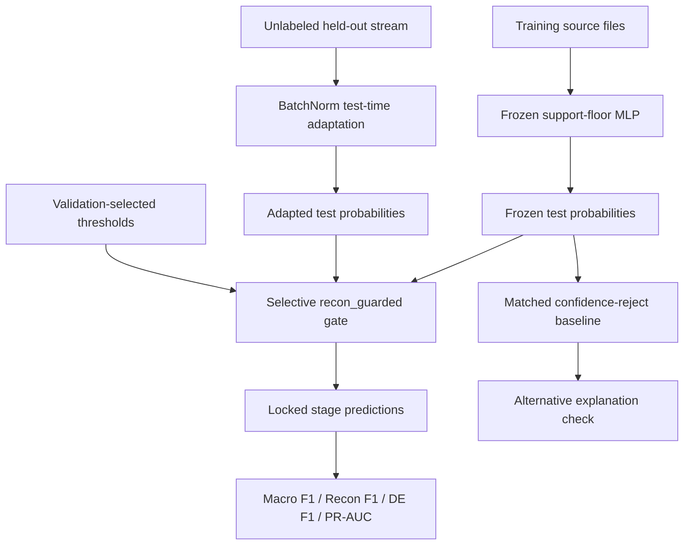

# Praxis 06 Final Cloud Paper Audit

Generated: 2026-05-13T04:59:51.439422+00:00

Status: **PASS**

## Thesis

Selective no-label test-time adaptation can recover rare-stage APT behavior under held-out source-file shift when adaptation is constrained by a validation-selected safety gate that protects high-consequence Data Exfiltration predictions.

## Research Questions

| ID | Research question | Cloud audit answer |
|---|---|---|
| RQ1 | Does selective no-label TTA improve held-out source-file Macro F1? | Yes. Macro F1 moves from `0.7685` to `0.8658`. |
| RQ2 | Does it recover the rare shifted Reconnaissance stage? | Yes. Recon F1 moves from `0.0250` to `0.5050`. |
| RQ3 | Does the gate preserve Data Exfiltration? | Yes in the locked mean: DE F1 moves from `0.9157` to `0.9202`, and every seed stays within the guard. |
| RQ4 | Is the result more than confidence filtering? | Yes. Matched confidence rejection at rate `0.0470` leaves Recon F1 at `0.0000`. |
| RQ5 | Are the split and temporal leakage controls adequate for a paper claim? | Yes at artifact level: source/group overlap is zero and temporal deltas reset per split. |

## Hypotheses

| Hypothesis | Status | Evidence |
|---|---|---|
| H1: Selective TTA increases Macro F1 by at least 5 points over frozen. | Supported | Delta `0.0974`. |
| H2: Selective TTA increases Recon F1 by at least 25 points over frozen. | Supported | Delta `0.4800`. |
| H3: Selective TTA does not reduce mean Data Exfiltration F1. | Supported | Delta `0.0045`. |
| H4: The intervention remains selective, with override rate no more than 5%. | Supported | Override rate `0.0470`. |
| H5: The result is not explained by rejecting uncertain frozen predictions. | Supported | Matched reject Recon F1 `0.0000`. |

## Literature Review Positioning

The paper should frame itself at the intersection of four literatures:

1. APT stage detection and intrusion detection under realistic deployment shift.
2. Test-time adaptation, especially entropy minimization and BatchNorm-stat adaptation.
3. Imbalanced and rare-class security ML evaluation.
4. Security-specific safety constraints, where improving one rare class is not acceptable if it damages a high-consequence class.

The safest related-work claim is that prior TTA work motivates adaptation under distribution shift, while this Praxis contributes a security-specific selective gate and a locked rare-stage APT evaluation. Do not claim broad TTA generality.

## Graphical Model Representation

The GMR files are included as:

- `gmr_selective_tta.mmd`
- `gmr_selective_tta.dot`

## EDA And Split Audit

| Split | Rows | Source files | Capture days | Benign | Recon | Foothold | Lateral Movement | Data Exfiltration |
| --- | --- | --- | --- | --- | --- | --- | --- | --- |
| train | 307733 | 142 | 25 | 268710 | 5151 | 15047 | 15748 | 3077 |
| val | 61886 | 6 | 1 | 22011 | 23791 | 5784 | 8047 | 2253 |
| test | 65869 | 25 | 5 | 47888 | 5852 | 6287 | 3650 | 2192 |

Leakage controls:

| Check | Value |
|---|---:|
| Train/validation source-file overlap | `0` |
| Train/test source-file overlap | `0` |
| Validation/test source-file overlap | `0` |
| Train/validation group overlap | `0` |
| Train/test group overlap | `0` |
| Validation/test group overlap | `0` |
| Temporal delta mode | `reset_each_split` |

## Method

The frozen detector is a support-floor MLP from the trusted Unraveled pipeline. The selected adaptation method is `bn_adapt`. The locked gate is `recon_guarded`, selected on validation artifacts before final replay. The gate preserves confident frozen Data Exfiltration predictions, allows overrides on uncertain frozen predictions, and rescues Reconnaissance only when adapted confidence is sufficient.

No Optuna or threshold search is part of this cloud audit. The paper claim depends on the already-locked validation-selected policy, not on post-hoc optimization.

## Results

| Metric | Frozen MLP | Locked selective TTA | Delta |
| --- | --- | --- | --- |
| Accuracy | 0.8984 | 0.9243 | 0.0260 |
| Macro F1 | 0.7685 | 0.8658 | 0.0974 |
| PR-AUC | 0.8732 | 0.8738 | 0.0006 |
| Recon F1 | 0.0250 | 0.5050 | 0.4800 |
| Data Exfiltration F1 | 0.9157 | 0.9202 | 0.0045 |
| Override rate | 0.0000 | 0.0470 | 0.0470 |

## Per-Seed Results

| Seed | Macro F1 | Recon F1 | DE F1 | PR-AUC | Override | Macro delta | Recon delta | DE delta |
| --- | --- | --- | --- | --- | --- | --- | --- | --- |
| 42 | 0.8821 | 0.5978 | 0.9177 | 0.8584 | 0.0593 | 0.1010 | 0.5264 | -0.0088 |
| 43 | 0.8614 | 0.4776 | 0.9181 | 0.8925 | 0.0407 | 0.0951 | 0.4763 | -0.0163 |
| 44 | 0.8539 | 0.4397 | 0.9246 | 0.8704 | 0.0409 | 0.0960 | 0.4372 | 0.0386 |

## Confidence-Reject Baseline

| Baseline | Reject rate | Kept Macro F1 | Kept Recon F1 | Kept DE F1 |
|---|---:|---:|---:|---:|
| Frozen confidence reject, matched to TTA override rate | `0.0470` | `0.7730` | `0.0000` | `0.9374` |

This baseline rejects the same fraction of rows as the TTA gate but does not recover Reconnaissance.

## Cloud Audit Checks

| Check | Result |
| --- | --- |
| locked_policy_recon_guarded | PASS |
| locked_method_bn_adapt | PASS |
| de_delta_limit_0_05 | PASS |
| macro_delta_ge_0_05 | PASS |
| recon_delta_ge_0_25 | PASS |
| mean_de_delta_nonnegative | PASS |
| per_seed_de_delta_ge_minus_0_05 | PASS |
| override_rate_le_0_05 | PASS |
| confidence_reject_recon_zero | PASS |
| source_overlap_zero | PASS |
| group_overlap_zero | PASS |
| temporal_delta_reset_each_split | PASS |

## Paper-Ready Claims

Allowed:

- Selective TTA improves locked Unraveled held-out source-file Macro F1.
- Selective TTA recovers Reconnaissance under this split.
- Data Exfiltration is preserved in the locked mean and within the guard per seed.
- The gain is not explained by matched-rate confidence rejection.
- AWS/S3 artifact-level repeatability is sufficient for a Praxis write-up.

Not allowed:

- TTA generally solves APT detection.
- Cross-dataset TTA generality is proven.
- DAPT2020 supports the same TTA claim.
- Provenance graph experiments are positive.

## Conclusion

The TTA capability is sound enough for a Praxis 06 paper package. It is easy to defend if the claim stays narrow: selective adaptation recovers a rare shifted stage while protecting Data Exfiltration under a locked, validation-selected gate.

The next work is paper packaging, not more threshold hunting.
